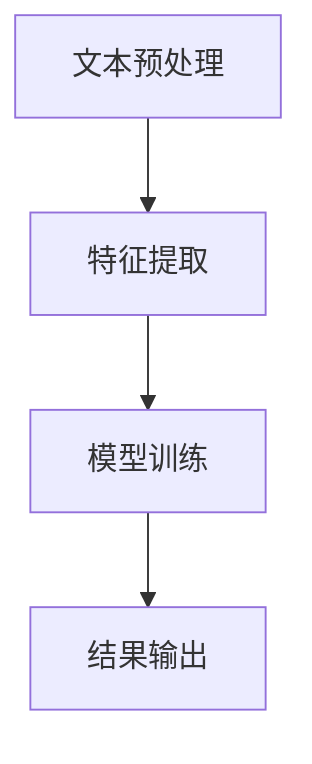
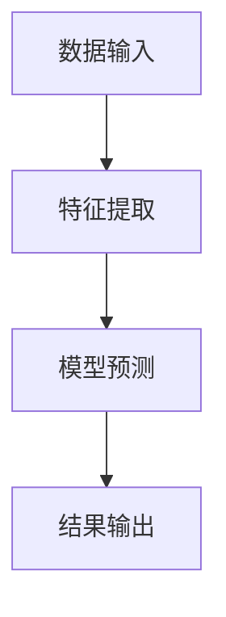
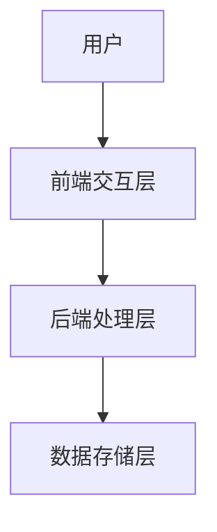
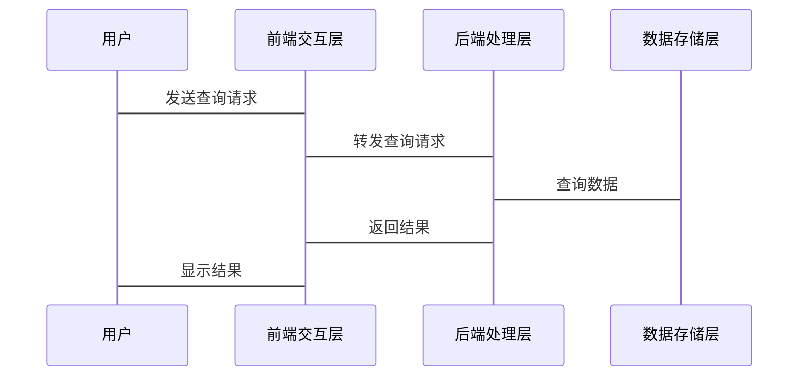

                 


# 《智能助手的架构设计》

---

## 关键词：
智能助手、架构设计、自然语言处理、机器学习、系统架构

---

## 摘要：
智能助手作为人工智能领域的重要应用，其架构设计涵盖了从用户交互到后端处理的多个环节。本文从智能助手的背景与概念出发，详细探讨了其核心概念、算法原理、系统架构设计以及项目实战。通过理论与实践相结合的方式，帮助读者全面理解智能助手的架构设计，并掌握实际开发中的关键技巧。

---

## 目录大纲：
1. 智能助手的背景与问题描述  
   1.1 智能助手的定义与背景  
   1.2 问题背景与问题描述  
   1.3 智能助手的核心要素与概念结构  

2. 智能助手的核心概念与联系  
   2.1 核心概念的原理  
   2.2 概念属性特征对比  
   2.3 ER实体关系图  

3. 智能助手的算法原理  
   3.1 算法原理概述  
   3.2 算法实现与优化  
   3.3 算法原理的数学模型  

4. 智能助手的系统分析与架构设计  
   4.1 系统功能需求与设计  
   4.2 系统架构设计  
   4.3 接口设计与交互流程  

5. 智能助手的项目实战  
   5.1 环境搭建与配置  
   5.2 核心功能实现  
   5.3 实际案例分析  

6. 总结与展望  
   6.1 最佳实践与注意事项  
   6.2 未来发展趋势  
   6.3 推荐阅读  

---

## 第一部分: 智能助手的背景与问题描述

---

### 第1章: 智能助手的背景与问题描述

#### 1.1 智能助手的定义与背景
智能助手是一种基于人工智能技术的交互工具，能够通过自然语言处理（NLP）理解用户需求，并通过机器学习模型提供个性化的服务。随着AI技术的快速发展，智能助手已广泛应用于智能手机、智能家居、客服系统等领域。

##### 1.1.1 智能助手的定义
智能助手是一种结合了自然语言处理、机器学习和语音识别等技术的智能系统，能够以对话形式与用户交互，并提供信息查询、任务执行、娱乐等多种功能。

##### 1.1.2 智能助手的发展历程
1. **早期阶段**：基于规则的简单问答系统（如ELIZA）。  
2. **发展阶段**：引入统计学习和模式匹配技术（如 Siri 的早期版本）。  
3. **成熟阶段**：深度学习驱动的智能助手（如 Google Assistant、Alexa）。  

##### 1.1.3 智能助手的应用场景
- **智能手机**：集成在 iOS 和 Android 系统中，提供语音搜索、信息查询等功能。  
- **智能家居**：通过语音控制家电、查询天气、播放音乐等。  
- **企业应用**：用于客服支持、内部信息查询、任务提醒等。  

#### 1.2 问题背景与问题描述
智能助手的核心目标是提供高效、准确的交互体验。然而，在实际应用中，仍面临诸多挑战。

##### 1.2.1 当前智能助手面临的问题
- **理解能力不足**：对复杂语义的理解不够准确。  
- **响应延迟**：在高并发场景下，响应速度较慢。  
- **隐私安全**：用户数据的泄露风险。  
- **功能局限性**：部分场景下的任务执行能力有限。  

##### 1.2.2 问题的解决目标
通过优化算法、改进系统架构和增强数据安全措施，提升智能助手的理解能力、响应速度和功能扩展性。

##### 1.2.3 问题的边界与外延
智能助手的功能边界包括语音交互、文本交互和任务执行，外延则涉及数据采集、模型训练和用户反馈优化。

#### 1.3 智能助手的核心要素与概念结构
##### 1.3.1 核心概念的构成
- **前端交互层**：用户输入（语音或文本）、输出结果。  
- **后端处理层**：自然语言理解、意图识别、任务执行。  
- **数据存储层**：用户数据、历史记录、训练数据。  

##### 1.3.2 概念属性特征对比表  
| **概念**       | **属性**       | **特征**                                                                 |
|-----------------|----------------|---------------------------------------------------------------------------|
| 前端交互层     | 输入方式       | 语音输入、文本输入                                                   |
|                 | 输出方式       | 文本输出、语音输出                                                   |
| 后端处理层     | 核心算法       | NLP、机器学习模型                                                     |
| 数据存储层     | 数据类型       | 用户数据、模型参数、日志数据                                         |

##### 1.3.3 ER实体关系图  
```mermaid
erDiagram
    user {
        id INT PK
        username VARCHAR
        password VARCHAR
    }
    query {
        id INT PK
        content TEXT
        timestamp DATETIME
    }
    intent {
        id INT PK
        name VARCHAR
        description TEXT
    }
    user --> query : 发起查询
    query --> intent : 触发意图
```

---

## 第二部分: 智能助手的核心概念与联系

---

### 第2章: 智能助手的核心概念与联系

#### 2.1 核心概念的原理
智能助手的核心概念包括自然语言处理、机器学习模型和系统架构设计。

##### 2.1.1 自然语言处理
自然语言处理（NLP）是智能助手理解用户输入的关键技术。其主要步骤包括分词、句法分析、语义理解等。

##### 2.1.2 机器学习模型
机器学习模型用于训练智能助手的行为模式，常见的模型包括循环神经网络（RNN）和 Transformer 模型。

##### 2.1.3 系统架构设计
系统架构设计决定了智能助手的模块划分和交互方式，常见的架构包括单体架构和微服务架构。

#### 2.2 概念属性特征对比
通过对比核心概念的属性特征，可以更好地理解其在系统中的作用。

##### 2.2.1 对比表格展示  
| **核心概念**   | **属性**       | **特征**                                                                 |
|-----------------|----------------|---------------------------------------------------------------------------|
| NLP             | 输入处理       | 分词、句法分析、语义理解                                               |
| 机器学习模型     | 训练目标       | 分类、回归、生成                                                       |
| 系统架构设计     | 模块划分       | 单体架构、微服务架构                                                 |

#### 2.3 ER实体关系图
通过ER图展示智能助手的核心实体及其关系。

```mermaid
erDiagram
    user {
        id INT PK
        username VARCHAR
        password VARCHAR
    }
    query {
        id INT PK
        content TEXT
        timestamp DATETIME
    }
    intent {
        id INT PK
        name VARCHAR
        description TEXT
    }
    user --> query : 发起查询
    query --> intent : 触发意图
```

---

## 第三部分: 智能助手的算法原理

---

### 第3章: 智能助手的算法原理

#### 3.1 算法原理概述
智能助手的算法原理主要涉及自然语言处理和机器学习模型。

##### 3.1.1 自然语言处理流程
自然语言处理的流程包括文本预处理、特征提取、模型训练等步骤。



##### 3.1.2 机器学习模型流程
机器学习模型的流程包括数据输入、特征提取、模型预测等步骤。



#### 3.2 算法实现
##### 3.2.1 Python代码实现
以下是一个简单的自然语言处理示例代码：

```python
import numpy as np
from sklearn.feature_extraction.text import TfidfVectorizer

# 示例文本
texts = ["This is a sample text.", "Another example text."]

# 特征提取
vectorizer = TfidfVectorizer()
X = vectorizer.fit_transform(texts)

# 输出特征向量
print(X.toarray())
```

##### 3.2.2 算法原理的数学模型
自然语言处理中的 TF-IDF 模型是一个常见的特征提取方法。其数学公式如下：

$$ TF-IDF = \text{TF} \times \text{IDF} $$

其中：
- $$ \text{TF} = \frac{\text{词项在文档中出现的次数}}{\text{文档的总词数}} $$
- $$ \text{IDF} = \log\left( \frac{\text{语料库中的文档总数}}{\text{词项出现的文档数}} \right) $$

---

## 第四部分: 智能助手的系统分析与架构设计

---

### 第4章: 智能助手的系统分析与架构设计

#### 4.1 系统功能需求与设计
##### 4.1.1 系统功能需求
- 用户交互功能：支持语音和文本输入。  
- 智能理解功能：准确识别用户意图。  
- 任务执行功能：执行查询、设置提醒等任务。  

##### 4.1.2 系统功能设计
系统功能设计包括用户界面、后端处理和数据存储三个模块。

##### 4.1.3 系统性能需求
- 响应时间：小于 2 秒。  
- 并发能力：支持 thousands 级别并发。  
- 可用性：99.9% 以上。  

#### 4.2 系统架构设计
##### 4.2.1 系统架构图
以下是系统的整体架构图：



##### 4.2.2 接口设计
智能助手的主要接口包括：
- 文本输入接口：`POST /api/v1/query`  
- 语音输入接口：`POST /api/v1/voice_query`  
- 查询结果输出接口：`GET /api/v1/results`  

#### 4.3 系统交互流程
##### 4.3.1 系统交互序列图
以下是用户与系统交互的流程图：



---

## 第五部分: 智能助手的项目实战

---

### 第5章: 智能助手的项目实战

#### 5.1 环境搭建与配置
##### 5.1.1 开发环境搭建
- 安装 Python 和必要的开发工具。  
- 安装机器学习框架（如 TensorFlow、Keras）。  
- 安装自然语言处理库（如 NLTK、spaCy）。  

#### 5.2 核心功能实现
##### 5.2.1 代码实现
以下是一个简单的智能助手核心功能实现代码：

```python
import tensorflow as tf
from tensorflow.keras import layers

# 定义模型
model = tf.keras.Sequential([
    layers.Dense(64, activation='relu'),
    layers.Dense(1, activation='sigmoid')
])

# 编译模型
model.compile(optimizer='adam',
              loss='binary_crossentropy',
              metrics=['accuracy'])

# 训练模型
model.fit(x_train, y_train, epochs=10, batch_size=32)
```

##### 5.2.2 代码解读与分析
- **模型定义**：使用 Dense 层构建一个简单的神经网络模型。  
- **编译模型**：使用 Adam 优化器和二元交叉熵损失函数。  
- **训练模型**：在训练数据上训练 10 个 epoch，每个 batch 大小为 32。  

#### 5.3 实际案例分析
##### 5.3.1 案例介绍
以下是一个智能助手的实际案例：通过语音指令控制智能家居设备。

##### 5.3.2 案例分析
- **用户输入**：语音指令“打开客厅的灯”。  
- **系统处理**：通过语音识别将指令转换为文本，识别意图后调用智能家居 API 执行操作。  
- **结果输出**：返回“已打开客厅的灯”作为反馈。

---

## 第六部分: 总结与展望

---

### 第6章: 总结与展望

#### 6.1 最佳实践与注意事项
- **数据安全**：确保用户数据的隐私和安全。  
- **模型优化**：定期更新模型以提升准确率。  
- **用户体验**：优化交互设计，提升用户体验。  

#### 6.2 未来发展趋势
- **多模态交互**：结合视觉、听觉等多种交互方式。  
- **增强学习**：通过强化学习提升智能助手的自主决策能力。  
- **边缘计算**：在本地设备上进行实时处理，减少延迟。  

#### 6.3 推荐阅读
- 《深度学习》—— Ian Goodfellow  
- 《自然语言处理入门》—— Jurafsky 和 Martin  
- 《系统架构设计实践》—— Mark Seemann  

---

## 作者简介
作者是人工智能领域的专家，拥有丰富的智能助手开发经验，致力于通过技术博客分享深度技术内容，帮助读者掌握智能助手的架构设计与实现技巧。

---

## 结语
希望本文能为智能助手的架构设计提供有价值的参考。如果需要进一步探讨或有疑问，欢迎留言交流。

