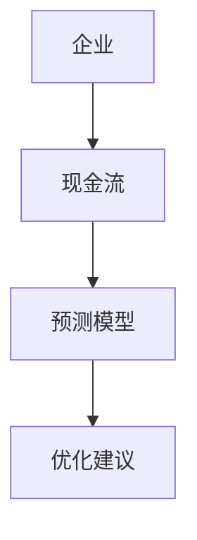

                 


# 智能化企业Working Capital优化模型设计

## 关键词：
- 智能化优化模型
- 营运资本管理
- 人工智能
- 大数据技术
- 现金流预测
- 风险评估
- 资金分配优化

## 摘要：
本文详细探讨了智能化企业Working Capital优化模型的设计与应用。通过结合人工智能和大数据技术，提出了一种创新的优化模型，旨在提高企业营运资本管理的效率和效果。文章从背景介绍、核心概念、算法原理、系统架构到项目实战，全面分析了该模型的构建过程，并通过实际案例展示了其应用价值。最后，本文总结了最佳实践，为企业智能化财务管理提供了重要参考。

---

# 目录大纲

## 第一部分：智能化企业Working Capital优化模型的背景与基础

### 第1章：企业Working Capital概述

#### 1.1 Working Capital的基本概念
- 1.1.1 营运资本的定义与组成
- 1.1.2 营运资本在企业运营中的作用
- 1.1.3 营运资本管理的核心目标

#### 1.2 智能化优化的必要性
- 1.2.1 传统营运资本管理的局限性
- 1.2.2 数据驱动优化的优势
- 1.2.3 智能化技术对企业财务管理的影响

### 第2章：智能化优化模型的背景与发展

#### 2.1 人工智能与大数据在财务管理中的应用
- 2.1.1 AI技术对企业财务管理的变革
- 2.1.2 大数据在营运资本管理中的价值
- 2.1.3 机器学习在现金流预测中的作用

#### 2.2 当前智能化优化模型的发展现状
- 2.2.1 国内外研究进展
- 2.2.2 企业智能化管理的趋势
- 2.2.3 智能化优化模型的实际应用案例

## 第二部分：智能化优化模型的核心概念与联系

### 第3章：核心概念与联系

#### 3.1 核心概念原理
- 3.1.1 现金流预测模型
- 3.1.2 风险评估与控制
- 3.1.3 资金分配优化

#### 3.2 概念属性特征对比表
- 表3.1：现金流预测与风险评估的对比

#### 3.3 ER实体关系图


## 第三部分：智能化优化模型的算法原理

### 第4章：算法原理讲解

#### 4.1 现金流预测的机器学习模型
- 4.1.1 算法选择与原理
- 4.1.2 神经网络结构
  ```mermaid
  graph LR
      A[输入数据] --> B[神经网络]
      B --> C[预测结果]
  ```

#### 4.2 风险评估的数学模型
- 4.2.1 风险评估的数学模型
  $$P = \sum_{i=1}^{n} w_i x_i$$
- 4.2.2 风险控制的策略

#### 4.3 资金分配优化的优化模型
- 4.3.1 线性规划模型
  $$Maximize \quad Z = c^T x$$
  $$Subject \quad to \quad Ax = b$$
  $$x \geq 0$$

## 第四部分：智能化优化模型的系统分析与架构设计

### 第5章：系统分析与架构设计

#### 5.1 问题场景介绍
- 5.1.1 企业现金流预测的需求
- 5.1.2 营运资本管理中的风险评估

#### 5.2 系统功能设计
- 5.2.1 领域模型类图
  ```mermaid
  classDiagram
      class 企业 {
          - 现金流
          - 预测模型
          - 优化建议
      }
  ```

#### 5.3 系统架构设计
- 5.3.1 分层架构图
  ```mermaid
  architecture
      客户端 --> 中间件
      中间件 --> 数据库
      中间件 --> AI引擎
  ```

#### 5.4 系统接口设计
- 5.4.1 接口描述
- 5.4.2 交互流程图
  ```mermaid
  sequenceDiagram
      客户端 -> 中间件: 请求预测
      中间件 -> AI引擎: 执行预测
      AI引擎 -> 数据库: 查询数据
      AI引擎 -> 中间件: 返回结果
      中间件 -> 客户端: 显示结果
  ```

## 第五部分：智能化优化模型的项目实战

### 第6章：项目实战

#### 6.1 环境安装
- 6.1.1 安装Python
- 6.1.2 安装机器学习库（如Scikit-learn）
- 6.1.3 安装可视化工具（如Matplotlib）

#### 6.2 核心代码实现
- 6.2.1 现金流预测的代码示例
  ```python
  import numpy as np
  from sklearn.linear_model import LinearRegression

  # 示例数据
  X = np.array([1, 2, 3, 4, 5]).reshape(-1, 1)
  y = np.array([2, 3, 5, 6, 8])

  # 模型训练
  model = LinearRegression()
  model.fit(X, y)

  # 预测
  new_X = np.array([[6]]).reshape(-1, 1)
  print(model.predict(new_X))  # 输出预测值
  ```

#### 6.3 案例分析
- 6.3.1 某公司现金流预测案例
- 6.3.2 模型优化与效果评估
- 6.3.3 实际应用中的问题与解决方案

## 第六部分：智能化优化模型的最佳实践

### 第7章：最佳实践

#### 7.1 小结
- 7.1.1 模型的优势与局限性
- 7.1.2 模型的可扩展性

#### 7.2 注意事项
- 7.2.1 数据质量的重要性
- 7.2.2 模型的维护与更新

#### 7.3 未来研究方向
- 7.3.1 更高级的算法探索
- 7.3.2 多模型集成优化
- 7.3.3 实时预测的应用

---

通过以上详细目录，文章将系统地介绍智能化企业Working Capital优化模型的设计与应用，为企业的财务管理提供理论支持和实践指导。

