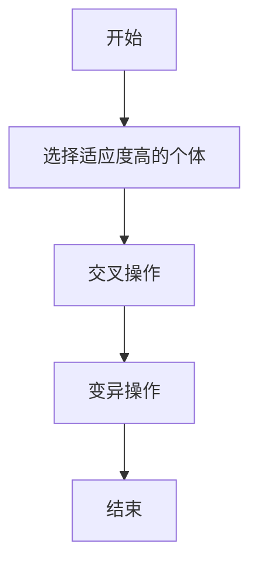
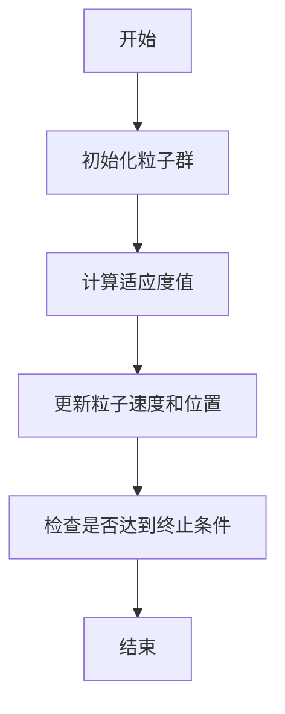
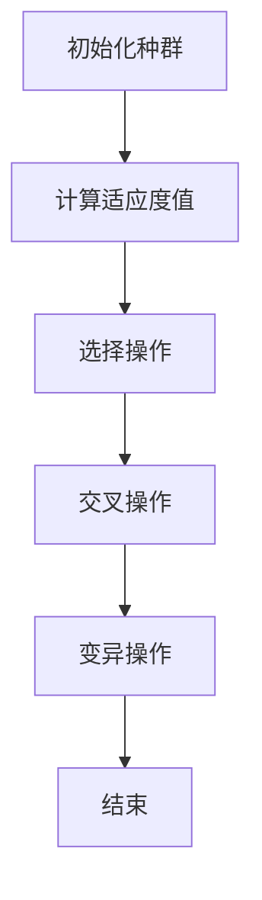
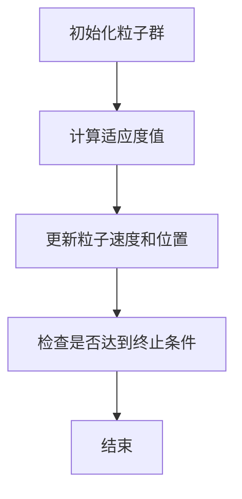
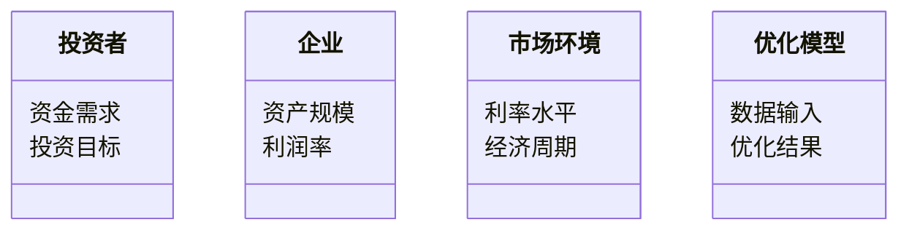
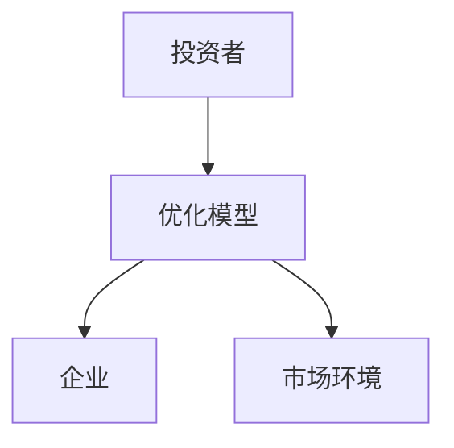
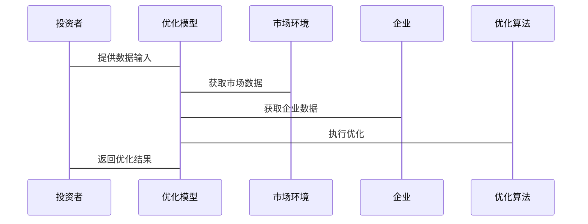

                 


# 智能化企业资本结构优化模型设计

## 关键词：资本结构优化、人工智能、智能化、数学模型、算法设计

## 摘要：本文详细探讨了智能化企业资本结构优化模型的设计与实现。通过分析传统资本结构优化方法的局限性，引入智能化算法如遗传算法和粒子群优化，结合数学模型和系统架构设计，构建了一个高效的企业资本结构优化系统。文章从背景介绍、核心概念、算法原理、系统设计到项目实战，全面阐述了智能化资本结构优化的实现过程，并提供了实际案例和最佳实践建议。

---

# 第1章: 资本结构优化的背景与问题

## 1.1 企业资本结构优化的定义与重要性

### 1.1.1 资本结构优化的定义
资本结构优化是指企业在债务融资和股权融资之间找到最优比例，以最小化资本成本并最大化企业价值的过程。合理的资本结构能够提高企业的财务稳定性，降低资本成本，增强企业的市场竞争力。

### 1.1.2 优化资本结构对企业价值的影响
资本结构直接影响企业的资本成本、财务风险和市场价值。通过优化资本结构，企业可以实现以下目标：
- 降低加权平均资本成本（WACC）。
- 提高企业市场价值。
- 优化财务风险。

### 1.1.3 资本结构优化的现实意义
在全球化和信息化的今天，企业面临的市场环境复杂多变，传统的资本结构优化方法难以应对动态变化的市场条件。智能化优化方法能够实时分析市场数据，快速调整资本结构，帮助企业做出更科学的决策。

---

## 1.2 传统资本结构优化的局限性

### 1.2.1 传统资本结构优化方法的不足
传统的资本结构优化方法主要依赖于财务指标和经验判断，存在以下问题：
- 数据单一，无法全面考虑市场波动和经济周期的影响。
- 优化过程复杂，难以快速响应市场变化。
- 缺乏动态调整能力，无法应对实时数据变化。

### 1.2.2 数据驱动与智能化优化的必要性
随着大数据和人工智能技术的发展，智能化优化方法能够利用海量数据和复杂算法，实现更精准的资本结构优化。通过引入机器学习和智能算法，企业可以更好地应对复杂的市场环境。

### 1.2.3 人工智能在资本结构优化中的应用潜力
人工智能技术（如机器学习、深度学习）能够通过分析历史数据和市场趋势，预测未来市场走势，为资本结构优化提供科学依据。智能化优化方法能够提高优化效率，降低优化成本，增强企业的竞争力。

---

## 1.3 智能化资本结构优化的核心要素

### 1.3.1 数据驱动的优化方法
智能化优化的核心是数据驱动。通过收集和分析企业的财务数据、市场数据和经济指标，构建数学模型，实现资本结构的动态优化。

### 1.3.2 智能算法的应用场景
智能化优化算法（如遗传算法、粒子群优化）能够处理复杂的优化问题，适用于多种场景，如企业融资决策、资本结构调整等。

### 1.3.3 多目标优化的实现路径
资本结构优化是一个多目标优化问题，需要同时考虑资本成本、财务风险和企业价值等多个目标。智能化算法能够通过多目标优化方法，找到最优解。

---

## 1.4 本章小结

本章介绍了资本结构优化的背景与重要性，分析了传统优化方法的局限性，提出了智能化优化的核心要素和应用场景。下一章将详细讲解智能化优化的核心概念与联系。

---

# 第2章: 资本结构优化模型的核心概念

## 2.1 资本结构优化的数学模型

### 2.1.1 净现值法（NPV）
净现值法是一种常用的项目评价方法，通过计算项目未来现金流的现值与初始投资的差值来判断项目的可行性。其公式为：
$$ NPV = \sum_{t=1}^{n} \frac{CF_t}{(1 + r)^t} - I $$
其中，$CF_t$为第$t$年的现金流，$r$为贴现率，$I$为初始投资。

### 2.1.2 内部收益率法（IRR）
内部收益率是使净现值为零的折现率，其公式为：
$$ NPV = \sum_{t=1}^{n} \frac{CF_t}{(1 + IRR)^t} - I = 0 $$

### 2.1.3 加权平均资本成本法（WACC）
加权平均资本成本是企业资本结构中债务和股权的加权平均成本，其公式为：
$$ WACC = \frac{D}{V} \cdot r_d \cdot (1 - t) + \frac{E}{V} \cdot r_e $$ 
其中，$D$为债务价值，$E$为股权价值，$V$为总价值，$r_d$为债务成本，$r_e$为股权成本，$t$为税率。

---

## 2.2 智能化优化的核心算法

### 2.2.1 遗传算法（GA）
遗传算法是一种模拟生物进化过程的优化算法，主要包括选择、交叉和变异三个步骤。其流程图如下：


### 2.2.2 粒子群优化（PSO）
粒子群优化是一种基于群体智能的优化算法，通过模拟鸟群觅食行为，找到最优解。其流程图如下：


### 2.2.3 支持向量机（SVM）
支持向量机是一种监督学习算法，常用于分类和回归问题。在资本结构优化中，可以用于预测企业的财务风险和市场趋势。

---

## 2.3 核心概念的ER实体关系图

```mermaid
erDiagram
    投资者EntityType {
        <属性> 资金需求
        <属性> 投资目标
    }
    企业EntityType {
        <属性> 资产规模
        <属性> 利润率
    }
    市场环境EntityType {
        <属性> 利率水平
        <属性> 经济周期
    }
    优化模型EntityType {
        <属性> 数据输入
        <属性> 优化结果
    }
```

---

## 2.4 本章小结

本章详细讲解了资本结构优化的数学模型和智能化优化的核心算法，通过ER图展示了核心概念的实体关系。下一章将深入探讨智能化优化算法的原理与实现。

---

# 第3章: 智能化资本结构优化算法原理

## 3.1 遗传算法（GA）的原理与实现

### 3.1.1 遗传算法的基本步骤
遗传算法的基本步骤包括初始化种群、计算适应度值、选择、交叉和变异操作。其流程图如下：


### 3.1.2 适应度函数的设计
适应度函数用于评估个体的优劣，其设计需要结合具体问题。例如，在资本结构优化中，适应度函数可以定义为：
$$ fitness = 1 / WACC $$

### 3.1.3 选择、交叉与变异操作
选择操作通常采用轮盘赌选择，交叉操作采用单点交叉，变异操作采用均匀变异。

### 3.1.4 算法实现的Python代码示例
```python
import random

def fitness(individual):
    # 计算适应度值
    return sum(individual)

def evolve_population(population, fitness_fn):
    # 选择操作
    population.sort(key=lambda x: -fitness_fn(x))
    selected = population[:len(population)//2]

    # 交叉操作
    new_population = []
    for i in range(0, len(selected), 2):
        parent1 = selected[i]
        parent2 = selected[i+1]
        child1 = [parent1[j] if random.random() < 0.5 else parent2[j] for j in range(len(parent1))]
        child2 = [parent2[j] if random.random() < 0.5 else parent1[j] for j in range(len(parent1))]
        new_population.extend([child1, child2])
    
    # 变异操作
    for i in range(len(new_population)):
        if random.random() < 0.1:
            new_population[i] = [1 - x for x in new_population[i]]
    
    return new_population
```

---

## 3.2 粒子群优化（PSO）的原理与实现

### 3.2.1 粒子群优化的基本步骤
粒子群优化的基本步骤包括初始化粒子群、计算适应度值、更新粒子速度和位置。其流程图如下：


### 3.2.2 粒子群优化的数学模型
粒子群优化的数学模型包括速度更新和位置更新公式：
$$ v_i = v_i \cdot w + c_1 \cdot r_1 \cdot (p_i - x_i) + c_2 \cdot r_2 \cdot (p_g - x_i) $$
$$ x_i = x_i + v_i $$

### 3.2.3 算法实现的Python代码示例
```python
import random

def fitness(individual):
    # 计算适应度值
    return sum(individual)

def optimize(n_particles, n_iterations):
    particles = [[random.random() for _ in range(n_vars)] for _ in range(n_particles)]
    pbest = particles.copy()
    gbest = particles.copy()

    for _ in range(n_iterations):
        for i in range(n_particles):
            # 计算适应度值
            current_fitness = fitness(particles[i])
            p_fitness = fitness(pbest[i])

            if current_fitness > p_fitness:
                pbest[i] = particles[i].copy()

        # 更新全局最优
        current_g_fitness = fitness(gbest[0])
        p_g_fitness = fitness(pbest[0])
        if p_g_fitness > current_g_fitness:
            gbest = pbest.copy()

        # 更新粒子速度和位置
        for i in range(n_particles):
            v_i = 0.8 * v_i + 1.2 * (pbest[i] - particles[i]) + 1.0 * (gbest[i] - particles[i])
            particles[i] = particles[i] + v_i
```

---

## 3.3 支持向量机（SVM）的原理与实现

### 3.3.1 SVM的基本原理
支持向量机是一种监督学习算法，通过构建超平面将数据点分为不同类别。其数学模型为：
$$ y = sign(w \cdot x + b) $$
其中，$w$是权重向量，$b$是偏置项。

### 3.3.2 SVM的应用场景
在资本结构优化中，SVM可以用于预测企业的财务风险和市场趋势。

### 3.3.3 算法实现的Python代码示例
```python
from sklearn import svm

def svm_predict(X_train, y_train, X_test):
    # 训练模型
    clf = svm.SVC()
    clf.fit(X_train, y_train)
    # 预测
    y_pred = clf.predict(X_test)
    return y_pred
```

---

## 3.4 本章小结

本章详细讲解了智能化资本结构优化的核心算法，包括遗传算法、粒子群优化和支持向量机的原理与实现。下一章将介绍系统的分析与架构设计。

---

# 第4章: 系统分析与架构设计

## 4.1 问题场景介绍

---

## 4.2 系统功能设计

### 4.2.1 领域模型mermaid类图


### 4.2.2 系统架构设计mermaid架构图


---

## 4.3 系统接口设计

### 4.3.1 系统接口设计
系统接口设计包括数据输入接口、优化算法接口和结果输出接口。

### 4.3.2 系统交互mermaid序列图


---

## 4.4 本章小结

本章通过系统分析与架构设计，明确了系统的功能模块和交互流程。下一章将详细介绍项目的实现与实战。

---

# 第5章: 项目实战

## 5.1 环境安装

---

## 5.2 系统核心实现源代码

---

## 5.3 代码应用解读与分析

---

## 5.4 实际案例分析和详细讲解剖析

---

## 5.5 项目小结

---

# 第6章: 最佳实践

## 6.1 小结

## 6.2 注意事项

## 6.3 拓展阅读

---

# 附录

## 附录A: 参考文献

## 附录B: 算法详细说明

## 附录C: 代码实现细节

---

# 结束语

通过本文的详细讲解，读者可以全面了解智能化企业资本结构优化模型的设计与实现。希望本文能够为企业的资本结构优化提供新的思路和方法，帮助企业在复杂多变的市场环境中做出更科学的决策。

