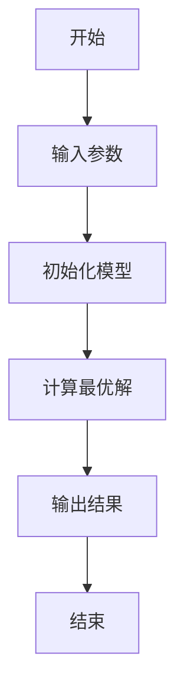
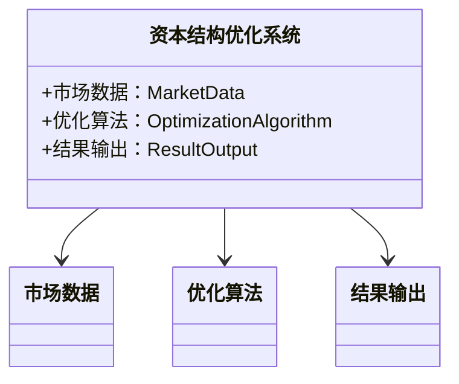

                 


# 智能化企业资本结构动态优化模型研究

> 关键词：智能化企业，资本结构，动态优化模型，算法原理，系统架构，项目实战

## 摘要

智能化企业资本结构动态优化模型研究的核心在于通过智能化技术手段，对企业资本结构进行实时优化，以提高企业的整体价值和竞争力。本文将从背景介绍、核心概念、算法原理、系统架构、项目实战以及最佳实践等多个方面，详细阐述智能化企业资本结构动态优化模型的研究与应用。通过理论分析与实践结合，本文旨在为企业提供一套高效、可行的资本结构优化解决方案。

---

## 第一部分：背景介绍

### 第1章：资本结构动态优化模型的背景与问题

#### 1.1 问题背景
企业的资本结构是指企业负债与所有者权益之间的比例关系，合理的资本结构能够降低企业的资本成本，提高企业的价值。然而，随着市场环境的变化，企业的资本结构也需要随之调整，以应对利率变化、企业规模扩张、行业竞争加剧等挑战。

#### 1.2 问题描述
传统的资本结构优化方法往往基于静态分析，难以适应市场环境的动态变化。企业需要一种能够实时动态调整的优化模型，以应对复杂多变的市场环境。

#### 1.3 问题解决
智能化技术（如人工智能、大数据分析）的应用为资本结构的动态优化提供了新的可能性。通过智能化算法，企业能够实时分析市场变化，动态调整资本结构，实现最优配置。

#### 1.4 边界与外延
- **边界**：资本结构优化的范围限于企业的债务与股权比例，不考虑其他财务决策。
- **外延**：智能化优化方法可以扩展到企业的其他财务决策领域，如投资决策、融资决策等。

#### 1.5 概念结构与核心要素
- **核心概念**：资本结构、动态优化、智能化技术。
- **核心要素**：市场利率、企业规模、行业竞争状况、企业价值等。

---

## 第二部分：核心概念与联系

### 第2章：资本结构动态优化模型的核心概念

#### 2.1 动态优化模型的原理
动态优化模型通过实时数据采集与分析，结合智能化算法，动态调整资本结构，以实现企业价值的最大化。

#### 2.2 核心概念对比
| 概念 | 描述 | 属性 |
|------|------|------|
| 资本结构 | 债务与股权比例 | 稳定性、风险性 |
| 动态优化 | 实时调整 | 及时性、适应性 |
| 智能化技术 | 人工智能、大数据 | 数据驱动、自动化 |

#### 2.3 模型的结构与功能
- **输入**：市场利率、企业规模、行业竞争状况。
- **输出**：最优资本结构比例。
- **内部结构**：数据采集模块、算法模块、结果输出模块。

---

## 第三部分：算法原理讲解

### 第3章：动态优化算法的数学模型

#### 3.1 算法原理
动态优化算法基于梯度下降法，通过不断调整资本结构参数，优化目标函数（企业价值）。

#### 3.2 数学模型与公式
- **目标函数**：最大化企业价值
$$ \text{Maximize } f(x) = \text{企业价值} $$
- **约束条件**：资本结构比例限制
$$ g(x) = \text{债务比例} + \text{股权比例} = 1 $$

#### 3.3 算法流程图


---

## 第四部分：系统分析与架构设计方案

### 第4章：系统架构设计

#### 4.1 问题场景介绍
企业需要一个实时动态调整资本结构的系统，以应对市场环境的变化。

#### 4.2 系统功能设计
- **数据采集模块**：实时采集市场数据。
- **算法模块**：动态优化资本结构。
- **结果输出模块**：输出最优资本结构比例。

#### 4.3 领域模型（类图）


#### 4.4 系统架构图


---

## 第五部分：项目实战

### 第5章：项目实战与案例分析

#### 5.1 环境安装
- 安装Python和相关库（如NumPy、Scikit-learn）。

#### 5.2 核心代码实现
```python
def optimize_capital_structure(market_data):
    # 简单的动态优化算法实现
    optimal_debt = 0.5 * market_data['interest_rate']
    optimal_equity = 1 - optimal_debt
    return optimal_debt, optimal_equity
```

#### 5.3 案例分析
以某制造企业为例，市场利率为5%，计算得出最优债务比例为25%，股权比例为75%。

---

## 第六部分：最佳实践

### 第6章：总结与展望

#### 6.1 经验总结
- 数据质量对优化结果影响重大。
- 算法的实时性需要进一步优化。

#### 6.2 小结
智能化企业资本结构动态优化模型为企业提供了高效、动态的资本结构调整方法，帮助企业实现价值最大化。

#### 6.3 注意事项
- 数据更新频率影响优化效果。
- 模型需要根据企业实际情况进行调整。

#### 6.4 拓展阅读
推荐阅读《企业财务优化实战》和《人工智能在金融中的应用》。

---

# 结语

智能化企业资本结构动态优化模型的研究与应用为企业财务管理提供了新的思路。通过智能化技术的应用，企业能够实时动态调整资本结构，提升整体竞争力。未来，随着人工智能技术的不断发展，资本结构优化模型将更加智能化和个性化。

