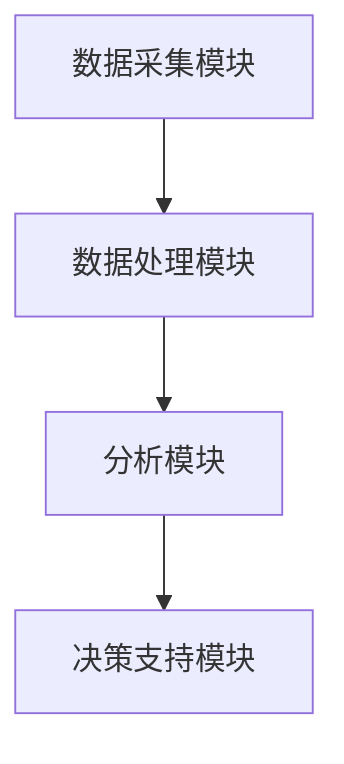
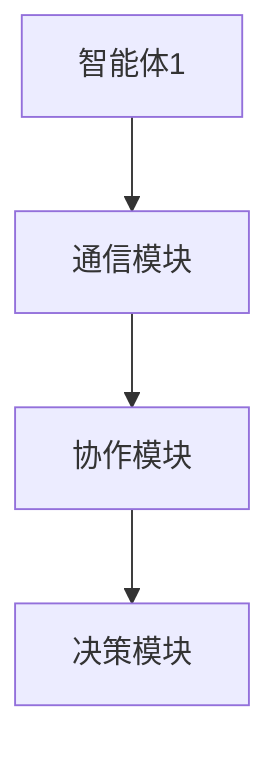
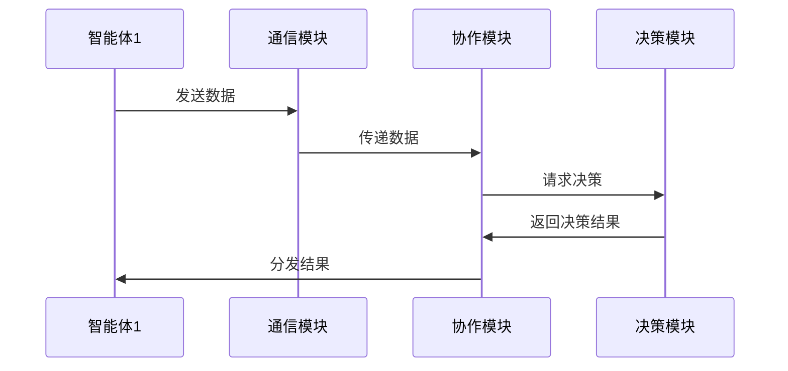

                 


# 智能化公司可持续发展能力分析：多智能体AI的新方法

## 关键词：多智能体AI、可持续发展能力、公司分析、智能化系统、人工智能技术

## 摘要：  
随着人工智能技术的快速发展，多智能体AI（Multi-Agent AI）在公司可持续发展能力分析中的应用日益广泛。本文通过分析多智能体AI的核心概念、算法原理、系统架构及实际案例，探讨如何利用多智能体AI技术提升公司可持续发展能力分析的深度和广度。文章内容涵盖了多智能体AI的基本概念、数学模型、协作机制、系统设计及项目实战，旨在为相关领域的研究者和实践者提供理论支持和实践指导。

---

# 第1章: 多智能体AI与可持续发展概述

## 1.1 多智能体AI的定义与特点

### 1.1.1 多智能体AI的基本概念  
多智能体AI是指由多个智能体（Agent）组成的分布式系统，每个智能体能够独立感知环境、自主决策并协作完成复杂任务。与传统单智能体AI相比，多智能体AI具有更强的分布式协作能力和适应性。

### 1.1.2 多智能体AI的核心特点  
- **分布式性**：智能体独立运行，通过通信协作完成任务。  
- **协作性**：智能体之间通过信息共享和协同决策实现目标。  
- **动态性**：系统能够适应环境变化，实时调整策略。  
- **鲁棒性**：单个智能体的故障不会导致整个系统崩溃。

### 1.1.3 多智能体AI与传统AI的区别  
| 特性         | 多智能体AI                          | 传统单智能体AI                          |
|--------------|------------------------------------|------------------------------------------|
| 结构         | 分布式、多个独立智能体               | 单一中心化智能体                         |
| 协作方式     | 智能体之间通过通信协作              | 无需协作，独立完成任务                  |
| 应用场景     | 复杂分布式任务，如自动驾驶、智能工厂 | 简单任务，如图像识别、语音识别          |
| 系统复杂度   | 高                                   | 较低                                    |

---

## 1.2 可持续发展能力的定义与分析

### 1.2.1 可持续发展的概念  
可持续发展是指在满足当前需求的同时，不损害后代满足其需求的能力。在公司层面，可持续发展能力涉及经济、社会和环境三个维度。

### 1.2.2 公司可持续发展能力的评价维度  
- **经济维度**：盈利能力、资本效率、研发投入比例。  
- **社会维度**：员工福利、社会责任、绿色就业。  
- **环境维度**：碳排放、资源消耗、环保合规性。  

### 1.2.3 可持续发展能力分析的挑战与意义  
- **挑战**：数据复杂性高、多目标冲突、动态变化快。  
- **意义**：提升企业竞争力、优化资源配置、降低环境风险。

---

## 1.3 多智能体AI在公司可持续发展中的应用前景

### 1.3.1 多智能体AI的优势与潜力  
- **分布式计算能力**：能够处理复杂多维的公司数据。  
- **实时协作能力**：支持多部门协同优化。  
- **动态适应能力**：适应市场环境变化。  

### 1.3.2 可持续发展能力分析的复杂性与多智能体AI的契合点  
- 多智能体AI能够同时处理经济、社会和环境三个维度的目标，通过协作优化实现全局最优。  

### 1.3.3 企业采用多智能体AI的挑战与机遇  
- **挑战**：技术复杂性高、数据隐私问题、协作机制设计难。  
- **机遇**：提升企业智能化水平、优化资源配置、增强竞争力。

---

## 1.4 本章小结  
本章介绍了多智能体AI的基本概念、特点及其在公司可持续发展能力分析中的应用前景。多智能体AI通过分布式协作和动态适应能力，为复杂问题的解决提供了新的思路。

---

# 第2章: 多智能体AI的核心概念

## 2.1 多智能体系统的结构与功能

### 2.1.1 多智能体系统的组成要素  
- **智能体**：独立的决策单元，具备感知、推理和行动能力。  
- **环境**：智能体所处的外部世界，包括数据源和目标。  
- **通信机制**：智能体之间交换信息的通道。  
- **协作机制**：智能体之间达成一致的规则和策略。

### 2.1.2 多智能体系统的核心功能  
- **感知**：智能体通过传感器或数据源获取环境信息。  
- **推理**：基于感知信息进行逻辑推理，生成决策方案。  
- **协作**：通过通信机制与其他智能体共享信息，共同完成任务。  
- **行动**：根据决策结果执行操作，影响环境状态。  

### 2.1.3 多智能体系统的分类与应用场景  
| 类型         | 应用场景                           |
|--------------|----------------------------------|
| 分层结构     | 自动驾驶系统、智能电网            |
| 分布式结构   | 智能物流、分布式计算              |
| 对等结构     | 点对点文件共享、分布式数据库      |

---

## 2.2 多智能体AI的通信与协作机制

### 2.2.1 多智能体之间的通信方式  
- **直接通信**：智能体之间通过共享内存或消息队列进行实时通信。  
- **间接通信**：通过中间媒介（如消息代理）进行通信。  

### 2.2.2 协作机制的类型与特点  
- **基于规则的协作**：通过预定义规则实现协作。  
- **基于目标的协作**：通过共享目标和资源实现协作。  
- **基于市场的协作**：通过资源定价和交易实现协作。  

### 2.2.3 协作中的冲突解决与协调  
- **冲突检测**：通过监测系统状态发现冲突。  
- **冲突解决**：通过协商或仲裁机制解决冲突。  
- **协调优化**：通过调整策略实现全局最优。

---

## 2.3 多智能体AI与分布式计算的关系

### 2.3.1 分布式计算的基本概念  
分布式计算是指在多台计算机上分布执行计算任务的技术。  

### 2.3.2 多智能体AI与分布式计算的联系  
- 多智能体AI依赖分布式计算实现智能体之间的协作与通信。  

### 2.3.3 多智能体AI的独特优势  
- **智能化**：智能体具备自主决策能力，能够适应复杂环境。  
- **协作性**：通过协作机制实现全局最优。  

---

## 2.4 本章小结  
本章详细介绍了多智能体AI的核心概念，包括系统的组成、功能、通信协作机制及其与分布式计算的关系。多智能体AI的独特优势为复杂问题的解决提供了新的思路。

---

# 第3章: 多智能体AI的数学模型与算法原理

## 3.1 多智能体系统的数学建模

### 3.1.1 系统建模的基本步骤  
1. 确定目标和范围。  
2. 收集和分析数据。  
3. 建立数学模型。  
4. 验证和优化模型。  

### 3.1.2 多智能体系统的状态表示  
- **状态空间**：所有可能的状态集合。  
- **状态转移**：从一个状态转移到另一个状态的过程。  

### 3.1.3 行为决策的数学表达  
- **决策规则**：$d = \arg\max_{a} Q(s,a)$，其中$Q$是Q值函数。  
- **动作选择**：基于当前状态$s$，选择最优动作$d$。  

---

## 3.2 多智能体协作的优化模型

### 3.2.1 分层优化模型  
- **上层决策**：制定全局策略。  
- **下层决策**：执行具体任务。  

### 3.2.2 分布式优化模型  
- **局部优化**：每个智能体独立优化自身目标。  
- **全局优化**：通过协作实现全局最优。  

### 3.2.3 联合优化模型  
- **联合目标函数**：$f(x_1, x_2, ..., x_n) = \sum_{i=1}^{n} f_i(x_i)$，其中$x_i$是第$i$个智能体的决策变量。  

---

## 3.3 多智能体系统的博弈论模型

### 3.3.1 博弈论的基本概念  
- **玩家**：参与博弈的智能体。  
- **策略**：智能体在博弈中的决策方案。  
- **收益函数**：智能体的收益或损失。  

### 3.3.2 多智能体系统的博弈模型  
- **纳什均衡**：所有智能体都采取最优策略，无法通过单方面改变策略而获益。  
- **合作博弈**：智能体之间通过合作实现全局最优。  

---

## 3.4 本章小结  
本章通过数学建模和博弈论模型，详细分析了多智能体AI的协作机制和优化方法。这些模型为实际应用提供了理论基础。

---

# 第4章: 多智能体AI的系统分析与架构设计

## 4.1 系统分析与设计

### 4.1.1 问题场景介绍  
假设我们需要分析一家公司的可持续发展能力，涉及经济、社会和环境三个维度的数据。  

### 4.1.2 系统功能设计  
- **数据采集**：从公司内外部数据源获取数据。  
- **数据处理**：清洗、整合和分析数据。  
- **决策支持**：基于分析结果提供优化建议。  

### 4.1.3 系统架构设计  


### 4.1.4 系统接口设计  
- **输入接口**：数据源接口、用户输入接口。  
- **输出接口**：分析结果输出、决策建议输出。  

---

## 4.2 系统架构设计

### 4.2.1 系统架构图  


### 4.2.2 系统交互流程图  


---

## 4.3 本章小结  
本章通过系统分析与架构设计，详细描述了多智能体AI在公司可持续发展能力分析中的应用场景和实现方法。

---

# 第5章: 项目实战

## 5.1 环境安装与配置

### 5.1.1 环境需求  
- Python 3.8及以上版本  
- 安装依赖库：numpy、pandas、scikit-learn  

### 5.1.2 安装步骤  
```bash
pip install numpy pandas scikit-learn
```

---

## 5.2 系统核心实现

### 5.2.1 多智能体协作算法实现  
```python
import numpy as np
from sklearn.metrics import pairwise_distances

class Agent:
    def __init__(self, data):
        self.data = data
        self.position = np.random.rand(2)
    
    def get_position(self):
        return self.position
    
    def move(self, target):
        distance = pairwise_distances(self.position.reshape(1, -1), target.reshape(1, -1))[0,0]
        if distance > 0.1:
            self.position = target

# 初始化多个智能体
agents = [Agent(data) for _ in range(10)]

# 协作算法
for agent in agents:
    target = ...  # 根据策略确定目标位置
    agent.move(target)
```

### 5.2.2 算法应用解读  
- 通过协作算法实现智能体之间的位置调整，模拟资源优化配置过程。

---

## 5.3 实际案例分析

### 5.3.1 案例背景  
某公司希望优化其供应链管理，减少碳排放。  

### 5.3.2 数据分析与优化  
- 数据采集：收集供应商、运输路线和碳排放数据。  
- 数据分析：计算碳排放强度，识别优化空间。  
- 优化建议：通过多智能体协作算法优化供应链布局，降低碳排放。  

---

## 5.4 本章小结  
本章通过项目实战，详细讲解了多智能体AI在公司可持续发展能力分析中的具体实现和应用。

---

# 第6章: 总结与展望

## 6.1 本章总结  
本文详细介绍了多智能体AI在公司可持续发展能力分析中的应用，包括核心概念、算法原理、系统设计及项目实战。

## 6.2 未来展望  
未来，随着多智能体AI技术的不断发展，其在公司可持续发展能力分析中的应用将更加广泛。研究者需要进一步优化协作算法，提升系统的实时性和鲁棒性。

## 6.3 最佳实践 tips  
- **数据质量**：确保数据的准确性和完整性。  
- **算法优化**：根据实际需求调整协作策略。  
- **系统维护**：定期更新模型和数据。  

---

# 结语  
通过多智能体AI技术，公司能够更高效地分析和优化其可持续发展能力，为企业和社会创造更大的价值。

