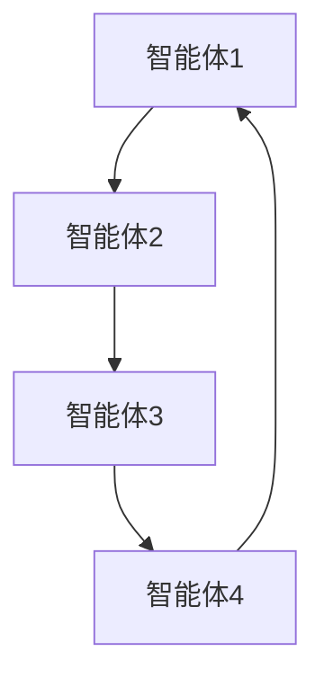
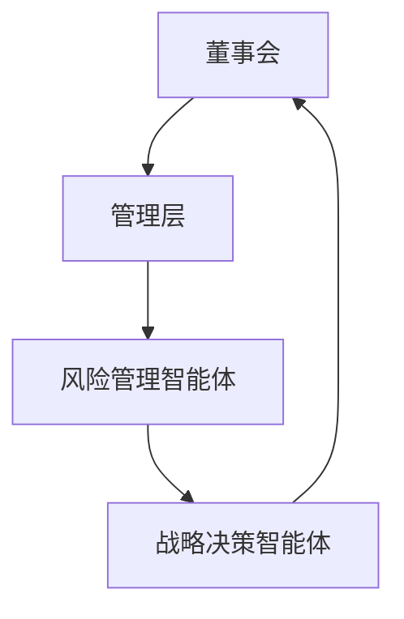
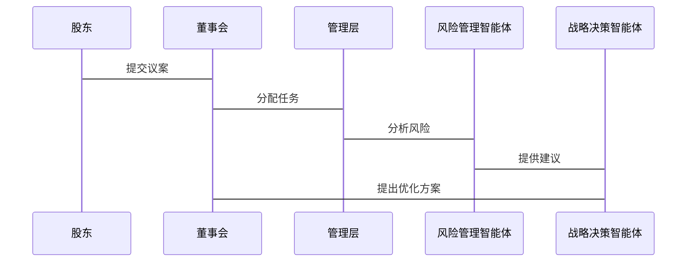

                 


# 智能化公司治理效率分析：多智能体AI的创新应用

## 关键词：公司治理，效率分析，多智能体AI，智能化决策，风险管理，协作机制

## 摘要：  
随着人工智能技术的快速发展，多智能体AI在公司治理中的应用逐渐成为提升效率的重要手段。本文将深入探讨多智能体AI的核心原理、应用场景及其在公司治理中的创新应用，结合实际案例分析，展示如何通过多智能体协作优化决策过程、降低风险、提高整体治理效率。通过本文的分析，读者能够全面理解多智能体AI在公司治理中的潜力和实际价值。

---

## 第一部分：多智能体AI与公司治理效率概述

### 第1章：多智能体AI的基本概念

#### 1.1 多智能体AI的定义
多智能体AI是指由多个相互协作或竞争的智能体组成的系统，这些智能体能够通过信息共享和协同决策完成复杂任务。与传统单智能体AI相比，多智能体系统能够更好地模拟人类团队协作的模式，适用于需要多方参与和复杂决策的场景。

#### 1.2 多智能体AI的核心特点
- **分布式智能**：多个智能体独立决策，共同完成任务。
- **协作性**：智能体之间通过通信和协作优化整体目标的实现。
- **动态性**：系统能够适应环境变化，实时调整策略。
- **自主性**：每个智能体都具备一定的自主决策能力。

#### 1.3 多智能体AI与传统AI的区别
| 特性 | 单智能体AI | 多智能体AI |
|------|------------|------------|
| 决策中心化 | 单一决策中心 | 分布式决策 |
| 信息共享 | 信息集中 | 信息分散共享 |
| 系统复杂度 | 较低 | 较高 |
| 应用场景 | 简单任务 | 复杂任务 |

### 第2章：公司治理效率的背景与问题

#### 2.1 公司治理的基本概念
公司治理是指通过制定和实施一系列制度、机制和流程，确保公司战略目标的实现、股东权益的保护以及公司运营的合规性。

#### 2.2 当前公司治理中的效率问题
- **信息不对称**：股东和管理层之间存在信息不透明，影响决策效率。
- **决策延迟**：复杂的决策过程可能导致效率低下。
- **风险管理不足**：传统治理模式难以应对复杂多变的市场风险。

#### 2.3 提升公司治理效率的必要性
- 提高决策效率，优化资源配置。
- 增强风险预警和应对能力。
- 提升公司整体竞争力。

---

## 第二部分：多智能体AI的原理与算法

### 第3章：多智能体AI的核心原理

#### 3.1 多智能体协作的机制
多智能体协作机制是实现高效公司治理的关键。通过智能体之间的通信与协作，可以优化决策过程。

##### 3.1.1 协作协议的定义
协作协议是智能体之间达成一致的规则，确保它们能够协同工作。

##### 3.1.2 协作协议的类型
- **协商协议**：智能体通过协商达成一致。
- **拍卖协议**：通过拍卖机制分配任务。
- **市场协议**：模拟市场机制进行资源分配。

##### 3.1.3 协作协议的实现方式


#### 3.2 多智能体协作的数学模型
多智能体协作的数学模型可以用博弈论中的纳什均衡来描述。每个智能体的目标函数如下：

$$ f_i(x_i, x_{-i}) \rightarrow \text{最大化或最小化} $$

其中，$x_i$ 是智能体i的策略，$x_{-i}$ 是其他智能体的策略。

---

### 第4章：多智能体AI的算法与数学模型

#### 4.1 多智能体协作算法
##### 4.1.1 分布式计算的基本原理
多智能体系统中的每个智能体都运行在不同的节点上，通过消息传递进行协作。

##### 4.1.2 博弈论在多智能体协作中的应用
博弈论中的囚徒困境模型可以用来解释智能体之间的合作与竞争。

##### 4.1.3 协作算法的实现步骤
```python
def multi_agent_collaboration():
    agents = [agent1, agent2, agent3, agent4]
    for agent in agents:
        agent.initiate()
    while True:
        for agent in agents:
            agent.communicate()
            agent.decide()
        # 检查是否达成一致
        if all(agents.agree):
            break
    return result
```

#### 4.2 多智能体AI的数学模型
##### 4.2.1 协作模型的数学表达
$$ \text{协作效益} = \sum_{i=1}^n f_i(x_i, x_{-i}) $$

##### 4.2.2 博弈论模型的数学公式
$$ \text{纳什均衡} \iff \forall i, f_i(x_i^*, x_{-i}^*) \geq f_i(x_i, x_{-i}^*) $$

---

## 第三部分：多智能体AI在公司治理中的应用

### 第5章：多智能体AI在公司治理中的应用场景

#### 5.1 战略决策中的多智能体协作
##### 5.1.1 战略决策的复杂性
公司战略决策通常涉及多个利益相关者，包括股东、管理层和外部顾问。

##### 5.1.2 多智能体协作在战略决策中的应用
通过多智能体AI，可以模拟不同决策路径，优化公司战略。

#### 5.2 风险管理中的多智能体协作
##### 5.2.1 风险管理的挑战
传统风险管理方法难以应对复杂多变的市场环境。

##### 5.2.2 多智能体AI在风险管理中的优势
通过实时数据共享和协作，多智能体AI能够快速识别和应对风险。

#### 5.3 董事会运作中的多智能体协作
##### 5.3.1 董事会运作的效率问题
传统董事会运作效率低下，难以快速响应变化。

##### 5.3.2 多智能体AI在董事会运作中的应用
通过多智能体协作，优化董事会决策流程，提升效率。

---

## 第四部分：系统设计与架构

### 第6章：多智能体AI治理系统的架构设计

#### 6.1 系统架构


#### 6.2 功能设计
- **信息共享模块**：实现智能体之间的信息共享。
- **决策协作模块**：支持多智能体协作决策。
- **风险管理模块**：实时监控并应对风险。

#### 6.3 接口设计
- **API接口**：定义智能体之间的通信接口。
- **数据接口**：实现数据的共享与处理。

#### 6.4 交互设计


---

## 第五部分：项目实战

### 第7章：多智能体AI治理系统的实现

#### 7.1 环境配置
- **编程语言**：Python
- **框架**：使用Rasa进行智能体通信。
- **数据库**：使用MongoDB存储数据。

#### 7.2 核心代码实现
```python
class Agent:
    def __init__(self, name):
        self.name = name
        self.strategy = None

    def communicate(self, message):
        # 处理消息并更新策略
        self.strategy = self.compute_strategy(message)

    def compute_strategy(self, message):
        # 简单策略实现
        return "approve" if message["status"] == "positive" else "reject"

# 初始化智能体
agents = [Agent("Board"), Agent("Management"), Agent("Risk"), Agent("Strategy")]

# 模拟通信
for agent in agents:
    agent.communicate({"status": "positive", "data": "strategic_plan"})
```

#### 7.3 案例分析
通过上述代码实现的多智能体AI系统，可以有效优化公司治理流程，提升决策效率。

---

## 第六部分：最佳实践与未来展望

### 第8章：总结与展望

#### 8.1 最佳实践
- **数据隐私保护**：确保智能体之间的数据共享符合隐私法规。
- **系统可扩展性**：设计灵活的架构，方便扩展。
- **持续优化**：定期更新智能体策略，适应变化。

#### 8.2 未来展望
随着AI技术的进步，多智能体AI在公司治理中的应用将更加广泛，实现更高效的治理模式。

---

## 附录：参考文献与拓展阅读

- 参考文献：[详细列出相关书籍和论文]
- 拓展阅读：推荐相关领域的优质资源。

---

通过以上分析和实践，我们可以看到多智能体AI在公司治理中的巨大潜力。未来，随着技术的进一步发展，多智能体AI将为公司治理效率的提升提供更强大的支持。

