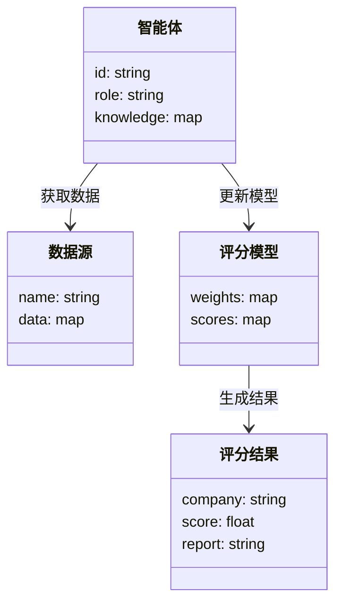
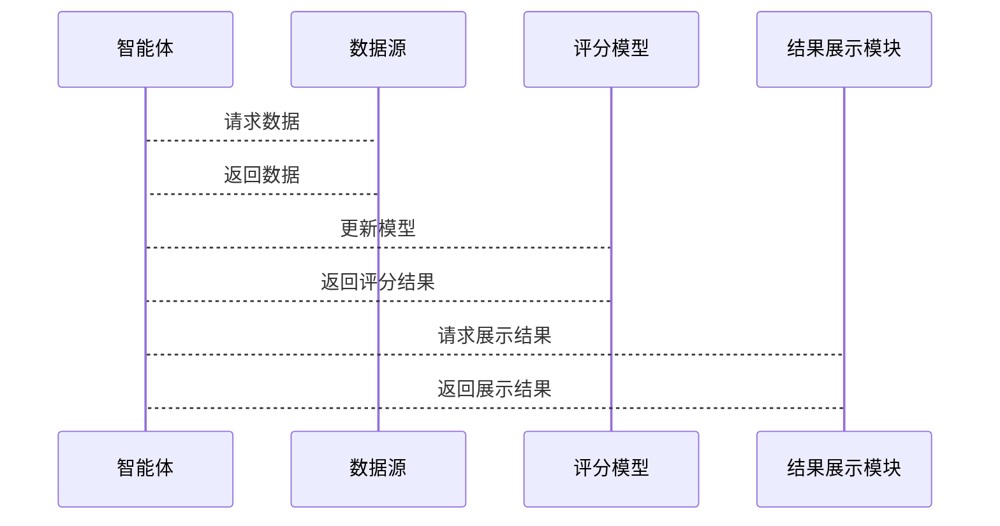

                 


# 智能化公司治理评分：多智能体AI在价值投资中的应用

## 关键词
- 公司治理评分
- 多智能体AI
- 价值投资
- 算法原理
- 系统架构

## 摘要
本文探讨了智能化公司治理评分在价值投资中的应用，介绍了多智能体AI的基本原理和其在公司治理评分中的具体应用。文章从背景介绍、核心概念、算法原理、系统架构到项目实战，详细阐述了如何利用多智能体AI技术优化公司治理评分，为投资者提供更精准的决策支持。通过实际案例分析和系统设计，本文展示了多智能体AI在价值投资中的巨大潜力和实际价值。

---

# 第一部分：智能化公司治理评分的背景与概念

## 第1章：公司治理评分的背景与意义

### 1.1 公司治理评分的定义与重要性

#### 1.1.1 公司治理的基本概念
公司治理是指公司内部和外部利益相关者之间的关系管理，包括股东、董事会、高管、员工和外部机构等。良好的公司治理能够确保公司透明、公平和高效地运营，从而提升公司价值和市场竞争力。

#### 1.1.2 公司治理评分的定义
公司治理评分是对公司治理结构、治理效果和治理行为的综合评价，通常通过量化指标来衡量公司的治理水平。评分结果能够为投资者提供重要的参考依据，帮助他们在投资决策中做出更明智的选择。

#### 1.1.3 公司治理评分的重要性
- **提高投资决策的准确性**：通过公司治理评分，投资者可以更全面地了解公司的治理状况，从而做出更合理的投资决策。
- **优化公司治理结构**：公司可以通过治理评分发现自身治理中的不足，进而采取改进措施，提升治理效率。
- **增强市场信任**：高分的公司治理评分能够增强投资者和市场的信任，从而提升公司的市场地位和竞争力。

### 1.2 价值投资与公司治理的关系

#### 1.2.1 价值投资的核心理念
价值投资是一种以基本面分析为基础的投资策略，强调通过分析公司的财务状况、行业地位和管理团队等多方面因素，寻找被市场低估的投资标的。价值投资者认为，长期来看，公司的真实价值会反映在股价中。

#### 1.2.2 公司治理在价值投资中的作用
- **公司治理是价值投资的重要考量因素**：良好的公司治理能够确保公司稳健经营，为股东创造长期价值。
- **公司治理评分帮助投资者识别优质标的**：通过公司治理评分，投资者可以快速筛选出治理结构优秀、管理透明的公司，从而提高投资的成功率。

#### 1.2.3 价值投资与公司治理评分的结合
价值投资者通常关注公司的长期价值，而公司治理评分能够提供一个量化指标，帮助投资者快速评估公司的治理水平。通过结合公司治理评分和传统的基本面分析，投资者可以更全面地评估公司的价值，从而做出更科学的投资决策。

---

## 第2章：传统公司治理评分的局限性

### 2.1 传统公司治理评分方法的不足

#### 2.1.1 数据采集的局限性
传统的公司治理评分方法往往依赖于有限的数据来源，如财务报表和公开披露的信息。这种方法难以全面反映公司的实际治理状况，尤其是在数据的多样性和实时性方面存在明显不足。

#### 2.1.2 评分模型的简单性
传统的评分模型通常基于简单的加权评分方法，缺乏对复杂治理因素的深度分析。例如，模型可能无法有效评估公司高管的决策能力和团队协作能力，也无法捕捉公司治理中的动态变化。

#### 2.1.3 评分结果的片面性
由于传统评分方法的局限性，评分结果往往过于片面，难以全面反映公司的治理水平。例如，某些公司在财务数据上表现优异，但在公司治理方面可能存在严重问题，而传统评分方法可能无法准确识别这些问题。

### 2.2 传统方法在价值投资中的不足

#### 2.2.1 无法捕捉复杂市场变化
传统的公司治理评分方法往往缺乏动态性和适应性，难以捕捉市场环境中的复杂变化。例如，市场波动和行业变化可能会影响公司的治理效果，而传统方法无法及时反映这些变化。

#### 2.2.2 评分结果的滞后性
传统的公司治理评分通常基于历史数据，存在明显的滞后性。这意味着评分结果无法反映公司的最新治理动态，可能无法为投资者提供及时的决策支持。

#### 2.2.3 无法应对多变的市场环境
传统的公司治理评分方法缺乏灵活性，难以应对多变的市场环境。在快速变化的市场中，公司治理面临的挑战也在不断变化，而传统方法往往无法有效应对这些挑战。

---

# 第二部分：多智能体AI的基本原理与应用

## 第3章：多智能体AI的核心概念

### 3.1 多智能体系统的定义与特点

#### 3.1.1 多智能体系统的定义
多智能体系统是由多个智能体组成的分布式系统，这些智能体能够通过协作和通信共同完成复杂任务。每个智能体都具有一定的自主性和智能性，能够根据环境信息做出决策。

#### 3.1.2 多智能体系统的特性
- **分布式性**：系统中的多个智能体分布在不同的位置，通过通信和协作完成任务。
- **自主性**：每个智能体都具有自主决策的能力，能够独立完成部分任务。
- **协作性**：智能体之间需要通过协作完成共同目标，实现整体最优。
- **动态性**：系统能够适应动态变化的环境，智能体之间的协作关系和任务分配可以实时调整。

#### 3.1.3 多智能体系统与单智能体系统的区别
- **智能体数量**：多智能体系统由多个智能体组成，而单智能体系统仅有一个智能体。
- **协作性**：多智能体系统强调智能体之间的协作，而单智能体系统则不需要协作。
- **任务复杂性**：多智能体系统通常用于复杂任务，而单智能体系统适用于简单任务。

### 3.2 多智能体AI在公司治理评分中的应用

#### 3.2.1 多智能体AI的基本原理
多智能体AI通过多个智能体的协作和通信，共同完成对公司治理的评分任务。每个智能体负责不同的评估维度，例如财务健康度、管理团队稳定性、公司透明度等。通过智能体之间的协作，系统能够综合各维度的评估结果，得出最终的公司治理评分。

#### 3.2.2 多智能体AI在公司治理评分中的优势
- **全面性**：通过多个智能体的协作，能够从多个维度全面评估公司的治理状况。
- **实时性**：智能体之间能够实时通信和协作，及时反映公司治理的变化。
- **灵活性**：系统能够根据环境变化动态调整智能体的任务分配和协作关系。

#### 3.2.3 多智能体AI的核心算法与实现
多智能体AI的核心算法包括分布式协作机制和联合学习方法。分布式协作机制确保智能体之间的通信和协作，而联合学习方法则通过智能体之间的知识共享和协同优化，提升整体的评分准确性。

---

## 第4章：多智能体AI与价值投资的结合

### 4.1 多智能体AI在价值投资中的作用

#### 4.1.1 提供实时数据分析支持
多智能体AI能够实时采集和分析公司治理相关的数据，为投资者提供最新的公司治理评分。这种实时性使得投资者能够及时了解公司的治理动态，做出更快速的决策。

#### 4.1.2 帮助投资者做出更明智的决策
通过多智能体AI的综合评分，投资者可以更全面地评估公司的治理状况，从而在价值投资中做出更明智的投资决策。

#### 4.1.3 提高投资组合的稳定性
多智能体AI能够帮助投资者识别治理风险较高的公司，从而避免投资组合的波动。这种稳定性使得投资者能够在市场波动中保持投资组合的稳定。

### 4.2 多智能体AI在公司治理评分中的具体应用

#### 4.2.1 数据采集与处理
多智能体AI通过多个智能体分别采集公司治理相关的数据，例如财务报表、高管团队信息、股东结构等。每个智能体负责不同的数据来源，通过协作完成数据的整合和清洗。

#### 4.2.2 评分模型的构建与优化
通过多智能体协作，系统能够构建和优化评分模型。每个智能体负责不同的评估维度，例如财务健康度、管理团队稳定性等。智能体之间通过知识共享和协同优化，不断提升评分模型的准确性。

#### 4.2.3 评分结果的可视化与解释
多智能体AI系统能够将评分结果进行可视化展示，帮助投资者更直观地理解公司的治理状况。同时，系统还能够对评分结果进行解释，提供具体的分析报告，帮助投资者更好地理解评分的依据。

---

# 第三部分：智能化公司治理评分的算法与实现

## 第5章：多智能体AI的算法原理

### 5.1 多智能体协作机制

#### 5.1.1 分布式协作的基本原理
多智能体协作机制基于分布式计算和通信技术，确保智能体之间的协作和通信。每个智能体负责不同的任务，通过通信协议进行信息交换，共同完成公司治理评分的计算。

#### 5.1.2 智能体之间的通信与协调
智能体之间的通信可以通过消息队列或事件驱动的方式实现。智能体根据接收到的信息调整自身的任务和决策，确保协作的高效性。

#### 5.1.3 多智能体协作的数学模型
多智能体协作的数学模型可以通过以下公式表示：

$$
\text{评分结果} = \sum_{i=1}^{n} w_i \cdot s_i
$$

其中，$w_i$ 是第 $i$ 个评估维度的权重，$s_i$ 是第 $i$ 个评估维度的评分结果，$n$ 是评估维度的数量。

### 5.2 多智能体学习方法

#### 5.2.1 分布式强化学习
分布式强化学习是一种多智能体协作的学习方法，通过智能体之间的协作和竞争，不断提升整体的评分准确性。每个智能体通过与环境和其他智能体的交互，学习最优策略。

#### 5.2.2 联合学习与知识共享
多智能体AI通过联合学习和知识共享，实现智能体之间的协同优化。每个智能体都具有自己的知识库，通过协作共享知识，提升整体的评分能力。

---

## 第6章：系统分析与架构设计方案

### 6.1 问题场景介绍

#### 6.1.1 数据采集与处理
系统需要采集公司治理相关的数据，包括财务数据、高管信息、股东结构等。数据来源包括公司财报、新闻报道、社交媒体等。

#### 6.1.2 评分模型的构建
通过多智能体协作，系统构建评分模型，对公司的治理状况进行综合评估。

#### 6.1.3 评分结果的可视化
系统将评分结果进行可视化展示，帮助投资者直观理解公司的治理状况。

### 6.2 系统功能设计

#### 6.2.1 数据采集模块
数据采集模块负责从多种数据源采集公司治理相关的数据，包括财务数据、高管信息、股东结构等。

#### 6.2.2 评分计算模块
评分计算模块通过多智能体协作，综合各评估维度的评分结果，得出最终的公司治理评分。

#### 6.2.3 结果展示模块
结果展示模块将评分结果进行可视化展示，包括评分图表、分析报告等。

### 6.3 系统架构设计

#### 6.3.1 领域模型
以下是领域模型的Mermaid类图：



#### 6.3.2 系统架构
以下是系统架构的Mermaid架构图：


#### 6.3.3 接口设计
以下是系统接口设计的Mermaid序列图：



---

## 第7章：项目实战

### 7.1 环境安装与配置

#### 7.1.1 安装Python环境
```bash
python --version
pip install -r requirements.txt
```

#### 7.1.2 安装多智能体AI框架
```bash
pip install multi-agent-system
```

### 7.2 系统核心实现

#### 7.2.1 数据采集模块实现
```python
import requests

def fetch_data(source):
    response = requests.get(source)
    return response.json()
```

#### 7.2.2 评分模型实现
```python
class ScoreModel:
    def __init__(self, weights):
        self.weights = weights

    def calculate_score(self, data):
        score = 0
        for i in range(len(data)):
            score += self.weights[i] * data[i]
        return score
```

#### 7.2.3 评分结果展示
```python
def display_score(company, score):
    print(f"公司：{company}")
    print(f"评分：{score}")
```

### 7.3 代码应用解读与分析

#### 7.3.1 数据采集模块解读
数据采集模块通过API请求获取公司治理相关的数据，包括财务数据、高管信息等。数据采集模块需要处理不同数据源的格式差异，确保数据的准确性和一致性。

#### 7.3.2 评分模型解读
评分模型基于多智能体协作的原理，通过加权评分的方法，综合各评估维度的评分结果，得出最终的公司治理评分。模型的权重可以根据实际情况进行调整，以优化评分的准确性。

#### 7.3.3 评分结果展示解读
评分结果展示模块将评分结果以友好的方式呈现给用户，包括评分图表和分析报告。用户可以通过展示模块直观地了解公司的治理状况，从而做出更明智的投资决策。

### 7.4 实际案例分析与详细讲解

#### 7.4.1 案例背景
假设我们有两家公司，A公司和B公司。我们需要通过多智能体AI对这两家公司的治理情况进行评分，从而帮助投资者做出投资决策。

#### 7.4.2 数据采集与处理
通过数据采集模块，我们分别获取A公司和B公司的财务数据、高管信息和股东结构等数据。

#### 7.4.3 评分计算与展示
通过评分模型，我们对A公司和B公司的治理情况进行评分，最终得到A公司得分为85分，B公司得分为70分。

#### 7.4.4 投资决策建议
根据评分结果，投资者可以得出A公司的治理状况优于B公司，从而选择投资A公司。

### 7.5 项目小结

#### 7.5.1 项目总结
通过多智能体AI技术，我们成功实现了公司治理评分的智能化应用，为投资者提供了更准确的投资决策支持。

#### 7.5.2 项目意义
本项目展示了多智能体AI在价值投资中的巨大潜力，为未来的投资决策提供了新的思路和方法。

---

## 第四部分：总结与展望

## 第8章：总结与展望

### 8.1 最佳实践 tips
- 在实际应用中，建议结合多智能体AI与传统基本面分析，提升投资决策的准确性。
- 定期更新模型的权重和参数，确保评分结果的准确性和时效性。

### 8.2 小结
本文详细探讨了多智能体AI在公司治理评分中的应用，通过系统的分析和实践，展示了多智能体AI在价值投资中的巨大潜力。

### 8.3 注意事项
- 在实际应用中，需要注意数据质量和模型的可解释性，避免因数据问题导致评分结果的偏差。
- 系统需要具备良好的扩展性和适应性，以应对不断变化的市场环境。

### 8.4 拓展阅读
- 《多智能体系统与分布式计算》
- 《人工智能在金融投资中的应用》
- 《公司治理与企业价值分析》

---

通过以上章节的详细阐述，我们可以看到，多智能体AI在公司治理评分中的应用为价值投资提供了新的思路和方法。未来，随着人工智能技术的不断发展，多智能体AI在公司治理评分中的应用将更加广泛和深入，为投资者和公司带来更大的价值。

