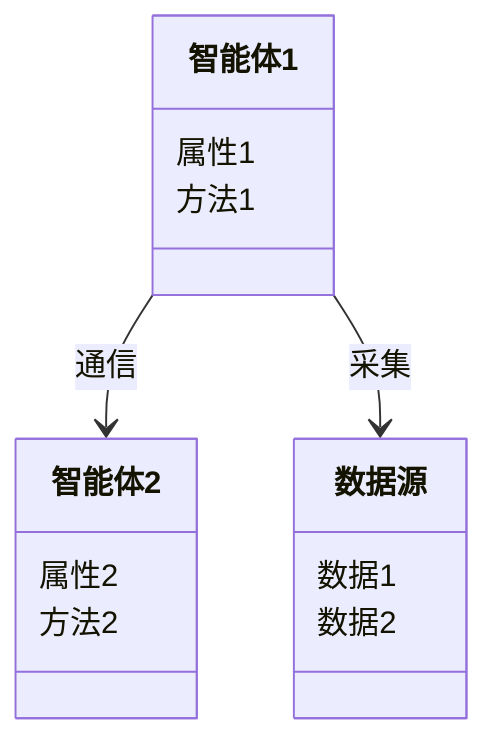
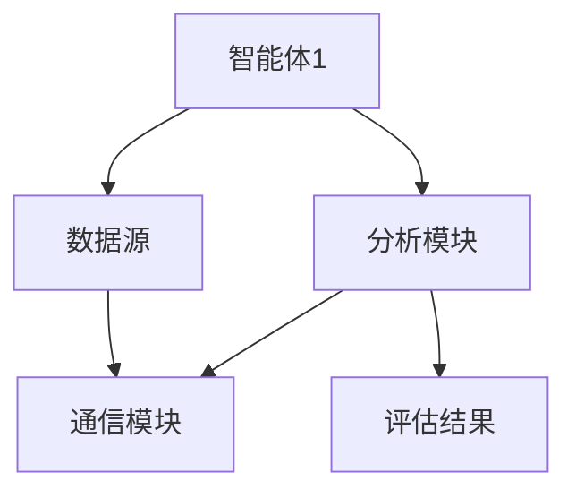
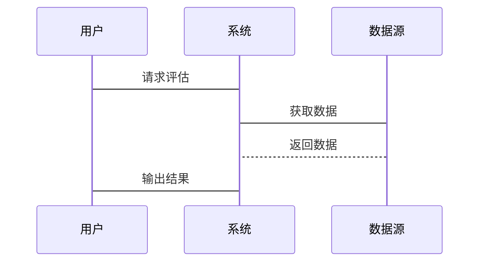

                 


# 智能化品牌价值评估：多智能体AI在价值投资中的应用

> 关键词：多智能体AI，品牌价值评估，价值投资，智能化评估，人工智能技术

> 摘要：本文深入探讨了多智能体AI在品牌价值评估中的应用，结合价值投资的理论，分析了智能化品牌价值评估的背景、原理、算法设计、系统架构以及实际案例，展示了多智能体AI如何提升品牌价值评估的准确性和效率，为价值投资者提供了新的工具和方法。

---

# 第一章: 智能化品牌价值评估的背景

## 1.1 品牌价值评估的背景与意义

### 1.1.1 品牌价值评估的定义与重要性
品牌价值是指品牌在市场中所代表的商誉和消费者信任的总和。准确评估品牌价值对企业的战略决策、投资评估和市场定位至关重要。传统的品牌价值评估方法依赖于财务指标和市场调研，但这些方法往往主观性强、数据有限，难以捕捉品牌在市场中的动态变化。

### 1.1.2 传统品牌价值评估方法的局限性
传统方法主要依赖问卷调查、专家评分和历史数据分析，存在以下问题：
- 数据采集成本高、耗时长。
- 主观性较强，难以量化。
- 无法实时捕捉市场动态。

### 1.1.3 智能化评估的必要性与优势
随着大数据和人工智能技术的发展，智能化评估能够利用多智能体AI技术，通过实时数据分析、情感计算和预测建模，提供更准确、高效的品牌价值评估。

## 1.2 多智能体AI的定义与特点

### 1.2.1 多智能体AI的定义
多智能体AI是指由多个相互作用的智能体组成的系统，每个智能体都能独立决策并协作完成复杂任务。这些智能体通过通信和协作，共同实现比单个智能体更强的功能。

### 1.2.2 多智能体AI的核心特征
- **分布式计算**：多个智能体协同工作，任务分解。
- **协作与通信**：智能体之间通过通信模块共享信息。
- **自主性**：每个智能体都能自主决策。
- **学习与适应**：智能体能通过反馈不断优化。

### 1.2.3 多智能体AI与传统AI的区别
传统AI依赖中心化决策，而多智能体AI强调去中心化协作，适用于复杂、动态的环境。

## 1.3 价值投资的基本概念

### 1.3.1 价值投资的定义
价值投资是一种投资策略，强调以低于公平价值的价格买入优质资产，长期持有，获得超额收益。

### 1.3.2 价值投资的核心理念
- 市场先生是不理性的。
- 安全边际的重要性。
- 长期投资，分散风险。

### 1.3.3 品牌价值在价值投资中的作用
品牌价值是企业长期竞争优势的体现，高品牌价值企业通常具有更强的定价能力和市场地位，适合价值投资者长期持有。

---

# 第二章: 多智能体AI的基本原理

## 2.1 多智能体系统的基本概念

### 2.1.1 多智能体系统的组成
- **智能体**：独立决策的单元，能感知环境并采取行动。
- **环境**：智能体所处的外部世界，包含任务目标和约束条件。
- **通信机制**：智能体之间共享信息的渠道。
- **协作协议**：定义智能体之间的交互规则。

### 2.1.2 多智能体系统的特点
- **分布式智能**：决策分散，无中心控制。
- **动态协作**：智能体根据环境变化调整协作方式。
- **自适应性**：系统能动态响应环境变化。

## 2.2 多智能体AI的核心算法

### 2.2.1 分布式计算
多智能体AI通过分布式计算将任务分解，每个智能体处理部分数据，提升计算效率。

### 2.2.2 协作与通信机制
智能体之间通过通信模块共享信息，采用共识算法（如拜占庭容错）确保数据一致性。

### 2.2.3 学习与适应算法
智能体通过强化学习和深度学习不断优化决策模型，提升评估准确性。

## 2.3 多智能体AI在品牌价值评估中的应用

### 2.3.1 多智能体AI的优势
- **数据处理能力**：能处理海量数据，提取深层特征。
- **实时性**：能实时分析市场动态，快速响应。
- **准确性**：通过多维度分析，提高评估结果的准确性。

### 2.3.2 多智能体AI的挑战
- **计算复杂性**：多智能体协作可能导致计算开销增加。
- **通信延迟**：智能体之间的通信可能引入延迟。
- **协同优化**：需要设计高效的协同算法，确保智能体之间协作有效。

### 2.3.3 多智能体AI在品牌价值评估中的具体应用
- **实时数据采集**：通过多个智能体实时采集品牌相关的市场数据。
- **情感分析**：利用自然语言处理技术分析消费者对品牌的看法。
- **预测建模**：构建多智能体预测模型，评估品牌未来价值。

---

# 第三章: 品牌价值评估的理论基础

## 3.1 品牌价值评估的传统方法

### 3.1.1 品牌价值的定义
品牌价值是品牌为企业带来的超额收益，通常通过财务指标和市场调研进行评估。

### 3.1.2 品牌价值评估的主要指标
- **市场份额**：品牌在市场中的占有率。
- **客户忠诚度**：客户对品牌的忠诚程度。
- **品牌认知度**：消费者对品牌的熟悉程度。

### 3.1.3 品牌价值评估的传统模型
- **溢价法**：计算品牌产品价格与非品牌产品价格的差异。
- **节省成本法**：计算品牌带来的成本节约。
- **收益法**：预测未来收益，折现计算现值。

## 3.2 现代品牌价值评估方法

### 3.2.1 数据驱动的评估方法
利用大数据分析技术，从海量数据中提取品牌相关信息，构建数学模型进行评估。

### 3.2.2 多维度分析方法
从财务、市场、消费者等多个维度进行综合分析，提高评估的全面性。

### 3.2.3 品牌价值评估的现代模型
- **因子分析模型**：提取影响品牌价值的关键因子。
- **神经网络模型**：利用深度学习技术预测品牌价值。
- **混合模型**：结合传统方法和现代技术，提高评估准确性和效率。

---

# 第四章: 多智能体AI在品牌价值评估中的应用

## 4.1 问题建模

### 4.1.1 问题定义
我们需要构建一个多智能体AI系统，能够实时采集、分析和评估品牌价值。

### 4.1.2 系统目标
- 实时采集品牌相关的市场数据。
- 分析数据，评估品牌价值。
- 提供评估结果，辅助价值投资决策。

## 4.2 算法设计

### 4.2.1 分布式数据采集
通过多个智能体分别采集不同来源的数据，如社交媒体、新闻网站等。

### 4.2.2 数据预处理
对采集到的数据进行清洗、归一化处理，确保数据质量。

### 4.2.3 情感分析
利用自然语言处理技术，分析消费者对品牌的看法，提取情感特征。

### 4.2.4 预测建模
构建多智能体预测模型，基于历史数据和实时数据预测品牌价值。

### 4.2.5 评估结果输出
将预测结果输出，供投资者进行决策。

## 4.3 案例分析

### 4.3.1 案例背景
以某知名消费品牌为例，分析其品牌价值。

### 4.3.2 数据来源
- 社交媒体评论。
- 新闻报道。
- 财务报表。

### 4.3.3 数据分析
通过多智能体AI系统，分析该品牌的市场份额、客户忠诚度和品牌认知度。

### 4.3.4 评估结果
预测该品牌未来三年的价值变化趋势，为投资者提供参考。

## 4.4 结果分析

### 4.4.1 模型准确性
通过对比历史数据，验证模型的准确性。

### 4.4.2 模型优化
根据实际应用效果，不断优化模型参数，提高评估精度。

### 4.4.3 实际应用效果
展示多智能体AI系统在实际中的应用效果，证明其优势。

---

# 第五章: 系统架构设计

## 5.1 问题场景分析

### 5.1.1 问题描述
设计一个多智能体AI系统，实现品牌价值的智能化评估。

### 5.1.2 项目介绍
项目目标、范围、技术路线和实施步骤。

## 5.2 系统功能设计

### 5.2.1 领域模型
使用Mermaid绘制领域模型类图，展示系统各模块之间的关系。



### 5.2.2 系统架构
使用Mermaid绘制系统架构图，展示系统的主要组件及其交互关系。



### 5.2.3 接口设计
定义系统各模块之间的接口，确保模块间通信顺畅。

### 5.2.4 交互流程
使用Mermaid绘制系统交互流程图，展示用户与系统之间的交互过程。



---

# 第六章: 项目实战

## 6.1 环境搭建

### 6.1.1 安装Python
安装Python 3.8及以上版本。

### 6.1.2 安装依赖库
安装numpy、pandas、scikit-learn等依赖库。

## 6.2 核心代码实现

### 6.2.1 数据采集模块
编写代码采集品牌相关的市场数据。

```python
import requests
from bs4 import BeautifulSoup

def fetch_data(url):
    response = requests.get(url)
    soup = BeautifulSoup(response.text, 'html.parser')
    return soup
```

### 6.2.2 数据预处理模块
对采集到的数据进行清洗和归一化处理。

```python
import pandas as pd

def preprocess_data(data):
    df = pd.DataFrame(data)
    df = df.dropna()
    df = df.apply(lambda x: (x - x.mean()) / x.std())
    return df
```

### 6.2.3 情感分析模块
使用自然语言处理技术进行情感分析。

```python
from textblob import TextBlob

def sentiment_analysis(text):
    blob = TextBlob(text)
    return blob.sentiment.polarity
```

### 6.2.4 预测建模模块
构建机器学习模型预测品牌价值。

```python
from sklearn.ensemble import RandomForestRegressor

def train_model(X, y):
    model = RandomForestRegressor()
    model.fit(X, y)
    return model
```

### 6.2.5 结果输出模块
输出品牌价值评估结果。

```python
def output_result(result):
    print(f"品牌价值评估结果：{result}")
```

## 6.3 案例分析

### 6.3.1 数据来源
以某品牌为例，采集其市场份额、客户忠诚度等数据。

### 6.3.2 数据分析
使用上述代码对数据进行预处理和情感分析。

### 6.3.3 模型训练
训练随机森林回归模型，预测品牌价值。

### 6.3.4 结果展示
输出品牌价值评估结果，供投资者参考。

---

# 第七章: 总结与展望

## 7.1 总结

### 7.1.1 核心内容回顾
总结全文的核心内容，包括多智能体AI的基本原理、品牌价值评估的理论基础、算法设计和系统架构。

### 7.1.2 实战经验分享
分享项目实战中的经验教训，优化建议和未来改进方向。

## 7.2 未来展望

### 7.2.1 当前应用中的挑战
讨论多智能体AI在品牌价值评估中的应用挑战，如数据隐私、计算资源等。

### 7.2.2 未来发展趋势
展望未来，多智能体AI在品牌价值评估中的潜力，如与其他AI技术的结合、更复杂模型的应用等。

### 7.2.3 对价值投资者的建议
建议投资者如何利用多智能体AI技术提升品牌价值评估的准确性和效率，抓住投资机会。

---

# 附录

## 附录A: 数据集说明

### 附录A.1 数据来源
详细说明数据集的来源和采集方法。

### 附录A.2 数据格式
说明数据集的格式和存储方式。

### 附录A.3 数据预处理步骤
详细描述数据预处理的具体步骤和方法。

## 附录B: 工具包说明

### 附录B.1 工具包安装
说明如何安装和配置所需的工具包。

### 附录B.2 工具包使用
详细说明工具包的使用方法和注意事项。

## 附录C: 参考文献

### 附录C.1 文献引用
列出参考文献，包括书籍、期刊文章和网络资源。

### 附录C.2 资源链接
提供相关资源的链接，方便读者进一步研究。

---

# 结语

通过本文的深入探讨，我们展示了多智能体AI在品牌价值评估中的巨大潜力。未来，随着技术的不断发展，多智能体AI将在价值投资中发挥越来越重要的作用，为投资者提供更精准的决策支持。

