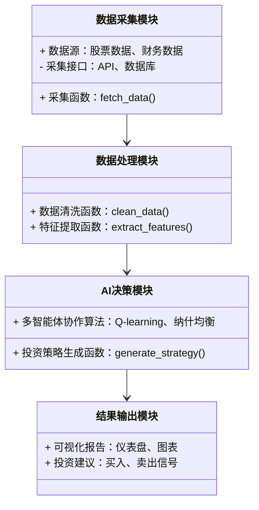

                 


# 智能化商业模式分析：多智能体AI在价值投资中的角色

---

## 关键词  
智能化商业模式、多智能体AI、价值投资、AI算法、投资决策、风险管理、系统架构

---

## 摘要  
本文深入探讨了多智能体AI在价值投资中的应用及其对商业模式的影响。通过分析多智能体AI的核心原理、算法模型、系统架构以及实际案例，本文揭示了多智能体AI如何通过分布式协作和智能决策优化投资策略。文章还结合具体代码实现和系统设计，展示了多智能体AI在价值投资中的实际应用价值，为智能化商业模式的未来发展提供了新的思路。

---

## 第1章: 智能化商业模式的背景与概念

### 1.1 智能化商业模式的背景  
随着数字化转型的深入推进，AI技术的快速发展正在重塑商业模式。传统的商业模式依赖于人工决策和经验判断，而智能化商业模式则通过多智能体AI实现分布式协作和智能决策，显著提升了效率和精准度。  

#### 1.1.1 数字化转型的浪潮  
企业正在经历从信息化向智能化的转变，数据的实时处理和智能分析成为核心竞争力。  
$$\text{数据驱动决策} \rightarrow \text{智能化转型}$$  

#### 1.1.2 AI技术的快速发展  
AI技术的突破（如深度学习、强化学习）为多智能体协作提供了技术基础。  
$$\text{多智能体系统} = \text{分布式计算} + \text{智能协作}$$  

#### 1.1.3 商业模式创新的需求  
传统商业模式的局限性（如效率低下、决策滞后）亟需通过智能化技术进行优化。  

### 1.2 价值投资的基本概念  
价值投资是一种通过分析企业基本面（如财务数据、行业地位）来寻找被低估投资标的的投资策略。  

#### 1.2.1 价值投资的定义  
$$\text{价值投资} = \text{基本面分析} + \text{长期视角}$$  

#### 1.2.2 价值投资的核心原则  
- 以合理价格买入优质资产。  
- 长期持有，避免短期波动干扰。  

#### 1.2.3 价值投资与传统投资的区别  
| 区别点 | 价值投资 | 传统投资 |  
|--------|-----------|-----------|  
| 投资策略 | 基于基本面分析 | 基于技术分析或短期趋势 |  
| 持股周期 | 长期持有 | 短期交易 |  
| 风险管理 | 强调安全边际 | 更依赖市场预测 |  

### 1.3 多智能体AI的基本概念  
多智能体AI是一种由多个智能体组成的系统，通过协作完成复杂任务。  

#### 1.3.1 多智能体系统的定义  
$$\text{多智能体系统} = \text{多个智能体} + \text{协作机制}$$  

#### 1.3.2 多智能体系统的特征  
- 分布式：多个智能体独立运行。  
- 协作性：智能体之间通过信息共享完成任务。  
- 自适应性：能够根据环境变化调整策略。  

#### 1.3.3 多智能体系统与单智能体系统的区别  
| 特性 | 单智能体系统 | 多智能体系统 |  
|------|--------------|--------------|  
| 独立性 | 单一决策主体 | 多个决策主体 |  
| 协作性 | 无 | 高 |  
| 并行性 | 串行 | 并行 |  

### 1.4 本章小结  
本章介绍了智能化商业模式的背景、价值投资的基本概念以及多智能体AI的核心概念，为后续分析奠定了基础。

---

## 第2章: 多智能体AI在价值投资中的应用

### 2.1 价值投资中的信息处理需求  
价值投资依赖于对企业基本面的深度分析，而多智能体AI能够通过分布式协作高效处理海量数据。  

#### 2.1.1 数据分析的重要性  
$$\text{数据分析} = \text{数据清洗} + \text{特征提取} + \text{模型训练}$$  

#### 2.1.2 信息整合的挑战  
- 数据来源多样，格式复杂。  
- 数据量大，处理效率要求高。  

#### 2.1.3 多智能体AI在信息处理中的优势  
- 并行计算能力：多智能体同时处理不同数据源。  
- 协作能力：智能体之间共享信息，避免信息孤岛。  

### 2.2 多智能体AI在投资决策中的作用  
多智能体AI能够通过协作优化投资决策，降低风险。  

#### 2.2.1 投资决策的复杂性  
- 需要考虑市场、行业、企业多维度因素。  
- 决策过程涉及多个环节，需要高效协作。  

#### 2.2.2 多智能体AI在决策支持中的应用  
- 数据分析：多个智能体分别分析财务数据、市场趋势、行业动态。  
- 风险评估：通过协作机制识别潜在风险点。  

#### 2.2.3 多智能体AI在风险控制中的作用  
- 实时监控市场变化。  
- 自动调整投资组合以规避风险。  

### 2.3 价值投资中的多智能体协作机制  
多智能体协作机制是实现价值投资智能化的关键。  

#### 2.3.1 多智能体协作的基本原理  
$$\text{协作机制} = \text{信息共享} + \text{任务分配} + \text{结果整合}$$  

#### 2.3.2 协作机制的设计原则  
- 明确角色分工：每个智能体负责特定任务。  
- 信息透明：确保智能体之间信息共享。  
- 反馈机制：根据结果调整协作策略。  

#### 2.3.3 协作机制在价值投资中的具体应用  
- 数据采集：智能体分别收集财务数据、市场数据。  
- 模型训练：智能体协作构建预测模型。  
- 投资决策：基于协作结果制定投资策略。  

### 2.4 本章小结  
本章分析了多智能体AI在价值投资中的信息处理、决策支持和协作机制，展示了其在投资领域的巨大潜力。

---

## 第3章: 多智能体AI的算法原理

### 3.1 多智能体AI的核心算法  
多智能体AI的核心算法包括Q-learning、纳什均衡和联合推理。  

#### 3.1.1 Q-learning算法  
Q-learning是一种经典的强化学习算法，适用于单智能体和多智能体系统。  

$$Q(s, a) = r + \max Q(s', a')$$  

#### 3.1.2 纳什均衡  
纳什均衡是博弈论中的一个概念，适用于多智能体协作中的策略选择。  

$$\text{纳什均衡} = \text{所有智能体策略最优}$$  

#### 3.1.3 联合推理算法  
联合推理算法通过智能体之间的协作推理实现全局最优。  

$$\text{联合推理} = \text{分布式推理} + \text{结果整合}$$  

### 3.2 多智能体AI的数学模型  
多智能体AI的数学模型包括状态空间、动作空间和奖励函数。  

#### 3.2.1 状态空间的定义  
状态空间表示智能体所处的环境状态。  

$$s \in S$$  

#### 3.2.2 动作空间的定义  
动作空间表示智能体可执行的操作。  

$$a \in A$$  

#### 3.2.3 奖励函数的设计  
奖励函数用于衡量智能体的行为优劣。  

$$r = f(s, a)$$  

### 3.3 多智能体AI的协作机制  
协作机制是多智能体AI的核心，包括基于博弈论的协作和分布式计算协作。  

#### 3.3.1 基于博弈论的协作机制  
博弈论为多智能体协作提供了理论基础，常用于策略选择和利益分配。  

#### 3.3.2 基于分布式计算的协作机制  
分布式计算协作机制通过并行计算提升效率。  

#### 3.3.3 基于强化学习的协作机制  
强化学习协作机制通过不断试错优化协作策略。  

### 3.4 本章小结  
本章详细介绍了多智能体AI的核心算法和数学模型，为后续实现奠定了理论基础。

---

## 第4章: 多智能体AI在价值投资中的系统架构设计

### 4.1 系统架构概述  
系统架构包括数据采集、数据处理、AI决策和结果输出四个模块。  

#### 4.1.1 系统整体架构  
$$\text{系统架构} = \text{数据采集} + \text{数据处理} + \text{AI决策} + \text{结果输出}$$  

#### 4.1.2 系统模块划分  
- 数据采集模块：负责采集企业财务数据、市场数据。  
- 数据处理模块：清洗数据并提取特征。  
- AI决策模块：通过多智能体协作生成投资策略。  
- 结果输出模块：输出投资建议和风险提示。  

#### 4.1.3 系统功能设计  
- 数据采集：支持多种数据源接入。  
- 数据处理：具备数据清洗、特征提取功能。  
- AI决策：支持多智能体协作和策略优化。  
- 结果输出：提供可视化报告和投资建议。  

### 4.2 系统功能模块设计  
功能模块设计基于领域模型，通过Mermaid类图展示。  



### 4.3 系统架构图  
系统架构图通过Mermaid架构图展示。  


### 4.4 本章小结  
本章设计了多智能体AI在价值投资中的系统架构，展示了各模块的功能和交互关系。

---

## 第5章: 多智能体AI在价值投资中的项目实战

### 5.1 项目环境搭建  
项目环境包括Python、机器学习库（如TensorFlow、PyTorch）和数据分析库（如Pandas、NumPy）。  

#### 5.1.1 环境安装  
```bash
pip install numpy pandas scikit-learn tensorflow
```

#### 5.1.2 工具配置  
- 数据采集工具：API接口、数据库连接。  
- 数据分析工具：Jupyter Notebook、IDE。  

#### 5.1.3 数据准备  
数据包括股票价格、财务数据、市场指标等。  

### 5.2 项目核心代码实现  
代码实现包括数据处理、模型训练和结果输出。  

#### 5.2.1 数据处理代码  
```python
import pandas as pd
import numpy as np

def clean_data(data):
    # 删除缺失值
    data = data.dropna()
    # 标准化数据
    data = (data - data.mean()) / data.std()
    return data

# 示例数据
data = pd.DataFrame({
    'price': [10, 20, 30, np.nan, 50],
    'volume': [100, 200, 300, 400, 500]
})

clean_data(data)
```

#### 5.2.2 AI决策模块代码  
```python
import tensorflow as tf
from tensorflow.keras import layers

def multi_agent_model(num_agents=5):
    model = tf.keras.Sequential()
    model.add(layers.Dense(64, activation='relu'))
    model.add(layers.Dense(32, activation='relu'))
    model.add(layers.Dense(1, activation='sigmoid'))
    return model

# 初始化多智能体模型
models = [multi_agent_model() for _ in range(5)]

# 训练模型
for model in models:
    model.compile(optimizer='adam', loss='binary_crossentropy')
    model.fit(X_train, y_train, epochs=10, batch_size=32)
```

#### 5.2.3 结果输出代码  
```python
import matplotlib.pyplot as plt

def visualize_results(results):
    plt.figure(figsize=(10, 6))
    plt.plot(results, label='投资收益')
    plt.xlabel('时间')
    plt.ylabel('收益')
    plt.legend()
    plt.show()

# 示例结果
results = [10, 20, 30, 40, 50]
visualize_results(results)
```

### 5.3 项目实战案例分析  
以股票投资为例，通过多智能体协作生成投资策略，并验证其有效性。  

#### 5.3.1 数据采集与处理  
- 数据来源：股票价格、财务指标、市场情绪。  
- 数据清洗：去除缺失值、处理异常值。  

#### 5.3.2 模型训练与优化  
- 训练多智能体模型，优化投资策略。  
- 通过回测验证策略的有效性。  

#### 5.3.3 投资策略生成  
- 基于模型输出生成买入、卖出信号。  
- 输出可视化报告。  

### 5.4 本章小结  
本章通过实际案例展示了多智能体AI在价值投资中的应用，验证了其有效性和实用性。

---

## 第6章: 结论与展望

### 6.1 本章总结  
本文详细探讨了多智能体AI在价值投资中的应用，从理论到实践，展示了其在信息处理、决策支持和风险控制中的巨大潜力。  

### 6.2 未来展望  
- 更复杂的多智能体协作算法。  
- 更广泛的应用场景（如量化交易、资产配置）。  
- 更高效的计算框架（如分布式计算、边缘计算）。  

---

## 参考文献  
（此处列出相关参考文献）

---

## 致谢  
感谢读者的支持与关注！

---

通过以上结构，文章详细探讨了多智能体AI在价值投资中的应用，从理论到实践，为智能化商业模式的未来发展提供了新的思路。

