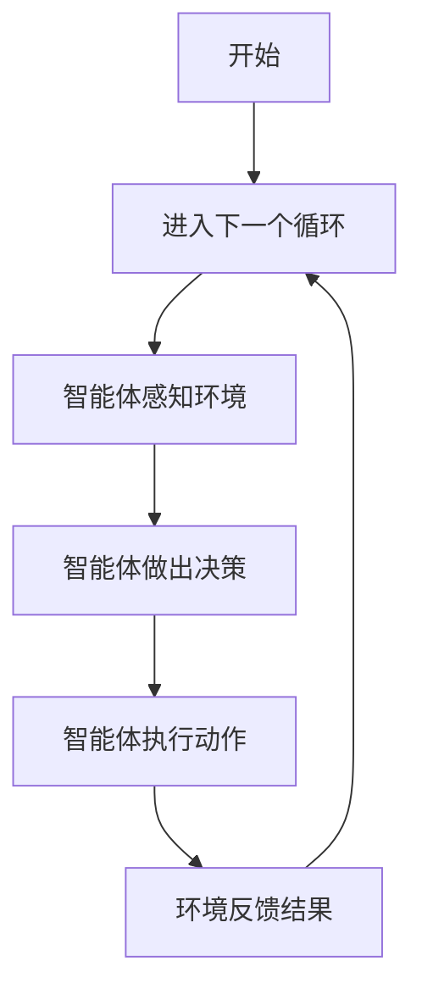

                 


# 智能化并购后整合效果预测：多智能体AI的新视角

## 关键词：智能化并购、多智能体AI、整合效果预测、企业整合、AI预测模型

## 摘要：本文从多智能体AI的视角，深入分析智能化并购后整合效果预测的核心原理、算法模型及系统架构。通过构建多智能体协同预测模型，结合企业并购整合的复杂场景，提出基于多智能体协同的预测方法，为企业的并购整合决策提供科学依据。

---

# 第一部分: 智能化并购后整合效果预测的背景与意义

## 第1章: 智能化并购整合概述

### 1.1 并购整合的背景与挑战

#### 1.1.1 并购整合的定义与特点
- **定义**: 并购整合是指企业在收购其他企业后，将其资源、业务、文化等进行整合的过程。
- **特点**: 
  - 跨界性：涉及企业内外部资源的整合。
  - 复杂性：涉及战略、财务、运营等多个方面。
  - 不确定性：整合效果受多种外部和内部因素影响。

#### 1.1.2 并购整合中的常见问题
- **协同效应难以量化**：整合后的协同效应往往难以准确预测。
- **文化冲突**：企业文化的差异可能导致整合失败。
- **资源分配问题**：资源整合不当可能导致资源浪费或效率低下。

#### 1.1.3 智能化预测的必要性
- **数据驱动决策**：通过AI技术，可以基于历史数据和实时信息，提供更精准的预测。
- **提高整合效率**：通过智能化预测，企业可以提前识别整合中的风险点。
- **降低整合成本**：通过优化整合策略，降低整合过程中的成本。

### 1.2 多智能体AI的定义与特点

#### 1.2.1 多智能体系统的定义
- **定义**: 多智能体系统是由多个相互作用的智能体组成的系统，每个智能体都有一定的自主性，能够感知环境并做出决策。
- **特点**:
  - 分布式：智能体之间通过分布式协作完成任务。
  - 协作性：智能体之间通过协作实现系统目标。
  - 动态性：系统能够适应环境的变化。

#### 1.2.2 多智能体AI的核心特点
- **分布式计算**：通过分布式计算实现智能体之间的协作。
- **自主性**：每个智能体都有一定的自主决策能力。
- **动态适应性**：系统能够根据环境变化动态调整。

#### 1.2.3 多智能体AI与传统AI的区别
| 特性          | 多智能体AI                            | 传统AI                              |
|---------------|--------------------------------------|--------------------------------------|
| 结构          | 分布式、多个智能体                   | 集中式、单个智能体                  |
| 协作方式      | 智能体之间协作                      | 单一智能体独立运行                  |
| 适应性        | 高，能够动态调整                     | 较低，需要人工干预或重新训练        |

### 1.3 智能化并购整合效果预测的意义

#### 1.3.1 提高整合效率
- 通过多智能体AI的协同预测，企业可以提前识别整合中的关键问题，优化整合流程。

#### 1.3.2 减少整合风险
- 多智能体AI能够预测整合中的潜在风险，并提供应对策略，降低整合失败的可能性。

#### 1.3.3 优化资源配置
- 通过智能化预测，企业可以更合理地分配资源，提高整合效率和效果。

### 1.4 本章小结
本章从背景、挑战、必要性三个方面介绍了智能化并购整合的背景，并详细阐述了多智能体AI的定义、特点及与传统AI的区别，最后总结了智能化并购整合效果预测的意义。

---

# 第二部分: 多智能体AI的核心概念与联系

## 第2章: 多智能体AI的核心原理

### 2.1 多智能体系统的组成与关系

#### 2.1.1 实体关系分析

##### 2.1.1.1 实体关系图（ER图）
通过ER图展示多智能体系统中各实体之间的关系。

```mermaid
erdiagram
actor 用户 {
  id 用户ID
  name 用户名
}
actor 系统管理员 {
  id 管理员ID
  name 管理员名
}
actor 智能体 {
  id 智能体ID
  name 智能体名称
}
```

#### 2.1.2 实体关系图（ER图）的作用
- **展示实体关系**：通过ER图清晰展示系统中各实体之间的关系。
- **便于系统设计**：ER图是系统设计的重要工具，能够帮助设计人员更好地理解系统结构。

### 2.2 多智能体AI的算法原理

#### 2.2.1 算法流程图


#### 2.2.2 算法实现
- **输入**: 环境信息
- **输出**: 智能体决策
- **算法步骤**:
  1. 智能体感知环境，获取相关信息。
  2. 基于感知信息，智能体做出决策。
  3. 智能体执行决策，并将结果反馈到环境。

### 2.3 多智能体AI的核心概念

#### 2.3.1 智能体之间的协作机制
- **协作协议**：智能体之间通过协作协议进行通信和协作。
- **任务分配**：智能体根据自身能力和环境信息，自动分配任务。

#### 2.3.2 智能体之间的通信机制
- **消息传递**：智能体之间通过消息传递进行通信。
- **信息共享**：智能体可以共享信息，以提高整体系统的智能性。

### 2.4 本章小结
本章详细阐述了多智能体系统的组成与关系，并通过ER图展示了实体关系。同时，通过算法流程图和代码示例，详细介绍了多智能体AI的算法原理。

---

# 第三部分: 多智能体AI算法的数学模型

## 第3章: 多智能体AI算法的数学模型

### 3.1 多智能体AI算法的输入与输出

#### 3.1.1 输入
- **环境信息**: 包括企业并购后的资源整合情况、文化差异等。
- **历史数据**: 包括之前并购案例的整合效果数据。

#### 3.1.2 输出
- **预测结果**: 包括整合效果的预测值、潜在风险的预测值等。

### 3.2 多智能体AI算法的数学模型

#### 3.2.1 模型构建
- **协同预测模型**：
  $$ P = \sum_{i=1}^{n} w_i x_i $$
  其中，$w_i$ 是权重，$x_i$ 是输入特征。

#### 3.2.2 模型训练
- **训练数据**: 包括历史并购案例的数据。
- **训练目标**: 优化权重，使得预测结果与实际结果尽可能接近。

#### 3.2.3 模型评估
- **评估指标**：包括准确率、召回率、F1值等。

### 3.3 本章小结
本章通过数学模型详细介绍了多智能体AI算法的输入、输出及模型构建过程，为后续的系统设计和实现提供了理论基础。

---

# 第四部分: 系统分析与架构设计方案

## 第4章: 系统分析与架构设计方案

### 4.1 项目介绍

#### 4.1.1 项目背景
- 本项目旨在通过多智能体AI技术，预测企业并购后的整合效果。

#### 4.1.2 项目目标
- 构建多智能体协同预测模型，实现对企业并购整合效果的智能化预测。

### 4.2 系统功能设计

#### 4.2.1 领域模型设计
- **类图**：
  ```mermaid
  classDiagram
  class 用户 {
    用户ID
    用户名
  }
  class 系统管理员 {
    管理员ID
    管理员名
  }
  class 智能体 {
    智能体ID
    智能体名称
  }
  ```

#### 4.2.2 系统架构设计
- **架构图**：
  ```mermaid
  architecture
  frontend
  backend
  database
  ```

#### 4.2.3 系统接口设计
- **接口描述**：
  - **输入接口**: 接收用户输入的并购数据。
  - **输出接口**: 输出整合效果的预测结果。

#### 4.2.4 系统交互设计
- **交互流程图**：
  ```mermaid
  sequenceDiagram
  用户 -> 系统管理员: 提交并购数据
  系统管理员 -> 智能体: 请求预测
  智能体 -> 用户: 返回预测结果
  ```

### 4.3 本章小结
本章通过系统分析与架构设计，详细介绍了项目背景、目标及系统功能设计，为后续的系统实现提供了指导。

---

# 第五部分: 项目实战

## 第5章: 项目实战

### 5.1 环境安装

#### 5.1.1 安装Python
- 安装Python 3.8及以上版本。

#### 5.1.2 安装依赖库
- 使用pip安装所需的依赖库：
  ```bash
  pip install numpy pandas scikit-learn
  ```

### 5.2 系统核心实现

#### 5.2.1 核心代码实现
```python
def multi_agent_algorithm(input_data):
    # 初始化智能体
    agents = initialize_agents()
    # 智能体感知环境
    observations =感知环境(input_data)
    # 智能体做出决策
    decisions =做出决策(observations)
    # 智能体执行动作
    execute_actions(decisions)
    return预测结果
```

#### 5.2.2 代码解读与分析
- **输入数据**: 包括企业并购后的资源整合情况。
- **算法实现**: 通过多智能体协同算法，预测整合效果。

### 5.3 案例分析

#### 5.3.1 实际案例分析
- **案例背景**: 某企业并购后整合效果预测。
- **案例分析**: 通过多智能体AI算法，预测整合效果。

#### 5.3.2 案例总结
- **经验教训**: 通过案例分析，总结多智能体AI算法在并购整合中的应用经验。

### 5.4 本章小结
本章通过项目实战，详细介绍了环境安装、系统核心实现及案例分析，为读者提供了实际操作的指导。

---

# 第六部分: 最佳实践与总结

## 第6章: 最佳实践

### 6.1 小结

#### 6.1.1 核心内容回顾
- 多智能体AI的核心原理。
- 系统设计与实现。

### 6.2 注意事项

#### 6.2.1 系统实现中的注意事项
- 确保系统设计的合理性。
- 确保算法实现的准确性。

#### 6.2.2 系统维护中的注意事项
- 定期更新模型。
- 定期维护系统。

### 6.3 拓展阅读

#### 6.3.1 推荐书籍
- 《多智能体系统》。
- 《人工智能在企业并购中的应用》。

#### 6.3.2 推荐博客
- 多智能体AI技术博客。
- 企业并购整合技术博客。

### 6.4 本章小结
本章通过小结、注意事项和拓展阅读，为读者提供了进一步学习和实践的指导。

---

# 总结

本文从多智能体AI的视角，详细介绍了智能化并购后整合效果预测的核心原理、算法模型及系统架构。通过构建多智能体协同预测模型，结合企业并购整合的复杂场景，提出基于多智能体协同的预测方法，为企业的并购整合决策提供科学依据。

