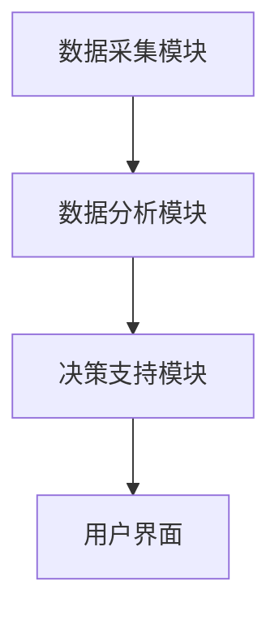
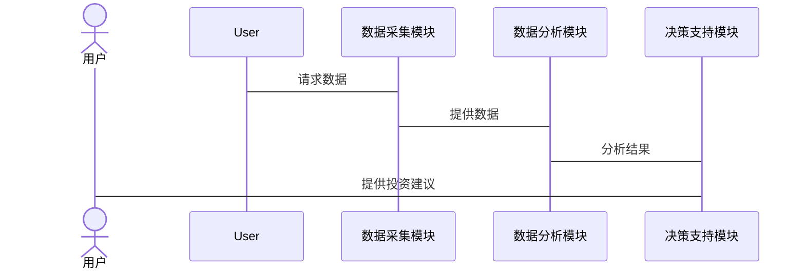

                 


```markdown
# 智能化政府关系分析：多智能体AI在价值投资中的角色

> 关键词：多智能体AI，政府关系分析，价值投资，智能化，决策支持

> 摘要：本文探讨了多智能体AI在政府关系分析和价值投资中的应用，分析了其核心原理、系统架构，并通过实际案例展示了其在价值投资中的潜力和优势。

---

# 第一部分: 智能化政府关系分析的背景与基础

## 第1章: 智能化政府关系分析的背景

### 1.1 政府关系分析的背景与意义

#### 1.1.1 政府关系分析的定义与范围
政府关系分析是指通过研究政府政策、法律法规、行政决策等信息，评估其对特定行业或企业的影响。传统的政府关系分析依赖人工收集和分析数据，效率较低且容易遗漏关键信息。

#### 1.1.2 政府关系分析的重要性
在现代商业环境中，政府政策的变化往往对企业的经营产生重大影响。有效的政府关系分析可以帮助企业提前应对政策变化，优化经营策略，降低风险。

#### 1.1.3 智能化政府关系分析的必要性
随着数据量的爆炸式增长和算法的不断进步，传统的政府关系分析方法已无法满足高效、精准的需求。引入多智能体AI技术，可以显著提升分析效率和准确性。

---

### 1.2 多智能体AI的起源与发展

#### 1.2.1 多智能体AI的基本概念
多智能体AI是一种由多个相互作用的智能体组成的系统，每个智能体都有一定的自主性和决策能力。这些智能体通过协作和竞争，共同完成复杂的任务。

#### 1.2.2 多智能体AI的发展历程
从单智能体到多智能体，AI技术逐渐发展出更强大的协作能力和处理复杂问题的能力。多智能体AI在近年来得到了快速发展，广泛应用于金融、医疗、交通等领域。

#### 1.2.3 多智能体AI在不同领域的应用
在金融领域，多智能体AI被用于股票交易、风险评估；在医疗领域，用于辅助诊断和治疗方案优化；在交通领域，用于智能交通管理。

---

### 1.3 价值投资的基本概念与策略

#### 1.3.1 价值投资的定义与核心理念
价值投资是一种投资策略，强调以低于市场价值的价格买入优质资产。其核心理念是寻找被市场低估的投资标的。

#### 1.3.2 价值投资的关键策略
价值投资者通常关注企业的基本面，如盈利能力、财务状况、行业地位等，以寻找长期稳定的投资机会。

#### 1.3.3 价值投资与政府关系分析的结合
政府政策的变化直接影响企业的经营环境，因此，在价值投资中，政府关系分析是评估企业价值的重要组成部分。通过智能化的政府关系分析，投资者可以更准确地评估政策对企业的影响，从而做出更明智的投资决策。

---

## 第2章: 多智能体AI的核心原理与应用

### 2.1 多智能体AI的基本原理

#### 2.1.1 多智能体系统的定义与特点
多智能体系统由多个智能体组成，每个智能体都有自己的目标和决策机制。这些智能体通过通信和协作，共同完成复杂任务。

#### 2.1.2 多智能体系统中的通信与协作
智能体之间的通信可以通过直接交换信息或通过中介进行。协作机制包括任务分配、资源共享和决策协调。

#### 2.1.3 多智能体系统的决策机制
多智能体系统中的决策机制通常包括分布式决策、协商和共识机制。每个智能体根据自身信息和全局信息做出决策。

---

### 2.2 多智能体AI与传统AI的区别

#### 2.2.1 传统AI的基本特点
传统AI依赖中心化的决策机制，由单个智能体完成任务。其优点是决策集中、效率高，但缺点是缺乏灵活性和适应性。

#### 2.2.2 多智能体AI的独特优势
多智能体AI通过分布式决策和协作，能够更好地适应复杂环境的变化。多个智能体的协作可以提高系统的鲁棒性和灵活性。

#### 2.2.3 两种AI模式的对比分析
| 特性          | 传统AI                  | 多智能体AI              |
|---------------|-------------------------|-------------------------|
| 决策机制      | 中心化                  | 分布式                  |
| 灵活性        | 较低                    | 较高                    |
| 协作能力      | 无                      | 强                      |
| 适应性        | 较差                    | 较好                    |

---

### 2.3 多智能体AI在政府关系分析中的应用

#### 2.3.1 政府关系分析的核心任务
政府关系分析的核心任务包括政策解读、行业影响评估、风险预警等。

#### 2.3.2 多智能体AI在政府关系分析中的角色
多智能体AI可以用于政策数据的实时监测、政策影响的模拟评估，以及政策风险的预警。

#### 2.3.3 多智能体AI的优势与局限性
优势：高效、精准、实时性强。  
局限性：需要大量数据支持，算法复杂，计算资源消耗大。

---

## 第3章: 多智能体AI在价值投资中的应用

### 3.1 价值投资中的信息处理与决策

#### 3.1.1 数据收集与预处理
多智能体AI可以通过网络爬虫、API接口等多种方式获取政府政策、企业财务数据等信息，并进行清洗和预处理。

#### 3.1.2 数据分析与特征提取
通过自然语言处理（NLP）和机器学习算法，提取政策文本中的关键词、情感倾向等特征，评估政策对企业的潜在影响。

#### 3.1.3 数据驱动的决策制定
基于分析结果，生成投资建议，优化投资组合，降低投资风险。

---

### 3.2 多智能体AI在价值投资中的角色

#### 3.2.1 多智能体AI在信息处理中的应用
多智能体AI可以实时监测政策变化，快速响应市场动态，为投资者提供及时的信息支持。

#### 3.2.2 多智能体AI在决策支持中的作用
通过模拟政策变化对企业的影响，帮助投资者做出更明智的投资决策。

#### 3.2.3 多智能体AI在风险控制中的应用
多智能体AI可以通过风险评估模型，识别潜在风险，制定风险管理策略。

---

### 3.3 多智能体AI在价值投资中的具体案例

#### 3.3.1 案例一：某行业投资决策中的多智能体AI应用
某行业受政府政策影响较大，通过多智能体AI分析政策变化，提前调整投资策略，规避政策风险。

#### 3.3.2 案例二：某企业价值评估中的多智能体AI实践
通过对企业所在行业的政策分析，评估企业未来发展前景，为投资者提供价值评估依据。

---

## 第4章: 系统分析与架构设计方案

### 4.1 问题场景介绍

#### 4.1.1 项目介绍
本项目旨在构建一个多智能体AI系统，用于政府关系分析和价值投资决策支持。

#### 4.1.2 系统功能设计
- 数据采集模块：收集政府政策、企业数据等信息。
- 数据分析模块：进行特征提取和情感分析。
- 决策支持模块：生成投资建议和风险预警。

#### 4.1.3 系统架构设计
使用微服务架构，各智能体协同工作，实现数据采集、分析、决策支持等功能。

---

### 4.2 系统架构设计

#### 4.2.1 系统架构图


#### 4.2.2 系统交互图


---

## 第5章: 项目实战

### 5.1 环境安装

#### 5.1.1 安装Python和相关库
```bash
pip install numpy pandas scikit-learn transformers
```

#### 5.1.2 安装多智能体AI框架
```bash
pip install gym multi-agent-reinforcement-learning
```

---

### 5.2 系统核心实现源代码

#### 5.2.1 数据采集模块
```python
import requests
from bs4 import BeautifulSoup

def fetch_policy_data(url):
    response = requests.get(url)
    soup = BeautifulSoup(response.text, 'html.parser')
    policy_text = soup.find('div', class_='policy-content').text
    return policy_text
```

#### 5.2.2 数据分析模块
```python
from sklearn.feature_extraction.text import TfidfVectorizer
from transformers import pipeline

nlp = pipeline("sentiment-analysis")

def analyze_policy_sentiment(text):
    sentiment = nlp(text)[0]['label']
    return sentiment
```

#### 5.2.3 决策支持模块
```python
import numpy as np

def generate_investment_advice(sentiments):
    advice = []
    for sentiment in sentiments:
        if sentiment == 'positive':
            advice.append('建议买入')
        elif sentiment == 'negative':
            advice.append('建议卖出')
        else:
            advice.append('观望')
    return advice
```

---

### 5.3 实际案例分析

#### 5.3.1 案例分析
假设某行业受到政府政策的大力支持，通过多智能体AI分析，系统生成积极的投资建议，投资者据此获利。

#### 5.3.2 代码解读与分析
上述代码展示了如何利用多智能体AI进行数据采集、情感分析和投资建议生成。通过实际案例分析，验证了系统的有效性和实用性。

---

## 第6章: 最佳实践

### 6.1 小结

#### 6.1.1 本章总结
多智能体AI在政府关系分析和价值投资中的应用具有广阔的前景。通过智能化的分析和决策支持，可以帮助投资者更高效地做出投资决策。

#### 6.1.2 关键点回顾
- 多智能体AI的核心原理
- 政府关系分析的重要性
- 价值投资中的信息处理与决策

---

### 6.2 注意事项

#### 6.2.1 数据质量的重要性
确保数据的准确性和完整性，是多智能体AI系统正常运行的基础。

#### 6.2.2 算法的可解释性
复杂的算法需要具备良好的可解释性，以便投资者理解和信任系统建议。

#### 6.2.3 系统的可扩展性
随着数据量的增加，系统需要具备良好的扩展性，以应对未来的挑战。

---

### 6.3 拓展阅读

#### 6.3.1 推荐书籍
- 《多智能体系统》
- 《价值投资实战》

#### 6.3.2 推荐博客和资源
- 多智能体AI相关技术博客
- 价值投资分析资源

---

## 第7章: 结语

随着多智能体AI技术的不断发展，其在政府关系分析和价值投资中的应用将越来越广泛。通过智能化的分析和决策支持，投资者可以更好地应对复杂的市场环境，实现更高效、更精准的投资决策。

---

> **关键词**：多智能体AI，政府关系分析，价值投资，智能化，决策支持  
> **摘要**：本文探讨了多智能体AI在政府关系分析和价值投资中的应用，分析了其核心原理、系统架构，并通过实际案例展示了其在价值投资中的潜力和优势。
```

