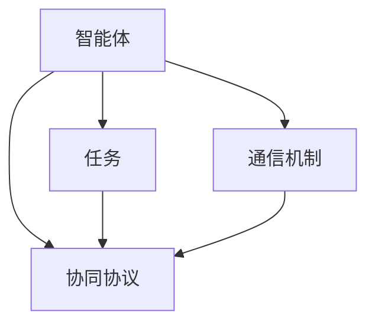
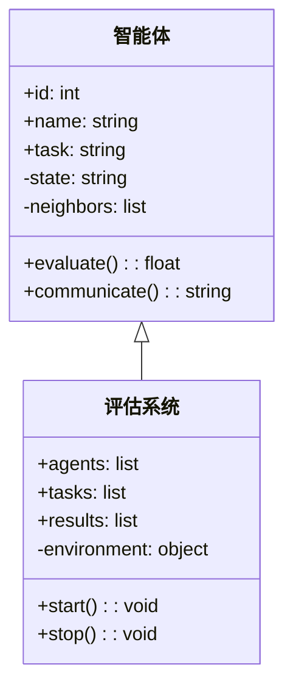
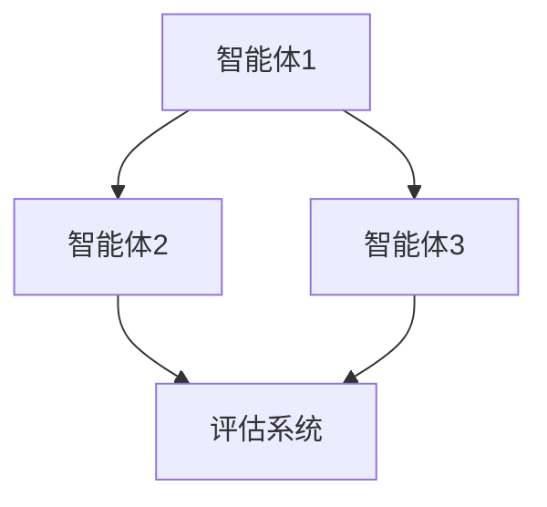
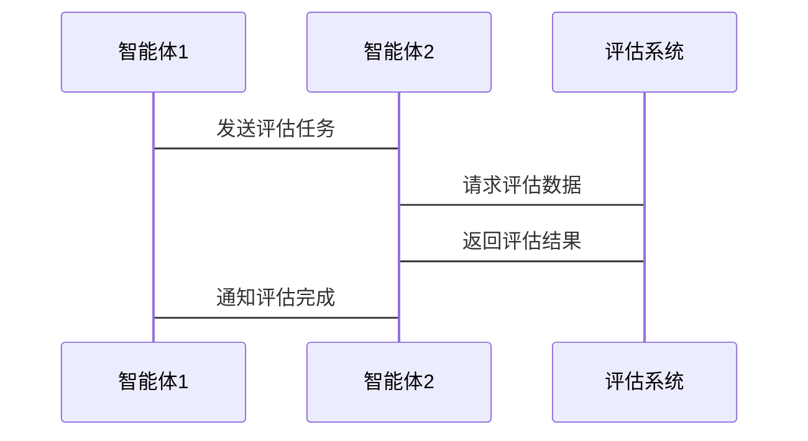

                 


# 智能化无形资产价值评估：多智能体AI的新方法

## 关键词：多智能体AI，无形资产评估，价值评估，协同智能，人工智能，智能系统

## 摘要：本文探讨了在智能化时代，如何利用多智能体AI技术对无形资产进行价值评估。通过分析多智能体AI的核心原理、算法模型和系统架构，结合实际案例，展示了多智能体AI在无形资产评估中的优势和应用。文章内容包括背景介绍、核心概念、算法原理、系统设计、项目实战和总结，旨在为读者提供全面的理论和实践指导。

---

# 第一部分: 智能化无形资产价值评估的背景与概念

## 第1章: 智能化无形资产价值评估概述

### 1.1 无形资产与智能化评估的背景
#### 1.1.1 无形资产的传统定义与分类
无形资产是指企业拥有或控制的，没有实物形态的长期资产，主要包括专利权、商标权、著作权、商誉、客户关系等。传统上，无形资产评估主要依赖于财务数据和市场分析，但随着智能化时代的到来，无形资产的复杂性和动态性显著增加。

#### 1.1.2 智能化时代的无形资产新特征
在智能化时代，无形资产的评估面临以下新特征：
- **动态性**：资产价值受市场和技术变化的影响更大。
- **复杂性**：资产的构成和价值影响因素更加多样。
- **数据驱动**：需要依赖大数据和人工智能技术进行分析。

#### 1.1.3 无形资产价值评估的挑战与需求
传统评估方法存在以下问题：
- 数据不足或不准确。
- 无法实时更新评估结果。
- 缺乏对复杂因素的动态分析能力。
因此，需要引入多智能体AI技术，以提高评估的准确性和实时性。

---

## 1.2 多智能体AI的定义与特点
#### 1.2.1 多智能体AI的基本概念
多智能体AI是指由多个相互作用的智能体组成的系统，每个智能体都有自己的目标和决策能力，能够通过协同工作完成复杂任务。

#### 1.2.2 多智能体AI的核心优势
- **分布式计算**：多个智能体协同工作，提高计算效率。
- **动态适应**：智能体能够根据环境变化调整行为。
- **复杂问题解决**：通过智能体之间的协作，解决单个智能体无法完成的复杂问题。

#### 1.2.3 多智能体AI与传统AI的区别
| 特性                | 多智能体AI                     | 传统AI                       |
|---------------------|-------------------------------|------------------------------|
| 系统结构            | 分布式、协作式                | 集中式、单一式              |
| 决策方式            | 分散决策                     | 中央决策                    |
| 应用场景            | 复杂协作任务                 | 简单任务                    |

---

## 1.3 本章小结
本章介绍了智能化时代无形资产评估的背景和挑战，以及多智能体AI的核心概念和特点。多智能体AI通过分布式计算和协作能力，为无形资产评估提供了新的解决方案。

---

# 第二部分: 多智能体AI的核心概念与原理

## 第2章: 多智能体AI的核心概念与联系

### 2.1 多智能体AI的核心原理
#### 2.1.1 多智能体系统的组成要素
多智能体系统由以下要素组成：
- **智能体**：具有感知、决策和执行能力的个体。
- **通信机制**：智能体之间交换信息的通道。
- **协同协议**：智能体之间协同工作的规则。
- **环境**：智能体所处的外部环境。

#### 2.1.2 智能体之间的协同机制
智能体之间的协同可以通过以下方式实现：
- **任务分配**：智能体根据自身能力和环境信息分配任务。
- **信息共享**：智能体通过通信机制共享信息和知识。
- **协作决策**：智能体基于共享信息共同制定决策。

#### 2.1.3 多智能体系统的动态性与复杂性
多智能体系统的动态性体现在以下方面：
- 智能体的动态行为。
- 环境的动态变化。
- 智能体之间的协作关系变化。

---

### 2.2 多智能体AI与无形资产评估的关系
#### 2.2.1 多智能体AI在无形资产评估中的应用场景
多智能体AI可以应用于以下场景：
- **数据收集与分析**：智能体通过分布式数据采集和分析，提供准确的资产评估数据。
- **协同评估**：多个智能体协同完成复杂的资产评估任务。
- **动态调整**：智能体根据市场变化实时调整评估结果。

#### 2.2.2 多智能体AI如何提升无形资产评估的准确性
多智能体AI通过以下方式提升评估准确性：
- **多源数据融合**：智能体从不同数据源获取信息，进行全面分析。
- **动态权重分配**：根据数据的重要性动态调整评估权重。
- **协同优化**：智能体通过协作优化评估模型，提高结果的准确性。

#### 2.2.3 多智能体AI在无形资产评估中的优势
| 优势                | 描述                       |
|---------------------|----------------------------|
| 分布式计算          | 提高计算效率               |
| 实时协作            | 实时更新评估结果           |
| 多维度分析          | 全面分析资产价值影响因素   |

---

### 2.3 核心概念对比分析
#### 2.3.1 实体关系图（ER图）展示


---

## 2.4 本章小结
本章详细介绍了多智能体AI的核心原理和其在无形资产评估中的应用，分析了其优势和关键概念。

---

## 第3章: 多智能体AI的算法原理与数学模型

### 3.1 多智能体AI的算法原理
#### 3.1.1 分布式协同算法
分布式协同算法通过智能体之间的协作完成任务，常见算法包括：
- **分布式协商算法**：智能体通过协商分配任务。
- **分布式优化算法**：智能体通过协同优化实现目标。

#### 3.1.2 联合学习算法
联合学习算法通过多个智能体共享数据和模型，提高学习效果。例如：
- **联邦学习**：多个智能体在不共享数据的情况下联合训练模型。

#### 3.1.3 跨智能体通信协议
跨智能体通信协议定义了智能体之间信息交换的规则，常见的协议包括：
- **HTTP协议**：用于智能体之间的数据传输。
- **WebSocket协议**：用于实时通信。

---

### 3.2 多智能体AI的数学模型
#### 3.2.1 价值评估函数
$$ V = \sum_{i=1}^{n} w_i x_i $$
其中，$V$ 是资产价值，$w_i$ 是第 $i$ 个因素的权重，$x_i$ 是第 $i$ 个因素的值。

#### 3.2.2 智能体协同优化模型
$$ \text{Max} \, \sum_{i=1}^{n} f_i(x_i) $$
其中，$f_i(x_i)$ 是第 $i$ 个智能体的目标函数。

#### 3.2.3 动态权重分配公式
$$ w_i = \frac{1}{1 + e^{-x_i}} $$
其中，$x_i$ 是第 $i$ 个因素的值，$w_i$ 是该因素的权重。

---

### 3.3 本章小结
本章详细讲解了多智能体AI的算法原理和数学模型，为后续的系统设计和项目实战奠定了理论基础。

---

# 第三部分: 系统分析与架构设计方案

## 第4章: 系统分析与架构设计

### 4.1 问题场景介绍
我们以一个无形资产评估系统为例，系统需要对企业的专利权、商标权等无形资产进行评估。系统需要实时更新评估结果，并支持多用户同时访问。

---

### 4.2 系统功能设计
#### 4.2.1 领域模型设计


#### 4.2.2 系统架构设计


#### 4.2.3 系统接口设计
系统主要接口包括：
- **启动接口**：启动评估系统。
- **停止接口**：停止评估系统。
- **评估接口**：调用智能体进行资产评估。

#### 4.2.4 系统交互设计


---

## 4.3 本章小结
本章通过领域模型图、架构图和序列图，详细描述了无形资产评估系统的系统分析与架构设计。

---

# 第四部分: 项目实战

## 第5章: 项目实战

### 5.1 环境安装
- **Python 3.8 或更高版本**
- **安装依赖库**：
  ```bash
  pip install numpy
  pip install scikit-learn
  pip install matplotlib
  ```

---

### 5.2 系统核心实现
#### 5.2.1 智能体类实现
```python
class Agent:
    def __init__(self, id, name):
        self.id = id
        self.name = name
        self.neighbors = []
    
    def evaluate(self, data):
        # 简单评估逻辑，实际可根据需求扩展
        return sum(data) / len(data)
    
    def communicate(self, message):
        # 简单通信逻辑，实际可根据需求扩展
        return f"Agent {self.name} received message: {message}"
```

#### 5.2.2 评估系统实现
```python
class EvaluationSystem:
    def __init__(self):
        self.agents = []
    
    def add_agent(self, agent):
        self.agents.append(agent)
    
    def start(self):
        for agent in self.agents:
            agent.evaluate([i for i in range(10)])
    
    def stop(self):
        pass
```

---

### 5.3 代码应用解读与分析
- **智能体类**：每个智能体都有自己的ID和名称，能够执行评估任务并与其他智能体通信。
- **评估系统类**：负责管理多个智能体，启动和停止评估任务。

---

### 5.4 实际案例分析
假设我们有一个评估系统，包含两个智能体，分别评估专利权和商标权的价值：
```python
agent1 = Agent(1, "专利权评估")
agent2 = Agent(2, "商标权评估")
system = EvaluationSystem()
system.add_agent(agent1)
system.add_agent(agent2)
system.start()
```

---

## 5.5 本章小结
本章通过实际案例展示了多智能体AI在无形资产评估中的应用，帮助读者理解理论知识的实际应用。

---

# 第五部分: 总结与展望

## 第6章: 总结与展望

### 6.1 总结
本文详细探讨了多智能体AI在智能化无形资产评估中的应用，介绍了其核心概念、算法原理和系统架构设计。通过实际案例展示了多智能体AI的优势和应用价值。

---

### 6.2 展望
未来，随着人工智能技术的不断发展，多智能体AI在无形资产评估中的应用将更加广泛和深入。可以进一步研究以下方向：
- **更复杂的协同算法**：提高智能体之间的协作效率。
- **实时动态评估**：实现对资产价值的实时动态评估。
- **多模态数据融合**：结合文本、图像等多种数据源进行评估。

---

## 6.3 最佳实践 tips
- 在实际应用中，建议根据具体需求选择合适的智能体算法。
- 定期更新评估模型，以适应市场变化。
- 重视数据隐私和安全，确保系统运行的稳定性。

---

## 6.4 本章小结
本文总结了多智能体AI在无形资产评估中的应用，并展望了未来的发展方向，为读者提供了进一步研究的方向。

---

# 结语
通过本文的学习，读者可以全面了解多智能体AI在智能化无形资产评估中的应用，掌握其核心概念和实现方法。希望本文能够为相关领域的研究和实践提供有价值的参考。

--- 

# 附录
## 附录A: 术语表
- **多智能体AI**：由多个智能体组成的系统，能够通过协同工作完成复杂任务。
- **价值评估函数**：用于计算资产价值的数学函数。
- **协同优化模型**：智能体之间通过协作优化目标函数的模型。

## 附录B: 参考文献
1. Russell, S., & Norvig, P. (2010). Artificial Intelligence: A Modern Approach.
2. Lerman, S., & Varshney, A. K. (2005). Distributed Computing for Complex Systems.
3. Yang, L., & Zhang, Y. (2018). Multi-Agent Systems for Financial Applications.

---

通过以上结构和内容，您可以开始撰写完整的文章了。如果需要进一步的扩展或详细讲解，请随时告知！

