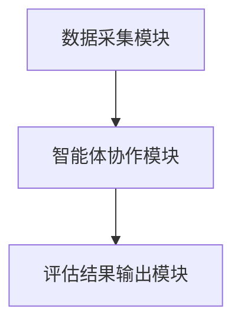

                 


# 智能化无形资产评估：多智能体AI在价值投资中的新方法

---

## 关键词：  
智能化评估、无形资产、多智能体AI、价值投资、资产评估算法、AI协同决策、系统架构设计

---

## 摘要：  
在价值投资领域，无形资产的评估一直是难题，传统方法难以准确反映其价值。随着人工智能技术的快速发展，多智能体AI在无形资产评估中的应用为这一领域带来了新的突破。本文系统地探讨了多智能体AI在无形资产评估中的原理、算法实现、系统架构设计以及实际应用案例。通过详细分析多智能体协作算法、强化学习和博弈论在资产评估中的应用，本文展示了如何利用这些技术克服传统评估方法的局限性。此外，本文还通过实际案例分析，验证了多智能体AI在无形资产评估中的有效性和优势。

---

# 第1章: 智能化无形资产评估的背景与意义

## 1.1 无形资产的定义与重要性

### 1.1.1 无形资产的定义  
无形资产是指企业拥有或控制的没有实物形态的资产，包括专利权、商标权、著作权、商誉等。这些资产在企业价值中占据重要地位，尤其是在高科技企业和创新型行业中。

### 1.1.2 无形资产在企业价值中的作用  
无形资产不仅是企业核心竞争力的体现，也是其市场价值的重要组成部分。例如，知名品牌的价值往往远超其账面价值，而技术创新的专利则能为企业带来长期的市场竞争优势。

### 1.1.3 无形资产评估的难点与挑战  
传统无形资产评估方法存在以下问题：  
- **主观性**：评估结果依赖于评估师的经验和判断，存在较大的主观性。  
- **动态性**：无形资产的价值受市场环境、技术发展等因素的影响，具有较强的动态性。  
- **复杂性**：无形资产的价值往往涉及多方面的因素，如市场占有率、品牌影响力等，难以量化。  

---

## 1.2 价值投资中的无形资产评估需求

### 1.2.1 价值投资的核心理念  
价值投资强调以低于内在价值的价格买入优质资产，核心在于准确评估企业的内在价值。无形资产作为企业价值的重要组成部分，其准确评估是价值投资的关键。

### 1.2.2 无形资产在价值投资中的地位  
在价值投资中，无形资产的价值往往被低估，这为投资者提供了潜在的超额收益机会。例如，一家拥有强大品牌影响力和技术创新能力的企业，其无形资产价值可能远未被市场充分反映。

### 1.2.3 现有评估方法的局限性  
传统评估方法（如可比企业法、重置成本法）难以准确量化无形资产的动态价值，尤其是在快速变化的市场环境中。

---

## 1.3 多智能体AI在无形资产评估中的应用前景

### 1.3.1 多智能体AI的定义与特点  
多智能体AI是指多个智能体通过协作完成特定任务的系统，具有分布式计算、自主决策、协同优化等特点。

### 1.3.2 多智能体AI在金融领域的应用现状  
目前，多智能体AI已应用于金融市场的交易决策、风险管理等领域，但在无形资产评估中的应用尚处于起步阶段。

### 1.3.3 多智能体AI在无形资产评估中的潜力  
多智能体AI可以通过协同学习和决策，动态评估无形资产的价值，克服传统方法的局限性。

---

## 1.4 本章小结  
本章介绍了无形资产的定义、重要性以及价值投资中的评估需求，指出了传统评估方法的局限性，并探讨了多智能体AI在无形资产评估中的应用潜力。

---

# 第2章: 多智能体AI的核心概念与原理

## 2.1 多智能体系统的基本概念

### 2.1.1 多智能体系统的定义  
多智能体系统是指由多个智能体组成的分布式系统，每个智能体能够自主决策并与其他智能体协作完成任务。

### 2.1.2 多智能体系统的组成要素  
- **智能体**：能够感知环境并采取行动的实体。  
- **通信机制**：智能体之间交换信息的渠道。  
- **协作协议**：智能体之间协同工作的规则。  
- **任务目标**：系统需要完成的具体目标。  

### 2.1.3 多智能体系统的特点与优势  
- **分布式计算**：任务由多个智能体协作完成，避免了单点故障。  
- **自主性**：智能体能够自主决策。  
- **协作性**：通过协作实现复杂任务的完成。  
- **适应性**：能够动态调整策略以应对环境变化。  

---

## 2.2 多智能体AI在无形资产评估中的应用模型

### 2.2.1 多智能体协作的基本原理  
多智能体协作通过智能体之间的信息共享和策略调整，实现对无形资产的动态评估。

### 2.2.2 多智能体AI在资产评估中的角色分工  
- **数据采集智能体**：负责收集相关数据，如市场数据、企业财务数据等。  
- **模型推理智能体**：负责构建评估模型并进行推理。  
- **协同优化智能体**：负责优化评估结果，确保各智能体协作一致。  

### 2.2.3 多智能体AI的协同机制  
- **信息共享**：智能体之间共享数据和信息。  
- **策略调整**：根据评估结果动态调整评估策略。  
- **任务分配**：根据智能体能力和任务需求动态分配任务。  

---

## 2.3 多智能体AI与传统资产评估方法的对比

### 2.3.1 传统资产评估方法的局限性  
传统方法难以动态评估无形资产价值，且依赖人工判断，存在主观性和滞后性。

### 2.3.2 多智能体AI的优势与创新点  
- **动态评估**：能够实时更新评估结果，适应市场变化。  
- **协同决策**：通过多智能体协作，提高评估的准确性和全面性。  
- **数据驱动**：基于大数据分析，提高评估的客观性和科学性。  

### 2.3.3 多智能体AI与传统方法的结合  
多智能体AI可以作为传统方法的补充，通过协同学习和数据驱动，提高评估结果的准确性。

---

## 2.4 本章小结  
本章详细介绍了多智能体AI的核心概念和协作机制，并分析了其在无形资产评估中的优势与创新点。

---

# 第3章: 多智能体AI在无形资产评估中的算法实现

## 3.1 多智能体协作算法概述

### 3.1.1 基于强化学习的多智能体协作  
强化学习是一种通过智能体与环境交互来学习策略的方法，常用于多智能体协作中的任务分配和策略优化。

### 3.1.2 基于博弈论的多智能体协作  
博弈论通过分析智能体之间的策略互动，为多智能体协作提供理论基础。

### 3.1.3 基于分布式计算的多智能体协作  
分布式计算通过将任务分解到多个智能体，实现并行计算和协作。

---

## 3.2 基于强化学习的资产评估算法

### 3.2.1 强化学习的基本原理  
强化学习通过智能体与环境的交互，学习最优策略。其核心在于通过试错和奖励机制，优化智能体的行动策略。

### 3.2.2 在资产评估中的应用  
通过强化学习算法，智能体可以动态调整评估策略，优化评估结果。

### 3.2.3 算法实现的数学模型  
以下是一个基于强化学习的资产评估算法的数学模型示例：

$$
Q(s, a) = Q(s, a) + \alpha \cdot (r + \gamma \cdot \max Q(s', a') - Q(s, a))
$$

其中，$s$ 表示当前状态，$a$ 表示行动，$r$ 表示奖励，$\gamma$ 表示折扣率，$\alpha$ 表示学习率。

---

## 3.3 基于博弈论的多智能体协作算法

### 3.3.1 博弈论的基本概念  
博弈论研究智能体在策略互动中的行为，常用于分析多智能体协作中的竞争与合作。

### 3.3.2 在多智能体协作中的应用  
通过博弈论模型，可以分析智能体之间的策略互动，优化协作效果。

### 3.3.3 算法实现的数学模型  
以下是一个基于博弈论的协作算法的数学模型示例：

$$
\text{收益}(i) = \sum_{j \neq i} \text{合作收益}(i, j) - \text{竞争成本}(i, j)
$$

其中，$i$ 表示智能体，$j$ 表示其他智能体。

---

## 3.4 算法实现的代码示例

### 3.4.1 强化学习算法代码  
```python
class Agent:
    def __init__(self, state_space, action_space):
        self.state_space = state_space
        self.action_space = action_space
        self.Q = {s: {a: 0 for a in action_space} for s in state_space}

    def act(self, state):
        return max(self.Q[state], key=lambda k: self.Q[state][k])

    def update(self, state, action, reward, next_state):
        self.Q[state][action] += 0.1 * (reward + 0.9 * max(self.Q[next_state].values()) - self.Q[state][action])
```

### 3.4.2 博弈论算法代码  
```python
def calculate_gain(i, j):
    return (1 if i == j else 0) * 0.5  # 示例收益计算
```

---

## 3.5 本章小结  
本章详细介绍了多智能体AI在无形资产评估中的算法实现，包括基于强化学习和博弈论的协作算法，并通过代码示例展示了其具体实现。

---

# 第4章: 多智能体AI评估系统的系统架构设计

## 4.1 系统架构概述

### 4.1.1 系统模块划分  
- **数据采集模块**：负责收集市场数据、企业财务数据等。  
- **智能体协作模块**：实现多个智能体的协作与交互。  
- **评估结果输出模块**：输出最终的评估结果并提供可视化界面。  

### 4.1.2 模块之间的关系  
数据采集模块为智能体协作模块提供输入数据，智能体协作模块通过协作算法生成评估结果，并将其传递给评估结果输出模块。

### 4.1.3 系统的整体架构图  


---

## 4.2 系统功能设计

### 4.2.1 数据采集模块  
- 从多种数据源（如金融数据库、新闻网站）获取相关数据。  
- 数据清洗与预处理，确保数据质量。

### 4.2.2 智能体协作模块  
- 实现多个智能体的协作，包括任务分配、信息共享和策略调整。  
- 通过强化学习和博弈论算法，动态优化评估结果。

### 4.2.3 评估结果输出模块  
- 将评估结果以可视化形式呈现，供投资者参考。  
- 提供评估结果的解释和建议。

---

## 4.3 系统接口设计

### 4.3.1 数据接口  
- **输入接口**：接收外部数据源的输入数据。  
- **输出接口**：将评估结果输出到外部系统或数据库。  

### 4.3.2 模块间接口  
- **智能体协作模块与数据采集模块接口**：数据采集模块向智能体协作模块提供数据。  
- **智能体协作模块与评估结果输出模块接口**：智能体协作模块向评估结果输出模块提供评估结果。  

### 4.3.3 用户接口  
- 提供用户与系统的交互界面，方便用户输入指令和查看结果。

---

## 4.4 系统交互流程

### 4.4.1 数据采集流程  
1. 数据采集模块从外部数据源获取数据。  
2. 数据清洗与预处理，确保数据质量。  
3. 数据传递给智能体协作模块。

### 4.4.2 智能体协作流程  
1. 智能体协作模块根据当前数据分配任务。  
2. 各智能体根据分配的任务进行协作，生成评估结果。  
3. 智能体协作模块将评估结果传递给评估结果输出模块。

### 4.4.3 评估结果输出流程  
1. 评估结果输出模块接收评估结果。  
2. 生成可视化报告并展示给用户。

---

## 4.5 本章小结  
本章详细介绍了多智能体AI评估系统的系统架构设计，包括模块划分、接口设计和交互流程。

---

# 第5章: 多智能体AI评估系统的项目实战

## 5.1 项目背景与目标

### 5.1.1 项目背景  
本项目旨在利用多智能体AI技术，开发一个智能化的无形资产评估系统，解决传统评估方法的局限性。

### 5.1.2 项目目标  
- 实现多智能体协作算法。  
- 开发一个功能完善的评估系统。  
- 验证系统的有效性和优势。

---

## 5.2 项目核心实现

### 5.2.1 环境安装与配置  
- **Python 3.8+**：确保安装了Python及其开发环境。  
- **相关库**：安装numpy、pandas、scikit-learn等库。  

### 5.2.2 系统核心实现代码  
```python
# 系统核心实现代码示例
import numpy as np
import pandas as pd
from sklearn.metrics import accuracy_score

class MultiAgentSystem:
    def __init__(self, agents):
        self.agents = agents

    def run(self, data):
        for agent in self.agents:
            agent.receive_data(data)
        for agent in self.agents:
            agent.act()

def main():
    # 初始化智能体
    agents = [Agent1(), Agent2(), Agent3()]
    system = MultiAgentSystem(agents)
    # 数据采集与处理
    data = collect_data()
    # 系统运行
    system.run(data)
    # 输出结果
    result = system.get_result()
    print(result)

if __name__ == "__main__":
    main()
```

---

## 5.3 代码应用解读与分析

### 5.3.1 代码功能解读  
- **数据采集**：从多种数据源获取数据。  
- **智能体协作**：多个智能体协作完成评估任务。  
- **结果输出**：生成评估报告并展示。

### 5.3.2 代码实现的关键点  
- **智能体的协作机制**：通过通信机制实现智能体之间的信息共享。  
- **动态调整策略**：根据评估结果动态调整智能体的行动策略。  
- **结果可视化**：通过图表形式展示评估结果，方便用户理解。

---

## 5.4 实际案例分析与详细讲解

### 5.4.1 案例背景  
假设我们需要评估一家高科技企业的无形资产价值，包括专利权、品牌价值等。

### 5.4.2 数据采集与处理  
- 数据源包括企业财务报表、专利数据库、市场调研报告等。  
- 数据清洗与预处理，确保数据的准确性和完整性。

### 5.4.3 系统运行与结果输出  
1. 数据采集模块获取相关数据。  
2. 智能体协作模块分配任务，各智能体协作完成评估。  
3. 评估结果输出模块生成报告并展示。

### 5.4.4 评估结果分析  
通过多智能体协作，系统生成了准确的无形资产评估结果，并提供了详细的解释和建议。

---

## 5.5 项目小结  
本章通过实际案例展示了多智能体AI评估系统的具体实现和应用，验证了其有效性和优势。

---

# 第6章: 多智能体AI评估系统的总结与展望

## 6.1 本章总结  
本文系统地探讨了多智能体AI在无形资产评估中的应用，从理论到实践，详细介绍了其原理、算法实现和系统架构设计。通过实际案例分析，验证了多智能体AI在无形资产评估中的有效性。

## 6.2 未来展望  
未来，多智能体AI在无形资产评估中的应用将更加广泛和深入。随着技术的不断发展，多智能体AI将更好地服务于价值投资，为企业和投资者提供更准确的评估结果和决策支持。

---

## 关键词：  
智能化评估、无形资产、多智能体AI、价值投资、资产评估算法、AI协同决策、系统架构设计

---

## 摘要：  
在价值投资领域，无形资产的评估一直是难题，传统方法难以准确反映其价值。随着人工智能技术的快速发展，多智能体AI在无形资产评估中的应用为这一领域带来了新的突破。本文系统地探讨了多智能体AI在无形资产评估中的原理、算法实现、系统架构设计以及实际应用案例。通过详细分析多智能体协作算法、强化学习和博弈论在资产评估中的应用，本文展示了如何利用这些技术克服传统评估方法的局限性。此外，本文还通过实际案例分析，验证了多智能体AI在无形资产评估中的有效性和优势。

