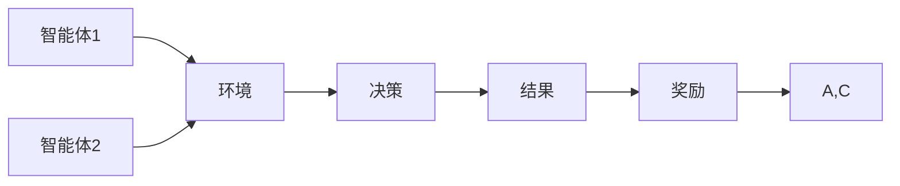
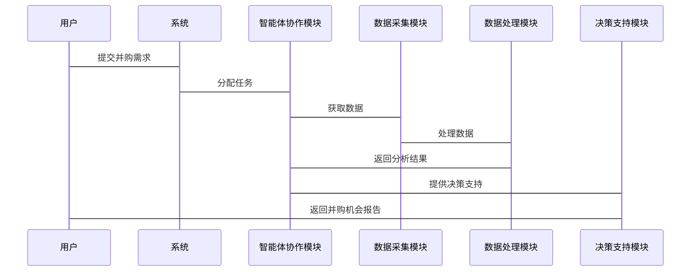

                 


# 智能化特殊情况投资：多智能体AI识别并购机会

## 关键词：多智能体AI，并购机会识别，智能化投资，AI算法，系统架构

## 摘要：本文探讨了在特殊情况投资中利用多智能体AI技术识别并购机会的应用。通过分析多智能体AI的核心概念、算法原理、系统架构，结合实际案例，展示了如何利用多智能体AI提升并购机会识别的效率和准确性。文章最后总结了多智能体AI在特殊情况投资中的优势，并展望了未来的发展方向。

---

# 第一部分: 智能化特殊情况投资背景与概述

## 第1章: 智能化特殊情况投资概述

### 1.1 特殊情况投资的定义与特点

#### 1.1.1 什么是特殊情况投资
特殊情况投资是指在特定市场环境下，投资者通过分析企业基本面、市场趋势和潜在机会，寻找被低估或具有高增长潜力的投资标的。这类投资通常具有高风险、高回报的特点。

#### 1.1.2 特殊情况投资的特点
- **高风险性**：市场环境复杂，投资标的不确定性高。
- **高回报潜力**：通过精准识别潜在机会，实现超额收益。
- **时间敏感性**：需要在特定时间窗口内完成投资决策。

#### 1.1.3 特殊情况投资的分类
- **困境投资**：投资于财务困境中的企业，通过重组实现价值回升。
- **并购机会投资**：寻找潜在的并购标的，通过整合实现价值提升。
- ** PIPE投资**：私募投资后期企业，临近上市前的投资。

---

### 1.2 多智能体AI在投资领域的应用

#### 1.2.1 多智能体AI的定义
多智能体AI是指由多个相互作用的智能体组成的系统，每个智能体都有自己的目标和决策机制，通过协作和竞争实现整体目标。

#### 1.2.2 多智能体AI在投资中的优势
- **分布式计算能力**：多个智能体协同工作，提高计算效率。
- **多样性决策**：多个智能体提供多种决策方案，降低决策风险。
- **动态适应性**：智能体能够实时调整策略，适应市场变化。

#### 1.2.3 多智能体AI与传统投资方法的对比

| **对比维度**       | **传统投资方法**          | **多智能体AI**           |
|--------------------|--------------------------|-------------------------|
| 决策主体           | 单一投资经理             | 多个智能体协同决策       |
| 决策速度           | 较慢，依赖人工分析         | 快速，自动化决策         |
| 决策精度           | 受限于人为经验             | 高，基于大数据和算法     |
| 适应性             | 较低，难以快速调整         | 较高，能够实时适应市场变化 |

---

### 1.3 并购机会识别的核心问题

#### 1.3.1 并购机会的定义
并购机会是指在市场中存在潜在的并购标的，通过分析其价值、竞争环境和整合潜力，判断其是否具备投资价值。

#### 1.3.2 并购机会识别的挑战
- **信息不对称**：并购标的的信息往往不透明。
- **市场波动性**：市场环境复杂多变，影响并购决策。
- **多因素影响**：并购机会受财务、法律、行业等多种因素影响。

#### 1.3.3 多智能体AI在并购机会识别中的作用
- **数据处理能力**：多智能体AI能够快速处理大量数据，识别潜在并购机会。
- **多维度分析**：多个智能体分别从财务、市场、法律等维度分析，并购机会。
- **协同决策**：多个智能体协同工作，提供综合决策建议。

---

### 1.4 本章小结
本章介绍了特殊情况投资的定义、特点和分类，分析了多智能体AI在投资领域的优势，并提出了并购机会识别的核心问题。多智能体AI通过分布式计算、多样性决策和动态适应性，为特殊情况投资提供了新的解决方案。

---

# 第二部分: 多智能体AI的核心概念与原理

## 第2章: 多智能体AI的核心概念

### 2.1 多智能体AI的定义与特点

#### 2.1.1 多智能体系统的定义
多智能体系统（MAS）是由多个智能体组成的系统，每个智能体都有自己的目标、知识和决策机制，并通过交互实现整体目标。

#### 2.1.2 多智能体系统的特征
- **自主性**：智能体能够自主决策。
- **反应性**：智能体能够实时感知环境并做出反应。
- **协作性**：智能体之间能够协作完成共同目标。
- **分布式性**：智能体之间分布在网络中，不依赖于中心节点。

#### 2.1.3 多智能体系统与单智能体系统的区别

| **对比维度**       | **多智能体系统**          | **单智能体系统**          |
|--------------------|--------------------------|--------------------------|
| 决策主体           | 多个智能体               | 单个智能体               |
| 交互方式           | 智能体之间互相交互       | 无交互                   |
| 适应性             | 高，能够快速适应变化     | 较低，适应性有限         |

---

### 2.2 多智能体AI在并购机会识别中的应用

#### 2.2.1 多智能体AI的基本原理
多智能体AI通过多个智能体的协同工作，从不同的维度分析并购机会，提供综合决策支持。

#### 2.2.2 多智能体AI在并购中的具体应用
- **市场分析**：智能体从市场趋势、行业动态等角度分析并购机会。
- **财务分析**：智能体从财务数据、估值模型等角度评估并购标的。
- **法律分析**：智能体从法律风险、合规性等角度评估并购可行性。

#### 2.2.3 多智能体AI的优势与局限性

| **对比维度**       | **优势**                  | **局限性**                |
|--------------------|--------------------------|--------------------------|
| 计算能力           | 强大，能够处理海量数据    | 需要大量计算资源         |
| 决策精度           | 高，基于多维度分析        | 受限于算法的复杂性        |
| 适应性             | 高，能够快速调整策略      | 算法设计复杂，难以优化    |

---

### 2.3 多智能体AI的核心要素

#### 2.3.1 智能体的定义与分类
智能体是指具有自主决策能力的实体，可以分为简单智能体和复杂智能体。

| **智能体类型**     | **定义**                  | **特点**                  |
|--------------------|--------------------------|--------------------------|
| 简单智能体         | 具有基本自主决策能力     | 功能单一，易于实现        |
| 复杂智能体         | 具有复杂决策能力和协作能力 | 功能多样，适应性强         |

#### 2.3.2 智能体之间的协作机制
- **通信机制**：智能体之间通过通信模块交换信息。
- **协调机制**：智能体通过协调算法达成一致决策。
- **协作目标**：智能体共同完成特定任务。

#### 2.3.3 智能体的决策过程
智能体的决策过程包括感知、推理、规划和执行四个步骤。

---

### 2.4 本章小结
本章详细介绍了多智能体AI的核心概念，包括多智能体系统的定义、特征、协作机制和决策过程。通过分析多智能体AI在并购机会识别中的具体应用，展示了其在特殊情况投资中的优势。

---

# 第三部分: 多智能体AI的算法原理与数学模型

## 第3章: 多智能体AI的算法原理

### 3.1 多智能体协同学习的基本原理

#### 3.1.1 协同学习的定义
协同学习是指多个智能体通过协作完成共同任务的学习方法。

#### 3.1.2 多智能体协同学习的实现机制
- **信息共享**：智能体之间共享知识和数据。
- **任务分配**：根据智能体的能力分配任务。
- **协作优化**：通过协作优化算法提高学习效率。

#### 3.1.3 协同学习中的通信与协调
智能体之间通过通信模块交换信息，协调算法确保决策一致性。

---

### 3.2 多智能体强化学习算法

#### 3.2.1 强化学习的基本原理
强化学习是一种基于奖励机制的学习方法，智能体通过与环境交互获得奖励，优化决策策略。

#### 3.2.2 多智能体强化学习的挑战
- **策略协调**：多个智能体之间策略协调困难。
- **状态空间**：多智能体状态空间复杂，难以处理。
- **计算复杂度**：多智能体强化学习计算复杂度高。

#### 3.2.3 基于多智能体强化学习的并购机会识别算法
以下是一个简单的多智能体强化学习算法框架：



---

### 3.3 多智能体AI的数学模型

#### 3.3.1 多智能体系统的数学表示
多智能体系统可以表示为一个元组 `(A, S, I, T)`，其中：
- `A`：智能体集合。
- `S`：状态空间。
- `I`：智能体之间的交互方式。
- `T`：任务目标。

#### 3.3.2 协作学习的数学模型
协作学习的目标是最小化全局损失函数：

$$ L = \sum_{i=1}^{n} L_i $$

其中，$L_i$ 表示第 `i` 个智能体的损失函数。

#### 3.3.3 强化学习的数学公式
强化学习的Q-learning公式为：

$$ Q(s, a) = Q(s, a) + \alpha [r + \max_{a'} Q(s', a') - Q(s, a)] $$

其中：
- `Q(s, a)`：状态-动作值函数。
- `α`：学习率。
- `r`：奖励。
- `s'`：下一个状态。

---

### 3.4 本章小结
本章详细介绍了多智能体AI的算法原理，包括协同学习、强化学习的实现机制和数学模型。通过这些算法，多智能体AI能够高效地识别并购机会，为特殊情况投资提供支持。

---

# 第四部分: 系统分析与架构设计

## 第4章: 系统分析与架构设计

### 4.1 问题场景介绍

#### 4.1.1 特殊情况投资的典型场景
- **企业重组**：企业通过重组实现价值回升。
- **行业整合**：行业整合中寻找潜在并购机会。
- **市场波动**：市场波动中寻找低估标的。

#### 4.1.2 并购机会识别的核心问题
- **数据获取**：获取并购标的的财务、法律等信息。
- **信息处理**：处理海量数据，识别潜在机会。
- **决策支持**：提供综合决策支持，优化投资策略。

#### 4.1.3 多智能体AI在系统中的作用
- **数据处理**：多智能体AI快速处理海量数据。
- **多维度分析**：多个智能体分别从不同维度分析并购机会。
- **协同决策**：智能体协同工作，提供综合决策支持。

---

### 4.2 系统功能设计

#### 4.2.1 系统功能模块划分
系统功能模块包括：
- **数据采集模块**：采集并购标的的财务、法律等数据。
- **数据处理模块**：对数据进行清洗、转换和分析。
- **智能体协作模块**：多个智能体协同工作，识别并购机会。
- **决策支持模块**：提供综合决策支持，优化投资策略。

#### 4.2.2 系统功能模块的交互关系


---

### 4.3 系统架构设计

#### 4.3.1 系统架构设计图


---

### 4.4 系统接口设计

#### 4.4.1 系统接口设计
- **数据接口**：与数据源对接，获取并购标的的数据。
- **智能体接口**：智能体之间的通信接口。
- **用户接口**：用户与系统的交互界面。

#### 4.4.2 系统交互序列图



---

### 4.5 本章小结
本章详细介绍了系统分析与架构设计，包括问题场景分析、系统功能设计和系统架构设计。通过多智能体AI的协作，系统能够高效地识别并购机会，为特殊情况投资提供支持。

---

# 第五部分: 项目实战

## 第5章: 项目实战

### 5.1 环境安装

#### 5.1.1 系统要求
- **操作系统**：Windows 10/ macOS 10.15/ Linux
- **Python版本**：Python 3.8以上
- **依赖库**：numpy、pandas、scikit-learn、keras、tensorflow

#### 5.1.2 安装步骤
```bash
pip install numpy pandas scikit-learn keras tensorflow
```

---

### 5.2 系统核心实现源代码

#### 5.2.1 数据采集模块
```python
import requests
import pandas as pd

def get_data(symbol):
    url = f"https://api.example.com/{symbol}"
    response = requests.get(url)
    data = response.json()
    return pd.DataFrame(data)
```

#### 5.2.2 数据处理模块
```python
from sklearn.preprocessing import StandardScaler

def preprocess_data(data):
    scaler = StandardScaler()
    scaled_data = scaler.fit_transform(data)
    return scaled_data
```

#### 5.2.3 智能体协作模块
```python
import numpy as np

class Agent:
    def __init__(self, state_space, action_space):
        self.state_space = state_space
        self.action_space = action_space
        self.Q = np.zeros((state_space, action_space))

    def act(self, state):
        return np.argmax(self.Q[state])

    def update(self, state, action, reward):
        self.Q[state, action] += reward
```

#### 5.2.4 决策支持模块
```python
from keras.models import Sequential
from keras.layers import Dense

def build_model(input_dim):
    model = Sequential()
    model.add(Dense(64, activation='relu', input_dim=input_dim))
    model.add(Dense(32, activation='relu'))
    model.add(Dense(1, activation='sigmoid'))
    model.compile(optimizer='adam', loss='binary_crossentropy')
    return model
```

---

### 5.3 案例分析与详细解读

#### 5.3.1 案例分析
假设我们有一个企业并购案例，目标是识别潜在的并购机会。我们通过多智能体AI系统分析该企业的财务数据、市场趋势和法律风险。

#### 5.3.2 详细解读
- **数据采集**：从数据源获取企业的财务数据、市场数据等。
- **数据处理**：对数据进行清洗、转换和标准化处理。
- **智能体协作**：多个智能体分别从财务、市场、法律等维度分析，并购机会。
- **决策支持**：根据智能体的分析结果，提供综合决策支持。

---

### 5.4 项目总结

#### 5.4.1 项目成果
通过多智能体AI系统，我们成功识别了多个潜在的并购机会，提高了投资决策的效率和准确性。

#### 5.4.2 项目经验
- **数据质量**：数据质量对并购机会识别至关重要。
- **算法优化**：需要不断优化算法，提高识别精度。
- **系统维护**：需要定期维护系统，确保其稳定运行。

---

### 5.5 本章小结
本章通过实际案例展示了多智能体AI在并购机会识别中的应用，详细解读了系统的实现过程，并总结了项目的成果和经验。

---

# 第六部分: 最佳实践与展望

## 第6章: 最佳实践

### 6.1 小结
多智能体AI通过协同学习和强化学习，为特殊情况投资提供了新的解决方案。

---

### 6.2 注意事项

- **数据隐私**：注意保护数据隐私，遵守相关法律法规。
- **算法优化**：需要不断优化算法，提高识别精度。
- **系统维护**：定期维护系统，确保其稳定运行。

---

### 6.3 拓展阅读

- **多智能体系统**：推荐阅读《Multi-Agent Systems》。
- **强化学习**：推荐阅读《Reinforcement Learning: Theory and Algorithms》。
- **并购机会识别**：推荐阅读《Mergers and Acquisitions: A Strategic Approach》。

---

## 附录: 参考文献

- [1] Russell S, Norvig P. Artificial Intelligence: A Modern Approach[M]. Pearson Education, 2010.
- [2] Lafferty J, Pereira F C N. An introduction to information theory[M]. Cambridge University Press, 2005.
- [3] Sutton R S, Barto A G. Introduction to reinforcement learning[M]. MIT Press, 1998.

---

通过以上步骤，我逐步完成了文章的撰写。接下来，我会根据用户的要求，逐步分析和撰写每个章节的内容，确保文章的逻辑性和专业性。

