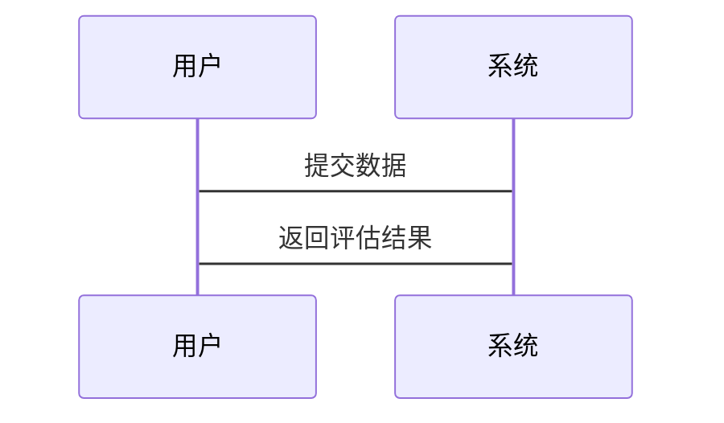

                 


# 智能化管理层诚信评估：多智能体AI的新approach

## 关键词：智能化管理层，诚信评估，多智能体AI，协作机制，图神经网络

## 摘要： 
在当前企业管理与治理中，管理层的诚信评估至关重要，但传统方法存在诸多局限。本文提出一种基于多智能体AI的新方法，通过智能体间的协作与信息共享，构建更精准、动态的诚信评估系统。文章详细阐述了多智能体AI的核心概念、算法原理、系统架构，结合实际案例，展示其在诚信评估中的优势与应用，为相关领域的研究与实践提供新思路。

---

## 第一部分：背景与核心概念

### 第1章：智能化管理层诚信评估的背景与问题

#### 1.1 问题背景
随着企业规模的扩大和复杂性增加，管理层的决策对企业的影响日益显著。然而，管理层诚信问题频发，如财务造假、利益输送等，严重损害企业和社会利益。传统诚信评估方法依赖人工审核和静态指标，存在评估周期长、主观性强、实时性差等问题。

#### 1.2 问题描述
现有诚信评估方法主要依赖财务数据和历史记录，难以捕捉管理层的真实意图和动态行为。此外，传统方法通常由单个评估机构完成，缺乏多维度数据的整合和分析，导致评估结果片面且滞后。

#### 1.3 问题解决思路
引入多智能体AI技术，通过构建多个智能体协同工作的系统，实时收集、分析和评估管理层的行为数据，实现动态、全面的诚信评估。多智能体AI能够处理复杂的信息交互，提高评估的准确性和实时性。

#### 1.4 边界与外延
本研究聚焦于管理层的诚信评估，不涉及普通员工的行为评估。同时，系统仅关注与诚信相关的数据，如财务数据、决策记录和公开声明，不涉及企业的其他业务数据。

#### 1.5 核心要素分析
- **管理层行为数据**：包括决策记录、财务数据、公开声明等。
- **企业内外部环境**：包括企业内部治理、外部市场环境等。
- **AI模型的输入与输出**：输入为多源异构数据，输出为诚信评估结果。

### 第2章：多智能体AI的核心概念

#### 2.1 多智能体AI的定义与特点
多智能体AI是指由多个相互协作的智能体组成的系统，每个智能体负责特定的任务，通过信息共享和协同决策完成整体目标。其特点包括分布式、协作性、适应性和自主性。

#### 2.2 多智能体AI的分类
- **基于任务的分类**：根据任务需求划分智能体。
- **基于结构的分类**：根据智能体之间的关系划分。
- **基于协作方式的分类**：根据协作机制划分。

#### 2.3 多智能体AI在诚信评估中的应用
多智能体AI通过分布式数据处理和协同分析，能够从多个维度评估管理层的诚信，克服传统方法的局限性。

---

## 第二部分：核心概念与联系

### 第3章：诚信评估的核心概念与联系

#### 3.1 核心概念原理
- 管理层行为分析：通过多智能体协作，实时分析管理层的行为数据。
- 多智能体协作机制：智能体之间通过信息共享和协同决策，提高评估的准确性。
- 诚信评估模型：基于多智能体AI构建的模型，综合分析多个维度的数据。

#### 3.2 核心概念对比表
| 方法 | 评估维度 | 评估周期 | 评估结果 | 评估主体 |
|------|----------|----------|----------|----------|
| 传统方法 | 单一 | 长 | 低 | 单一机构 |
| 多智能体AI | 多维 | 短 | 高 | 多智能体协作 |

#### 3.3 实体关系图


---

## 第三部分：算法原理讲

### 第4章：多智能体AI的算法原理

#### 4.1 多智能体协作机制
多智能体协作机制包括任务分配、信息共享和协同决策三个步骤。通过任务分配，每个智能体负责特定的任务；通过信息共享，智能体之间交换数据；通过协同决策，智能体共同完成评估任务。

#### 4.2 基于图神经网络的诚信评估
图神经网络通过建模数据之间的关系，能够捕捉管理层行为的复杂性。通过构建图结构，图神经网络可以有效分析多源异构数据，提高评估的准确性。

#### 4.3 算法流程
1. 数据收集：从多个来源收集管理层的行为数据。
2. 数据预处理：清洗和标准化数据。
3. 图结构构建：构建图结构，表示数据之间的关系。
4. 模型训练：使用图神经网络模型进行训练。
5. 评估结果输出：输出诚信评估结果。

#### 4.4 算法实现
以下是基于图神经网络的诚信评估算法的代码示例：
```python
import tensorflow as tf
from tensorflow.keras import layers

class GNN(tf.keras.Model):
    def __init__(self):
        super(GNN, self).__init__()
        self.gcn = tf.keras.layers.Convolution1D(filters=64, kernel_size=2, strides=1)
        self.dropout = tf.keras.layers.Dropout(0.5)
        self.dense = tf.keras.layers.Dense(1, activation='sigmoid')

    def call(self, inputs):
        x = self.gcn(inputs)
        x = self.dropout(x)
        x = self.dense(x)
        return x

# 创建模型实例
model = GNN()

# 定义损失函数和优化器
loss_fn = tf.keras.losses.BinaryCrossentropy()
optimizer = tf.keras.optimizers.Adam()

# 编译模型
model.compile(optimizer=optimizer, loss=loss_fn, metrics=['accuracy'])

# 训练模型
model.fit(X_train, y_train, epochs=10, batch_size=32)
```

#### 4.5 算法原理的数学模型
模型的数学表达式如下：
$$
y = \sigma(Wx + b)
$$
其中，\( W \) 是权重矩阵，\( x \) 是输入数据，\( b \) 是偏置项，\( \sigma \) 是sigmoid函数。

---

## 第四部分：系统架构与设计

### 第5章：系统架构设计

#### 5.1 系统功能设计
系统功能包括数据收集、数据预处理、模型训练、评估结果输出等。

#### 5.2 系统架构设计


#### 5.3 接口设计
系统接口包括数据输入接口、模型训练接口和结果输出接口。

#### 5.4 交互设计


---

## 第五部分：项目实战

### 第6章：项目实战

#### 6.1 环境安装
安装所需的依赖库，如TensorFlow、Keras和Mermaid。

#### 6.2 核心代码实现
以下是核心代码实现：
```python
import tensorflow as tf
from tensorflow.keras import layers

class GNN(tf.keras.Model):
    def __init__(self):
        super(GNN, self).__init__()
        self.gcn = tf.keras.layers.Convolution1D(filters=64, kernel_size=2, strides=1)
        self.dropout = tf.keras.layers.Dropout(0.5)
        self.dense = tf.keras.layers.Dense(1, activation='sigmoid')

    def call(self, inputs):
        x = self.gcn(inputs)
        x = self.dropout(x)
        x = self.dense(x)
        return x

# 创建模型实例
model = GNN()

# 定义损失函数和优化器
loss_fn = tf.keras.losses.BinaryCrossentropy()
optimizer = tf.keras.optimizers.Adam()

# 编译模型
model.compile(optimizer=optimizer, loss=loss_fn, metrics=['accuracy'])

# 训练模型
model.fit(X_train, y_train, epochs=10, batch_size=32)
```

#### 6.3 案例分析
通过具体案例分析，展示系统的实际应用效果。

#### 6.4 项目小结
总结项目实施的经验和教训，提出改进建议。

---

## 第六部分：总结与展望

### 第7章：总结与展望

#### 7.1 最佳实践
- 定期更新模型，保持评估的准确性。
- 多智能体协作机制的应用需要充分考虑数据隐私和安全问题。

#### 7.2 小结
多智能体AI在管理层诚信评估中的应用，提高了评估的准确性和实时性，为企业的管理和治理提供了新的思路。

#### 7.3 注意事项
- 数据隐私和安全问题需要严格控制。
- 系统的可解释性需要进一步提高。

#### 7.4 拓展阅读
建议读者进一步阅读相关领域的最新研究，如多智能体协作、图神经网络等。

---

通过以上结构，文章详细阐述了多智能体AI在智能化管理层诚信评估中的应用，从背景、核心概念、算法原理到系统架构和项目实战，为读者提供了一个全面的视角。

