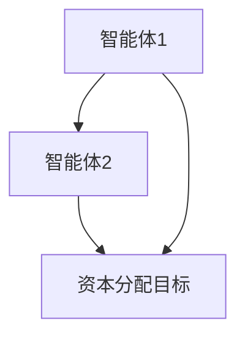
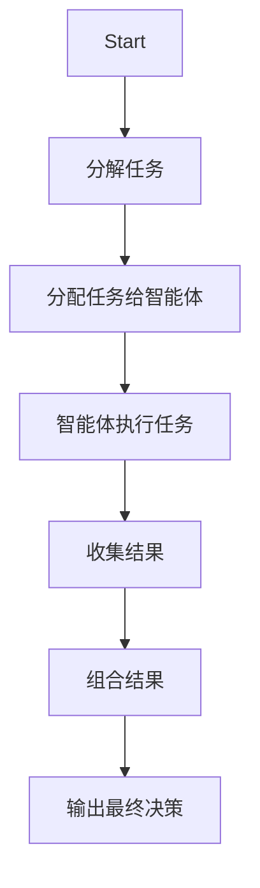
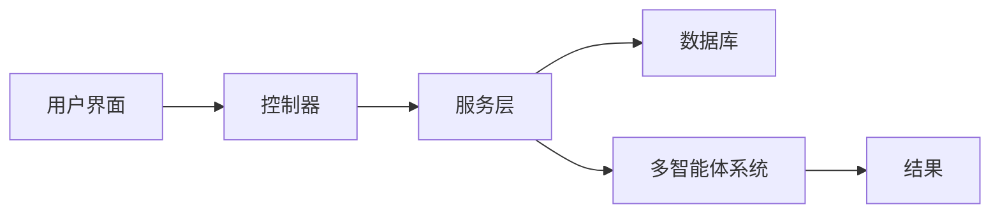

                 


---

# 智能化资本配置效率分析：多智能体AI的新方法

## 关键词：智能化资本配置、多智能体AI、资本效率、人工智能、金融优化

## 摘要：  
本文探讨了如何利用多智能体AI技术提升资本配置效率，分析了传统资本配置方法的局限性，并提出了基于多智能体协作的新方法。通过详细阐述多智能体系统的概念、算法原理、系统架构及实际应用案例，本文为金融领域的资本配置优化提供了新的思路和解决方案。

---

## 第一部分：智能化资本配置效率分析的背景与核心概念

### 第1章：智能化资本配置效率分析的背景与问题描述

#### 1.1 资本配置效率的定义与重要性
##### 1.1.1 资本配置效率的基本概念
资本配置效率是指在一定资源条件下，将资金分配到最优资产组合中以实现收益最大化的过程。高效的资金配置能够最大化投资收益，降低风险，是金融领域的重要研究方向。

##### 1.1.2 资本配置效率在金融领域的应用
资本配置效率直接关系到金融市场的运作效率。通过合理分配资金，投资者可以实现收益与风险的最佳平衡，从而推动金融市场的健康发展。

##### 1.1.3 资本配置效率对经济发展的意义
资本配置效率的提升能够促进资源的合理分配，支持经济结构优化，提高整体经济运行效率。

#### 1.2 传统资本配置方法的局限性
##### 1.2.1 基于均值-方差模型的传统方法
传统方法主要依赖均值-方差模型，但其假设条件过于理想化，难以应对现实中的复杂情况。

##### 1.2.2 传统方法在实际应用中的不足
传统方法难以处理多目标优化问题，且对数据的敏感性和实时性要求较高，难以满足现代金融市场的动态需求。

##### 1.2.3 传统方法与现代需求的矛盾
随着金融市场环境的复杂化和多样化，传统资本配置方法的局限性日益显现，亟需更先进的技术手段。

#### 1.3 多智能体AI在资本配置中的应用前景
##### 1.3.1 多智能体AI的基本概念
多智能体AI是指由多个相互协作的智能体组成的系统，每个智能体都有明确的目标和任务，能够通过通信和协调完成复杂任务。

##### 1.3.2 多智能体AI在金融领域的潜力
多智能体AI能够通过分工协作，实现复杂金融问题的高效解决，提升资本配置的效率和效果。

##### 1.3.3 多智能体AI如何提升资本配置效率
多智能体AI能够分解任务，分配给不同的智能体完成，通过协作优化整体资本分配，提高效率和决策质量。

#### 1.4 本章小结
本章介绍了资本配置效率的基本概念及其在金融领域的重要性，分析了传统方法的局限性，并探讨了多智能体AI的应用前景，为后续内容奠定了基础。

---

## 第二部分：多智能体AI的核心概念与原理

### 第2章：多智能体AI的核心概念与联系

#### 2.1 多智能体系统的定义与特点
##### 2.1.1 多智能体系统的定义
多智能体系统是由多个具有自主性、反应性和协作性的智能体组成的系统，能够共同完成复杂任务。

##### 2.1.2 多智能体系统的特性对比
| 特性 | 单智能体 | 多智能体 |
|------|----------|----------|
| 任务处理 | 单一任务 | 分解任务 |
| 协作性 | 低 | 高 |
| 灵活性 | 低 | 高 |

##### 2.1.3 多智能体系统与单智能体系统的区别
多智能体系统通过任务分解和协作实现更高效的资源利用，而单智能体系统则依赖单一决策中心。

#### 2.2 多智能体AI在资本配置中的应用模型
##### 2.2.1 多智能体AI的实体关系图

该图展示了多个智能体如何协作实现资本分配目标。

##### 2.2.2 多智能体AI的协作机制
多智能体AI通过通信和协调，实现任务分解、信息共享和决策优化，从而提高资本配置效率。

---

## 第三部分：多智能体AI的算法原理

### 第3章：多智能体协作算法的实现

#### 3.1 多智能体协作算法的基本原理
多智能体协作算法通过任务分解、信息共享和决策优化，实现高效协作。

#### 3.2 多智能体协作算法的实现步骤


#### 3.3 多智能体协作算法的Python实现
```python
def multi_agent_collaboration(tasks):
    agents = [Agent1, Agent2, Agent3]
    task分配 = distribute_tasks(tasks, agents)
    results = [agent.execute(task) for agent, task in zip(agents, task分配)]
    return combine_results(results)
```

#### 3.4 多智能体协作算法的数学模型
资本配置的数学模型可以通过以下公式表示：
$$
\text{目标函数} = \sum_{i=1}^{n} w_i r_i - \lambda \sum_{i=1}^{n} (w_i - \mu_i)^2
$$
其中，$w_i$为权重，$r_i$为收益，$\mu_i$为均值，$\lambda$为惩罚系数。

---

## 第四部分：系统分析与架构设计

### 第4章：智能化资本配置系统的分析与设计

#### 4.1 系统功能设计
系统功能包括数据采集、任务分解、智能体协作、结果整合和决策输出。

#### 4.2 系统架构设计


#### 4.3 系统接口设计
系统接口包括数据接口、任务接口和结果接口，通过API实现数据交互。

#### 4.4 系统交互流程
```mermaid
sequenceDiagram
    participant 用户
    participant 控制器
    participant 服务层
    participant 多智能体系统
    participant 数据库
    用户->控制器: 发送任务请求
    控制器->服务层: 调用服务
    服务层->数据库: 查询数据
    服务层->多智能体系统: 分配任务
    多智能体系统->服务层: 返回结果
    服务层->控制器: 返回结果
    用户<-控制器: 展示结果
```

---

## 第五部分：项目实战与案例分析

### 第5章：智能化资本配置系统的实现与应用

#### 5.1 环境安装与配置
安装Python、TensorFlow、Keras等工具，配置开发环境。

#### 5.2 系统核心代码实现
```python
class Agent:
    def __init__(self, id):
        self.id = id
    def execute(self, task):
        # 具体实现
        pass
```

#### 5.3 项目实战案例分析
通过模拟市场波动，分析多智能体AI在资本配置中的应用效果。

#### 5.4 系统优化与性能提升
通过算法优化、任务分配策略改进，提升系统性能和效率。

#### 5.5 项目小结
本章通过实际案例展示了多智能体AI在资本配置中的应用，验证了其有效性和优势。

---

## 第六部分：最佳实践与总结

### 第6章：智能化资本配置的未来展望与实践建议

#### 6.1 最佳实践
- 数据质量是关键，确保数据的准确性和及时性。
- 合理设计智能体的通信机制，提高协作效率。
- 定期监控和优化系统性能，确保稳定运行。

#### 6.2 小结
本文详细探讨了多智能体AI在资本配置中的应用，通过理论分析和实际案例，验证了其有效性。

#### 6.3 注意事项
在实际应用中，需注意智能体之间的通信延迟和计算资源分配问题。

#### 6.4 拓展阅读
建议读者进一步阅读相关领域的最新研究成果，深入了解多智能体AI的应用前景。

---

通过以上内容，本文全面探讨了智能化资本配置效率分析的各个方面，为金融领域的优化提供了新的思路和解决方案。

