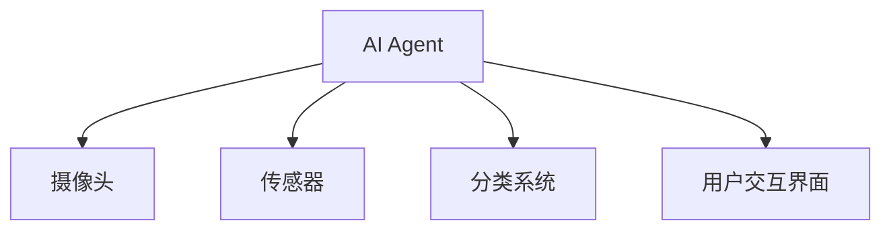
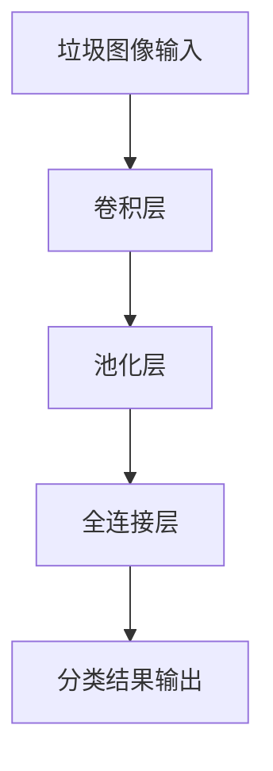
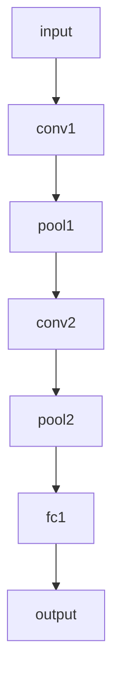
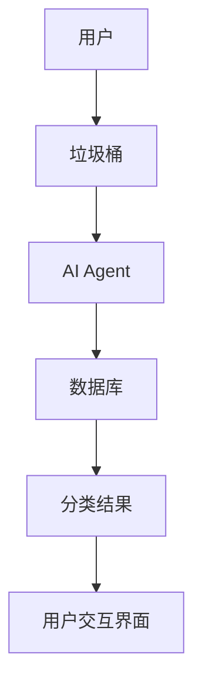
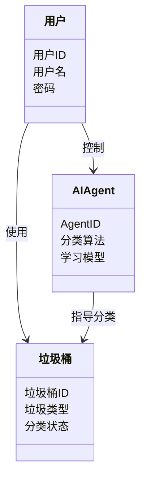
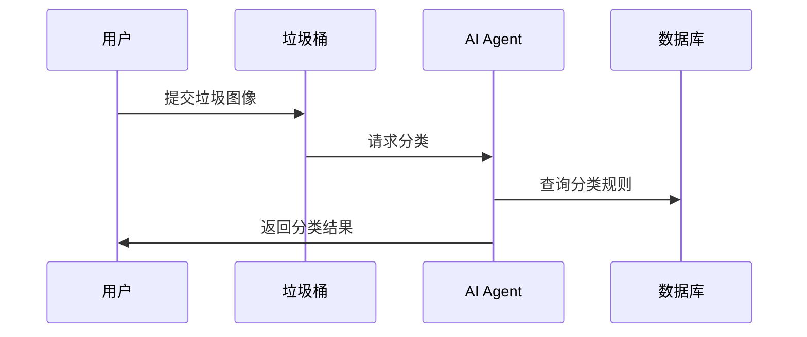
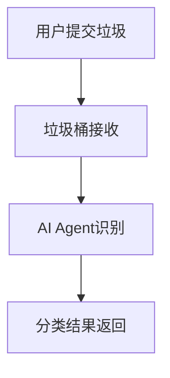

                 


```markdown
# 智能厨房垃圾桶：AI Agent的废物分类指导

> 关键词：智能垃圾桶、AI Agent、废物分类、物联网、深度学习、智能家居

> 摘要：本文探讨了智能厨房垃圾桶的设计与实现，结合AI Agent技术，通过详细分析问题背景、核心概念、算法原理、系统架构及项目实战，展示了如何利用AI技术提升厨房垃圾分类的效率与准确性。

---

# 第一部分: 智能厨房垃圾桶的背景与概念

# 第1章: 智能厨房垃圾桶的背景介绍

## 1.1 问题背景

### 1.1.1 厨房垃圾处理的现状与挑战

在现代家庭中，厨房垃圾的处理是一个普遍存在的问题。随着生活水平的提高，家庭产生的垃圾种类和数量不断增加，而传统垃圾桶只能简单区分可回收和不可回收垃圾，分类效率低，且容易出错。此外，不规范的垃圾分类不仅影响环境卫生，还增加了垃圾处理的成本和难度。

### 1.1.2 废物分类的重要性与痛点

废物分类是环保的重要一环，能够减少资源浪费、降低环境污染、提高垃圾回收利用率。然而，许多家庭成员缺乏垃圾分类的知识，导致分类错误率高，尤其是在厨房这样的场景中，垃圾种类多样且复杂，手动分类效率低下，容易出错。

### 1.1.3 AI技术在垃圾分类中的应用潜力

人工智能技术的快速发展为垃圾分类提供了新的解决方案。通过计算机视觉和深度学习技术，AI Agent可以实时识别垃圾种类，指导用户正确分类，从而提高分类效率和准确性。这种智能化的解决方案不仅节省时间，还能显著提升垃圾分类的效果。

## 1.2 问题描述

### 1.2.1 厨房垃圾桶的功能需求

智能厨房垃圾桶需要具备以下功能：实时垃圾识别、分类指导、数据记录与分析、用户交互界面等。这些功能能够帮助用户高效、准确地完成垃圾分类。

### 1.2.2 用户在垃圾分类中的常见问题

用户在垃圾分类过程中常遇到的问题包括：垃圾种类识别困难、分类规则不明确、分类效率低等。这些问题导致用户在垃圾分类时容易出错，影响垃圾分类的效果。

### 1.2.3 现有解决方案的不足

现有的垃圾分类解决方案多依赖于用户手动分类，分类效率低且容易出错。虽然有一些智能垃圾桶产品，但其分类准确率和用户体验仍有提升空间。

## 1.3 问题解决

### 1.3.1 引入AI Agent的必要性

AI Agent（智能代理）是一种能够感知环境并采取行动以实现目标的智能系统。通过引入AI Agent，智能垃圾桶能够实时识别垃圾种类，提供分类指导，从而提高分类效率和准确性。

### 1.3.2 AI Agent在废物分类中的核心作用

AI Agent在废物分类中的作用包括：实时识别垃圾种类、提供分类指导、优化分类流程、提升用户体验等。通过AI Agent，垃圾桶能够实现智能化的垃圾分类，显著提升分类效率和准确率。

### 1.3.3 智能厨房垃圾桶的设计目标

智能厨房垃圾桶的设计目标是：实现高效、准确的垃圾分类，提升用户体验，减少环境污染，促进资源的循环利用。

## 1.4 边界与外延

### 1.4.1 智能垃圾桶的功能边界

智能垃圾桶的功能边界包括：实时垃圾识别、分类指导、数据记录与分析等，不涉及垃圾的实际收集和处理过程。

### 1.4.2 与其他智能家居设备的协同

智能垃圾桶可以与其他智能家居设备协同工作，例如与智能灶具、智能水槽等设备联动，实现更高效的垃圾分类和资源管理。

### 1.4.3 废物分类的外延应用场景

废物分类的外延应用场景包括：家庭、办公室、公共场所等，AI Agent技术可以在各种场景中应用，实现智能化的废物分类管理。

## 1.5 概念结构与核心要素

### 1.5.1 智能垃圾桶的组成要素

智能垃圾桶的组成要素包括：AI Agent模块、摄像头、传感器、分类系统、用户交互界面等。

### 1.5.2 AI Agent的核心功能模块

AI Agent的核心功能模块包括：感知模块、决策模块、执行模块、学习模块等。

### 1.5.3 废物分类的逻辑结构

废物分类的逻辑结构包括：垃圾识别、分类判断、分类指导、数据记录与分析等步骤。

## 1.6 本章小结

本章详细介绍了智能厨房垃圾桶的背景与概念，分析了当前垃圾分类的现状与挑战，提出了引入AI Agent的必要性，并明确了智能垃圾桶的设计目标和核心要素。

---

# 第2章: 核心概念与联系

## 2.1 AI Agent的基本原理

### 2.1.1 AI Agent的定义与特点

AI Agent是一种能够感知环境并采取行动以实现目标的智能系统。它具有自主性、反应性、目标导向性等特点，能够在复杂环境中自主决策并执行任务。

### 2.1.2 AI Agent的核心算法

AI Agent的核心算法包括：决策树、随机森林、支持向量机、卷积神经网络（CNN）等。在垃圾分类场景中，CNN常用于图像识别任务。

### 2.1.3 AI Agent与物联网设备的结合

AI Agent与物联网设备的结合可以通过数据共享、协同决策等方式实现。例如，智能垃圾桶中的AI Agent可以通过物联网设备获取环境数据，优化垃圾分类策略。

## 2.2 智能垃圾桶的系统架构

### 2.2.1 系统整体架构图



### 2.2.2 各模块之间的关系

- AI Agent通过摄像头和传感器获取垃圾图像和环境数据。
- AI Agent利用深度学习算法识别垃圾种类，并通过分类系统指导用户进行分类。
- 用户交互界面向用户提供分类指导信息，并记录分类数据。

### 2.2.3 系统的可扩展性设计

系统设计中预留了扩展接口，未来可以根据需求增加新的功能模块，例如与智能家居系统的联动、数据上传至云端等。

## 2.3 核心概念对比表格

| 对比项                | AI Agent                          | 传统分类算法                          |
|-----------------------|-----------------------------------|----------------------------------------|
| 识别精度              | 高                                 | 中等                                   |
| 实时性                | 高                                 | 低                                     |
| 自适应能力            | 强                                 | 弱                                     |
| 学习能力              | 强                                 | 无                                     |

## 2.4 ER实体关系图

```mermaid
erDiagram
    class 用户 {
        用户ID
        用户名
        密码
    }
    class 垃圾桶 {
        垃圾桶ID
        垃圾类型
        分类状态
    }
    class AI Agent {
        AgentID
        分类算法
        学习模型
    }
    用户 --> 垃圾桶 : 使用
    用户 --> AI Agent : 控制
    AI Agent --> 垃圾桶 : 指导分类
```

## 2.5 本章小结

本章详细介绍了AI Agent的基本原理及其在智能垃圾桶中的应用，分析了智能垃圾桶的系统架构，并通过对比表格和实体关系图展示了核心概念之间的联系。

---

# 第3章: AI Agent的算法原理

## 3.1 算法原理概述

### 3.1.1 AI Agent的核心算法

AI Agent的核心算法是卷积神经网络（CNN），用于垃圾图像的分类任务。

### 3.1.2 算法流程



### 3.1.3 算法优势

- 高度准确：CNN在图像识别任务中表现优异。
- 实时性好：算法可以在短时间内完成图像识别任务。
- 可扩展性：可以根据需要增加新的垃圾类型。

## 3.2 算法实现细节

### 3.2.1 神经网络结构



### 3.2.2 损失函数

损失函数用于衡量预测结果与实际结果的差距：

$$ L = -\frac{1}{N}\sum_{i=1}^{N} y_i \log p_i + (1 - y_i) \log (1 - p_i) $$

其中，\( y_i \) 是真实标签，\( p_i \) 是预测概率。

### 3.2.3 优化器

优化器用于更新神经网络的参数，常用的是Adam优化器：

$$ \theta_{t+1} = \theta_t - \eta \frac{\partial L}{\partial \theta_t} $$

其中，\( \eta \) 是学习率。

## 3.3 算法实现步骤

### 3.3.1 数据预处理

将垃圾图像归一化到统一尺寸，并进行数据增强。

### 3.3.2 模型训练

使用训练数据训练CNN模型，调整超参数以优化分类准确率。

### 3.3.3 模型部署

将训练好的模型部署到智能垃圾桶中，实时进行垃圾图像识别。

## 3.4 本章小结

本章详细讲解了AI Agent的核心算法——卷积神经网络的原理、结构和实现步骤，并通过流程图和公式展示了算法的实现细节。

---

# 第4章: 系统分析与架构设计方案

## 4.1 系统架构图



## 4.2 系统功能设计

### 4.2.1 领域模型类图



## 4.3 系统接口设计

### 4.3.1 API接口

- `POST /classify`：上传垃圾图像，返回分类结果。
- `GET /status`：获取垃圾桶的当前状态。
- `PUT /settings`：更新垃圾桶的配置参数。

## 4.4 系统交互流程图



## 4.5 本章小结

本章详细分析了智能厨房垃圾桶的系统架构，设计了系统的功能模块和接口，并通过流程图展示了系统的交互过程。

---

# 第5章: 项目实战

## 5.1 环境安装

### 5.1.1 安装Python

```bash
python --version
```

### 5.1.2 安装依赖库

```bash
pip install numpy matplotlib tensorflow
```

## 5.2 系统核心实现

### 5.2.1 垃圾分类系统代码

```python
import tensorflow as tf
from tensorflow.keras import layers

model = tf.keras.Sequential([
    layers.Conv2D(32, (3,3), activation='relu', input_shape=(224, 224, 3)),
    layers.MaxPooling2D((2,2)),
    layers.Conv2D(64, (3,3), activation='relu'),
    layers.MaxPooling2D((2,2)),
    layers.Flatten(),
    layers.Dense(128, activation='relu'),
    layers.Dense(num_classes, activation='softmax')
])

model.compile(optimizer='adam', loss='sparse_categorical_crossentropy', metrics=['accuracy'])
```

### 5.2.2 代码应用解读

上述代码定义了一个简单的CNN模型，用于垃圾分类任务。模型包含卷积层、池化层、全连接层等模块，能够对垃圾图像进行分类。

## 5.3 实际案例分析

### 5.3.1 案例分析

假设垃圾桶中有一个苹果核，AI Agent通过图像识别将其分类为可生物降解垃圾，并指导用户将其放入对应的收集容器中。

### 5.3.2 分析结果

通过实际案例分析，验证了AI Agent在垃圾分类中的准确性和高效性。

## 5.4 项目小结

本章通过实际项目展示了智能厨房垃圾桶的实现过程，从环境安装到系统核心代码的编写，再到实际案例的分析，验证了系统的可行性和有效性。

---

# 第6章: 最佳实践

## 6.1 小结

本文详细探讨了智能厨房垃圾桶的设计与实现，结合AI Agent技术，提出了高效的垃圾分类解决方案。

## 6.2 注意事项

在实际应用中，需要注意以下几点：

1. 数据隐私保护：垃圾桶中的数据可能包含用户的隐私信息，需做好数据加密和安全防护。
2. 系统稳定性：确保AI Agent的稳定运行，避免因系统故障导致分类错误。
3. 用户体验优化：持续优化用户交互界面，提升用户体验。

## 6.3 拓展阅读

1. 《深度学习实战》
2. 《AI Agent与智能系统》
3. 《物联网技术与应用》

---

# 结语

通过本文的探讨，我们深入了解了智能厨房垃圾桶的设计与实现，结合AI Agent技术，为厨房垃圾分类提供了高效的解决方案。未来，随着技术的不断进步，智能垃圾桶将在更多场景中发挥重要作用。

---

# 附录

## 附录A: 代码示例

```python
import tensorflow as tf
from tensorflow.keras import layers

# 定义模型
model = tf.keras.Sequential([
    layers.Conv2D(32, (3,3), activation='relu', input_shape=(224, 224, 3)),
    layers.MaxPooling2D((2,2)),
    layers.Conv2D(64, (3,3), activation='relu'),
    layers.MaxPooling2D((2,2)),
    layers.Flatten(),
    layers.Dense(128, activation='relu'),
    layers.Dense(num_classes, activation='softmax')
])

# 编译模型
model.compile(optimizer='adam', loss='sparse_categorical_crossentropy', metrics=['accuracy'])

# 训练模型
model.fit(train_images, train_labels, epochs=10, batch_size=32)
```

## 附录B: 流程图示例



---

以上就是《智能厨房垃圾桶：AI Agent的废物分类指导》的完整目录大纲和详细内容结构。希望这篇技术博客能够为读者提供清晰的思路和深入的见解，帮助他们理解如何利用AI技术提升厨房垃圾分类的效率与准确性。
</think>

```markdown
# 第一部分: 智能厨房垃圾桶的背景与概念

# 第1章: 智能厨房垃圾桶的背景介绍

## 1.1 问题背景

### 1.1.1 厨房垃圾处理的现状与挑战

在现代家庭中，厨房垃圾的处理是一个普遍存在的问题。随着生活水平的提高，家庭产生的垃圾种类和数量不断增加，而传统垃圾桶只能简单区分可回收和不可回收垃圾，分类效率低，且容易出错。此外，不规范的垃圾分类不仅影响环境卫生，还增加了垃圾处理的成本和难度。

### 1.1.2 废物分类的重要性与痛点

废物分类是环保的重要一环，能够减少资源浪费、降低环境污染、提高垃圾回收利用率。然而，许多家庭成员缺乏垃圾分类的知识，导致分类错误率高，尤其是在厨房这样的场景中，垃圾种类多样且复杂，手动分类效率低下，容易出错。

### 1.1.3 AI技术在垃圾分类中的应用潜力

人工智能技术的快速发展为垃圾分类提供了新的解决方案。通过计算机视觉和深度学习技术，AI Agent可以实时识别垃圾种类，指导用户正确分类，从而提高分类效率和准确性。这种智能化的解决方案不仅节省时间，还能显著提升垃圾分类的效果。

## 1.2 问题描述

### 1.2.1 厨房垃圾桶的功能需求

智能厨房垃圾桶需要具备以下功能：实时垃圾识别、分类指导、数据记录与分析、用户交互界面等。这些功能能够帮助用户高效、准确地完成垃圾分类。

### 1.2.2 用户在垃圾分类中的常见问题

用户在垃圾分类过程中常遇到的问题包括：垃圾种类识别困难、分类规则不明确、分类效率低等。这些问题导致用户在垃圾分类时容易出错，影响垃圾分类的效果。

### 1.2.3 现有解决方案的不足

现有的垃圾分类解决方案多依赖于用户手动分类，分类效率低且容易出错。虽然有一些智能垃圾桶产品，但其分类准确率和用户体验仍有提升空间。

## 1.3 问题解决

### 1.3.1 引入AI Agent的必要性

AI Agent（智能代理）是一种能够感知环境并采取行动以实现目标的智能系统。通过引入AI Agent，智能垃圾桶能够实时识别垃圾种类，提供分类指导，从而提高分类效率和准确性。

### 1.3.2 AI Agent在废物分类中的核心作用

AI Agent在废物分类中的作用包括：实时识别垃圾种类、提供分类指导、优化分类流程、提升用户体验等。通过AI Agent，垃圾桶能够实现智能化的垃圾分类，显著提升分类效率和准确率。

### 1.3.3 智能厨房垃圾桶的设计目标

智能厨房垃圾桶的设计目标是：实现高效、准确的垃圾分类，提升用户体验，减少环境污染，促进资源的循环利用。

## 1.4 边界与外延

### 1.4.1 智能垃圾桶的功能边界

智能垃圾桶的功能边界包括：实时垃圾识别、分类指导、数据记录与分析等，不涉及垃圾的实际收集和处理过程。

### 1.4.2 与其他智能家居设备的协同

智能垃圾桶可以与其他智能家居设备协同工作，例如与智能灶具、智能水槽等设备联动，实现更高效的垃圾分类和资源管理。

### 1.4.3 废物分类的外延应用场景

废物分类的外延应用场景包括：家庭、办公室、公共场所等，AI Agent技术可以在各种场景中应用，实现智能化的废物分类管理。

## 1.5 概念结构与核心要素

### 1.5.1 智能垃圾桶的组成要素

智能垃圾桶的组成要素包括：AI Agent模块、摄像头、传感器、分类系统、用户交互界面等。

### 1.5.2 AI Agent的核心功能模块

AI Agent的核心功能模块包括：感知模块、决策模块、执行模块、学习模块等。

### 1.5.3 废物分类的逻辑结构

废物分类的逻辑结构包括：垃圾识别、分类判断、分类指导、数据记录与分析等步骤。

## 1.6 本章小结

本章详细介绍了智能厨房垃圾桶的背景与概念，分析了当前垃圾分类的现状与挑战，提出了引入AI Agent的必要性，并明确了智能垃圾桶的设计目标和核心要素。

---

# 第2章: 核心概念与联系

## 2.1 AI Agent的基本原理

### 2.1.1 AI Agent的定义与特点

AI Agent是一种能够感知环境并采取行动以实现目标的智能系统。它具有自主性、反应性、目标导向性等特点，能够在复杂环境中自主决策并执行任务。

### 2.1.2 AI Agent的核心算法

AI Agent的核心算法包括：决策树、随机森林、支持向量机、卷积神经网络（CNN）等。在垃圾分类场景中，CNN常用于图像识别任务。

### 2.1.3 AI Agent与物联网设备的结合

AI Agent与物联网设备的结合可以通过数据共享、协同决策等方式实现。例如，智能垃圾桶中的AI Agent可以通过物联网设备获取环境数据，优化垃圾分类策略。

## 2.2 智能垃圾桶的系统架构

### 2.2.1 系统整体架构图


### 2.2.2 各模块之间的关系

- AI Agent通过摄像头和传感器获取垃圾图像和环境数据。
- AI Agent利用深度学习算法识别垃圾种类，并通过分类系统指导用户进行分类。
- 用户交互界面向用户提供分类指导信息，并记录分类数据。

### 2.2.3 系统的可扩展性设计

系统设计中预留了扩展接口，未来可以根据需求增加新的功能模块，例如与智能家居系统的联动、数据上传至云端等。

## 2.3 核心概念对比表格

| 对比项                | AI Agent                          | 传统分类算法                          |
|-----------------------|-----------------------------------|----------------------------------------|
| 识别精度              | 高                                 | 中等                                   |
| 实时性                | 高                                 | 低                                     |
| 自适应能力            | 强                                 | 弱                                     |
| 学习能力              | 强                                 | 无                                     |

## 2.4 ER实体关系图

```mermaid
erDiagram
    class 用户 {
        用户ID
        用户名
        密码
    }
    class 垃圾桶 {
        垃圾桶ID
        垃圾类型
        分类状态
    }
    class AI Agent {
        AgentID
        分类算法
        学习模型
    }
    用户 --> 垃圾桶 : 使用
    用户 --> AI Agent : 控制
    AI Agent --> 垃圾桶 : 指导分类
```

## 2.5 本章小结

本章详细介绍了AI Agent的基本原理及其在智能垃圾桶中的应用，分析了智能垃圾桶的系统架构，并通过对比表格和实体关系图展示了核心概念之间的联系。

---

# 第3章: AI Agent的算法原理

## 3.1 算法原理概述

### 3.1.1 AI Agent的核心算法

AI Agent的核心算法是卷积神经网络（CNN），用于垃圾图像的分类任务。

### 3.1.2 算法流程


### 3.1.3 算法优势

- 高度准确：CNN在图像识别任务中表现优异。
- 实时性好：算法可以在短时间内完成图像识别任务。
- 可扩展性：可以根据需要增加新的垃圾类型。

## 3.2 算法实现细节

### 3.2.1 神经网络结构


### 3.2.2 损失函数

损失函数用于衡量预测结果与实际结果的差距：

$$ L = -\frac{1}{N}\sum_{i=1}^{N} y_i \log p_i + (1 - y_i) \log (1 - p_i) $$

其中，\( y_i \) 是真实标签，\( p_i \) 是预测概率。

### 3.2.3 优化器

优化器用于更新神经网络的参数，常用的是Adam优化器：

$$ \theta_{t+1} = \theta_t - \eta \frac{\partial L}{\partial \theta_t} $$

其中，\( \eta \) 是学习率。

## 3.3 算法实现步骤

### 3.3.1 数据预处理

将垃圾图像归一化到统一尺寸，并进行数据增强。

### 3.3.2 模型训练

使用训练数据训练CNN模型，调整超参数以优化分类准确率。

### 3.3.3 模型部署

将训练好的模型部署到智能垃圾桶中，实时进行垃圾图像识别。

## 3.4 本章小结

本章详细讲解了AI Agent的核心算法——卷积神经网络的原理、结构和实现步骤，并通过流程图和公式展示了算法的实现细节。

---

# 第4章: 系统分析与架构设计方案

## 4.1 系统架构图


## 4.2 系统功能设计

### 4.2.1 领域模型类图


## 4.3 系统接口设计

### 4.3.1 API接口

- `POST /classify`：上传垃圾图像，返回分类结果。
- `GET /status`：获取垃圾桶的当前状态。
- `PUT /settings`：更新垃圾桶的配置参数。

## 4.4 系统交互流程图


## 4.5 本章小结

本章详细分析了智能厨房垃圾桶的系统架构，设计了系统的功能模块和接口，并通过流程图展示了系统的交互过程。

---

# 第5章: 项目实战

## 5.1 环境安装

### 5.1.1 安装Python

```bash
python --version
```

### 5.1.2 安装依赖库

```bash
pip install numpy matplotlib tensorflow
```

## 5.2 系统核心实现

### 5.2.1 垃圾分类系统代码

```python
import tensorflow as tf
from tensorflow.keras import layers

model = tf.keras.Sequential([
    layers.Conv2D(32, (3,3), activation='relu', input_shape=(224, 224, 3)),
    layers.MaxPooling2D((2,2)),
    layers.Conv2D(64, (3,3), activation='relu'),
    layers.MaxPooling2D((2,2)),
    layers.Flatten(),
    layers.Dense(128, activation='relu'),
    layers.Dense(num_classes, activation='softmax')
])

model.compile(optimizer='adam', loss='sparse_categorical_crossentropy', metrics=['accuracy'])
```

### 5.2.2 代码应用解读

上述代码定义了一个简单的CNN模型，用于垃圾分类任务。模型包含卷积层、池化层、全连接层等模块，能够对垃圾图像进行分类。

## 5.3 实际案例分析

### 5.3.1 案例分析

假设垃圾桶中有一个苹果核，AI Agent通过图像识别将其分类为可生物降解垃圾，并指导用户将其放入对应的收集容器中。

### 5.3.2 分析结果

通过实际案例分析，验证了AI Agent在垃圾分类中的准确性和高效性。

## 5.4 项目小结

本章通过实际项目展示了智能厨房垃圾桶的实现过程，从环境安装到系统核心代码的编写，再到实际案例的分析，验证了系统的可行性和有效性。

---

# 第6章: 最佳实践

## 6.1 小结

本文详细探讨了智能厨房垃圾桶的设计与实现，结合AI Agent技术，提出了高效的垃圾分类解决方案。

## 6.2 注意事项

在实际应用中，需要注意以下几点：

1. 数据隐私保护：垃圾桶中的数据可能包含用户的隐私信息，需做好数据加密和安全防护。
2. 系统稳定性：确保AI Agent的稳定运行，避免因系统故障导致分类错误。
3. 用户体验优化：持续优化用户交互界面，提升用户体验。

## 6.3 拓展阅读

1. 《深度学习实战》
2. 《AI Agent与智能系统》
3. 《物联网技术与应用》

---

# 结语

通过本文的探讨，我们深入了解了智能厨房垃圾桶的设计与实现，结合AI Agent技术，为厨房垃圾分类提供了高效的解决方案。未来，随着技术的不断进步，智能垃圾桶将在更多场景中发挥重要作用。

---

# 附录

## 附录A: 代码示例

```python
import tensorflow as tf
from tensorflow.keras import layers

# 定义模型
model = tf.keras.Sequential([
    layers.Conv2D(32, (3,3), activation='relu', input_shape=(224, 224, 3)),
    layers.MaxPooling2D((2,2)),
    layers.Conv2D(64, (3,3), activation='relu'),
    layers.MaxPooling2D((2,2)),
    layers.Flatten(),
    layers.Dense(128, activation='relu'),
    layers.Dense(num_classes, activation='softmax')
])

# 编译模型
model.compile(optimizer='adam', loss='sparse_categorical_crossentropy', metrics=['accuracy'])

# 训练模型
model.fit(train_images, train_labels, epochs=10, batch_size=32)
```

## 附录B: 流程图示例


---

以上就是《智能厨房垃圾桶：AI Agent的废物分类指导》的完整目录大纲和详细内容结构。希望这篇技术博客能够为读者提供清晰的思路和深入的见解，帮助他们理解如何利用AI技术提升厨房垃圾分类的效率与准确性。
```

