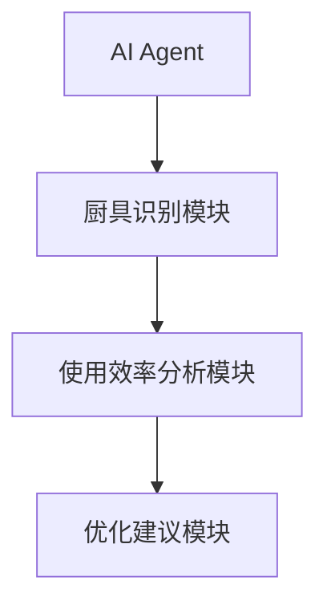
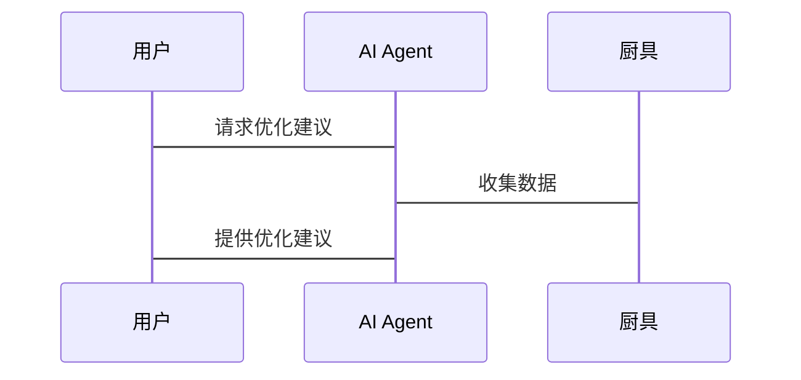

                 


# 智能厨房抽屉：AI Agent的厨具使用效率分析

**关键词：** AI Agent，厨具使用效率，智能厨房，路径规划，任务调度，数学建模

**摘要：**  
本文探讨了AI Agent在智能厨房抽屉中的应用，分析了厨具使用效率的提升方法。通过详细的技术分析，本文揭示了如何利用AI技术优化厨房操作流程，提高效率，降低成本。文章涵盖了AI Agent的基本原理、系统架构设计、算法实现、项目实战及优化建议，为读者提供了全面的技术视角。

---

## 第1章: 背景与问题分析

### 1.1 智能厨房抽屉的概念与背景
#### 1.1.1 厨房智能化的现状
现代厨房正在经历智能化转型，智能设备的普及使得厨房操作更加高效。然而，厨具的使用效率仍未达到最优水平，主要问题包括资源浪费和时间浪费。

#### 1.1.2 智能厨房抽屉的定义与特点
智能厨房抽屉是一种结合了AI技术的厨房设备，能够通过传感器和AI算法优化厨具的存储和使用效率。

#### 1.1.3 厨具使用效率的重要性
提高厨具使用效率可以节省时间、减少能源浪费，同时提升用户体验。

### 1.2 问题背景与需求分析
#### 1.2.1 厨具使用效率低下问题
传统厨房中，厨具的存储和使用缺乏优化，导致效率低下。

#### 1.2.2 用户需求分析
用户希望厨房操作更加高效、便捷，减少重复劳动。

#### 1.2.3 问题解决的目标与边界
目标是通过AI技术优化厨具使用效率，边界包括厨房环境、用户习惯和设备限制。

### 1.3 问题描述与解决方案
#### 1.3.1 厨具使用效率低下的具体表现
包括厨具查找时间长、使用后的归位混乱等问题。

#### 1.3.2 AI Agent在厨具效率提升中的作用
AI Agent可以实时感知厨具位置，优化使用路径，提高效率。

#### 1.3.3 解决方案的框架与实现路径
通过AI算法优化厨具管理，结合物联网技术实现高效操作。

---

## 第2章: AI Agent的核心概念与原理

### 2.1 AI Agent的基本定义
#### 2.1.1 AI Agent的定义
AI Agent是一种智能体，能够感知环境并采取行动以实现目标。

#### 2.1.2 AI Agent的核心属性
包括感知能力、推理能力、学习能力和决策能力。

#### 2.1.3 AI Agent与传统程序的区别
AI Agent具备自主性和适应性，能够动态调整行为。

### 2.2 AI Agent的基本原理
#### 2.2.1 感知与推理机制
AI Agent通过传感器感知环境，利用推理算法进行决策。

#### 2.2.2 行为决策过程
基于感知数据，AI Agent通过路径规划和任务调度优化行动。

#### 2.2.3 与环境的交互方式
AI Agent通过物联网设备与厨房环境交互，实现厨具的高效管理。

### 2.3 AI Agent在厨具效率中的应用
#### 2.3.1 厨具使用场景分析
分析厨房中常见操作场景，识别效率瓶颈。

#### 2.3.2 AI Agent在厨具管理中的具体应用
通过AI算法优化厨具的存储和使用路径。

#### 2.3.3 AI Agent与厨具效率的关系
AI Agent能够显著提升厨具使用效率，优化厨房操作流程。

---

## 第3章: 系统架构与功能设计

### 3.1 系统总体架构
#### 3.1.1 系统架构图（Mermaid图）

#### 3.1.2 系统组件介绍
包括AI Agent、厨具识别模块、使用效率分析模块和优化建议模块。

#### 3.1.3 系统功能模块划分
将系统划分为感知、分析和优化三个主要模块。

### 3.2 功能模块设计
#### 3.2.1 厨具识别模块
通过传感器和图像识别技术，识别厨具的位置和状态。

#### 3.2.2 使用效率分析模块
分析厨具的使用频率和路径，识别效率瓶颈。

#### 3.2.3 优化建议模块
根据分析结果，提供优化建议，如调整存储位置或使用顺序。

### 3.3 系统接口与交互设计
#### 3.3.1 系统接口定义
定义AI Agent与厨房设备之间的接口，确保数据流畅传输。

#### 3.3.2 用户交互流程（Mermaid图）


---

## 第4章: 算法原理与实现

### 4.1 算法原理
#### 4.1.1 路径规划算法
使用A*算法优化厨具的使用路径，减少移动距离。

#### 4.1.2 任务调度算法
通过优先级队列，优化任务执行顺序，提高效率。

### 4.2 算法实现
#### 4.2.1 路径规划的数学模型
$$ \text{距离} = \sum_{i=1}^{n} |x_i - x_{i-1}| + |y_i - y_{i-1}| $$

#### 4.2.2 任务调度的数学模型
$$ \text{优先级} = \frac{1}{\text{任务时间} + \text{任务依赖}} $$

#### 4.2.3 代码示例
```python
import heapq

def a_star(start, end, obstacles):
    open_set = {start}
    came_from = {}
    g_score = {start: 0}
    f_score = {start: heuristic(start, end)}
    
    while open_set:
        current = heapq.heappop(open_set)
        if current == end:
            return reconstruct_path(came_from, current)
        for neighbor in neighbors(current):
            new_g = g_score[current] + distance(current, neighbor)
            if neighbor not in g_score or new_g < g_score[neighbor]:
                came_from[neighbor] = current
                g_score[neighbor] = new_g
                f_score[neighbor] = g_score[neighbor] + heuristic(neighbor, end)
                heapq.heappush(open_set, neighbor)
```

---

## 第5章: 项目实战与实现

### 5.1 项目环境搭建
#### 5.1.1 硬件环境
包括摄像头、传感器和物联网设备。

#### 5.1.2 软件环境
安装Python、AI框架（如TensorFlow）和相关库。

### 5.2 核心实现
#### 5.2.1 厨具识别
使用OpenCV进行图像识别，识别厨具的位置和类型。

#### 5.2.2 使用效率分析
通过数据统计和分析，识别效率瓶颈。

#### 5.2.3 优化建议生成
根据分析结果，生成优化建议，如调整存储位置。

### 5.3 实际案例分析
#### 5.3.1 案例背景
分析一个典型厨房的使用情况，识别效率问题。

#### 5.3.2 实施优化
通过AI Agent优化厨具使用路径，提高效率。

#### 5.3.3 优化效果
对比优化前后的数据，展示效率提升的具体指标。

---

## 第6章: 优化与扩展

### 6.1 系统优化
#### 6.1.1 性能优化
通过算法优化和硬件升级，提高系统运行效率。

#### 6.1.2 功能扩展
增加更多AI功能，如食材管理、菜谱推荐。

### 6.2 用户体验优化
#### 6.2.1 交互设计优化
改进用户界面，提升用户体验。

#### 6.2.2 功能扩展建议
结合用户反馈，进一步优化系统功能。

---

## 第7章: 总结与展望

### 7.1 总结
AI Agent在智能厨房抽屉中的应用显著提升了厨具使用效率，优化了厨房操作流程。

### 7.2 展望
未来，AI技术将进一步融入厨房设备，实现更高效的厨房管理。

---

## 参考文献
- [1] Russell, S., & Norvig, P. (2010). Artificial Intelligence: A Modern Approach.
- [2] 李航. (2007). 人工智能: 理论与实践.

---

通过以上内容，我们可以看到AI Agent在智能厨房抽屉中的应用潜力，未来随着技术的不断发展，厨具使用效率将得到进一步提升，为用户带来更便捷的厨房体验。

