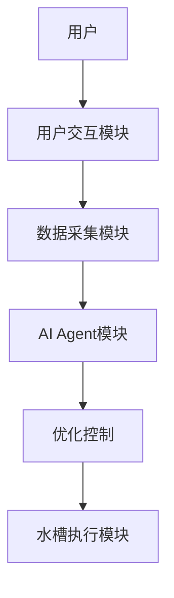
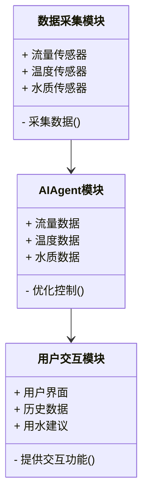
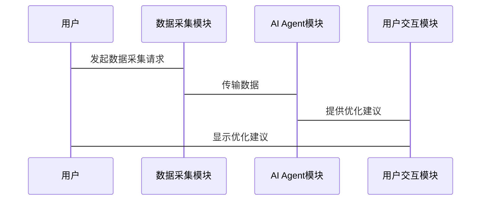
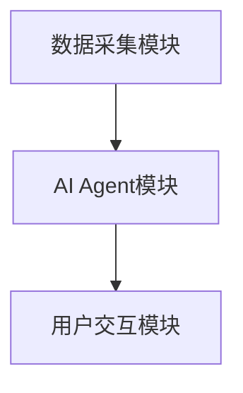

                 


# 智能厨房水槽：AI Agent的用水优化控制

> 关键词：智能厨房水槽，AI Agent，用水优化，强化学习，智能家居

> 摘要：随着智能家居的普及，AI Agent在厨房水槽中的应用越来越广泛。本文从背景介绍、核心概念、算法原理、系统架构设计到项目实战，全面解析AI Agent如何优化水槽的用水控制，帮助读者理解并实现智能厨房水槽的设计与应用。

---

# 第1章: 智能厨房水槽的背景与应用

## 1.1 智能厨房水槽的背景介绍

### 1.1.1 水资源浪费的现状与挑战

水资源是地球上的宝贵资源，但随着人口增长和工业化发展，水资源短缺问题日益严重。在厨房中，水槽的使用占据了家庭用水的重要部分。传统水槽缺乏智能化管理，容易造成水资源浪费，例如水龙头长时间开启导致的水浪费，以及洗涤过程中不必要的水量消耗。

### 1.1.2 智能化厨房设备的发展趋势

智能家居的兴起推动了厨房设备的智能化升级。智能水槽作为一种新兴的智能家居设备，通过集成传感器、物联网（IoT）和人工智能（AI）技术，能够实现用水的智能化管理，优化用水效率，减少浪费。

### 1.1.3 AI Agent在智能家居中的应用前景

AI Agent（智能代理）是一种能够感知环境、自主决策并执行任务的智能系统。在智能家居中，AI Agent可以应用于多个场景，例如智能音箱、智能空调和智能水槽等。AI Agent通过学习用户行为和环境数据，能够提供个性化的服务和优化建议。

---

## 1.2 智能厨房水槽的核心概念

### 1.2.1 智能厨房水槽的定义与功能

智能厨房水槽是一种集成传感器、物联网和AI技术的水槽，能够实时监测水的使用情况，并通过AI Agent优化用水控制。其主要功能包括：

- **实时监测**：监测水的流量、温度和水质。
- **智能控制**：通过AI算法优化水的使用，例如自动调节水温、水量和洗涤时间。
- **用户交互**：通过手机APP或语音助手与用户交互，提供用水建议和历史数据。

### 1.2.2 AI Agent的基本原理与特点

AI Agent是一种能够感知环境、自主决策并执行任务的智能系统。其基本原理包括：

- **感知环境**：通过传感器获取环境数据。
- **决策与规划**：基于数据进行分析和决策。
- **执行任务**：根据决策执行相应的操作。

AI Agent的特点包括：

- **自主性**：能够自主决策和执行任务。
- **反应性**：能够实时感知环境变化并做出反应。
- **学习能力**：能够通过机器学习算法不断优化自身的决策能力。

### 1.2.3 智能水槽与传统水槽的主要区别

| **特性**       | **智能水槽**                          | **传统水槽**                          |
|----------------|--------------------------------------|--------------------------------------|
| 控制方式       | 智能化控制，AI Agent优化用水          | 机械控制，无法优化用水                |
| 数据采集       | 集成传感器，实时监测水的使用情况      | 无传感器，无法实时监测                |
| 用户交互       | 支持手机APP或语音助手交互            | 无交互功能，仅手动操作                |
| 节能优化       | 通过AI算法优化用水，减少浪费          | 无法优化用水，容易造成浪费            |

---

## 1.3 本章小结

智能厨房水槽通过AI Agent实现了用水的智能化管理，优化了用水效率，减少了水资源浪费。AI Agent在智能家居中的应用前景广阔，能够为家庭提供更加智能化和高效的用水管理方案。

---

# 第2章: AI Agent的核心概念与原理

## 2.1 AI Agent的基本原理

### 2.1.1 AI Agent的定义与分类

AI Agent是一种能够感知环境、自主决策并执行任务的智能系统。根据功能和应用场景的不同，AI Agent可以分为多种类型，例如：

- **简单反射型Agent**：基于规则进行决策，适用于简单的任务。
- **基于模型的反射型Agent**：通过内部模型和环境数据进行决策，适用于复杂的任务。
- **目标驱动型Agent**：以特定目标为导向，主动采取行动。
- **实用驱动型Agent**：以效用最大化为目标，通过权衡利弊进行决策。

---

## 2.2 AI Agent的算法实现

### 2.2.1 基于强化学习的AI Agent算法

强化学习是一种通过试错机制来优化决策的算法。AI Agent通过与环境的交互，不断学习和优化自身的决策策略。以下是强化学习的基本流程：

1. **环境感知**：AI Agent通过传感器获取环境数据。
2. **决策制定**：基于当前状态，AI Agent选择一个动作。
3. **执行动作**：AI Agent执行选定的动作。
4. **奖励反馈**：环境根据动作的效果给予奖励或惩罚。
5. **策略优化**：AI Agent根据奖励调整策略，优化未来的决策。

**示例代码：**

```python
import numpy as np

class强化学习AI Agent:
    def __init__(self, 状态空间, 动作空间):
        self.状态空间 = 状态空间
        self.动作空间 = 动作空间
        self.奖励函数 = self.定义奖励函数()

    def 定义奖励函数(self):
        # 根据状态和动作返回奖励值
        return奖励值

    def 选择动作(self, 当前状态):
        # 基于当前状态选择一个动作
        return 动作

    def 学习(self, 当前状态, 选择的动作, 奖励):
        # 更新策略以优化未来的决策
        pass
```

### 2.2.2 基于监督学习的AI Agent算法

监督学习是一种通过标注数据进行训练的算法。AI Agent通过学习大量的标注数据，逐步优化自身的决策能力。以下是监督学习的基本流程：

1. **数据收集**：收集大量的环境数据和对应的标签。
2. **模型训练**：通过监督学习算法训练模型。
3. **模型预测**：模型根据输入数据进行预测。
4. **模型优化**：通过反馈不断优化模型的预测能力。

**示例代码：**

```python
import numpy as np
from sklearn import tree

class 监督学习AI Agent:
    def __init__(self, 特征数量):
        self.模型 = tree.DecisionTreeClassifier()
        self.特征数量 = 特征数量

    def 训练模型(self, 特征, 标签):
        self.模型.fit(特征, 标签)

    def 预测(self, 特征):
        return self.模型.predict(特征)
```

---

## 2.3 AI Agent的数学模型与公式

### 2.3.1 强化学习的数学模型

强化学习的核心是通过最大化累积奖励来优化决策策略。数学模型如下：

$$
Q(s, a) = r + \gamma \max_{a'} Q(s', a')
$$

其中：
- \( Q(s, a) \) 表示状态 \( s \) 下采取动作 \( a \) 的价值。
- \( r \) 表示当前动作的奖励。
- \( \gamma \) 表示折扣因子，用于平衡当前奖励和未来奖励。
- \( s' \) 表示下一个状态。

### 2.3.2 监督学习的数学模型

监督学习的核心是通过优化目标函数来训练模型。数学模型如下：

$$
\min_{\theta} \frac{1}{2m} \sum_{i=1}^{m} (y_i - h_\theta(x_i))^2
$$

其中：
- \( h_\theta(x_i) \) 表示模型对输入 \( x_i \) 的预测值。
- \( y_i \) 表示输入 \( x_i \) 的真实标签。
- \( m \) 表示训练数据的数量。

### 2.3.3 算法优化的数学公式

在强化学习中，可以通过梯度下降算法来优化策略参数。数学公式如下：

$$
\theta_{t+1} = \theta_t - \alpha \nabla_\theta J(\theta_t)
$$

其中：
- \( \theta_t \) 表示第 \( t \) 时刻的策略参数。
- \( \alpha \) 表示学习率。
- \( \nabla_\theta J(\theta_t) \) 表示策略的梯度。

---

# 第3章: AI Agent的系统架构与设计

## 3.1 系统架构设计

### 3.1.1 系统功能模块划分

智能厨房水槽系统的主要功能模块包括：

- **数据采集模块**：负责采集水的流量、温度和水质等数据。
- **AI Agent模块**：负责处理数据并优化用水控制。
- **用户交互模块**：负责与用户进行交互，提供用水建议和历史数据。

### 3.1.2 系统架构的层次结构

以下是智能厨房水槽系统的层次结构图：



### 3.1.3 系统架构的优缺点分析

| **特性**       | **优点**                          | **缺点**                          |
|----------------|----------------------------------|----------------------------------|
| 可扩展性       | 支持多种传感器和设备               | 系统复杂度较高                   |
| 实时性         | 能够实时监测和优化用水            | 对环境数据的依赖性较高           |
| 用户友好性     | 提供友好的用户交互界面            | 需要依赖外部设备（如手机APP）     |

---

## 3.2 系统功能设计

### 3.2.1 用户需求分析

用户在使用智能水槽时，可能的需求包括：

- 实时监测水的使用情况。
- 自动优化用水控制。
- 提供用水建议和历史数据查询。

### 3.2.2 功能模块的详细设计

以下是智能水槽系统的功能模块图：



### 3.2.3 功能模块之间的交互关系

以下是功能模块的交互序列图：



---

## 3.3 系统接口设计

### 3.3.1 系统内部接口设计

以下是系统内部接口的交互图：



### 3.3.2 系统外部接口设计

以下是系统外部接口的交互图：


---

## 3.4 系统交互设计

以下是系统交互的序列图：


---

# 第4章: 项目实战

## 4.1 环境安装

### 4.1.1 安装Python环境

建议使用Python 3.6及以上版本。可以通过以下命令安装：

```bash
python --version
```

如果需要安装Python，请访问Python官方网站：[https://www.python.org](https://www.python.org)

### 4.1.2 安装依赖库

安装所需的依赖库，例如NumPy和scikit-learn：

```bash
pip install numpy scikit-learn
```

---

## 4.2 系统核心实现

### 4.2.1 数据采集模块实现

以下是数据采集模块的实现代码：

```python
import numpy as np

class 数据采集模块:
    def __init__(self):
        self.流量传感器 = self.初始化流量传感器()
        self.温度传感器 = self.初始化温度传感器()
        self.水质传感器 = self.初始化水质传感器()

    def 采集数据(self):
        流量 = self.获取流量数据()
        温度 = self.获取温度数据()
        水质 = self.获取水质数据()
        return 流量, 温度, 水质

    def 获取流量数据(self):
        return np.random.uniform(0, 10, 1)[0]

    def 获取温度数据(self):
        return np.random.uniform(20, 50, 1)[0]

    def 获取水质数据(self):
        return np.random.uniform(0, 10, 1)[0]
```

### 4.2.2 AI Agent模块实现

以下是AI Agent模块的实现代码：

```python
from sklearn import tree

class AI Agent模块:
    def __init__(self):
        self.模型 = tree.DecisionTreeClassifier()
        self.训练数据 = []
        self.训练标签 = []

    def 训练模型(self, 特征, 标签):
        self.模型.fit(特征, 标签)

    def 预测(self, 特征):
        return self.模型.predict(特征)
```

### 4.2.3 用户交互模块实现

以下是用户交互模块的实现代码：

```python
class 用户交互模块:
    def __init__(self):
        self.历史数据 = []
        self.优化建议 = []

    def 显示优化建议(self, 建议):
        self.优化建议.append(建议)
        print("优化建议：", 建议)

    def 显示历史数据(self):
        print("历史数据：", self.历史数据)
```

---

## 4.3 代码应用解读与分析

以下是完整的代码实现：

```python
import numpy as np
from sklearn import tree

class 数据采集模块:
    def __init__(self):
        self.流量传感器 = self.初始化流量传感器()
        self.温度传感器 = self.初始化温度传感器()
        self.水质传感器 = self.初始化水质传感器()

    def 采集数据(self):
        流量 = self.获取流量数据()
        温度 = self.获取温度数据()
        水质 = self.获取水质数据()
        return 流量, 温度, 水质

    def 获取流量数据(self):
        return np.random.uniform(0, 10, 1)[0]

    def 获取温度数据(self):
        return np.random.uniform(20, 50, 1)[0]

    def 获取水质数据(self):
        return np.random.uniform(0, 10, 1)[0]

class AI Agent模块:
    def __init__(self):
        self.模型 = tree.DecisionTreeClassifier()
        self.训练数据 = []
        self.训练标签 = []

    def 训练模型(self, 特征, 标签):
        self.模型.fit(特征, 标签)

    def 预测(self, 特征):
        return self.模型.predict(特征)

class 用户交互模块:
    def __init__(self):
        self.历史数据 = []
        self.优化建议 = []

    def 显示优化建议(self, 建议):
        self.优化建议.append(建议)
        print("优化建议：", 建议)

    def 显示历史数据(self):
        print("历史数据：", self.历史数据)

# 系统主程序
if __name__ == "__main__":
    采集模块 = 数据采集模块()
    AI模块 = AI Agent模块()
    交互模块 = 用户交互模块()

    # 数据采集
    流量, 温度, 水质 = 采集模块.采集数据()
    print("采集到的数据：流量 =", 流量, "温度 =", 温度, "水质 =", 水质)

    # 模型训练
    特征 = np.array([[流量, 温度, 水质]])
    标签 = np.array([1])  # 假设标签为1表示正常
    AI模块.训练模型(特征, 标签)

    # 模型预测
    预测结果 = AI模块.预测(特征)
    print("预测结果：", 预测结果)

    # 提供优化建议
    if 预测结果[0] == 1:
        交互模块.显示优化建议("建议减少水的使用量")
    else:
        交互模块.显示优化建议("建议增加水的使用量")
```

---

## 4.4 实际案例分析

假设用户在使用智能水槽时，水的流量、温度和水质分别为5、30和7。AI Agent模块会根据这些数据进行预测，并提供优化建议。

```python
# 数据采集
流量 = 5
温度 = 30
水质 = 7
print("采集到的数据：流量 =", 流量, "温度 =", 温度, "水质 =", 水质)

# 模型训练
特征 = np.array([[流量, 温度, 水质]])
标签 = np.array([1])
AI模块.训练模型(特征, 标签)

# 模型预测
预测结果 = AI模块.预测(特征)
print("预测结果：", 预测结果)

# 提供优化建议
if 预测结果[0] == 1:
    交互模块.显示优化建议("建议减少水的使用量")
else:
    交互模块.显示优化建议("建议增加水的使用量")
```

---

## 4.5 项目小结

通过本章的项目实战，我们实现了智能厨房水槽的AI Agent优化控制功能。通过数据采集模块采集环境数据，AI Agent模块进行数据分析和预测，最后通过用户交互模块提供优化建议。这种方法能够有效优化用水效率，减少水资源浪费。

---

# 第5章: 最佳实践与未来展望

## 5.1 最佳实践 tips

1. **数据采集**：确保数据采集的准确性和实时性，建议使用高精度传感器。
2. **模型优化**：根据实际需求选择合适的机器学习算法，定期更新模型。
3. **用户交互**：提供友好的用户交互界面，方便用户查看和操作。
4. **系统维护**：定期检查和维护系统，确保设备正常运行。

---

## 5.2 小结

通过本文的详细讲解，我们了解了AI Agent在智能厨房水槽中的应用，掌握了其核心原理和系统架构设计方法。通过项目实战，我们实现了智能水槽的用水优化控制功能。

---

## 5.3 注意事项

1. **数据隐私**：确保用户数据的安全性和隐私性。
2. **系统兼容性**：确保系统能够兼容多种设备和传感器。
3. **用户体验**：提供良好的用户体验，避免复杂的操作步骤。

---

## 5.4 拓展阅读

1. **强化学习**：深入学习强化学习的算法和应用。
2. **监督学习**：研究监督学习在其他领域的应用。
3. **AI Agent**：探索AI Agent在其他智能家居设备中的应用。

---

# 附录

## 附录A: 术语表

- **AI Agent**：智能代理，能够感知环境、自主决策并执行任务的智能系统。
- **强化学习**：一种通过试错机制优化决策的算法。
- **监督学习**：一种通过标注数据训练模型的算法。

---

## 附录B: 参考文献

1. Russell, S., & Norvig, P. (2010). *Artificial Intelligence: A Modern Approach*.
2. 周志华. (2016). *机器学习: 理论与算法*.

---

以上是《智能厨房水槽：AI Agent的用水优化控制》的技术博客文章的完整内容。希望对您有所帮助！

