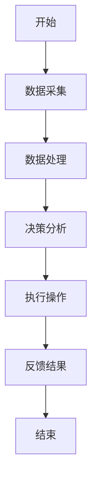

                 


# 智能厨房水槽：AI Agent的节水与清洁指导

> **关键词**：智能厨房水槽、AI Agent、节水、清洁、智能家居  
> **摘要**：本文探讨了AI Agent在智能厨房水槽中的应用，详细介绍了如何通过智能优化实现节水和清洁的目标。通过系统分析和架构设计，结合实际案例和项目实战，为读者提供了全面的技术指导和实践方案。

---

## 第一部分: 智能厨房水槽与AI Agent概述

### 第1章: 智能厨房水槽的背景与意义

#### 1.1 智能厨房水槽的发展背景
##### 1.1.1 厨房水槽的演变历程
厨房水槽作为日常生活中的必备工具，经历了从简单洗涤容器到智能化设备的演变。早期的水槽主要用于清洗餐具和食材，随着科技的发展，智能水槽逐渐融入传感器、物联网和人工智能技术，具备了节水、清洁和自动化管理的功能。

##### 1.1.2 智能化趋势的推动因素
智能化厨房设备的普及主要由以下几个因素推动：
- **技术进步**：传感器、AI和物联网技术的成熟为智能水槽的发展提供了基础。
- **环保需求**：节水和节能成为全球关注的焦点，推动了智能水槽的市场需求。
- **用户体验提升**：智能化设备能够提供更便捷、高效的使用体验。

##### 1.1.3 节水与清洁的重要性
厨房水槽的使用与水资源的消耗密切相关。据统计，家庭用水中约有30%来自厨房水槽。通过智能优化，可以有效减少水浪费，同时提升清洁效率，减少化学清洁剂的使用，降低对环境的负担。

---

#### 1.2 AI Agent的核心概念
##### 1.2.1 人工智能代理的基本定义
AI Agent（人工智能代理）是一种能够感知环境并采取行动以实现目标的智能实体。在智能厨房水槽中，AI Agent负责采集数据、分析信息并执行优化操作。

##### 1.2.2 AI Agent在厨房水槽中的应用场景
AI Agent在智能厨房水槽中的主要应用包括：
- **节水优化**：通过分析用水习惯，优化水流控制，减少浪费。
- **智能清洁**：根据污垢情况自动调整清洁模式，提高清洁效率。
- **故障诊断**：通过数据分析，快速识别设备故障并提供解决方案。

##### 1.2.3 节水与清洁的智能化目标
智能化的目标是通过AI Agent实现以下功能：
- **实时监控**：实时监测水槽的使用状态，包括水温、水量、污垢程度等。
- **智能决策**：基于监测数据，优化用水和清洁方案。
- **用户反馈**：通过人机交互，提供个性化建议，提升用户体验。

---

#### 1.3 本书的核心目标与结构
##### 1.3.1 本书的核心目标
本书旨在通过技术分析和实践指导，帮助读者理解AI Agent在智能厨房水槽中的应用，掌握节水和清洁的核心技术，实现智能化管理。

##### 1.3.2 目录结构概述
本书内容分为三部分：
1. **概述与核心技术**：介绍智能水槽的背景、AI Agent的概念及其在节水和清洁中的应用。
2. **系统设计与实现**：详细讲解算法原理、系统架构和功能实现。
3. **项目实战与拓展**：通过实际案例，指导读者进行系统搭建和优化。

##### 1.3.3 预期读者群体
本书适合以下读者阅读：
- 对智能家居和AI技术感兴趣的读者。
- 厨房设备制造商和研发人员。
- 对节水和环保技术感兴趣的读者。

---

### 第2章: 智能厨房水槽的核心技术

#### 2.1 AI Agent的基本原理
##### 2.1.1 代理的感知与决策机制
AI Agent通过传感器感知环境数据（如水流、温度、污垢等），利用算法进行分析和决策，执行相应的操作（如调整水流、启动清洁模式等）。

##### 2.1.2 基于传感器的数据采集
智能水槽配备了多种传感器，包括：
- **水量传感器**：监测水流速度和流量。
- **温度传感器**：检测水温，优化清洁和消毒。
- **污垢传感器**：通过光学或化学传感器检测污垢程度。

##### 2.1.3 数据分析与优化算法
AI Agent通过机器学习算法对数据进行分析，优化节水和清洁策略。常用算法包括：
- **强化学习**：通过奖励机制优化决策。
- **聚类分析**：将相似的用水习惯分组，提供个性化建议。

---

#### 2.2 节水与清洁的实现方法
##### 2.2.1 节水技术的核心原理
节水技术主要通过以下方式实现：
- **智能控制**：根据实际需求调整水流，避免过度用水。
- **循环利用**：将废水处理后循环使用，减少新鲜水的消耗。

##### 2.2.2 清洁技术的创新点
智能水槽的清洁技术包括：
- **自动清洁模式**：根据污垢程度自动启动清洁程序。
- **高效清洁剂**：使用环保清洁剂，减少化学污染。

##### 2.2.3 节水与清洁的协同优化
通过AI Agent的协同优化，智能水槽能够在节水的同时实现高效的清洁效果，避免因过度清洁导致的水资源浪费。

---

#### 2.3 系统架构与功能模块
##### 2.3.1 系统整体架构
智能厨房水槽的系统架构分为以下几个层次：
1. **感知层**：包括传感器和数据采集模块。
2. **决策层**：AI Agent负责数据分析和决策。
3. **执行层**：控制水流、清洁设备等物理装置。

##### 2.3.2 功能模块划分
主要功能模块包括：
- **数据采集模块**：采集水槽的使用数据。
- **决策控制模块**：基于数据进行决策并发出指令。
- **用户交互模块**：提供人机交互界面，反馈系统状态。

##### 2.3.3 模块间的交互关系
模块间的交互关系如下：
1. 数据采集模块将传感器数据传递给决策控制模块。
2. 决策控制模块根据数据生成决策，并将指令传递给执行模块。
3. 执行模块执行操作后，将状态反馈给决策控制模块和用户交互模块。

---

### 第3章: AI Agent的算法原理

#### 3.1 数据采集与处理
##### 3.1.1 传感器数据的采集流程
传感器数据采集流程如下：
1. **数据采集**：传感器实时采集水槽的使用数据。
2. **数据预处理**：对采集的数据进行清洗和转换。
3. **数据存储**：将处理后的数据存储到数据库中。

##### 3.1.2 数据预处理与特征提取
数据预处理包括：
- **去噪处理**：去除传感器噪声。
- **特征提取**：提取关键特征，如水流速度、温度等。

##### 3.1.3 数据存储与管理
数据存储采用数据库技术，支持高效查询和管理。

---

#### 3.2 节水与清洁的优化算法
##### 3.2.1 基于强化学习的优化策略
强化学习通过奖励机制优化决策。例如，当AI Agent成功优化用水量时，给予正向奖励，反之则给予负向奖励。

##### 3.2.2 节水算法的数学模型
节水算法的数学模型如下：
$$
\text{优化目标} = \min_{x} \text{用水量}(x) \\
\text{约束条件}：满足清洁需求
$$

##### 3.2.3 清洁算法的实现步骤
清洁算法的实现步骤包括：
1. **污垢检测**：通过传感器检测污垢程度。
2. **清洁模式选择**：根据污垢程度选择合适的清洁模式。
3. **执行清洁**：启动清洁设备，完成清洁任务。

---

#### 3.3 算法实现的流程图
以下是节水与清洁算法的流程图：



---

### 第4章: 系统架构与设计

#### 4.1 系统功能设计
##### 4.1.1 用户界面设计
用户界面设计注重简洁性和易用性，提供以下功能：
- **状态显示**：显示当前水槽的使用状态。
- **模式选择**：用户可以选择节水模式或清洁模式。
- **历史记录**：显示用水和清洁的历史数据。

##### 4.1.2 功能模块划分
功能模块包括：
- **数据采集模块**：采集水槽数据。
- **决策控制模块**：分析数据并发出指令。
- **执行模块**：控制水槽的物理设备。

##### 4.1.3 功能实现流程
功能实现流程如下：
1. 用户通过界面选择模式。
2. 系统采集数据并进行分析。
3. AI Agent发出指令，执行相应的操作。

---

#### 4.2 系统架构设计
##### 4.2.1 分层架构设计
系统架构采用分层设计，包括：
1. **感知层**：传感器和数据采集模块。
2. **网络层**：数据传输和通信模块。
3. **应用层**：AI Agent和决策控制模块。
4. **执行层**：物理设备和执行机构。

##### 4.2.2 模块间的依赖关系
模块间的依赖关系如下：
- 数据采集模块依赖传感器。
- 决策控制模块依赖数据处理模块。
- 执行模块依赖决策控制模块。

##### 4.2.3 系统扩展性设计
系统设计预留扩展接口，支持未来功能的增加和升级。

---

#### 4.3 接口与交互设计
##### 4.3.1 系统接口定义
系统接口包括：
- **数据接口**：传感器数据的输入接口。
- **控制接口**：对水槽设备的控制接口。
- **用户接口**：与用户的交互界面。

##### 4.3.2 用户与系统的交互流程
用户与系统的交互流程如下：
1. 用户通过界面选择功能。
2. 系统接收指令并处理。
3. 系统执行操作并反馈结果。

##### 4.3.3 系统反馈机制
系统通过反馈机制实时更新状态，确保用户能够及时了解设备运行情况。

---

## 第二部分: 项目实战与实现

### 第5章: 项目实战与实现

#### 5.1 环境搭建与工具安装
##### 5.1.1 开发环境的选择
推荐使用Python和相关AI框架（如TensorFlow、Keras）进行开发。

##### 5.1.2 必要工具的安装
安装必要的工具和库，如：
- **Python**：编程语言。
- **TensorFlow**：机器学习框架。
- **Mermaid**：流程图工具。

##### 5.1.3 代码仓库的初始化
使用版本控制工具（如Git）初始化代码仓库，方便团队协作和代码管理。

---

#### 5.2 核心代码实现
##### 5.2.1 核心算法实现
以下是节水优化算法的Python代码示例：

```python
import numpy as np
from sklearn.metrics import mean_squared_error

def optimize_water_usage(data):
    # 数据预处理
    processed_data = data.dropna()
    
    # 模型训练
    model = tf.keras.Sequential([
        tf.keras.layers.Dense(64, activation='relu'),
        tf.keras.layers.Dense(1)
    ])
    model.compile(optimizer='adam', loss='mean_squared_error')
    model.fit(processed_data, epochs=100, batch_size=32)
    
    # 模型预测
    predicted_usage = model.predict(processed_data)
    
    return predicted_usage
```

##### 5.2.2 系统功能实现
以下是用户界面的实现代码：

```python
import tkinter as tk

def create_interface():
    root = tk.Tk()
    root.title("智能厨房水槽")
    
    # 状态显示
    status_label = tk.Label(root, text="当前状态：待机")
    status_label.pack()
    
    # 模式选择
    mode_var = tk.StringVar(root)
    mode_var.set("节水模式")
    mode_menu = tk.OptionMenu(root, mode_var, ["节水模式", "清洁模式"])
    mode_menu.pack()
    
    # 反馈结果
    result_label = tk.Label(root, text="操作结果：")
    result_label.pack()
    
    root.mainloop()

create_interface()
```

---

#### 5.3 系统测试与优化
##### 5.3.1 系统测试
测试内容包括：
- **功能测试**：验证各功能模块是否正常运行。
- **性能测试**：评估系统的处理速度和稳定性。
- **用户体验测试**：收集用户反馈，优化界面和操作流程。

##### 5.3.2 系统优化
根据测试结果，优化系统性能和用户体验。

---

#### 5.4 项目总结
通过项目实战，我们验证了AI Agent在智能厨房水槽中的应用可行性，同时积累了宝贵的经验，为后续的优化和升级提供了参考。

---

## 第三部分: 最佳实践与拓展

### 第6章: 最佳实践与拓展

#### 6.1 使用建议
- **定期维护**：定期检查传感器和设备，确保系统正常运行。
- **数据备份**：备份重要数据，防止数据丢失。
- **软件更新**：及时更新系统软件，获取最新的功能和优化。

#### 6.2 小结
通过本文的介绍和实践，我们深入探讨了AI Agent在智能厨房水槽中的应用，掌握了节水和清洁的核心技术。

#### 6.3 注意事项
- **安全性**：确保系统运行的安全性，防止数据泄露。
- **兼容性**：确保系统与各种设备和环境的兼容性。

#### 6.4 拓展阅读
推荐以下拓展阅读材料：
- 《人工智能入门》
- 《智能家居系统设计》
- 《节水技术与环保》

---

# 结语
智能厨房水槽作为智能家居的重要组成部分，通过AI Agent的优化，实现了节水与清洁的目标。未来，随着技术的不断进步，智能厨房水槽将具备更多功能，为用户带来更便捷、高效的使用体验。

--- 

# END

