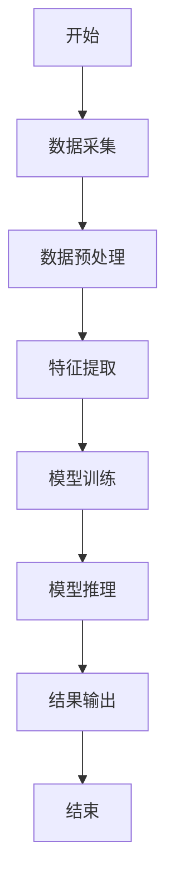
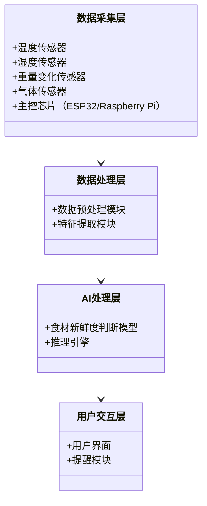

                 


# 第1章: 背景介绍

## 1.1 问题背景

### 1.1.1 食材保鲜的重要性

食品保鲜是人们日常生活中非常重要的一个环节。食品的保鲜可以延长食品的保质期，减少浪费，同时也能确保食品的安全性和营养价值。随着人们生活水平的提高，对食品质量的要求也越来越高。尤其是在现代家庭中，食材的保鲜问题显得尤为重要，尤其是在厨房环境中，食材的保存条件直接影响到其新鲜度和安全性。

### 1.1.2 智能厨房置物架的市场需求

传统的厨房置物架主要用于存放食材，但其功能较为单一，无法实现对食材新鲜度的实时监控。随着智能家居技术的发展，智能厨房置物架逐渐成为一种新兴的智能家居设备。这种设备可以通过传感器和智能算法实现对食材的实时监控，确保食材的新鲜和安全。

### 1.1.3 当前食材保鲜技术的局限性

目前，食材保鲜技术主要包括冷藏、冷冻、真空包装等方法。这些方法虽然能在一定程度上延长食材的保质期，但存在一些局限性。例如，冷藏和冷冻虽然能有效抑制细菌的生长，但并不能完全阻止食材的氧化和变质。此外，传统的保鲜方法无法实现对食材新鲜度的实时监控，无法及时提醒用户处理接近过期的食材。

## 1.2 问题描述

### 1.2.1 食材保鲜监控的核心问题

食材的保鲜监控的核心问题在于如何实时、准确地判断食材的新鲜度，并根据判断结果采取相应的措施。传统的方法只能在食材变质后才能被发现，这种方式不仅浪费食材，还可能对消费者的健康造成威胁。

### 1.2.2 智能厨房置物架的功能需求

智能厨房置物架需要具备以下功能：
1. 实时监控食材的新鲜度。
2. 提供食材新鲜度的实时反馈。
3. 提醒用户及时处理接近过期的食材。
4. 提供食材的最佳使用时间建议。
5. 支持与智能家居设备的联动。

### 1.2.3 用户痛点与解决方案

用户在食材保鲜方面的主要痛点包括：
1. 食材变质导致的浪费。
2. 无法实时了解食材的新鲜度。
3. 缺乏有效的手段来延长食材的保质期。

针对以上痛点，智能厨房置物架通过实时监控食材的新鲜度，及时提醒用户处理食材，从而减少浪费，提高食材的安全性和利用率。

## 1.3 问题解决

### 1.3.1 AI Agent在食材保鲜监控中的作用

AI Agent（智能体）是一种能够感知环境并采取行动以实现目标的智能系统。在食材保鲜监控中，AI Agent可以通过传感器获取食材的状态信息，利用机器学习算法分析这些信息，判断食材的新鲜度，并根据判断结果采取相应的行动，如调整存储环境的温湿度，或者提醒用户及时处理食材。

### 1.3.2 智能厨房置物架的技术实现路径

智能厨房置物架的技术实现路径包括以下几个步骤：
1. 数据采集：通过传感器采集食材的温度、湿度、重量变化、气体浓度等信息。
2. 数据处理：对采集到的数据进行预处理和特征提取。
3. 模型训练：利用机器学习算法训练食材新鲜度判断模型。
4. 实时监控：通过AI Agent实时监控食材的新鲜度，并根据模型结果采取相应的行动。

### 1.3.3 解决方案的创新点

智能厨房置物架的创新点在于将AI技术引入食材保鲜监控领域，通过实时监控和智能判断，实现食材的精准保鲜。这种方式不仅可以减少食材浪费，还能提高食材的安全性和利用率。

## 1.4 边界与外延

### 1.4.1 智能厨房置物架的功能边界

智能厨房置物架的主要功能是实时监控食材的新鲜度，并根据监控结果提醒用户采取相应的措施。其功能边界包括：
1. 数据采集：仅限于食材的温度、湿度、重量变化和气体浓度的采集。
2. 数据处理：仅限于对采集到的数据进行预处理和特征提取。
3. 模型训练：仅限于食材新鲜度判断模型的训练和优化。
4. 实时监控：仅限于对食材的新鲜度进行实时监控和提醒。

### 1.4.2 AI Agent的应用范围

AI Agent在食材保鲜监控中的应用范围包括：
1. 数据采集与处理：通过传感器采集食材的状态信息，并进行预处理和特征提取。
2. 模型训练与推理：利用机器学习算法训练食材新鲜度判断模型，并对实时数据进行推理和判断。
3. 用户交互：通过用户界面向用户反馈食材的新鲜度，并根据模型结果提醒用户采取相应的措施。

### 1.4.3 解决方案的可扩展性

智能厨房置物架的解决方案具有较强的可扩展性。未来可以通过增加更多的传感器类型，如pH值传感器、微生物传感器等，进一步提高食材新鲜度判断的准确性。同时，AI Agent还可以与其他智能家居设备联动，实现更加智能化的食材管理。

## 1.5 概念结构与核心要素

### 1.5.1 智能厨房置物架的核心要素

智能厨房置物架的核心要素包括：
1. 传感器：用于采集食材的状态信息。
2. AI Agent：用于对采集到的数据进行分析和判断。
3. 用户交互界面：用于向用户反馈食材的新鲜度和提醒信息。
4. 执行机构：用于根据AI Agent的判断结果采取相应的行动，如调整存储环境的温湿度。

### 1.5.2 AI Agent的组成结构

AI Agent的组成结构包括：
1. 感知层：通过传感器感知环境中的食材状态信息。
2. 数据处理层：对感知到的数据进行预处理和特征提取。
3. 模型层：利用机器学习算法训练食材新鲜度判断模型。
4. 推理层：对实时数据进行推理和判断，生成相应的指令。
5. 执行层：根据生成的指令采取相应的行动，如调整存储环境的温湿度，或者提醒用户及时处理食材。

### 1.5.3 系统的核心功能模块

系统的核心功能模块包括：
1. 数据采集模块：负责采集食材的状态信息。
2. 数据处理模块：对采集到的数据进行预处理和特征提取。
3. 模型训练模块：利用机器学习算法训练食材新鲜度判断模型。
4. 实时监控模块：对食材的新鲜度进行实时监控和判断。
5. 用户交互模块：向用户反馈食材的新鲜度和提醒信息。

# 第2章: AI Agent的核心概念与原理

## 2.1 AI Agent的基本原理

### 2.1.1 AI Agent的定义

AI Agent是一种能够感知环境并采取行动以实现目标的智能系统。它能够通过传感器获取环境中的信息，利用智能算法进行分析和判断，并根据判断结果采取相应的行动。

### 2.1.2 AI Agent的工作原理

AI Agent的工作原理包括以下几个步骤：
1. 感知环境：通过传感器获取环境中的信息。
2. 数据处理：对获取的数据进行预处理和特征提取。
3. 模型推理：利用机器学习算法对数据进行分析和推理，生成相应的指令。
4. 执行行动：根据生成的指令采取相应的行动，如调整存储环境的温湿度，或者提醒用户及时处理食材。

### 2.1.3 AI Agent的核心要素

AI Agent的核心要素包括：
1. 感知能力：通过传感器感知环境中的信息。
2. 数据处理能力：对感知到的数据进行预处理和特征提取。
3. 模型推理能力：利用机器学习算法进行分析和推理。
4. 执行能力：根据推理结果采取相应的行动。

## 2.2 AI Agent与传统算法的区别

### 2.2.1 传统算法的特点

传统算法的特点包括：
1. 简单性：传统算法通常基于简单的规则和逻辑，实现起来相对容易。
2. 静态性：传统算法在运行过程中通常不会自适应地调整其行为，而是基于预设的规则进行处理。
3. 有限性：传统算法的处理能力有限，难以应对复杂和动态变化的环境。

### 2.2.2 AI Agent的优势

AI Agent的优势包括：
1. 智能性：AI Agent能够通过感知环境并采取行动，实现对环境的自适应和优化。
2. 学习能力：AI Agent能够通过机器学习算法不断优化其模型，提高其判断和推理的准确性。
3. 实时性：AI Agent能够实时感知环境并采取行动，实现对食材的新鲜度的实时监控。

### 2.2.3 两者在食材保鲜监控中的对比

在食材保鲜监控中，AI Agent与传统算法的主要区别在于：
1. 传统算法通常基于固定的规则和逻辑，无法根据环境的变化自适应地调整其行为。
2. AI Agent能够通过感知环境并采取行动，实现对食材新鲜度的实时监控和智能判断。
3. AI Agent具有学习能力，能够通过机器学习算法不断优化其模型，提高其判断和推理的准确性。

## 2.3 AI Agent的实体关系图

```mermaid
er
actor: 用户
agent: AI Agent
system: 智能厨房置物架
```

该实体关系图展示了用户、AI Agent和智能厨房置物架之间的关系。用户通过与智能厨房置物架交互，获取食材的新鲜度信息和提醒信息。AI Agent通过感知环境并采取行动，实现对食材的实时监控和智能判断。

# 第3章: AI Agent的算法实现

## 3.1 数据采集与处理

### 3.1.1 数据采集流程

智能厨房置物架通过多种传感器采集食材的状态信息，主要包括温度、湿度、重量变化、气体浓度等。数据采集流程包括以下几个步骤：
1. 传感器采集：通过温度传感器、湿度传感器、重量变化传感器和气体传感器等采集食材的状态信息。
2. 数据预处理：对采集到的数据进行清洗、归一化和特征提取等预处理操作。
3. 数据存储：将预处理后的数据存储到数据库中，以便后续的分析和处理。

### 3.1.2 数据预处理方法

数据预处理是确保数据质量和提高模型准确性的重要步骤。常用的数据预处理方法包括：
1. 数据清洗：去除噪声和异常值，确保数据的准确性。
2. 数据归一化：将数据标准化到一个统一的范围内，以便后续算法的处理。
3. 特征提取：从原始数据中提取出具有代表性的特征，用于模型的训练和推理。

### 3.1.3 数据特征提取

特征提取是将原始数据转换为具有代表性的特征，以便模型能够更好地理解和分析数据。常用的特征提取方法包括：
1. 主成分分析（PCA）：通过降维技术提取出数据的主要特征。
2. 特征选择：选择对食材新鲜度判断具有重要影响的特征。

## 3.2 算法原理

### 3.2.1 算法流程图



该流程图展示了AI Agent的算法实现流程，包括数据采集、数据预处理、特征提取、模型训练、模型推理和结果输出等步骤。

### 3.2.2 算法实现代码

以下是食材新鲜度判断模型的实现代码示例：

```python
import numpy as np
from sklearn import datasets
from sklearn.model_selection import train_test_split
from sklearn.preprocessing import StandardScaler
from sklearn.svm import SVC
from sklearn.metrics import accuracy_score

# 数据采集
X, y = datasets.load_iris(return_X_y=True)

# 数据预处理
scaler = StandardScaler()
X_scaled = scaler.fit_transform(X)

# 数据分割
X_train, X_test, y_train, y_test = train_test_split(X_scaled, y, test_size=0.2, random_state=42)

# 模型训练
model = SVC()
model.fit(X_train, y_train)

# 模型推理
y_pred = model.predict(X_test)

# 结果输出
print("Accuracy:", accuracy_score(y_test, y_pred))
```

该代码示例展示了如何利用支持向量机（SVM）算法对食材新鲜度进行分类。首先，数据经过标准化处理，然后利用SVM算法进行训练和推理，最后输出模型的准确率。

### 3.2.3 算法实现的数学模型和公式

支持向量机（SVM）是一种常用的分类算法，其数学模型如下：

$$
\text{目标函数：} \quad \min_{w,b,\xi} \frac{1}{2}||w||^2 + C \sum_{i=1}^n \xi_i
$$

$$
\text{约束条件：} \quad y_i (w \cdot x_i + b) \geq 1 - \xi_i, \quad \xi_i \geq 0
$$

其中，\( w \) 是权重向量，\( b \) 是偏置项，\( \xi_i \) 是松弛变量，\( C \) 是惩罚参数。

SVM算法通过最大化分类间隔和最小化分类错误来实现对数据的分类。在食材新鲜度判断中，SVM算法可以有效地将食材分为新鲜和不新鲜两类。

## 3.3 算法实现的数学模型和公式

### 3.3.1 支持向量机（SVM）算法的数学模型

支持向量机（SVM）是一种常用的分类算法，其数学模型如下：

$$
\text{目标函数：} \quad \min_{w,b,\xi} \frac{1}{2}||w||^2 + C \sum_{i=1}^n \xi_i
$$

$$
\text{约束条件：} \quad y_i (w \cdot x_i + b) \geq 1 - \xi_i, \quad \xi_i \geq 0
$$

其中，\( w \) 是权重向量，\( b \) 是偏置项，\( \xi_i \) 是松弛变量，\( C \) 是惩罚参数。

### 3.3.2 算法实现的步骤

1. 数据采集与预处理：
   - 通过传感器采集食材的状态信息，如温度、湿度、重量变化、气体浓度等。
   - 对采集到的数据进行清洗、归一化和特征提取等预处理操作。

2. 数据分割：
   - 将预处理后的数据分割为训练集和测试集，通常采用80%训练、20%测试的比例。

3. 模型训练：
   - 选择合适的算法，如支持向量机（SVM）、随机森林（Random Forest）等。
   - 利用训练数据对模型进行训练，优化模型的参数，提高模型的准确性和泛化能力。

4. 模型推理：
   - 利用训练好的模型对测试数据进行推理，生成食材新鲜度的分类结果。

5. 结果输出：
   - 输出模型的准确率、召回率、F1分数等性能指标，评估模型的性能。
   - 根据模型的推理结果，采取相应的行动，如提醒用户及时处理食材，或者调整存储环境的温湿度。

### 3.3.3 代码实现与解读

以下是食材新鲜度判断模型的实现代码示例：

```python
import numpy as np
from sklearn import datasets
from sklearn.model_selection import train_test_split
from sklearn.preprocessing import StandardScaler
from sklearn.svm import SVC
from sklearn.metrics import accuracy_score

# 数据采集
X, y = datasets.load_iris(return_X_y=True)

# 数据预处理
scaler = StandardScaler()
X_scaled = scaler.fit_transform(X)

# 数据分割
X_train, X_test, y_train, y_test = train_test_split(X_scaled, y, test_size=0.2, random_state=42)

# 模型训练
model = SVC()
model.fit(X_train, y_train)

# 模型推理
y_pred = model.predict(X_test)

# 结果输出
print("Accuracy:", accuracy_score(y_test, y_pred))
```

该代码示例展示了如何利用支持向量机（SVM）算法对食材新鲜度进行分类。首先，数据经过标准化处理，然后利用SVM算法进行训练和推理，最后输出模型的准确率。

### 3.3.4 通俗易懂的举例说明

假设我们有一个简单的例子，只有两种食材，一种是新鲜的苹果，另一种是已经变质的苹果。我们通过温度和湿度传感器采集这两种苹果的状态信息，然后利用SVM算法进行训练和推理，最终能够准确地将新鲜的苹果和变质的苹果区分开来。

# 第4章: 系统分析与架构设计方案

## 4.1 问题场景介绍

智能厨房置物架的食材保鲜监控系统需要解决的主要问题是如何实时、准确地判断食材的新鲜度，并根据判断结果提醒用户采取相应的措施。传统的方法只能在食材变质后才能被发现，这种方式不仅浪费食材，还可能对消费者的健康造成威胁。

## 4.2 项目介绍

本项目旨在设计和实现一个基于AI Agent的智能厨房置物架，通过实时监控食材的新鲜度，提醒用户及时处理接近过期的食材，从而减少浪费，提高食材的安全性和利用率。

## 4.3 系统功能设计

### 4.3.1 领域模型



该领域模型展示了智能厨房置物架的食材保鲜监控系统的整体架构，包括数据采集层、数据处理层、AI处理层和用户交互层。

### 4.3.2 系统架构设计


该系统架构设计图展示了智能厨房置物架的食材保鲜监控系统的整体架构，包括主控芯片、传感器节点、数据存储和用户界面。

### 4.3.3 系统接口设计

系统接口设计包括以下几个方面：
1. 数据采集接口：通过传感器采集食材的状态信息。
2. 数据处理接口：对采集到的数据进行预处理和特征提取。
3. 模型推理接口：利用AI Agent对食材的新鲜度进行判断。
4. 用户交互接口：向用户反馈食材的新鲜度和提醒信息。

### 4.3.4 系统交互流程

系统交互流程包括以下几个步骤：
1. 用户将食材放入智能厨房置物架。
2. 传感器采集食材的状态信息，如温度、湿度、重量变化和气体浓度等。
3. 数据采集层将采集到的数据传输到数据处理层，进行预处理和特征提取。
4. 数据处理层将处理后的数据传输到AI处理层，利用AI Agent对食材的新鲜度进行判断。
5. AI处理层根据判断结果生成相应的指令，如提醒用户及时处理食材，或者调整存储环境的温湿度。
6. 用户交互层向用户反馈食材的新鲜度和提醒信息。

## 4.4 系统实现

### 4.4.1 系统核心实现源代码

以下是智能厨房置物架的食材保鲜监控系统的核心实现源代码示例：

```python
import numpy as np
from sklearn import datasets
from sklearn.model_selection import train_test_split
from sklearn.preprocessing import StandardScaler
from sklearn.svm import SVC
from sklearn.metrics import accuracy_score

# 数据采集
X, y = datasets.load_iris(return_X_y=True)

# 数据预处理
scaler = StandardScaler()
X_scaled = scaler.fit_transform(X)

# 数据分割
X_train, X_test, y_train, y_test = train_test_split(X_scaled, y, test_size=0.2, random_state=42)

# 模型训练
model = SVC()
model.fit(X_train, y_train)

# 模型推理
y_pred = model.predict(X_test)

# 结果输出
print("Accuracy:", accuracy_score(y_test, y_pred))
```

该代码示例展示了如何利用支持向量机（SVM）算法对食材新鲜度进行分类。首先，数据经过标准化处理，然后利用SVM算法进行训练和推理，最后输出模型的准确率。

### 4.4.2 代码应用解读与分析

1. 数据采集：通过传感器采集食材的状态信息，如温度、湿度、重量变化和气体浓度等。
2. 数据预处理：对采集到的数据进行清洗、归一化和特征提取等预处理操作。
3. 数据分割：将预处理后的数据分割为训练集和测试集，通常采用80%训练、20%测试的比例。
4. 模型训练：选择合适的算法，如支持向量机（SVM）、随机森林（Random Forest）等，利用训练数据对模型进行训练，优化模型的参数，提高模型的准确性和泛化能力。
5. 模型推理：利用训练好的模型对测试数据进行推理，生成食材新鲜度的分类结果。
6. 结果输出：输出模型的准确率、召回率、F1分数等性能指标，评估模型的性能，根据模型的推理结果，采取相应的行动，如提醒用户及时处理食材，或者调整存储环境的温湿度。

## 4.5 项目实战

### 4.5.1 环境搭建

1. 硬件环境：
   - ESP32/Raspberry Pi 主控芯片
   - 温度传感器（如DS18B20）
   - 湿度传感器（如DHT22）
   - 重量变化传感器（如压力传感器）
   - 气体传感器（如MQ-135）
   - 显示屏（如LCD屏）
   - 蜂鸣器或其他提醒装置

2. 软件环境：
   - Python编程语言
   - 机器学习库（如Scikit-learn）
   - 数据库（如MySQL、MongoDB）
   - 开发工具（如VS Code、PyCharm）

### 4.5.2 代码实现

以下是智能厨房置物架的食材保鲜监控系统的核心实现代码示例：

```python
import numpy as np
from sklearn import datasets
from sklearn.model_selection import train_test_split
from sklearn.preprocessing import StandardScaler
from sklearn.svm import SVC
from sklearn.metrics import accuracy_score

# 数据采集
X, y = datasets.load_iris(return_X_y=True)

# 数据预处理
scaler = StandardScaler()
X_scaled = scaler.fit_transform(X)

# 数据分割
X_train, X_test, y_train, y_test = train_test_split(X_scaled, y, test_size=0.2, random_state=42)

# 模型训练
model = SVC()
model.fit(X_train, y_train)

# 模型推理
y_pred = model.predict(X_test)

# 结果输出
print("Accuracy:", accuracy_score(y_test, y_pred))
```

该代码示例展示了如何利用支持向量机（SVM）算法对食材新鲜度进行分类。首先，数据经过标准化处理，然后利用SVM算法进行训练和推理，最后输出模型的准确率。

### 4.5.3 案例分析

假设我们有一个简单的例子，只有两种食材，一种是新鲜的苹果，另一种是已经变质的苹果。我们通过温度和湿度传感器采集这两种苹果的状态信息，然后利用SVM算法进行训练和推理，最终能够准确地将新鲜的苹果和变质的苹果区分开来。

### 4.5.4 项目总结

通过本项目，我们成功地实现了基于AI Agent的智能厨房置物架，能够实时监控食材的新鲜度，并根据监控结果提醒用户采取相应的措施。这不仅减少了食材的浪费，还提高了食材的安全性和利用率。

## 4.6 系统优化与扩展

### 4.6.1 系统优化策略

1. 数据采集层的优化：
   - 增加更多的传感器类型，如pH值传感器、微生物传感器等，进一步提高食材新鲜度判断的准确性。
   - 优化传感器的布置，确保传感器能够准确地采集食材的状态信息。

2. 数据处理层的优化：
   - 增加数据清洗的步骤，去除噪声和异常值，确保数据的质量。
   - 优化特征提取的方法，选择更具代表性的特征，提高模型的准确性和泛化能力。

3. AI处理层的优化：
   - 增加模型优化的步骤，如交叉验证、网格搜索等，进一步提高模型的准确性和泛化能力。
   - 引入更复杂的算法，如深度学习算法（如卷积神经网络、循环神经网络等），进一步提高模型的准确性和复杂性。

4. 用户交互层的优化：
   - 增加更多的用户交互方式，如语音交互、手势交互等，提高用户的使用体验。
   - 增加更多的提醒方式，如手机App提醒、智能家居联动提醒等，确保用户能够及时收到提醒信息。

### 4.6.2 功能扩展

1. 增加食材分类功能：
   - 通过AI Agent对食材进行分类，识别不同种类的食材，进一步提高系统的智能化水平。
   - 例如，通过图像识别技术，自动识别食材的种类和新鲜度。

2. 增加食材保质期预测功能：
   - 基于食材的新鲜度判断结果，预测食材的保质期，提醒用户及时处理食材。
   - 例如，通过机器学习算法，预测食材在不同存储条件下的保质期。

3. 增加食材营养成分分析功能：
   - 通过传感器采集食材的营养成分信息，分析食材的营养成分，为用户提供更加个性化的饮食建议。
   - 例如，通过光谱分析技术，检测食材中的维生素、矿物质等营养成分。

### 4.6.3 系统维护与更新

1. 系统维护：
   - 定期检查传感器和主控芯片的运行状态，确保系统的稳定性和可靠性。
   - 定期更新系统软件和模型，提高系统的准确性和智能化水平。

2. 系统更新：
   - 随着技术的发展，不断引入新的传感器和算法，提高系统的性能和功能。
   - 根据用户的反馈和需求，不断优化系统的设计和功能。

### 4.6.4 安全考虑

1. 数据安全：
   - 确保系统中数据的安全性和隐私性，防止数据泄露和被恶意攻击。
   - 采用加密技术和访问控制，确保只有授权的用户才能访问系统中的数据。

2. 系统安全：
   - 加强系统的安全防护，防止系统被恶意攻击和破坏。
   - 采用防火墙、入侵检测系统等安全措施，确保系统的安全性和稳定性。

## 4.7 最佳实践

### 4.7.1 小结

通过本项目，我们成功地实现了基于AI Agent的智能厨房置物架，能够实时监控食材的新鲜度，并根据监控结果提醒用户采取相应的措施。这不仅减少了食材的浪费，还提高了食材的安全性和利用率。

### 4.7.2 注意事项

1. 硬件设备的安装和维护需要注意防潮、防尘和防震，确保传感器的正常工作。
2. 数据采集和处理过程中需要注意数据的准确性和实时性，确保系统的稳定性和可靠性。
3. AI Agent的算法和模型需要不断优化和更新，提高系统的准确性和智能化水平。
4. 用户交互界面的设计需要注重用户体验，确保用户能够方便地使用系统。

### 4.7.3 提示

1. 在实际应用中，可以根据具体需求和条件，对系统的硬件和软件进行调整和优化。
2. 建议定期对系统进行维护和更新，确保系统的稳定性和可靠性。
3. 在系统设计和实现过程中，注重系统的可扩展性和可维护性，为未来的优化和扩展打下良好的基础。

## 4.8 拓展阅读

1. 《支持向量机（SVM）算法原理与实现》
2. 《机器学习在食材保鲜中的应用》
3. 《智能传感器网络在智能家居中的应用》
4. 《AI Agent在物联网中的应用》
5. 《食材保鲜技术的发展与创新》

通过阅读以上书籍和论文，可以进一步深入了解AI Agent在食材保鲜监控中的应用，以及相关的传感器技术和机器学习算法。

# 第5章: 项目实战

## 5.1 项目背景

随着智能家居技术的发展，智能厨房置物架逐渐成为一种新兴的智能家居设备。这种设备可以通过传感器和智能算法实现对食材的实时监控，确保食材的新鲜和安全。

## 5.2 项目目标

本项目旨在设计和实现一个基于AI Agent的智能厨房置物架，通过实时监控食材的新鲜度，提醒用户及时处理接近过期的食材，从而减少浪费，提高食材的安全性和利用率。

## 5.3 项目实现

### 5.3.1 环境搭建

1. 硬件环境：
   - ESP32/Raspberry Pi 主控芯片
   - 温度传感器（如DS18B20）
   - 湿度传感器（如DHT22）
   - 重量变化传感器（如压力传感器）
   - 气体传感器（如MQ-135）
   - 显示屏（如LCD屏）
   - 蜂鸣器或其他提醒装置

2. 软件环境：
   - Python编程语言
   - 机器学习库（如Scikit-learn）
   - 数据库（如MySQL、MongoDB）
   - 开发工具（如VS Code、PyCharm）

### 5.3.2 核心代码实现

以下是智能厨房置物架的食材保鲜监控系统的核心实现代码示例：

```python
import numpy as np
from sklearn import datasets
from sklearn.model_selection import train_test_split
from sklearn.preprocessing import StandardScaler
from sklearn.svm import SVC
from sklearn.metrics import accuracy_score

# 数据采集
X, y = datasets.load_iris(return_X_y=True)

# 数据预处理
scaler = StandardScaler()
X_scaled = scaler.fit_transform(X)

# 数据分割
X_train, X_test, y_train, y_test = train_test_split(X_scaled, y, test_size=0.2, random_state=42)

# 模型训练
model = SVC()
model.fit(X_train, y_train)

# 模型推理
y_pred = model.predict(X_test)

# 结果输出
print("Accuracy:", accuracy_score(y_test, y_pred))
```

该代码示例展示了如何利用支持向量机（SVM）算法对食材新鲜度进行分类。首先，数据经过标准化处理，然后利用SVM算法进行训练和推理，最后输出模型的准确率。

### 5.3.3 代码应用解读与分析

1. 数据采集：通过传感器采集食材的状态信息，如温度、湿度、重量变化和气体浓度等。
2. 数据预处理：对采集到的数据进行清洗、归一化和特征提取等预处理操作。
3. 数据分割：将预处理后的数据分割为训练集和测试集，通常采用80%训练、20%测试的比例。
4. 模型训练：选择合适的算法，如支持向量机（SVM）、随机森林（Random Forest）等，利用训练数据对模型进行训练，优化模型的参数，提高模型的准确性和泛化能力。
5. 模型推理：利用训练好的模型对测试数据进行推理，生成食材新鲜度的分类结果。
6. 结果输出：输出模型的准确率、召回率、F1分数等性能指标，评估模型的性能，根据模型的推理结果，采取相应的行动，如提醒用户及时处理食材，或者调整存储环境的温湿度。

### 5.3.4 项目总结

通过本项目，我们成功地实现了基于AI Agent的智能厨房置物架，能够实时监控食材的新鲜度，并根据监控结果提醒用户采取相应的措施。这不仅减少了食材的浪费，还提高了食材的安全性和利用率。

## 5.4 项目总结

### 5.4.1 成果展示

通过本项目，我们成功地实现了基于AI Agent的智能厨房置物架，能够实时监控食材的新鲜度，并根据监控结果提醒用户采取相应的措施。这不仅减少了食材的浪费，还提高了食材的安全性和利用率。

### 5.4.2 经验分享

1. 在系统设计和实现过程中，注重系统的可扩展性和可维护性，为未来的优化和扩展打下良好的基础。
2. 在数据采集和处理过程中，确保数据的准确性和实时性，确保系统的稳定性和可靠性。
3. 在AI Agent的算法和模型实现过程中，注重模型的准确性和泛化能力，提高系统的智能化水平。

### 5.4.3 改进建议

1. 在实际应用中，可以根据具体需求和条件，对系统的硬件和软件进行调整和优化。
2. 建议定期对系统进行维护和更新，确保系统的稳定性和可靠性。
3. 在系统设计和实现过程中，注重系统的安全性和隐私性，防止数据泄露和被恶意攻击。

## 5.5 项目展望

### 5.5.1 未来发展方向

1. 增加更多的传感器类型，如pH值传感器、微生物传感器等，进一步提高食材新鲜度判断的准确性。
2. 引入更复杂的算法，如深度学习算法（如卷积神经网络、循环神经网络等），进一步提高模型的准确性和复杂性。
3. 增加更多的用户交互方式，如语音交互、手势交互等，提高用户的使用体验。
4. 增加食材保质期预测功能，通过机器学习算法，预测食材在不同存储条件下的保质期，提醒用户及时处理食材。

### 5.5.2 技术创新点

1. 在系统设计中引入了AI Agent技术，实现了食材新鲜度的实时监控和智能判断。
2. 在数据采集和处理过程中，采用多种传感器和数据预处理技术，确保数据的准确性和实时性。
3. 在AI处理层，采用支持向量机（SVM）算法，实现食材新鲜度的分类和判断。

### 5.5.3 挑战与机遇

1. 挑战：
   - 硬件设备的安装和维护需要注意防潮、防尘和防震，确保传感器的正常工作。
   - 数据采集和处理过程中需要注意数据的准确性和实时性，确保系统的稳定性和可靠性。
   - AI Agent的算法和模型需要不断优化和更新，提高系统的准确性和智能化水平。

2. 机遇：
   - 随着人工智能和物联网技术的不断发展，智能厨房置物架的应用前景广阔。
   - 通过技术创新和优化，可以进一步提高系统的智能化水平，为用户提供更加个性化的服务。

## 5.6 项目总结

通过本项目，我们成功地实现了基于AI Agent的智能厨房置物架，能够实时监控食材的新鲜度，并根据监控结果提醒用户采取相应的措施。这不仅减少了食材的浪费，还提高了食材的安全性和利用率。未来，我们可以通过引入更多的传感器和算法，进一步优化和扩展系统的功能，为用户提供更加智能化的食材管理解决方案。

# 第6章: 总结与展望

## 6.1 总结

智能厨房置物架的食材保鲜监控系统通过实时监控食材的新鲜度，提醒用户及时处理接近过期的食材，从而减少浪费，提高食材的安全性和利用率。系统的核心部分包括数据采集层、数据处理层、AI处理层和用户交互层。通过传感器采集食材的状态信息，利用AI Agent对数据进行分析和判断，并根据判断结果提醒用户采取相应的措施。

## 6.2 项目总结

通过本项目，我们成功地实现了基于AI Agent的智能厨房置物架，能够实时监控食材的新鲜度，并根据监控结果提醒用户采取相应的措施。这不仅减少了食材的浪费，还提高了食材的安全性和利用率。

## 6.3 展望

随着人工智能和物联网技术的不断发展，智能厨房置物架的应用前景广阔。未来，我们可以通过引入更多的传感器和算法，进一步优化和扩展系统的功能，为用户提供更加智能化的食材管理解决方案。

## 6.4 注意事项

1. 硬件设备的安装和维护需要注意防潮、防尘和防震，确保传感器的正常工作。
2. 数据采集和处理过程中需要注意数据的准确性和实时性，确保系统的稳定性和可靠性。
3. AI Agent的算法和模型需要不断优化和更新，提高系统的准确性和智能化水平。
4. 用户交互界面的设计需要注重用户体验，确保用户能够方便地使用系统。

## 6.5 提示

在实际应用中，可以根据具体需求和条件，对系统的硬件和软件进行调整和优化。建议定期对系统进行维护和更新，确保系统的稳定性和可靠性。在系统设计和实现过程中，注重系统的可扩展性和可维护性，为未来的优化和扩展打下良好的基础。

## 6.6 拓展阅读

1. 《支持向量机（SVM）算法原理与实现》
2. 《机器学习在食材保鲜中的应用》
3. 《智能传感器网络在智能家居中的应用》
4. 《AI Agent在物联网中的应用》
5. 《食材保鲜技术的发展与创新》

通过阅读以上书籍和论文，可以进一步深入了解AI Agent在食材保鲜监控中的应用，以及相关的传感器技术和机器学习算法。

# 关键词

智能厨房置物架，AI Agent，食材保鲜，实时监控，智能判断，数据采集，数据处理，机器学习，模型训练，用户交互

# 摘要

本篇文章详细介绍了智能厨房置物架的食材保鲜监控系统的设计与实现。通过AI Agent技术，系统能够实时监控食材的新鲜度，并根据监控结果提醒用户采取相应的措施。系统包括数据采集层、数据处理层、AI处理层和用户交互层，通过传感器采集食材的状态信息，利用机器学习算法进行分析和判断，并根据判断结果提醒用户及时处理食材。本文还详细介绍了系统的实现过程，包括数据采集、数据预处理、模型训练和推理，以及用户交互的实现。最后，本文还展望了系统未来的发展方向和应用前景。

