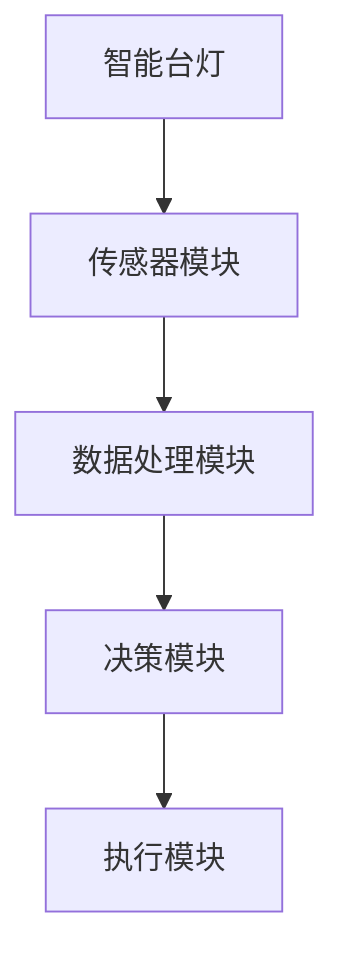
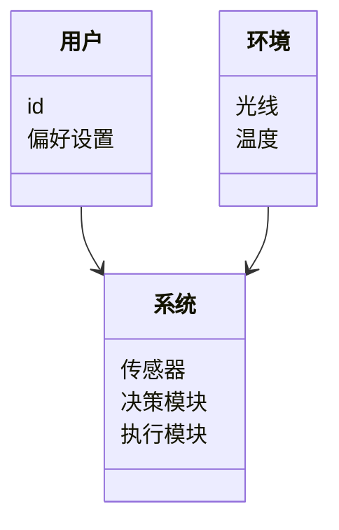
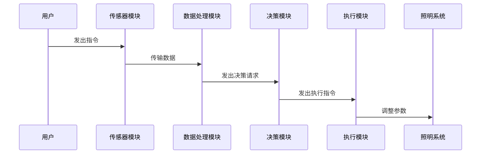

                 


# 智能台灯：AI Agent的个性化照明方案

## 关键词：智能台灯，AI Agent，个性化照明，物联网，机器学习

## 摘要：  
智能台灯结合AI Agent技术，通过个性化照明方案提升用户体验。本文深入探讨AI Agent在智能台灯中的应用，从核心概念、算法原理到系统设计，再到项目实战，全面解析实现个性化照明的全过程。通过结合传感器数据、机器学习算法和自然语言处理，AI Agent能够实时感知用户需求，动态调整照明方案，为用户提供智能化、个性化的照明体验。

---

# 第1章：智能台灯的发展历程

## 1.1 智能台灯的定义与特点  
### 1.1.1 传统台灯的功能与局限性  
传统台灯仅提供基本的照明功能，无法满足用户的个性化需求，且缺乏智能化的控制方式。  

### 1.1.2 智能台灯的核心特点  
智能台灯通过集成传感器、无线通信和智能控制技术，具备以下特点：  
- **智能化控制**：支持远程控制和自动化调节。  
- **个性化照明**：根据用户需求动态调整亮度、色温和模式。  
- **物联网连接**：与智能家居系统无缝集成。  

### 1.1.3 智能台灯的市场现状与发展趋势  
随着智能家居的普及，智能台灯市场快速增长，个性化和智能化成为主要发展趋势。

---

## 1.2 AI Agent的基本概念  
### 1.2.1 AI Agent的定义与分类  
AI Agent（智能代理）是一种能够感知环境、自主决策并执行任务的智能系统，主要分为以下几类：  
- **简单反射型**：基于规则的反应式系统。  
- **基于模型的反应式**：结合环境模型进行决策。  
- **目标驱动型**：基于目标进行规划和推理。  
- **实用驱动型**：基于效用函数优化决策。  

### 1.2.2 AI Agent的核心功能与优势  
AI Agent的核心功能包括感知、推理、规划和执行。其优势在于能够根据环境动态调整行为，提供智能化的服务。

### 1.2.3 AI Agent在智能设备中的应用案例  
AI Agent在智能音箱、智能空调等设备中的广泛应用，展示了其强大的潜力。

---

## 1.3 个性化照明的意义与价值  
### 1.3.1 照明对人类生活的影响  
照明不仅影响视觉效果，还与人的生物节律和情绪密切相关。  

### 1.3.2 个性化照明的需求场景  
- **工作场景**：需要专注的照明环境。  
- **休闲场景**：舒适的色温调节。  
- **健康场景**：根据生物节律调整光照。  

### 1.3.3 AI Agent在个性化照明中的作用  
AI Agent通过感知用户行为和环境变化，实时调整照明参数，满足个性化需求。

---

## 1.4 本章小结  
本章介绍了智能台灯的发展历程和AI Agent的基本概念，强调了个性化照明的重要性和AI Agent在其中的关键作用。

---

# 第2章：AI Agent的核心原理与技术  

## 2.1 AI Agent的基本原理  
### 2.1.1 感知层：智能台灯的环境数据采集  
AI Agent通过传感器采集环境数据，包括光线、温度、人体感应等。  

### 2.1.2 决策层：基于数据的智能决策  
AI Agent根据感知数据和用户需求，通过算法生成决策。  

### 2.1.3 执行层：个性化照明方案的实现  
根据决策结果，智能台灯调整亮度、色温等参数，实现个性化照明。

---

## 2.2 AI Agent的关键技术  
### 2.2.1 传感器技术：光线、温度、人体感应  
传感器是AI Agent感知环境的基础，多种传感器的融合可以提高感知精度。

### 2.2.2 机器学习算法：个性化需求预测  
通过机器学习算法，AI Agent可以学习用户的偏好，预测其需求。

### 2.2.3 自然语言处理：用户意图识别  
NLP技术使智能台灯能够理解用户的语音指令，进一步优化照明方案。

---

## 2.3 AI Agent与智能台灯的系统架构  
### 2.3.1 系统整体架构图（Mermaid）  


---

## 2.4 本章小结  
本章详细讲解了AI Agent的核心原理和关键技术，并通过系统架构图展示了智能台灯的整体结构。

---

# 第3章：AI Agent的算法与数学模型  

## 3.1 感知算法  
### 3.1.1 光线传感器数据处理  
光线传感器通过光敏电阻或光电传感器检测环境亮度，数据经过滤波和归一化处理。

### 3.1.2 用户行为模式识别  
通过机器学习算法识别用户的使用习惯，例如工作时间的规律。

### 3.1.3 环境数据融合算法  
将多源传感器数据（如光线、温度、人体感应）融合，提高感知精度。

---

## 3.2 决策算法  
### 3.2.1 基于规则的决策算法  
根据预设规则进行决策，例如“人在阅读时亮度调至80%”。

### 3.2.2 基于机器学习的决策算法  
通过训练模型预测用户的偏好，例如使用随机森林算法进行分类。

---

## 3.3 执行算法  
### 3.3.1 照明参数调节算法  
根据决策结果调整亮度、色温和模式。

---

## 3.4 数学模型与公式  
### 3.4.1 亮度调节模型  
$$ 亮度 = 基础亮度 + (用户偏好系数 \times 环境亮度) $$  

### 3.4.2 色温调节模型  
$$ 色温 = 基础色温 + (时间因素 \times 用户偏好系数) $$  

---

## 3.5 本章小结  
本章详细介绍了AI Agent的核心算法，并通过数学模型展示了如何实现个性化照明。

---

# 第4章：智能台灯的系统分析与架构设计  

## 4.1 系统功能设计  
### 4.1.1 领域模型（Mermaid类图）  


---

## 4.2 系统架构设计  
### 4.2.1 系统架构图（Mermaid架构图）  


---

## 4.3 系统接口设计  
### 4.3.1 接口设计  
- **传感器接口**：采集环境数据。  
- **用户接口**：接收用户指令。  
- **执行接口**：控制照明系统。  

### 4.3.2 交互流程（Mermaid序列图）  


---

## 4.4 本章小结  
本章通过系统分析和架构设计，展示了智能台灯的整体结构和各部分的协作关系。

---

# 第5章：智能台灯的项目实战  

## 5.1 环境搭建  
### 5.1.1 开发环境安装  
- **硬件**：智能台灯、传感器模块、单片机或嵌入式系统。  
- **软件**：Python开发环境、机器学习库（如Scikit-learn）。  

---

## 5.2 核心实现  
### 5.2.1 传感器数据采集代码  
```python
import numpy as np

# 光线传感器数据采集
def get_light_level():
    # 模拟传感器数据
    return np.random.uniform(0, 100)
```

### 5.2.2 机器学习模型训练代码  
```python
from sklearn.tree import DecisionTreeClassifier

# 训练用户偏好模型
X = [...]  # 特征数据
y = [...]  # 标签数据
model = DecisionTreeClassifier().fit(X, y)
```

---

## 5.3 案例分析  
### 5.3.1 实际案例  
- **案例1**：用户在晚上阅读时，系统自动调整亮度和色温。  
- **案例2**：用户在早晨起床时，系统提供模拟日出效果的渐亮功能。  

---

## 5.4 项目小结  
本章通过项目实战，详细讲解了智能台灯的开发过程，包括环境搭建、核心实现和案例分析。

---

# 第6章：总结与展望  

## 6.1 全文总结  
智能台灯结合AI Agent技术，能够提供个性化、智能化的照明方案，显著提升用户体验。

---

## 6.2 未来展望  
未来，智能台灯将更加智能化和个性化，可能集成更多传感器和AI算法，进一步优化照明体验。

---

## 6.3 最佳实践 Tips  
- 数据隐私保护：确保用户数据的安全性。  
- 系统维护：定期更新算法模型，优化性能。  

---

## 6.4 本章小结  
本章总结了全文内容，并展望了智能台灯的未来发展方向。

---

通过以上目录，文章从智能台灯的背景、AI Agent的核心原理、算法实现、系统架构设计到项目实战，全面、系统地阐述了智能台灯的个性化照明方案。

