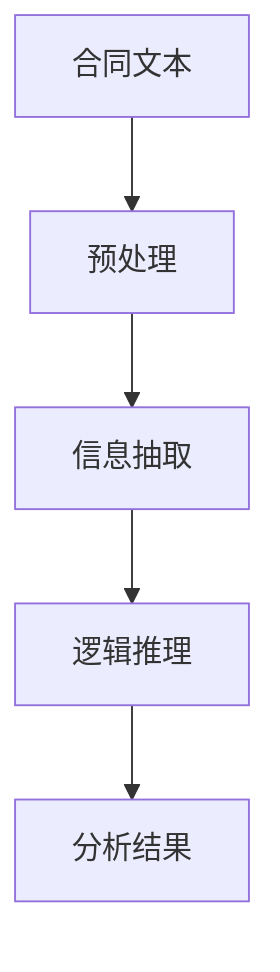
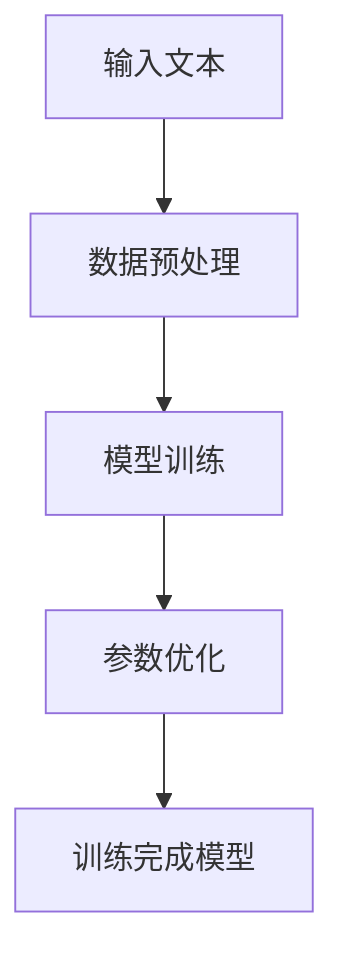
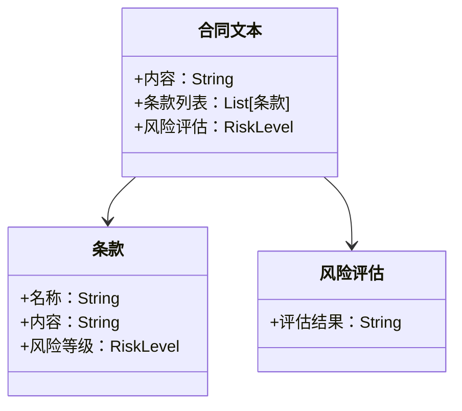
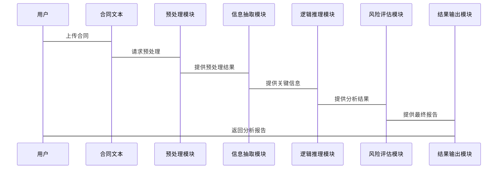

                 


# 智能合同分析AI Agent：LLM在法律文本理解中的应用

> 关键词：智能合同分析，AI Agent，LLM，法律文本理解，自然语言处理

> 摘要：本文详细探讨了智能合同分析AI Agent在法律文本理解中的应用，重点分析了大语言模型（LLM）如何通过自然语言处理技术解决合同分析中的挑战与痛点。文章从背景介绍、核心概念、算法原理、系统架构设计、项目实战等多方面展开，结合实际案例和代码实现，深入剖析了LLM在法律文本分析中的优势和应用场景。同时，文章还提供了最佳实践建议和注意事项，为读者提供了全面的技术指导。

---

## 第1章: 背景介绍

### 1.1 问题背景

#### 1.1.1 合同分析的挑战与痛点
合同分析是一项复杂且耗时的任务，传统的手动分析方式效率低下，且容易出错。法律文本通常包含复杂的术语、多层结构和模糊条款，这使得手动分析需要大量的时间和专业知识。此外，不同行业的合同格式和条款重点也存在差异，增加了分析的难度。

#### 1.1.2 AI在法律文本处理中的潜力
随着人工智能技术的发展，AI在法律文本处理中的潜力逐渐显现。AI能够快速处理大量文本，识别关键信息，提取条款和条件，并进行自动化验证。这不仅提高了合同分析的效率，还减少了人为错误的可能性。

#### 1.1.3 LLM在合同分析中的应用价值
大语言模型（LLM）通过其强大的自然语言理解能力，能够处理复杂的法律文本，识别隐含含义，并生成准确的分析结果。LLM在合同分析中的应用能够显著提升效率，降低成本，并为法律专业人士提供有力支持。

### 1.2 问题描述

#### 1.2.1 合同分析的复杂性
合同分析的复杂性主要体现在以下几个方面：
- **术语多样性**：法律文本中存在大量专业术语，需要准确理解和应用。
- **结构复杂性**：合同通常包含多个章节和条款，结构复杂，逻辑性强。
- **条款模糊性**：某些条款可能存在模糊表述，需要结合上下文进行判断。

#### 1.2.2 传统合同分析的局限性
传统合同分析主要依赖人工操作，存在以下局限性：
- **效率低下**：手动分析需要大量时间，难以应对大量合同的处理需求。
- **容易出错**：人为因素可能导致分析结果的偏差或错误。
- **成本高昂**：需要大量法律专业人士参与，增加了企业的运营成本。

#### 1.2.3 需求与供给的不平衡
随着企业规模的扩大和合同数量的激增，市场对高效、准确的合同分析工具的需求日益增长。然而，传统方法难以满足这一需求，导致供需不平衡的问题。

### 1.3 问题解决

#### 1.3.1 AI Agent的定义与目标
AI Agent是一种智能代理系统，能够通过与用户的交互完成特定任务。在合同分析中，AI Agent的目标是通过自然语言处理技术，自动识别合同中的关键信息，生成结构化的分析结果，并提供决策支持。

#### 1.3.2 LLM在合同分析中的具体应用
LLM在合同分析中的具体应用包括：
- **信息抽取**：提取合同中的关键条款和条件。
- **意图识别**：理解合同中的隐含意图和潜在风险。
- **自动验证**：检查合同的合规性和完整性。

#### 1.3.3 智能合同分析AI Agent的优势
智能合同分析AI Agent的优势主要体现在以下几个方面：
- **高效性**：能够快速处理大量合同，节省时间和成本。
- **准确性**：通过先进的自然语言处理技术，提高分析结果的准确性。
- **可扩展性**：支持多种合同格式和语言，适应不同需求。

### 1.4 边界与外延

#### 1.4.1 合同分析的边界
智能合同分析AI Agent的主要边界包括：
- **适用范围**：仅适用于标准化的合同文本，对非结构化或复杂格式的合同可能效果有限。
- **处理深度**：目前主要适用于初步分析和信息提取，复杂的法律推理和决策仍需人工干预。

#### 1.4.2 智能合同分析的适用范围
智能合同分析的适用范围包括：
- **合同审查**：快速审查合同条款，识别潜在风险。
- **合规性检查**：确保合同内容符合相关法律法规。
- **信息提取**：从合同中提取关键信息，生成结构化数据。

#### 1.4.3 与其他AI应用的区分
智能合同分析AI Agent与其它AI应用的主要区别在于其专注于法律文本的理解和分析，结合了专业的法律知识和自然语言处理技术。

### 1.5 核心概念结构

#### 1.5.1 核心要素组成
智能合同分析AI Agent的核心要素包括：
- **自然语言处理技术**：用于理解和分析法律文本。
- **法律知识库**：包含相关的法律术语和条款。
- **推理引擎**：用于逻辑推理和风险评估。

#### 1.5.2 概念之间的关系
通过概念关系图可以清晰地展示各要素之间的关系：
- **自然语言处理技术**与**法律知识库**结合，实现对合同文本的深度理解。
- **推理引擎**基于上述理解，进行逻辑推理，生成分析结果。

#### 1.5.3 案例分析
通过一个简单的合同案例，展示AI Agent如何从合同文本中提取关键信息，并生成分析报告。

---

## 第2章: 核心概念与联系

### 2.1 AI Agent的原理

#### 2.1.1 LLM的工作机制
LLM通过大量训练数据学习语言模式，并在输入文本的基础上生成相关输出。其工作机制包括：
1. **输入处理**：接收合同文本作为输入。
2. **上下文理解**：基于上下文理解文本含义。
3. **生成输出**：根据理解生成结构化的分析结果。

#### 2.1.2 智能合同分析的流程
智能合同分析的流程包括：
1. **文本预处理**：包括分词、去停用词等步骤。
2. **信息抽取**：识别合同中的关键条款和条件。
3. **逻辑推理**：分析条款之间的关系，评估潜在风险。
4. **结果输出**：生成结构化的分析报告。

#### 2.1.3 多阶段模型的协作
多阶段模型的协作体现在：
- **预处理阶段**：清理和标准化文本。
- **特征提取阶段**：提取关键特征和信息。
- **分析阶段**：进行逻辑推理和风险评估。

### 2.2 核心概念对比

#### 2.2.1 不同模型的对比表格
以下是一个对比表格，展示了不同模型在合同分析中的表现：

| 模型类型 | 参数数量 | 处理速度 | 分析准确率 |
|----------|----------|----------|------------|
| GPT-3    | 175B     | 较慢     | 高          |
| LegalLM  | 100B     | 较快     | 中等        |
| LegalBERT| 125M     | 快       | 高          |

#### 2.2.2 模型性能的对比分析
通过对比分析可以发现，虽然GPT-3的参数数量最多，处理速度较慢，但其分析准确率最高。LegalBERT虽然参数数量较少，但处理速度快，且准确率也较高，适用于轻量级应用。

#### 2.2.3 优缺点的总结
- **优点**：模型参数越多，分析能力越强；处理速度快的模型适用于实时应用。
- **缺点**：参数多的模型计算资源消耗大；处理速度慢的模型不适合大规模应用。

### 2.3 实体关系图

#### 2.3.1 ER实体关系图的Mermaid流程图


---

## 第3章: 算法原理讲解

### 3.1 LLM的训练过程

#### 3.1.1 数据预处理
数据预处理包括：
- **分词**：将文本分割成词语或短语。
- **去停用词**：去除常见词汇，如“的”、“了”等。
- **词干提取**：提取词语的词干，便于后续处理。

#### 3.1.2 模型训练
模型训练过程包括：
1. **数据输入**：将预处理后的文本输入模型。
2. **损失计算**：计算模型输出与真实标签之间的损失。
3. **参数更新**：通过反向传播算法更新模型参数。

#### 3.1.3 调优与优化
调优与优化包括：
- **学习率调整**：通过学习率衰减优化训练效果。
- **批量处理**：通过批量处理提高训练效率。
- **正则化**：使用正则化技术防止过拟合。

### 3.2 NLP技术的应用

#### 3.2.1 分词与词性标注
分词和词性标注是NLP技术的基础，用于将文本分割成词语，并标注每个词语的词性。

#### 3.2.2 句法分析与语义理解
句法分析用于分析句子的结构，语义理解用于理解文本的含义。

#### 3.2.3 文本匹配与相似度计算
文本匹配用于识别相似文本，相似度计算用于衡量文本之间的相似程度。

### 3.3 算法流程图

#### 3.3.1 LLM的训练流程图


---

## 第4章: 数学模型与公式

### 4.1 模型结构

#### 4.1.1 损失函数
$$L = -\sum_{i=1}^{n} y_i \log p(y_i|x_i) + (1-y_i)\log(1-p(y_i|x_i))$$

### 4.2 模型优化

#### 4.2.1 优化目标
$$\min_{\theta} \mathbb{E}_{(x,y)}[L]$$

### 4.3 示例说明

#### 4.3.1 模型训练的简单例子
假设输入文本为“合同条款”，模型通过训练生成对应的分析结果。

---

## 第5章: 系统分析与架构设计

### 5.1 项目场景介绍

#### 5.1.1 项目目标
项目目标是开发一个智能合同分析AI Agent，实现合同文本的自动分析和风险评估。

#### 5.1.2 项目范围
项目范围包括合同信息抽取、条款分析和风险评估三个部分。

#### 5.1.3 项目利益相关者
利益相关者包括企业法务部门、合同审查人员和企业决策者。

### 5.2 系统功能设计

#### 5.2.1 领域模型Mermaid类图


### 5.3 系统架构设计

#### 5.3.1 系统架构Mermaid架构图


### 5.4 系统接口设计

#### 5.4.1 接口定义
- **输入接口**：接收合同文本。
- **输出接口**：输出结构化分析报告。

#### 5.4.2 接口交互流程
1. 用户上传合同文本。
2. 系统进行预处理。
3. 提取关键信息。
4. 进行逻辑推理。
5. 输出分析结果。

### 5.5 系统交互设计

#### 5.5.1 序列图


---

## 第6章: 项目实战

### 6.1 环境安装

#### 6.1.1 安装Python
```bash
python --version
```

#### 6.1.2 安装依赖库
```bash
pip install transformers
pip install numpy
pip install matplotlib
```

### 6.2 系统核心实现源代码

#### 6.2.1 预处理代码
```python
import transformers
from transformers import AutoTokenizer, AutoModelForMaskedLM

tokenizer = AutoTokenizer.from_pretrained('bert-base-uncased')
model = AutoModelForMaskedLM.from_pretrained('bert-base-uncased')
```

#### 6.2.2 信息抽取代码
```python
def extract_info(text):
    inputs = tokenizer.encode_plus(text, return_tensors='pt')
    outputs = model(inputs.input_ids)
    # 处理输出结果
    return extracted_info
```

#### 6.2.3 风险评估代码
```python
def assess_risk(info):
    # 风险评估逻辑
    return risk_level
```

### 6.3 案例分析

#### 6.3.1 合同案例
假设合同文本如下：
```
合同条款：本合同自签订之日起生效，有效期为一年。
```

#### 6.3.2 分析结果
分析结果包括：
- **合同类型**：服务合同。
- **生效日期**：签订之日起。
- **有效期**：一年。

### 6.4 项目小结

#### 6.4.1 项目总结
通过本项目，我们实现了智能合同分析AI Agent的基本功能，包括合同文本的预处理、信息抽取和风险评估。

#### 6.4.2 项目经验
在项目实施过程中，我们深刻体会到自然语言处理技术的强大，同时也意识到模型优化和数据质量的重要性。

---

## 第7章: 最佳实践与小结

### 7.1 最佳实践

#### 7.1.1 模型优化
- **数据增强**：通过数据增强技术提高模型的泛化能力。
- **参数调优**：通过参数调优优化模型性能。

#### 7.1.2 数据管理
- **数据清洗**：确保数据质量，减少噪声。
- **数据安全**：保护敏感信息，确保数据安全。

### 7.2 小结

本文详细探讨了智能合同分析AI Agent在法律文本理解中的应用，通过背景介绍、核心概念、算法原理、系统架构设计、项目实战等多个方面，全面剖析了LLM在合同分析中的优势和应用场景。通过实际案例和代码实现，读者可以更好地理解和应用这些技术。

### 7.3 注意事项

- **数据隐私**：在处理合同文本时，需注意数据隐私保护。
- **模型选择**：根据具体需求选择合适的模型和参数。
- **持续优化**：定期优化模型和系统，以适应新的需求。

### 7.4 拓展阅读

- **推荐书籍**：《自然语言处理入门》、《法律文本分析实战》。
- **推荐博客**：关注前沿技术博客，获取最新动态。

---

通过本文的详细讲解和实践，读者可以深入了解智能合同分析AI Agent的实现过程，并将其应用于实际场景中，为企业的合同管理提供有力支持。

