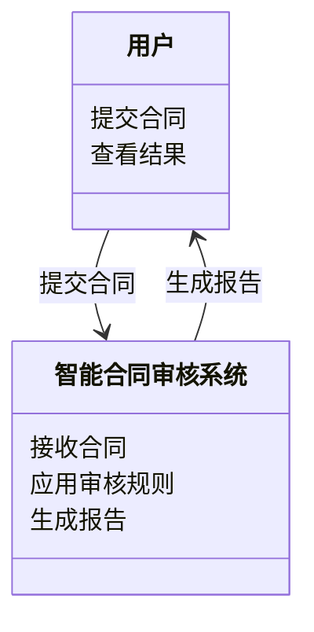
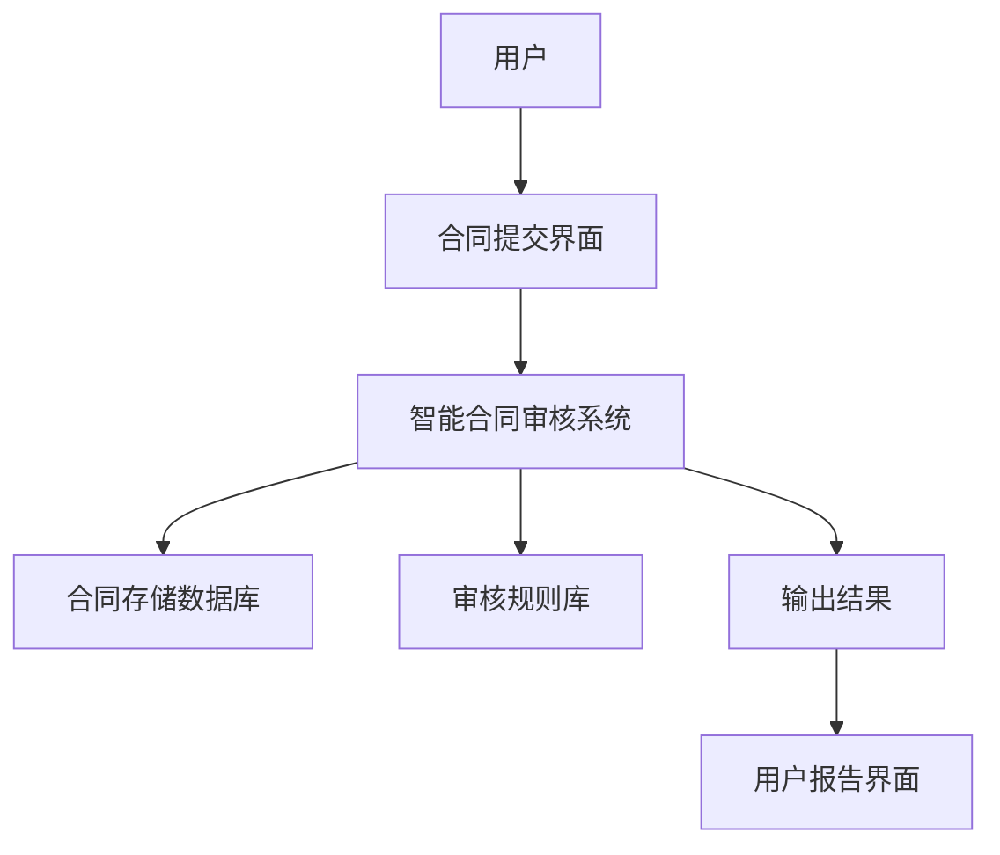
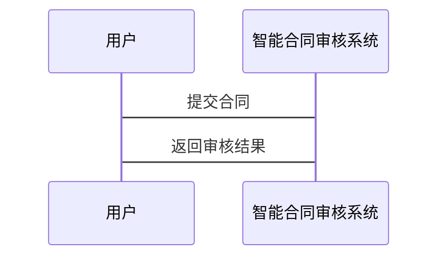

                 


# 智能合同审核 AI Agent：LLM 在法律文件处理中的应用

## 关键词：智能合同审核，LLM，AI Agent，法律文件处理，自然语言处理

## 摘要：  
随着人工智能技术的快速发展，法律文件处理领域的智能化需求日益增长。本文将深入探讨如何利用大语言模型（LLM）构建智能合同审核AI Agent，解决传统合同审核中的低效与误差问题。通过分析LLM的核心原理、算法实现以及实际应用案例，本文将为读者呈现智能合同审核技术的最新进展与未来发展方向。

---

# 目录

## 第一部分: 背景与核心概念

### 第1章: 智能合同审核的背景与问题

#### 1.1 智能合同审核的背景  
- 1.1.1 合同审核的传统方式与痛点  
- 1.1.2 AI技术在法律领域的应用现状  
- 1.1.3 LLM在智能合同审核中的优势  

#### 1.2 问题背景与描述  
- 1.2.1 合同审核中的常见问题  
- 1.2.2 LLM在合同审核中的应用场景  
- 1.2.3 智能合同审核的目标与边界  

### 第2章: 智能合同审核的核心概念与联系  

#### 2.1 核心概念原理  
- 2.1.1 LLM的基本原理  
- 2.1.2 智能合同审核的关键技术  
- 2.1.3 AI Agent在合同审核中的角色  

#### 2.2 核心概念对比与ER图  
- 2.2.1 不同模型的对比分析  
- 2.2.2 实体关系图（ER图）展示  
```mermaid
er
    actor: 用户
    system: 智能合同审核系统
    contract: 合同
    rule: 审核规则
    actor --> system: 提交合同
    system --> contract: 存储合同
    system --> rule: 应用审核规则
```

---

## 第二部分: 算法原理与数学模型

### 第3章: LLM的算法原理  

#### 3.1 LLM的训练流程  
- 3.1.1 数据预处理  
- 3.1.2 模型训练  
- 3.1.3 模型优化  

#### 3.2 模型推理过程  
- 3.2.1 输入处理  
- 3.2.2 解析与生成  
- 3.2.3 输出结果  

#### 3.3 模型架构  
- 3.3.1 Transformer架构  
- 3.3.2 注意力机制  
- 3.3.3 激活函数  

### 第4章: 数学模型与公式  

#### 4.1 概率论基础  
- 4.1.1 条件概率与似然函数  
- 4.1.2 贝叶斯定理的应用  
- 4.1.3 梯度下降与损失函数  

#### 4.2 模型优化算法  
- 4.2.1 Adam优化器的原理  
- 4.2.2 激活函数的选择与影响  
- 4.2.3 注意力机制的数学表达  

---

## 第三部分: 系统分析与架构设计

### 第5章: 系统分析与架构设计方案  

#### 5.1 项目场景介绍  
- 5.1.1 合同审核的典型场景  
- 5.1.2 系统的目标与需求  

#### 5.2 系统功能设计  
- 5.2.1 领域模型设计  


#### 5.3 系统架构设计  
- 5.3.1 系统架构图  


#### 5.4 系统接口设计  
- 5.4.1 API接口定义  
- 5.4.2 接口交互流程  

#### 5.5 系统交互设计  
- 5.5.1 交互流程图  


---

## 第四部分: 项目实战

### 第6章: 项目实战与应用

#### 6.1 环境安装与配置  
- 6.1.1 安装Python与相关库  
- 6.1.2 安装LLM框架（如Hugging Face）  

#### 6.2 系统核心实现  

##### 6.2.1 核心代码实现  
```python
def contract_review(text):
    # 输入合同文本
    model = load_model("llm_contract_review")  # 加载预训练模型
    result = model.generate(text)  # 生成审核结果
    return result
```

##### 6.2.2 代码解读与分析  
- 输入处理与模型调用  
- 结果解析与输出  

#### 6.3 实际案例分析  
- 6.3.1 案例背景与输入  
- 6.3.2 模型处理过程  
- 6.3.3 输出结果与分析  

#### 6.4 项目小结  
- 项目总结与经验分享  
- 模型优化建议  

---

## 第五部分: 最佳实践与总结

### 第7章: 最佳实践与总结

#### 7.1 小结  
- 智能合同审核的核心优势  
- LLM技术的未来发展趋势  

#### 7.2 注意事项  
- 模型选择与优化  
- 数据隐私与安全问题  

#### 7.3 拓展阅读  
- 推荐的书籍与论文  
- 相关技术社区与资源  

---

## 参考文献  
- [1] 提到的模型与框架的官方文档  
- [2] 相关技术论文与研究报告  
- [3] 行业内的最佳实践与案例分享  

---

以上是《智能合同审核 AI Agent：LLM 在法律文件处理中的应用》的技术博客文章目录。通过逐步分析与设计，确保内容逻辑清晰、结构合理，为读者提供深入的技术见解与实践指导。

