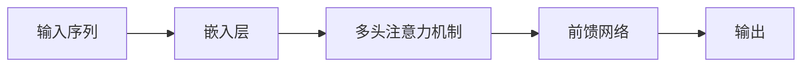
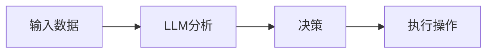
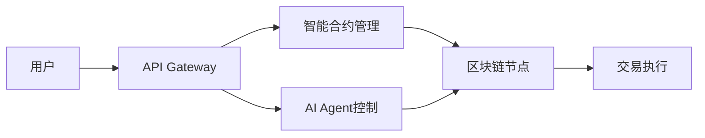

                 


# 智能合约 AI Agent：LLM 在区块链应用中的角色

## 关键词：智能合约、AI Agent、LLM、区块链、人工智能、智能合约开发

## 摘要：本文探讨LLM在区块链中的应用，特别是其在智能合约和AI Agent中的角色。通过详细分析智能合约和AI Agent的核心概念、算法原理、系统架构及实际应用，展示LLM如何增强区块链的智能性和自动化能力。

---

# 第一部分: 智能合约与AI Agent的背景介绍

## 第1章: 智能合约与AI Agent的定义与背景

### 1.1 智能合约的概念与特点

#### 1.1.1 智能合约的定义
智能合约是基于区块链技术的自动执行程序，能够根据预设条件自动执行和管理事务。它通过区块链的去中心化特性，确保合约的安全性和不可篡改性。

#### 1.1.2 智能合约的核心特点
- **自动执行**：无需人工干预，自动根据条件执行操作。
- **去中心化**：依赖区块链技术，避免单点故障。
- **透明性**：所有交易记录在区块链上，可追溯且透明。
- **不可篡改**：区块链的特性确保合约内容无法被篡改。

#### 1.1.3 智能合约与传统合约的区别
| 特性       | 智能合约                | 传统合约               |
|------------|-------------------------|------------------------|
| 执行方式   | 自动化执行               | 需人工执行               |
| 中心化程度 | 去中心化                 | 中心化                   |
| 可追溯性   | 高                     | 低                     |

### 1.2 AI Agent的概念与特点

#### 1.2.1 AI Agent的定义
AI Agent（人工智能代理）是能够感知环境、做出决策并执行任务的智能实体。它通过传感器获取信息，利用算法进行分析和决策，并通过执行器与环境互动。

#### 1.2.2 AI Agent的核心特点
- **自主性**：无需外部干预，能够独立决策。
- **反应性**：能够实时感知环境并做出反应。
- **学习能力**：通过机器学习不断优化决策和执行能力。

#### 1.2.3 AI Agent与传统Agent的区别
| 特性       | AI Agent                | 传统Agent              |
|------------|-------------------------|------------------------|
| 智能性     | 高，具备学习能力         | 低，基于规则执行         |
| 决策能力   | 动态优化决策             | 静态规则执行             |
| 适应性     | 强，能适应环境变化       | 弱，适应性有限           |

### 1.3 智能合约与AI Agent的结合背景

#### 1.3.1 区块链技术的发展
区块链技术的普及使得智能合约的应用范围不断扩大，特别是在金融、供应链等领域。

#### 1.3.2 LLM技术的突破
大语言模型（LLM）的出现使得AI Agent具备更强的自然语言处理和决策能力，能够更好地与智能合约结合。

#### 1.3.3 两者的结合意义
通过结合智能合约和AI Agent，区块链系统能够实现更智能、更自动化的操作，提升系统的可靠性和效率。

---

## 第2章: LLM在区块链中的应用角色

### 2.1 LLM的基本原理

#### 2.1.1 LLM的定义
LLM是一种基于深度学习的自然语言处理模型，能够理解和生成人类语言。它通过大规模的数据训练，具备强大的上下文理解和生成能力。

#### 2.1.2 LLM的核心算法
- **Transformer模型**：由多头注意力机制和前馈网络组成，能够处理长序列数据。
- **训练过程**：通过监督学习和无监督学习相结合的方式进行训练。

#### 2.1.3 LLM的应用场景
- 自然语言生成
- 机器翻译
- 文本摘要
- 联系上下文推理

### 2.2 智能合约中的LLM角色

#### 2.2.1 LLM作为智能合约的执行者
AI Agent可以作为智能合约的执行者，根据区块链上的数据和LLM的分析结果，自动触发合约的执行。

#### 2.2.2 LLM作为智能合约的开发者
AI Agent能够辅助开发智能合约，通过LLM的自然语言处理能力，简化智能合约的开发过程。

#### 2.2.3 LLM作为智能合约的优化者
AI Agent可以通过分析智能合约的执行情况，优化合约的逻辑和性能。

### 2.3 AI Agent在区块链中的应用

#### 2.3.1 AI Agent作为智能合约的交互界面
AI Agent可以作为用户与智能合约之间的接口，简化用户的操作流程。

#### 2.3.2 AI Agent作为智能合约的自动化执行者
AI Agent能够自动监控区块链上的数据变化，根据预设的条件触发智能合约的执行。

#### 2.3.3 AI Agent作为智能合约的智能决策者
AI Agent具备学习和决策能力，可以根据实时数据和上下文信息，优化智能合约的执行策略。

---

## 第3章: 智能合约与AI Agent的核心原理

### 3.1 智能合约的执行机制

#### 3.1.1 智能合约的执行流程
1. 合约部署：将智能合约部署到区块链上。
2. 合约调用：通过区块链节点调用合约方法。
3. 合约执行：根据调用的参数和合约逻辑，自动执行相应的操作。
4. 结果确认：将执行结果记录在区块链上。

#### 3.1.2 智能合约的触发机制
智能合约可以通过区块链上的事件触发，例如交易完成、时间到达等。

#### 3.1.3 智能合约的状态管理
智能合约的状态包括未执行、执行中、已执行等，通过区块链的共识机制确保状态的正确性。

### 3.2 AI Agent的决策机制

#### 3.2.1 感知环境
AI Agent通过传感器或API获取区块链上的数据，如交易记录、合约状态等。

#### 3.2.2 分析与决策
AI Agent利用LLM的自然语言处理能力和机器学习模型，分析当前环境并做出决策。

#### 3.2.3 执行操作
根据决策结果，AI Agent通过智能合约接口或区块链API执行相应的操作。

---

## 第4章: 智能合约AI Agent的算法原理

### 4.1 LLM的算法实现

#### 4.1.1 Transformer模型


#### 4.1.2 LLM的训练过程
```python
# 示例代码：LLM的训练流程
import torch

def loss_fn(outputs, labels):
    return torch.nn.functional.cross_entropy(outputs, labels)

optimizer = torch.optim.Adam(model.parameters(), lr=0.001)

for epoch in range(num_epochs):
    for batch in batches:
        outputs = model(batch.input)
        loss = loss_fn(outputs, batch.label)
        optimizer.zero_grad()
        loss.backward()
        optimizer.step()
```

#### 4.1.3 LLM的应用案例
通过LLM生成智能合约的描述文本，帮助开发人员快速理解合约逻辑。

### 4.2 AI Agent的算法实现

#### 4.2.1 状态感知
AI Agent通过区块链API获取当前合约状态和交易信息。

#### 4.2.2 决策模型


#### 4.2.3 执行操作
AI Agent根据决策结果，调用智能合约接口执行相应的操作。

---

## 第5章: 智能合约AI Agent的系统架构设计

### 5.1 系统功能设计

#### 5.1.1 合约管理模块
负责智能合约的部署、管理和版本控制。

#### 5.1.2 AI Agent控制模块
负责AI Agent的配置、监控和决策。

#### 5.1.3 交易执行模块
负责智能合约的触发和交易的执行。

### 5.2 系统架构图


### 5.3 接口设计

#### 5.3.1 用户接口
- API接口：供用户调用智能合约和AI Agent功能。
- Web界面：用户可以通过网页界面进行操作。

#### 5.3.2 系统接口
- 区块链接口：与区块链节点进行交互。
- AI Agent接口：与AI Agent进行通信。

---

## 第6章: 智能合约AI Agent的项目实战

### 6.1 环境安装

#### 6.1.1 安装区块链框架
- 安装以太坊的Solidity编译器。
- 安装Python和必要的机器学习库（如TensorFlow、PyTorch）。

#### 6.1.2 安装AI Agent框架
- 安装LLM模型（如GPT-3、PaLM）。
- 安装相关API接口库。

### 6.2 核心代码实现

#### 6.2.1 智能合约实现
```solidity
contract SmartContract {
    function execute(uint256 value) public {
        // 合约逻辑
    }
}
```

#### 6.2.2 AI Agent实现
```python
class AIAgent:
    def __init__(self, llm_model):
        self.llm_model = llm_model

    def analyze(self, input_data):
        # 分析数据并返回决策结果
        pass

    def execute(self, contract_address):
        # 执行智能合约
        pass
}
```

#### 6.2.3 接口实现
```python
from web3 import Web3

w3 = Web3(Web3.HTTPProvider('http://localhost:8545'))
```

### 6.3 项目总结

#### 6.3.1 项目优势
- 高效：AI Agent能够自动执行智能合约，减少人工干预。
- 智能：基于LLM的分析能力，提升合约的执行效率。
- 可靠：区块链的特性确保合约的安全性和不可篡改性。

#### 6.3.2 项目不足
- 复杂性：智能合约和AI Agent的结合增加了系统的复杂性。
- 资源消耗：LLM的运行需要大量的计算资源。

---

## 第7章: 总结与展望

### 7.1 总结
智能合约和AI Agent的结合为区块链应用带来了新的可能性。通过LLM的分析能力，智能合约的执行更加智能化和自动化，大大提升了系统的效率和可靠性。

### 7.2 展望
未来，随着LLM技术的不断发展，智能合约AI Agent将在更多领域得到应用，例如金融、供应链管理、法律事务等。同时，如何进一步优化系统的性能和安全性，是未来研究的重要方向。

---

## 第8章: 最佳实践 tips

### 8.1 小结
- 智能合约AI Agent的结合是区块链技术发展的趋势。
- LLM在其中扮演了关键的角色，提升了系统的智能性。

### 8.2 注意事项
- 确保系统的安全性和稳定性。
- 合规性：遵守相关法律法规，确保智能合约的合法性。
- 性能优化：提升系统的运行效率，降低资源消耗。

### 8.3 拓展阅读
- 《Mastering Blockchain》
- 《Deep Learning for NLP》
- 《AI in Business Applications》

---

通过本文的详细介绍，您应该能够理解智能合约AI Agent在区块链中的角色和作用，以及如何通过LLM技术提升系统的智能化水平。希望本文能为您提供有价值的信息和启示。

