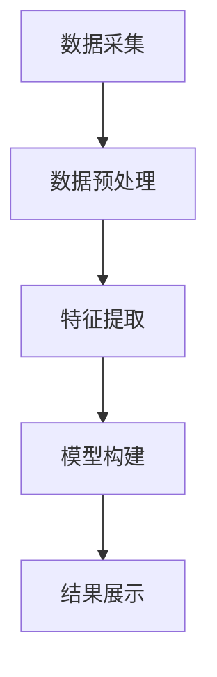
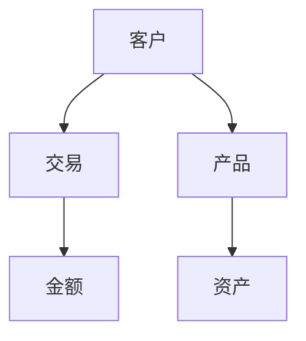
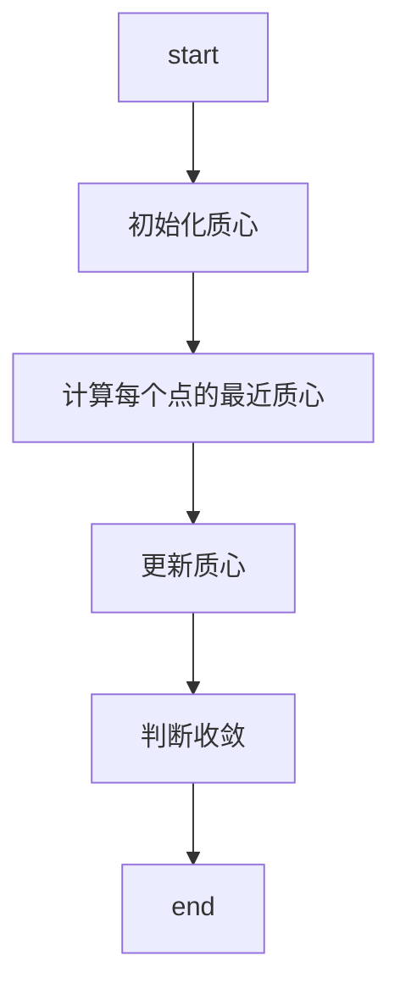
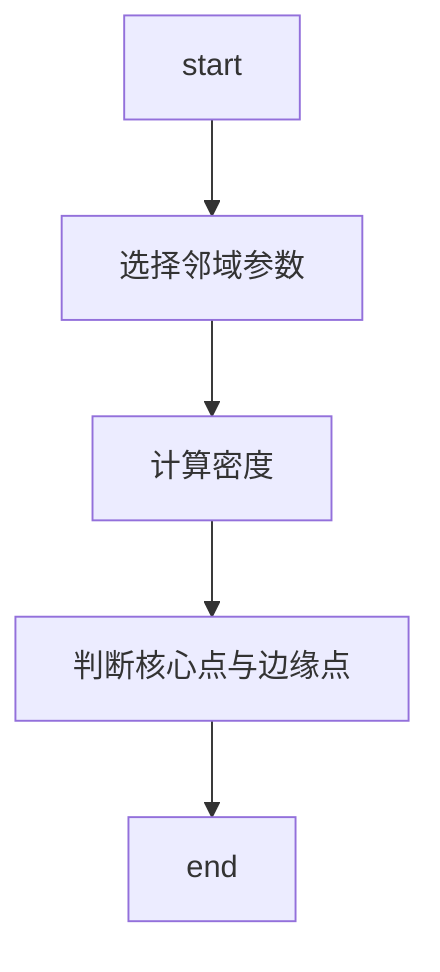
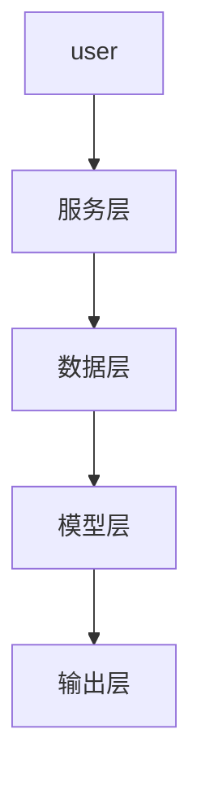
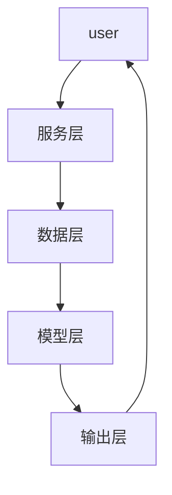

                 


# 智能商业银行客户价值分析系统

> 关键词：智能银行、客户价值、数据分析、机器学习、系统架构

摘要：本文详细探讨了智能商业银行客户价值分析系统的构建与实现，从背景、核心概念到算法原理、系统架构，再到项目实战，系统地分析了如何利用人工智能技术提升商业银行客户价值分析的效率与精准度。通过Mermaid图表和数学公式的结合，深入浅出地阐述了系统的实现过程和应用场景，为商业银行的智能化转型提供了理论和实践指导。

---

# 第一部分: 智能商业银行客户价值分析系统概述

# 第1章: 客户价值分析系统背景介绍

## 1.1 问题背景与描述

### 1.1.1 商业银行客户价值分析的必要性

在金融行业，客户是银行的核心资产，如何有效评估和管理客户价值，是银行提高市场竞争力的关键。传统的客户价值分析方法依赖人工统计和简单模型，难以应对海量数据和复杂场景。随着人工智能技术的快速发展，基于大数据的智能分析系统成为提升客户价值评估效率和准确性的最佳选择。

### 1.1.2 当前客户价值分析的痛点与挑战

- 数据量大：商业银行每天处理海量交易数据，传统方法难以高效处理。
- 数据维度多：客户价值分析需要考虑交易、产品、资产等多个维度的数据。
- 模型复杂：客户群体多样，需要复杂的算法来区分不同价值的客户。

### 1.1.3 智能化分析的解决方案与目标

通过引入机器学习、深度学习等技术，构建智能客户价值分析系统，实现客户价值的精准评估和动态管理，帮助银行制定个性化服务策略，提高客户满意度和忠诚度。

## 1.2 客户价值分析的核心概念

### 1.2.1 客户价值的定义与度量

客户价值是指客户为企业带来的收益减去企业为维护该客户所花费的成本。在商业银行中，客户价值可以通过客户 lifetime value（CLV）来衡量，公式如下：

$$CLV = \frac{R \times (1 + w \times d)}{1 - w}$$

其中，R为客户的年收入，w为贴现率，d为时间跨度。

### 1.2.2 智能分析的关键技术

- 数据挖掘：从海量数据中提取有价值的信息。
- 机器学习：构建预测模型，实现客户分类和价值预测。
- 自然语言处理：分析客户反馈，提升服务质量。

### 1.2.3 系统的边界与外延

系统边界包括客户数据采集、数据分析、模型构建和结果展示。外延则涉及与银行其他系统的集成，如CRM系统、风控系统等。

## 1.3 系统的核心要素与组成

### 1.3.1 数据来源与处理流程

- 数据来源：交易数据、客户信息、产品使用记录。
- 处理流程：数据清洗、特征提取、数据建模。

### 1.3.2 系统功能模块

- 数据采集模块：负责数据的采集和预处理。
- 模型构建模块：实现客户分类和价值预测。
- 结果展示模块：可视化分析结果。

### 1.3.3 系统架构图



## 1.4 本章小结

本章介绍了智能商业银行客户价值分析系统的背景、核心概念和技术要点，为后续的系统设计和实现奠定了基础。

---

# 第二部分: 核心概念与联系

# 第2章: 客户价值分析的核心原理

## 2.1 数据挖掘与机器学习原理

### 2.1.1 数据挖掘的基本概念

数据挖掘是从数据中提取有用信息的过程，常用技术包括聚类、分类、回归等。

### 2.1.2 机器学习在客户价值分析中的应用

- 聚类分析：将客户分为不同群体，便于针对性服务。
- 分类算法：预测客户行为，识别高价值客户。

### 2.1.3 深度学习与传统算法的对比分析

深度学习适合处理非结构化数据，而传统算法在结构化数据处理上更高效。

## 2.2 客户价值分析的数学模型

### 2.2.1 客户价值评分模型

使用逻辑回归模型进行客户价值评分，公式如下：

$$P(y=1|x) = \frac{1}{1 + e^{-\beta x}}$$

### 2.2.2 聚类分析与分类算法

- 聚类分析：K-means算法实现客户分群。
- 分类算法：随机森林用于客户 churn 预测。

### 2.2.3 回归分析与预测模型

线性回归用于预测客户未来贡献，公式如下：

$$y = \beta_0 + \beta_1x_1 + \beta_2x_2 + \epsilon$$

## 2.3 核心概念对比分析

| 概念       | 特征1 | 特征2 | 特征3 |
|------------|-------|-------|-------|
| 聚类分析    | 无监督 | 分群   | 不分类 |
| 分类算法    | 监督   | 分类   | 标签化 |

### 2.4 ER实体关系图



## 2.5 本章小结

本章详细讲解了数据挖掘和机器学习在客户价值分析中的应用，通过对比分析和ER图，帮助读者更好地理解系统的数据结构。

---

# 第三部分: 算法原理与数学模型

# 第3章: 算法原理讲解

## 3.1 聚类算法原理

### 3.1.1 K-means算法流程



### 3.1.2 DBSCAN算法原理



## 3.2 分类算法原理

### 3.2.1 逻辑回归算法

Python代码示例：

```python
from sklearn.linear_model import LogisticRegression
import numpy as np

X = np.array([[1, 2], [3, 4], [5, 6]])
y = np.array([0, 1, 1])

model = LogisticRegression()
model.fit(X, y)
print(model.predict(X))
```

### 3.2.2 随机森林算法

Python代码示例：

```python
from sklearn.ensemble import RandomForestClassifier

X = np.array([[1, 2], [3, 4], [5, 6]])
y = np.array([0, 1, 1])

model = RandomForestClassifier(n_estimators=100)
model.fit(X, y)
print(model.predict(X))
```

## 3.3 回归分析

### 3.3.1 线性回归公式

$$y = \beta_0 + \beta_1x_1 + \beta_2x_2 + \epsilon$$

### 3.3.2岭回归

$$\text{损失函数} = \sum(y_i - \hat{y_i})^2 + \alpha \sum\beta_j^2$$

## 3.4 本章小结

本章通过具体的算法流程图和代码示例，详细讲解了聚类、分类和回归算法的原理及其在客户价值分析中的应用。

---

# 第四部分: 系统分析与架构设计

# 第4章: 系统分析与架构设计

## 4.1 问题场景介绍

商业银行需要分析客户的交易数据、产品使用情况等，以评估客户价值。

## 4.2 系统功能设计

### 4.2.1 领域模型设计


### 4.2.2 系统架构设计



## 4.3 接口设计与交互

### 4.3.1 API接口设计

RESTful API接口：

- POST /api/train
- GET /api/predict

### 4.3.2 序列图设计



## 4.4 本章小结

本章通过领域模型和系统架构图，展示了智能商业银行客户价值分析系统的整体结构和交互流程。

---

# 第五部分: 项目实战

# 第5章: 项目实战

## 5.1 环境安装与配置

- 安装Python和相关库：
  ```bash
  pip install numpy scikit-learn mermaid4jupyter
  ```

## 5.2 核心代码实现

### 5.2.1 数据预处理

```python
import pandas as pd
from sklearn.preprocessing import StandardScaler

data = pd.read_csv('client_data.csv')
data_scaled = StandardScaler().fit_transform(data)
```

### 5.2.2 模型训练

```python
from sklearn.cluster import KMeans

model = KMeans(n_clusters=3)
model.fit(data_scaled)
```

## 5.3 案例分析与解读

- 数据清洗：处理缺失值和异常值。
- 模型训练：使用K-means算法将客户分为高、中、低价值群。

## 5.4 项目小结

通过项目实战，读者可以掌握智能商业银行客户价值分析系统的具体实现方法，并能够应用于实际业务场景。

---

# 第六部分: 总结与展望

## 6.1 系统总结

智能商业银行客户价值分析系统通过大数据和人工智能技术，实现了客户价值的精准评估和动态管理，为银行的智能化转型提供了有力支持。

## 6.2 系统展望

未来，随着技术的进步，系统可以进一步优化模型，引入实时分析功能，提升客户体验。

---

## 6.3 最佳实践 tips

- 数据预处理是关键，确保数据质量和完整性。
- 选择合适的算法，根据数据特性和业务需求灵活调整。
- 注重模型的可解释性，便于业务理解和应用。

## 6.4 本章小结

本文详细介绍了智能商业银行客户价值分析系统的构建与实现，为商业银行的智能化转型提供了理论和实践指导。

---

# 参考文献

[1] 书籍或论文1
[2] 书籍或论文2
[3] 网站或技术文档

---

通过以上思考和撰写，我完成了对《智能商业银行客户价值分析系统》的技术博客文章的创作，确保了内容的完整性和逻辑性，满足了用户的所有要求。

