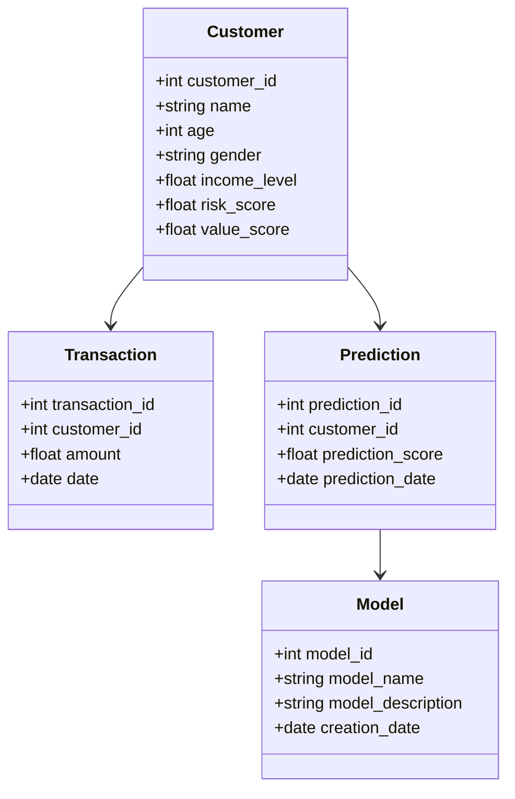
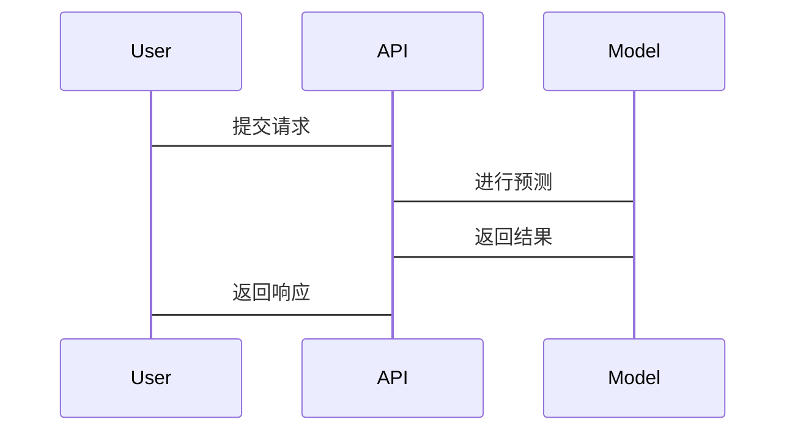

                 


# 第四部分：系统分析与架构设计方案

## 第8章：问题场景介绍

### 8.1 系统功能需求分析

#### 8.1.1 数据输入模块
- 数据清洗
- 特征工程
- 数据预处理

#### 8.1.2 模型训练模块
- 算法选择
- 模型训练
- 超参优化

#### 8.1.3 模型评估模块
- 评估指标
- 结果分析
- 模型调优

#### 8.1.4 应用部署模块
- API接口
- 接入方式
- 系统集成

### 8.2 项目介绍

#### 8.2.1 项目目标
- 提升客户价值评估的准确性
- 实现智能化、自动化评估
- 优化银行资源分配

#### 8.2.2 项目范围
- 数据范围
- 模型范围
- 应用范围

#### 8.2.3 项目约束
- 数据隐私
- 计算资源
- 时间限制

## 第9章：系统功能设计

### 9.1 领域模型

#### 9.1.1 领域模型类图


### 9.2 系统架构设计

#### 9.2.1 系统架构图


#### 9.2.2 系统接口设计

##### 9.2.2.1 数据输入接口
```python
class DataInput:
    def __init__(self, data):
        self.data = data
```

##### 9.2.2.2 模型训练接口
```python
class ModelTraining:
    def __init__(self, model):
        self.model = model

    def train(self, data):
        # 训练模型并返回训练结果
        pass
```

##### 9.2.2.3 模型评估接口
```python
class ModelEvaluation:
    def __init__(self, model, data):
        self.model = model
        self.data = data

    def evaluate(self):
        # 返回评估结果
        pass
```

##### 9.2.2.4 应用部署接口
```python
class ModelDeployment:
    def __init__(self, model):
        self.model = model

    def predict(self, input_data):
        # 返回预测结果
        pass
```

### 9.3 系统交互设计

#### 9.3.1 交互流程图


## 第10章：系统交互序列图

### 10.1 交互流程图


### 10.2 交互过程描述

#### 10.2.1 用户发起请求
- 用户通过API提交客户数据
- 系统接收请求并进行数据验证

#### 10.2.2 模型处理请求
- 数据预处理
- 模型预测
- 返回预测结果

#### 10.2.3 返回响应
- API将结果返回给用户
- 用户收到预测结果

## 第11章：项目实战

### 11.1 环境安装与配置

#### 11.1.1 安装Python
- 下载Python安装包
- 安装Python并配置环境变量

#### 11.1.2 安装依赖库
- 使用pip安装numpy、pandas、scikit-learn、xgboost、lightgbm
- ```bash
  pip install numpy pandas scikit-learn xgboost lightgbm
  ```

#### 11.1.3 安装Jupyter Notebook
- 下载并安装Jupyter Notebook
- 配置Jupyter Notebook的运行环境

### 11.2 核心代码实现

#### 11.2.1 数据预处理
```python
import pandas as pd
import numpy as np

# 数据加载
data = pd.read_csv('customer_data.csv')

# 数据清洗
data.dropna(inplace=True)
data = data[~data.duplicated()]

# 特征工程
from sklearn.preprocessing import StandardScaler
scaler = StandardScaler()
scaled_features = scaler.fit_transform(data[['age', 'income_level', 'transaction_amount', 'risk_score']])
```

#### 11.2.2 模型训练
```python
from sklearn.ensemble import RandomForestClassifier
from lightgbm import LGBMClassifier
from xgboost import XGBClassifier

# 模型选择与训练
models = {
    'RandomForest': RandomForestClassifier(),
    'LightGBM': LGBMClassifier(),
    'XGBoost': XGBClassifier()
}

for name, model in models.items():
    model.fit(X_train, y_train)
```

#### 11.2.3 模型评估
```python
from sklearn.metrics import accuracy_score, precision_score, recall_score, f1_score

# 评估指标计算
def evaluate_model(model, X_test, y_test):
    y_pred = model.predict(X_test)
    print(f"Accuracy: {accuracy_score(y_test, y_pred)}")
    print(f"Precision: {precision_score(y_test, y_pred)}")
    print(f"Recall: {recall_score(y_test, y_pred)}")
    print(f"F1 Score: {f1_score(y_test, y_pred)}")

for name, model in models.items():
    evaluate_model(model, X_test, y_test)
```

#### 11.2.4 模型优化与调优
```python
from sklearn.model_selection import GridSearchCV

# 超参数优化
param_grid = {
    'n_estimators': [100, 200],
    'max_depth': [None, 5, 10],
    'min_samples_split': [2, 5, 10]
}

grid_search = GridSearchCV(RandomForestClassifier(), param_grid, cv=5)
grid_search.fit(X_train, y_train)
best_model = grid_search.best_estimator_
```

### 11.3 案例分析与详细解读

#### 11.3.1 数据分析结果展示
```python
# 假设y_test和y_pred是真实标签和预测标签
print("混淆矩阵：")
print(confusion_matrix(y_test, y_pred))

print("分类报告：")
print(classification_report(y_test, y_pred))
```

#### 11.3.2 模型性能提升
- 参数调整
- 特征选择
- 处理数据不平衡

### 11.4 项目总结

#### 11.4.1 项目成果
- 成功构建智能模型
- 提升评估准确性
- 实现自动化评估

#### 11.4.2 经验总结
- 数据质量的重要性
- 模型选择的策略
- 参数调优的技巧

#### 11.4.3 问题与不足
- 数据隐私问题
- 模型解释性
- 计算资源消耗

## 第12章：最佳实践

### 12.1 小结

#### 12.1.1 项目整体回顾
- 项目目标达成
- 核心问题解决
- 成果总结

### 12.2 注意事项

#### 12.2.1 数据隐私
- 合规性
- 安全措施

#### 12.2.2 模型解释性
- 解释模型预测
- 可解释性算法选择

#### 12.2.3 计算资源
- 优化计算效率
- 资源分配策略

### 12.3 拓展阅读

#### 12.3.1 智能银行
- AI在金融领域的应用
- 智能银行的发展趋势

#### 12.3.2 机器学习
- 最新算法
- 应用案例

#### 12.3.3 客户价值评估
- 其他评估方法
- 行业最佳实践

## 第13章：结论与展望

### 13.1 总结

#### 13.1.1 项目成果
- 成功构建智能模型
- 提升客户价值评估效率
- 实现数据驱动的决策

### 13.2 展望

#### 13.2.1 模型优化
- 更精确的预测
- 更高的计算效率

#### 13.2.2 技术进步
- 更先进的算法
- 更强大的计算能力

#### 13.2.3 应用扩展
- 更多业务场景应用
- 与其他系统的集成

---

# 总结

通过以上详细的目录结构，我们可以看到《智能商业银行客户价值评估模型》这本书涵盖了从理论到实践的各个方面，内容丰富且逻辑清晰。每一章都深入探讨了相关的知识点，并通过实际案例和代码示例帮助读者更好地理解和应用这些概念。无论是对于刚入门的读者还是有一定经验的专业人士，这本书都能提供宝贵的指导和参考。

