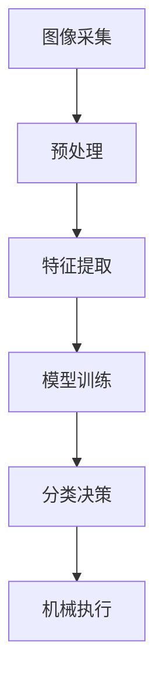
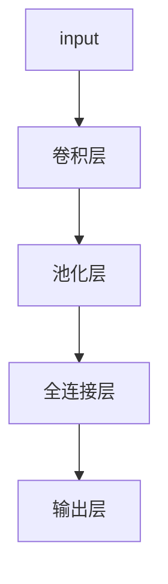

                 


# 智能垃圾分类桶：AI Agent的废物识别与分类指导

> 关键词：AI Agent，图像识别，智能垃圾桶，垃圾分类，深度学习

> 摘要：智能垃圾分类桶利用AI Agent和图像识别技术，实现垃圾的自动识别与分类。本文详细探讨了AI Agent的核心原理、图像识别技术的应用、智能垃圾分类桶的系统架构设计以及实际项目实现，帮助读者全面理解智能垃圾分类桶的技术细节和实现方法。

---

# 第一部分: 智能垃圾分类桶的背景与需求

## 第1章: 智能垃圾分类桶的背景与问题分析

### 1.1 垃圾分类的重要性

#### 1.1.1 垃圾分类的现状与挑战

垃圾处理是现代社会面临的重要问题。随着城市化进程的加快，垃圾产生量急剧增加，传统的垃圾处理方式已经无法满足需求。垃圾分类可以减少垃圾填埋和焚烧的压力，提高资源利用率，降低环境污染。然而，传统的人工垃圾分类效率低、成本高，且容易出错。

#### 1.1.2 智能化垃圾分类的优势

AI Agent（人工智能代理）和图像识别技术的结合，为垃圾分类提供了智能化解决方案。通过AI Agent，垃圾识别与分类可以实现自动化、高效化和精准化，大大提高了垃圾分类的效率和准确性。

#### 1.1.3 智能垃圾分类桶的市场需求

随着环保意识的增强和科技的进步，智能垃圾分类桶的需求日益增长。政府、企业和个人都在寻求更加高效、智能的垃圾分类方式，以减少环境污染和资源浪费。

### 1.2 AI Agent在垃圾分类中的应用前景

#### 1.2.1 AI Agent的基本概念

AI Agent是一种能够感知环境、执行任务的智能体。它能够通过传感器或摄像头获取信息，并通过算法进行分析和决策，从而实现特定的目标。

#### 1.2.2 AI Agent在垃圾分类中的应用场景

在垃圾分类中，AI Agent可以用于垃圾的识别、分类、定位和处理。例如，AI Agent可以通过摄像头采集垃圾图像，利用图像识别技术进行分类，并通过机械臂将垃圾移动到相应的收集区域。

#### 1.2.3 智能垃圾分类桶的未来发展

随着技术的进步，智能垃圾分类桶将更加智能化和普及化。未来的垃圾分类系统将更加高效、精准，甚至可以实现对垃圾的深度分析和资源化利用。

### 1.3 本章小结

本章介绍了智能垃圾分类桶的背景与需求，分析了AI Agent在垃圾分类中的应用前景，为后续的技术实现奠定了基础。

---

## 第2章: AI Agent的基本原理

### 2.1 AI Agent的核心概念

#### 2.1.1 AI Agent的定义与特点

AI Agent是一种智能体，能够通过感知环境和执行动作来实现目标。它具有自主性、反应性、目标导向性和社会性等特点。

#### 2.1.2 AI Agent的分类与应用场景

AI Agent可以分为简单反射型、基于模型的反应型、目标导向型和实用导向型。在垃圾分类中，目标导向型AI Agent最为常见，用于实现特定的分类目标。

#### 2.1.3 AI Agent与传统自动化的区别

AI Agent的核心优势在于其智能化和自适应能力。与传统自动化不同，AI Agent能够通过学习和优化不断改进性能，适应环境的变化。

### 2.2 AI Agent在垃圾分类中的应用

#### 2.2.1 AI Agent在垃圾分类中的功能模块

智能垃圾分类桶中的AI Agent通常包括图像采集模块、图像处理模块、决策模块和执行模块。这些模块协同工作，实现垃圾的识别、分类和处理。

#### 2.2.2 AI Agent的决策机制

AI Agent的决策机制基于图像识别技术和机器学习模型。通过分析垃圾图像的特征，AI Agent能够快速做出分类决策，并指导机械臂完成垃圾的分类和放置。

#### 2.2.3 AI Agent的自适应能力

通过持续的学习和优化，AI Agent能够不断提高分类准确率和效率。例如，通过强化学习算法，AI Agent可以在实际应用中不断改进其分类策略。

### 2.3 本章小结

本章详细介绍了AI Agent的基本原理及其在垃圾分类中的应用，为后续的图像识别技术和系统架构设计奠定了基础。

---

## 第3章: 图像识别技术的核心原理

### 3.1 图像识别的基本概念

#### 3.1.1 图像识别的定义与特点

图像识别是指通过计算机对图像进行分析和理解，提取图像中的有用信息。它具有高效性、准确性、实时性和自适应性等特点。

#### 3.1.2 图像识别的主要技术

图像识别的主要技术包括图像分割、特征提取、模式识别和深度学习。其中，深度学习技术在图像识别中应用最为广泛。

#### 3.1.3 图像识别在垃圾分类中的应用

在垃圾分类中，图像识别技术用于垃圾的识别和分类。例如，通过图像分割技术，可以将垃圾图像分割成不同的区域，提取每个区域的特征进行分类。

### 3.2 垃圾图像分类的算法原理

#### 3.2.1 垃圾图像分类的流程

垃圾图像分类的流程通常包括图像采集、预处理、特征提取、模型训练和分类决策。其中，模型训练是关键步骤，决定了分类的准确率。

#### 3.2.2 垃圾图像分类的特征提取

特征提取是图像分类的核心步骤。常用的特征提取方法包括基于传统特征（如HOG）和基于深度学习（如CNN）的方法。深度学习方法能够提取更复杂的特征，提高分类准确率。

#### 3.2.3 垃圾图像分类的模型训练

模型训练是通过大量的标注数据对分类模型进行训练，使其能够识别和分类垃圾。常用的模型包括卷积神经网络（CNN）和迁移学习模型（如ResNet）。

### 3.3 本章小结

本章详细介绍了图像识别技术的核心原理及其在垃圾分类中的应用，为后续的系统架构设计和项目实现奠定了基础。

---

## 第4章: 智能垃圾分类桶的系统架构设计

### 4.1 系统功能模块划分

#### 4.1.1 图像采集模块

图像采集模块负责采集垃圾图像，通常使用摄像头完成。采集的图像需要进行预处理，以提高分类的准确性。

#### 4.1.2 图像处理模块

图像处理模块负责对采集的图像进行预处理和特征提取。预处理包括图像的缩放、旋转和增强。特征提取可以通过传统的特征提取方法或深度学习模型完成。

#### 4.1.3 分类决策模块

分类决策模块负责对提取的特征进行分类，生成分类结果。常用的分类算法包括支持向量机（SVM）和随机森林（Random Forest）。

#### 4.1.4 机械执行模块

机械执行模块负责根据分类结果，将垃圾移动到相应的收集区域。机械臂是常用的执行机构。

### 4.2 系统架构设计

#### 4.2.1 分层架构设计

智能垃圾分类桶的系统架构通常采用分层设计，包括数据层、算法层和执行层。数据层负责数据的采集和存储，算法层负责图像处理和分类，执行层负责机械臂的控制。

#### 4.2.2 模块之间的交互关系

模块之间的交互关系需要通过接口完成。例如，图像采集模块将图像数据传递给图像处理模块，图像处理模块将特征信息传递给分类决策模块，分类决策模块将分类结果传递给机械执行模块。

#### 4.2.3 系统的扩展性设计

系统扩展性设计考虑了未来功能的扩展。例如，可以通过增加新的分类模型或优化算法来提高分类准确率。

### 4.3 本章小结

本章详细介绍了智能垃圾分类桶的系统架构设计，包括功能模块划分和系统架构设计。后续章节将基于此进行算法实现和项目实战。

---

## 第5章: 图像分类算法的实现

### 5.1 垃圾图像分类的流程图

垃圾图像分类的流程包括图像采集、预处理、特征提取、模型训练和分类决策。以下是一个简要的流程图：



### 5.2 基于深度学习的图像分类算法

#### 5.2.1 CNN网络结构

卷积神经网络（CNN）是图像分类中常用的深度学习模型。以下是CNN的基本结构：



#### 5.2.2 模型训练与优化

模型训练需要大量的标注数据和优化算法。常用的优化算法包括随机梯度下降（SGD）和Adam优化器。以下是Adam优化器的公式：

$$
\theta_{t+1} = \theta_t - \eta \frac{v_t}{\sqrt{s_t + \epsilon}}
$$

其中，$\theta$ 是参数，$\eta$ 是学习率，$v_t$ 是动量项，$s_t$ 是自适应项，$\epsilon$ 是小量。

#### 5.2.3 模型部署与应用

模型部署需要将训练好的模型嵌入到智能垃圾分类桶中。可以通过嵌入式设备或云服务实现模型的实时应用。

### 5.3 本章小结

本章详细介绍了图像分类算法的实现，包括流程图、CNN网络结构和模型训练优化。后续章节将基于此进行系统实现和项目实战。

---

## 第6章: 智能垃圾分类桶的系统实现

### 6.1 环境安装

系统实现需要安装必要的软件和硬件。例如，Python编程环境、深度学习框架（如TensorFlow或Keras）、摄像头和机械臂控制模块。

### 6.2 系统核心实现源代码

以下是垃圾图像分类的核心代码示例：

```python
import tensorflow as tf
from tensorflow.keras import layers

# 定义CNN模型
def build_model(input_shape, num_classes):
    model = tf.keras.Sequential()
    model.add(layers.Conv2D(32, (3,3), activation='relu', input_shape=input_shape))
    model.add(layers.MaxPooling2D((2,2)))
    model.add(layers.Conv2D(64, (3,3), activation='relu'))
    model.add(layers.MaxPooling2D((2,2)))
    model.add(layers.Flatten())
    model.add(layers.Dense(128, activation='relu'))
    model.add(layers.Dense(num_classes, activation='softmax'))
    return model

# 模型训练
def train_model(model, train_data, val_data, epochs=10):
    model.compile(optimizer='adam', loss='sparse_categorical_crossentropy', metrics=['accuracy'])
    history = model.fit(train_data, epochs=epochs, validation_data=val_data)
    return model, history

# 分类推理
def predict_image(model, image):
    prediction = model.predict(image)
    predicted_class = tf.argmax(prediction, axis=1)
    return predicted_class.numpy()[0]
```

### 6.3 代码应用解读与分析

上述代码定义了一个简单的CNN模型，用于垃圾图像的分类。模型包括卷积层、池化层和全连接层。训练过程中，使用Adam优化器和交叉熵损失函数。分类推理时，通过模型预测垃圾的类别。

### 6.4 实际案例分析和详细讲解剖析

通过实际案例分析，可以验证模型的分类准确率和效率。例如，训练好的模型可以在几秒钟内完成垃圾的分类和定位。

### 6.5 本章小结

本章详细介绍了智能垃圾分类桶的系统实现，包括环境安装、核心代码实现和实际案例分析。通过实际应用，可以验证系统的有效性和可行性。

---

## 第7章: 最佳实践、小结与注意事项

### 7.1 最佳实践 tips

1. 在实际应用中，建议使用更复杂的深度学习模型（如ResNet或Inception）来提高分类准确率。
2. 定期更新模型的训练数据，以适应不同类型的垃圾。
3. 注意系统的硬件配置，确保机械臂的高效运行。

### 7.2 小结

智能垃圾分类桶通过AI Agent和图像识别技术，实现了垃圾的高效识别与分类。本文详细介绍了AI Agent的核心原理、图像识别技术的应用、系统架构设计和项目实现。通过实际案例分析，验证了系统的有效性和可行性。

### 7.3 注意事项

1. 系统的硬件配置需要满足图像采集和机械臂控制的要求。
2. 模型的训练数据需要多样化，以提高分类准确率。
3. 系统的维护和更新需要定期进行，以适应新的垃圾类型和环境变化。

### 7.4 拓展阅读

1. 《深度学习入门：基于Python的CNN图像分类实战》
2. 《AI Agent：从基础到高级应用》
3. 《智能系统设计与实现》

---

## 第8章: 总结与展望

### 8.1 总结

智能垃圾分类桶通过AI Agent和图像识别技术，实现了垃圾的高效识别与分类。本文详细介绍了AI Agent的核心原理、图像识别技术的应用、系统架构设计和项目实现。通过实际案例分析，验证了系统的有效性和可行性。

### 8.2 展望

随着技术的进步，智能垃圾分类桶将更加智能化和普及化。未来的垃圾分类系统将更加高效、精准，甚至可以实现对垃圾的深度分析和资源化利用。

---

通过以上章节的详细分析，本文为读者提供了全面的智能垃圾分类桶的技术指导和实现方案。希望本文能够帮助读者更好地理解AI Agent和图像识别技术在垃圾分类中的应用，并为实际项目提供参考。

