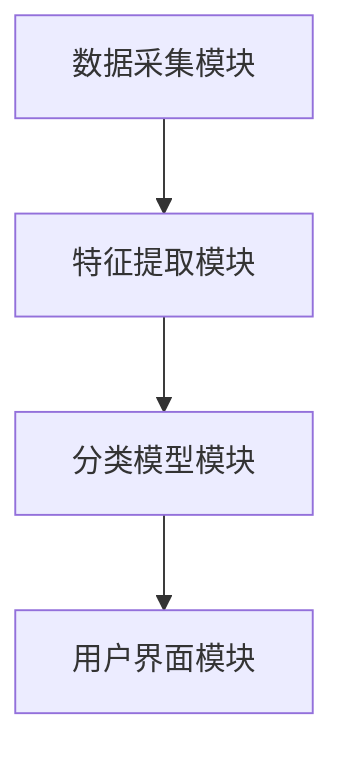

                 


# 智能婴儿监视器：AI Agent的啼哭原因分析

> 关键词：智能婴儿监视器，AI Agent，婴儿啼哭分析，声音识别，机器学习，深度学习

> 摘要：本文详细探讨了智能婴儿监视器中AI Agent对婴儿啼哭原因的分析方法。通过背景介绍、核心概念、算法原理、系统架构、项目实战和最佳实践等多方面的内容，系统地分析了AI技术在婴儿监视器中的应用，重点阐述了如何利用AI Agent对婴儿啼哭进行分类和原因分析。本文结合理论与实践，为读者提供了一套完整的解决方案，并展望了未来的发展方向。

---

# 第一部分: 智能婴儿监视器与AI Agent的背景介绍

# 第1章: 智能婴儿监视器的发展历程

## 1.1 传统婴儿监视器的功能与局限性

### 1.1.1 传统婴儿监视器的功能分析
传统婴儿监视器主要通过摄像头和音频传感器，实现对婴儿的实时监控。其核心功能包括：
- **实时监控**：通过摄像头和显示屏，家长可以实时查看婴儿的状态。
- **音频监听**：通过麦克风，家长可以听取婴儿的哭声和其他声音。
- **报警功能**：当检测到异常声音或长时间无响应时，设备会发出报警信号。

### 1.1.2 传统婴儿监视器的局限性
尽管传统婴儿监视器在一定程度上解决了家长无法实时照顾婴儿的问题，但其功能较为单一，存在以下局限性：
- **无法分析啼哭原因**：传统设备只能监听声音，无法分析婴儿啼哭的具体原因。
- **数据处理能力有限**：无法存储和分析大量的声音数据，难以提供个性化的建议。
- **缺乏智能化**：无法通过AI技术优化用户体验，无法与智能家居系统联动。

### 1.1.3 智能化升级的需求
随着AI技术的快速发展，智能化婴儿监视器的需求日益增长。家长不仅需要实时监控婴儿的状态，还需要通过设备获取更多的信息，例如：
- 婴儿的睡眠质量
- 婴儿的哭声原因
- 婴儿的情绪变化
- 婴儿的健康状况

智能化升级的需求推动了AI技术在婴儿监视器中的应用。

## 1.2 AI技术在婴儿监视器中的应用

### 1.2.1 AI技术的基本概念
AI（Artificial Intelligence）即人工智能，是指通过计算机模拟人类的智能行为，包括学习、推理、感知和决策等。AI技术的核心在于通过数据驱动的方式，训练模型完成特定任务。

### 1.2.2 AI在婴儿监视器中的应用现状
目前，AI技术已经在婴儿监视器中得到广泛应用，例如：
- **声音识别**：通过AI算法，识别婴儿的哭声类型，分析哭声的原因。
- **行为分析**：通过AI技术，分析婴儿的睡眠周期和情绪变化。
- **智能联动**：与智能家居系统联动，例如当婴儿哭闹时，自动调节室温或播放安抚音乐。

### 1.2.3 AI婴儿监视器的优势与挑战
- **优势**：
  - 提高家长的育儿效率
  - 提供科学的育儿建议
  - 实现远程监控和实时反馈
- **挑战**：
  - 数据隐私问题
  - 算法的准确性和鲁棒性
  - 设备的成本和易用性

## 1.3 本书的研究目标与意义

### 1.3.1 研究目标
本书旨在通过AI技术，实现对婴儿啼哭原因的分析，并设计一套智能化的婴儿监视器系统，帮助家长更好地理解和解决婴儿的哭闹问题。

### 1.3.2 研究意义
- **理论意义**：探索AI技术在婴儿监视器中的应用，推动智能硬件与AI技术的深度融合。
- **实践意义**：为家长提供科学的育儿工具，提升婴儿的健康和幸福感。

### 1.3.3 本书的结构安排
本书共分为七大部分，从背景介绍到系统实现，再到实际应用，全面阐述智能婴儿监视器中AI Agent的啼哭原因分析方法。

---

# 第2章: 婴儿啼哭原因分析的背景与需求

## 2.1 婴儿啼哭的基本特征

### 2.1.1 婴儿啼哭的声学特征
婴儿的哭声是一种复杂的声学信号，其特征包括：
- **频率范围**：通常在200Hz到2000Hz之间。
- **时域特征**：哭声的波形呈现周期性变化。
- **音调和节奏**：不同原因的哭声具有不同的音调和节奏。

### 2.1.2 婴儿啼哭的心理特征
婴儿哭声的心理特征主要与情绪相关，例如：
- **饥饿**：哭声通常较为急促。
- **困倦**：哭声可能带有低沉和拖长的特点。
- **疼痛**：哭声尖锐且持续时间较长。

### 2.1.3 婴儿啼哭的生理特征
婴儿啼哭的生理特征与身体状态密切相关，例如：
- **体温**：过高或过低可能导致哭闹。
- **尿布**：湿尿布或便秘可能导致不适。
- **呼吸**：异常呼吸可能引发哭闹。

## 2.2 婴儿啼哭原因分析的难点

### 2.2.1 婴儿啼哭的多样性
婴儿哭声的原因多样，包括生理需求、情绪波动和环境刺激等，导致哭声的特征复杂且难以统一分类。

### 2.2.2 数据采集的挑战
- **数据质量**：婴儿哭声的数据容易受到环境噪声的干扰。
- **数据量**：需要大量的哭声数据进行训练和验证。
- **数据多样性**：需要涵盖不同原因和不同阶段的婴儿哭声数据。

### 2.2.3 分析模型的复杂性
- **特征提取**：需要从哭声中提取有效的特征。
- **模型训练**：需要设计高效的算法，提高分类准确率。
- **实时性要求**：婴儿监视器需要实时分析哭声，对模型的计算效率提出更高要求。

## 2.3 AI技术在婴儿啼哭分析中的应用前景

### 2.3.1 AI技术的优势
- **高效性**：AI技术可以通过大数据分析，快速识别哭声的原因。
- **准确性**：通过深度学习算法，可以提高分类的准确率。
- **可扩展性**：AI技术可以不断优化模型，适应新的数据和场景。

### 2.3.2 应用场景分析
- **家庭场景**：帮助家长实时分析婴儿哭声，提供育儿建议。
- **医疗场景**：结合医疗数据，辅助医生诊断婴儿的健康问题。
- **智能硬件**：与智能家居系统联动，提供个性化的婴儿护理方案。

### 2.3.3 未来发展趋势
- **多模态分析**：结合视觉和听觉数据，提高分析的准确性。
- **个性化服务**：根据婴儿的个体特征，提供定制化的分析结果。
- **实时反馈**：通过实时分析，实现即时的育儿指导。

---

# 第3章: AI Agent的基本原理与核心概念

## 3.1 AI Agent的基本原理

### 3.1.1 AI Agent的定义
AI Agent是一种智能代理，能够通过感知环境、分析信息和执行任务，帮助用户完成特定目标。在婴儿监视器中，AI Agent负责接收哭声数据，分析原因，并提供相应的反馈。

### 3.1.2 AI Agent的核心特征
- **感知能力**：能够采集和处理声音数据。
- **分析能力**：能够通过算法分析哭声的原因。
- **决策能力**：能够根据分析结果，提供相应的建议或触发联动设备。

### 3.1.3 AI Agent的工作流程
1. **数据采集**：通过麦克风采集婴儿的哭声数据。
2. **特征提取**：对哭声数据进行预处理，提取有效的特征。
3. **分类分析**：利用机器学习算法，对哭声进行分类，识别原因。
4. **反馈输出**：将分析结果反馈给用户，并根据需要触发联动设备。

## 3.2 AI Agent与婴儿监视器的结合

### 3.2.1 AI Agent在婴儿监视器中的角色
- **数据处理**：负责处理婴儿哭声的数据。
- **分析决策**：负责分析哭声的原因，并提供相应的建议。
- **系统联动**：负责与智能家居系统联动，实现智能化的婴儿护理。

### 3.2.2 AI Agent的功能模块
- **数据采集模块**：负责采集婴儿的哭声数据。
- **特征提取模块**：负责从哭声数据中提取有效的特征。
- **分类模型模块**：负责对哭声进行分类，识别原因。
- **用户界面模块**：负责与用户交互，输出分析结果。

### 3.2.3 AI Agent的性能指标
- **准确率**：分类的准确率需要达到较高的水平。
- **实时性**：需要在较短的时间内完成分析和反馈。
- **稳定性**：需要在复杂环境下保持稳定运行。

## 3.3 婴儿啼哭分析的核心概念

### 3.3.1 婴儿啼哭的分类
婴儿啼哭可以分为以下几类：
- **饥饿哭**：哭声急促，通常伴随吸吮动作。
- **困倦哭**：哭声拖长，通常在夜间或傍晚。
- **疼痛哭**：哭声尖锐，通常伴随身体僵硬。
- **其他原因**：如尿布湿了、环境不适等。

### 3.3.2 婴儿啼哭的原因分析
通过分析哭声的特征，可以推断出婴儿哭闹的原因。例如：
- **频率分析**：高频率哭声可能表示疼痛。
- **节奏分析**：急促的节奏可能表示饥饿。
- **时域分析**：哭声的波形可能与情绪相关。

### 3.3.3 婴儿啼哭的多模态分析
除了声音数据，还可以结合其他数据，例如：
- **视觉数据**：通过摄像头观察婴儿的表情和动作。
- **生理数据**：通过传感器监测婴儿的体温、心率等。

---

# 第4章: AI Agent在婴儿监视器中的应用

## 4.1 AI Agent的核心算法

### 4.1.1 基于机器学习的分类算法
常用的机器学习算法包括：
- **支持向量机（SVM）**
- **随机森林（Random Forest）**
- **K-近邻算法（K-NN）**

### 4.1.2 基于深度学习的分类算法
常用的深度学习算法包括：
- **卷积神经网络（CNN）**
- **长短时记忆网络（LSTM）**
- **双向LSTM**

### 4.1.3 算法对比与选择
| 算法类型   | 优势             | 劣势             |
|------------|------------------|------------------|
| 传统机器学习 | 简单易实现       | 需要大量特征工程 |
| 深度学习    | 高准确性         | 计算资源消耗大   |

在实际应用中，通常选择基于深度学习的算法，例如LSTM，因为其在处理时间序列数据方面具有优势。

## 4.2 婴儿哭声数据的特征提取

### 4.2.1 声学特征提取
常用的声学特征包括：
- **梅尔频谱系数（MFCC）**
- **波形因数**
- **峰谷因数**

### 4.2.2 时间特征提取
常用的时间特征包括：
- **均值**
- **方差**
- **最大值和最小值**

## 4.3 婴儿哭声的分类模型

### 4.3.1 分类模型的设计
设计一个高效的分类模型，需要考虑以下因素：
- **数据预处理**：包括降噪、归一化等。
- **特征选择**：选择对分类有帮助的特征。
- **模型训练**：使用训练数据训练分类模型。

### 4.3.2 模型的评估与优化
常用的评估指标包括：
- **准确率（Accuracy）**
- **精确率（Precision）**
- **召回率（Recall）**
- **F1分数（F1 Score）**

---

# 第5章: 系统架构与实现

## 5.1 系统架构设计

### 5.1.1 系统功能模块
- **数据采集模块**：负责采集婴儿的哭声数据。
- **特征提取模块**：负责从哭声数据中提取特征。
- **分类模型模块**：负责对哭声进行分类。
- **用户界面模块**：负责与用户交互，输出分析结果。

### 5.1.2 系统架构图


## 5.2 系统实现细节

### 5.2.1 数据采集模块的实现
- **麦克风选择**：选择灵敏度高、抗干扰能力强的麦克风。
- **数据采集频率**：通常选择44.1kHz或48kHz的采样率。

### 5.2.2 特征提取模块的实现
- **MFCC提取**：使用 librosa 库提取梅尔频谱系数。
- **数据预处理**：包括降噪、归一化等。

### 5.2.3 分类模型模块的实现
- **模型选择**：选择 LSTM 网络进行分类。
- **模型训练**：使用 PyTorch 框架进行训练。

### 5.2.4 用户界面模块的实现
- **界面设计**：设计友好的用户界面，直观展示分析结果。
- **反馈机制**：根据分析结果，提供相应的建议或触发联动设备。

## 5.3 系统性能测试

### 5.3.1 系统准确率测试
- **测试数据集**：使用独立的测试数据集进行评估。
- **评估指标**：准确率、精确率、召回率、F1分数。

### 5.3.2 系统实时性测试
- **延迟测试**：测试从数据采集到结果输出的延迟时间。
- **吞吐量测试**：测试系统在高负载下的处理能力。

---

# 第6章: 项目实战与案例分析

## 6.1 项目环境与数据集

### 6.1.1 项目环境配置
- **开发工具**：Python 3.8及以上版本，PyTorch 1.9及以上版本。
- **依赖库安装**： librosa, numpy, scikit-learn, matplotlib.

### 6.1.2 数据集介绍
- **数据来源**：收集自真实婴儿哭声数据，涵盖多种原因。
- **数据格式**：音频文件（WAV格式）。

## 6.2 项目核心实现

### 6.2.1 数据预处理代码
```python
import librosa
import numpy as np

def preprocess_audio(audio_path):
    # 加载音频数据
    y, sr = librosa.load(audio_path, sr=44100)
    # 提取MFCC特征
    mfccs = librosa.feature.mfcc(y=y, sr=sr, n_mfcc=13)
    # 数据归一化
    mfccs = (mfccs - np.mean(mfccs, axis=1, keepdims=True)) / np.std(mfccs, axis=1, keepdims=True)
    return mfccs
```

### 6.2.2 分类模型实现代码
```python
import torch
import torch.nn as nn
import torch.optim as optim

class CryAnalyzer(nn.Module):
    def __init__(self, input_size, hidden_size, output_size):
        super(CryAnalyzer, self).__init__()
        self.lstm = nn.LSTM(input_size, hidden_size, batch_first=True)
        self.fc = nn.Linear(hidden_size, output_size)
    
    def forward(self, x):
        out, _ = self.lstm(x)
        out = self.fc(out[:, -1, :])
        return out

# 模型训练
def train_model(model, train_loader, criterion, optimizer, num_epochs):
    for epoch in range(num_epochs):
        for inputs, labels in train_loader:
            outputs = model(inputs)
            loss = criterion(outputs, labels)
            loss.backward()
            optimizer.step()
            optimizer.zero_grad()
```

## 6.3 实际案例分析

### 6.3.1 案例背景
某婴儿哭闹时，家长希望通过智能婴儿监视器分析哭声的原因。

### 6.3.2 数据分析过程
1. **数据采集**：采集婴儿的哭声数据。
2. **特征提取**：提取MFCC特征。
3. **分类分析**：通过训练好的模型，分析哭声的原因。

### 6.3.3 分析结果
经过分析，哭声的原因可能是饥饿，建议家长及时喂食。

---

# 第7章: 最佳实践与总结

## 7.1 最佳实践

### 7.1.1 数据质量管理
- **数据清洗**：去除噪声和无效数据。
- **数据增强**：通过数据增强技术，增加数据的多样性。

### 7.1.2 模型优化
- **超参数调优**：通过网格搜索优化模型的参数。
- **模型集成**：通过集成学习，提高分类的准确率。

### 7.1.3 系统优化
- **降低延迟**：优化数据处理流程，减少系统延迟。
- **提高稳定性**：增强系统的抗干扰能力。

## 7.2 项目小结

### 7.2.1 核心成果
- 成功设计并实现了一套基于AI Agent的婴儿监视器系统。
- 提出了高效的婴儿哭声分析方法。

### 7.2.2 经验总结
- 数据质量对模型的准确率有重要影响。
- 模型的实时性和稳定性需要重点关注。

## 7.3 注意事项

### 7.3.1 数据隐私
在处理婴儿数据时，需要严格遵守数据隐私保护的相关法规。

### 7.3.2 伦理问题
在使用AI技术时，需要考虑伦理问题，避免对婴儿造成不必要的干扰。

### 7.3.3 技术局限性
目前的AI技术在婴儿哭声分析方面仍存在一定的局限性，需要进一步研究和改进。

## 7.4 拓展阅读

### 7.4.1 相关技术
- **多模态分析**：结合视觉和听觉数据，提高分析的准确性。
- **实时反馈系统**：实现即时的育儿指导。

### 7.4.2 应用场景
- **医疗领域**：结合医疗数据，辅助医生诊断婴儿的健康问题。
- **智能硬件**：与智能家居系统联动，提供个性化的婴儿护理方案。

---

# 第8章: 总结与展望

## 8.1 本文总结
本文详细探讨了智能婴儿监视器中AI Agent对婴儿啼哭原因的分析方法。通过背景介绍、核心概念、算法原理、系统架构、项目实战和最佳实践等多方面的内容，系统地分析了AI技术在婴儿监视器中的应用，重点阐述了如何利用AI Agent对婴儿啼哭进行分类和原因分析。

## 8.2 未来展望
随着AI技术的不断发展，婴儿监视器的功能将更加智能化和个性化。未来的研究方向包括：
- **多模态分析**：结合更多的数据源，提高分析的准确性。
- **个性化服务**：根据婴儿的个体特征，提供定制化的分析结果。
- **实时反馈系统**：实现即时的育儿指导，帮助家长更好地照顾婴儿。

通过本文的研究和实践，我们相信AI技术在婴儿监视器中的应用将为家长和婴儿带来更多的便利和福祉。

---

# 结语

智能婴儿监视器作为AI技术在家庭场景中的重要应用之一，其发展前景广阔。通过本文的分析和实践，我们不仅掌握了AI Agent的核心原理，还为未来的研究和应用提供了宝贵的参考。希望本文能够为读者提供有价值的 insights，并激发更多关于智能婴儿监视器的研究与创新。

