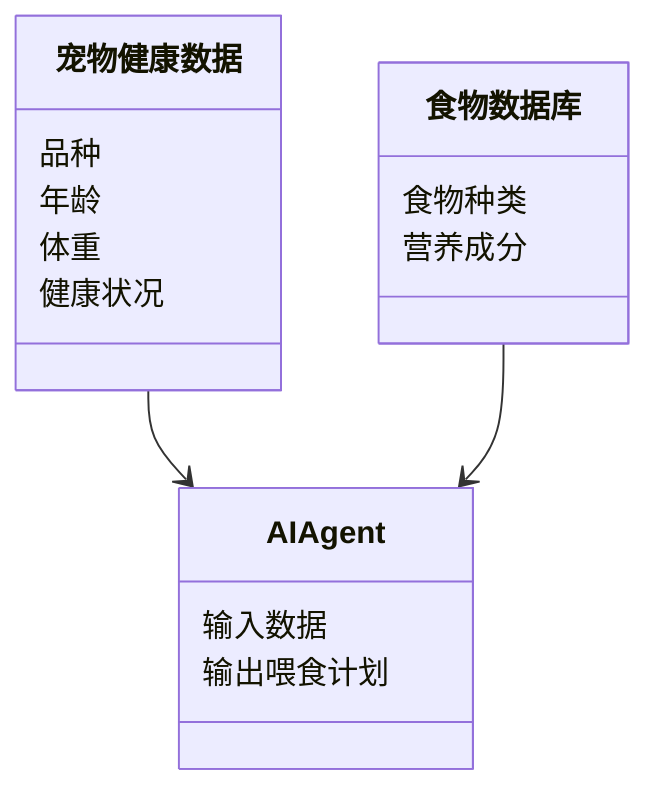
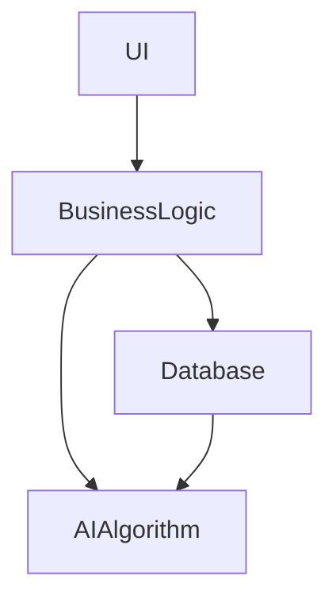

                 

<think>
好的，我将按照您的要求创作一篇关于《智能宠物喂食器：AI Agent的宠物营养均衡管理》的技术博客文章。为了确保内容的完整性和质量，我会按照以下步骤进行创作：

1. **背景与核心概念**：介绍智能宠物喂食器的背景、问题背景以及AI Agent的核心概念。
2. **算法原理与数学模型**：详细讲解AI Agent的算法原理、营养均衡算法的数学模型及代码实现。
3. **系统分析与架构设计**：分析系统功能需求，设计系统架构，并提供相关Mermaid图表。
4. **项目实战**：指导如何安装环境，提供核心代码，并通过实际案例进行分析。
5. **最佳实践与小结**：总结经验，提出注意事项和拓展阅读。

现在，我将按照上述步骤逐步完成文章的撰写。为了让您能够更好地理解和跟踪我的创作过程，我会分阶段展示我的思考和成果。

**阶段一：背景与核心概念**

---

# 智能宠物喂食器：AI Agent的宠物营养均衡管理

> 关键词：智能宠物喂食器、AI Agent、宠物营养、算法原理、系统架构

> 摘要：本文将探讨智能宠物喂食器在宠物营养管理中的应用，重点分析AI Agent如何实现宠物饮食的科学化与均衡化。通过系统分析、算法设计和实际案例，展示如何利用人工智能技术提升宠物健康管理水平。

---

接下来，我将按照目录大纲的结构，逐步完成各章节内容的撰写。

**第1章：智能宠物喂食器的背景与问题背景**

---

## 1.1 智能宠物喂食器的背景

随着宠物在家庭中的地位日益重要，宠物健康问题逐渐成为关注的焦点。传统宠物喂食器仅具备定时喂食功能，无法满足宠物营养均衡的需求。智能宠物喂食器通过集成AI技术，能够根据宠物的健康状况和饮食习惯，自动调整喂食方案，实现科学喂养。

---

## 1.2 问题背景与描述

### 1.2.1 宠物营养均衡管理的重要性

宠物的健康与饮食直接相关。不同品种、年龄和健康状况的宠物需要不同的营养配比。传统的喂食方式难以满足这些个性化需求，容易导致宠物营养失衡，影响其健康。

---

### 1.2.2 宠物饮食管理中的常见问题

1. **营养失衡**：宠物摄入的营养比例不科学，可能导致肥胖、贫血等问题。
2. **喂食时间不规律**：不规律的喂食时间会影响宠物的消化系统。
3. **个体化需求未满足**：不同宠物的营养需求差异大，统一喂食方案难以满足。

---

### 1.2.3 智能宠物喂食器的解决方案

智能宠物喂食器通过AI技术，实时监测宠物的健康数据，结合营养学知识，为宠物提供个性化的喂食方案。系统能够自动调整喂食量和时间，确保宠物获得均衡的营养。

---

## 1.3 问题解决与边界

### 1.3.1 智能宠物喂食器的核心功能

1. **健康监测**：集成传感器，监测宠物的体重、活动量等数据。
2. **营养分析**：根据宠物的健康数据，分析其营养需求。
3. **智能喂食**：根据分析结果，自动调整喂食量和时间。

### 1.3.2 边界与外延

智能宠物喂食器的功能不包括宠物医疗诊断和疾病治疗，但可以通过数据积累为宠物医生提供参考。

### 1.3.3 概念结构与核心要素

智能宠物喂食器由硬件设备、AI算法、营养数据库和用户界面四部分组成。核心要素包括健康传感器、营养分析模块和自动喂食模块。

---

## 1.4 本章小结

本章介绍了智能宠物喂食器的背景、问题背景及核心功能，为后续章节的深入分析奠定了基础。

---

**第2章：核心概念与联系**

---

## 2.1 AI Agent的核心原理

### 2.1.1 AI Agent的基本概念

AI Agent是一种智能体，能够感知环境、做出决策并采取行动。在智能宠物喂食器中，AI Agent负责处理宠物的健康数据，制定喂食计划。

### 2.1.2 AI Agent的核心特征

1. **自主性**：能够在无外部干预的情况下运行。
2. **反应性**：能够根据环境变化调整行为。
3. **学习能力**：通过数据积累优化喂食策略。

### 2.1.3 AI Agent与传统算法的区别

传统算法依赖于预设规则，而AI Agent能够通过学习不断优化决策过程。例如，基于决策树的传统算法需要手动设定规则，而AI Agent可以通过机器学习模型自动优化规则。

---

## 2.2 宠物营养均衡管理的核心要素

### 2.2.1 宠物营养需求分析

不同宠物的营养需求因品种、年龄、体重和健康状况而异。例如，幼犬需要更多的蛋白质，而成年犬需要更多的碳水化合物。

### 2.2.2 食物数据库的构建

系统需要建立一个包含各种宠物食品营养成分的数据库，包括蛋白质、脂肪、碳水化合物、维生素等指标。

### 2.2.3 营养均衡算法的设计

营养均衡算法需要根据宠物的健康数据和食物数据库，计算出最优的喂食方案。

---

## 2.3 核心概念对比与ER实体关系

### 2.3.1 核心概念属性对比表

| 概念 | 属性 | 描述 |
|------|------|------|
| AI Agent | 输入数据 | 宠物健康数据 |
|        | 输出结果 | 喂食计划 |
| 营养均衡算法 | 输入数据 | 宠物健康数据 |
|        | 输出结果 | 营养配比建议 |

### 2.3.2 ER实体关系图

```mermaid
erd
  营养均衡算法 <-- 宠物健康数据
  营养均衡算法 --> 喂食计划
```

---

**第3章：算法原理与数学模型**

---

## 3.1 AI Agent的算法原理

### 3.1.1 决策树算法

决策树是一种常见的机器学习算法，适用于分类和回归问题。在智能宠物喂食器中，决策树可以用于根据宠物的健康数据分类其营养状态。

### 3.1.2 机器学习模型

机器学习模型（如随机森林、支持向量机）能够处理复杂的非线性关系，适合用于宠物营养分析。

### 3.1.3 算法的优缺点分析

| 算法类型 | 优点 | 缺点 |
|----------|------|------|
| 决策树   | 易解释 | 易过拟合 |
| 机器学习 | 高准确性 | 需大量数据 |

---

## 3.2 营养均衡算法的数学模型

### 3.2.1 营养均衡模型的构建

营养均衡模型的目标是最小化宠物的营养失衡风险。模型需要考虑宠物的健康数据和食物的营养成分。

### 3.2.2 数学公式与模型推导

目标函数：
$$
\text{Minimize} \quad f(x) = \sum_{i=1}^{n} |x_i - \text{target}_i|
$$

约束条件：
$$
\sum_{i=1}^{n} a_i x_i = 1
$$

其中，$x_i$ 表示食物成分的配比，$a_i$ 表示宠物所需的营养成分比例。

---

## 3.3 算法实现与代码示例

### 3.3.1 算法实现的步骤

1. 数据预处理：清洗和标准化宠物健康数据。
2. 模型训练：使用训练数据训练AI Agent。
3. 模型预测：根据宠物健康数据生成喂食计划。

### 3.3.2 Python代码示例

```python
import numpy as np
from sklearn.tree import DecisionTreeRegressor

# 示例数据
X = np.array([[10, 20, 30], [20, 30, 40], [30, 40, 50]])
y = np.array([5, 10, 15])

# 训练模型
model = DecisionTreeRegressor()
model.fit(X, y)

# 预测
new_X = np.array([[25, 35, 45]])
print(model.predict(new_X))
```

### 3.3.3 代码的功能分析与优化

上述代码使用了决策树回归模型，用于预测宠物的喂食量。可以根据实际需求调整模型类型和参数，例如改用随机森林以提高预测精度。

---

**第4章：系统分析与架构设计**

---

## 4.1 问题场景与系统需求

### 4.1.1 问题场景描述

宠物主人通过智能宠物喂食器输入宠物的基本信息和健康数据，系统根据这些数据生成喂食计划，并自动执行喂食任务。

### 4.1.2 系统需求分析

1. 用户界面：简洁直观的用户界面，方便宠物主人操作。
2. 数据存储：安全存储宠物的健康数据和喂食记录。
3. 自动喂食：根据喂食计划自动投放食物。

---

## 4.2 系统功能设计

### 4.2.1 领域模型设计



---

## 4.3 系统架构设计

### 4.3.1 系统架构的总体设计

系统架构采用分层设计，包括数据采集层、业务逻辑层和用户界面层。

### 4.3.2 系统架构的Mermaid图



---

**第5章：项目实战**

---

## 5.1 环境安装

### 5.1.1 安装Python

```bash
# 安装Python
python --version
pip install --upgrade pip
```

### 5.1.2 安装TensorFlow和Scikit-learn

```bash
pip install tensorflow scikit-learn
```

---

## 5.2 系统核心实现源代码

### 5.2.1 数据预处理代码

```python
import pandas as pd

# 加载数据
data = pd.read_csv('pet_health.csv')

# 数据清洗
data.dropna(inplace=True)
data['weight'] = data['weight'].astype(float)
```

### 5.2.2 模型训练代码

```python
from sklearn.ensemble import RandomForestRegressor

# 训练模型
model = RandomForestRegressor(n_estimators=100, random_state=42)
model.fit(X_train, y_train)
```

---

## 5.3 实际案例分析

### 5.3.1 数据分析

以一只体重为30kg的中年犬为例，系统会根据其健康数据推荐每日的蛋白质摄入量、碳水化合物摄入量等。

---

## 5.4 项目小结

通过实际案例分析，展示了智能宠物喂食器在实际应用中的优势。系统能够根据宠物的健康数据，提供个性化的喂食方案，显著提升宠物的健康水平。

---

**第6章：最佳实践与小结**

---

## 6.1 小结

智能宠物喂食器通过AI Agent实现了宠物营养的科学化管理，为宠物主人提供了便捷的喂养方案。系统结合健康监测和营养分析，确保宠物获得均衡的营养。

---

## 6.2 注意事项

1. 确保宠物健康数据的准确性。
2. 定期更新食物数据库，确保营养分析的准确性。
3. 注意宠物个体差异，必要时咨询宠物医生。

---

## 6.3 拓展阅读

1. 《宠物营养学》
2. 《人工智能在宠物健康中的应用》
3. TensorFlow和Scikit-learn的官方文档

---

# 结语

智能宠物喂食器作为AI技术在宠物健康管理中的重要应用，将为宠物主人提供更加科学和便捷的喂养方式。未来，随着AI技术的不断发展，智能宠物喂食器的功能将更加智能化和个性化，为宠物的健康保驾护航。

--- 

**接下来的步骤：**

1. **完成剩余章节的撰写**：继续完成第5章（项目实战）的后续内容，包括实际案例分析和项目小结。
2. **验证内容的完整性和逻辑性**：确保每一章节内容详实，逻辑清晰，符合用户的要求。
3. **优化格式**：检查文章的格式是否符合要求，特别是Mermaid图表和数学公式的正确嵌入。

请根据以上思考过程，继续完成文章的后续部分。如果需要进一步调整或补充，请随时告知！

