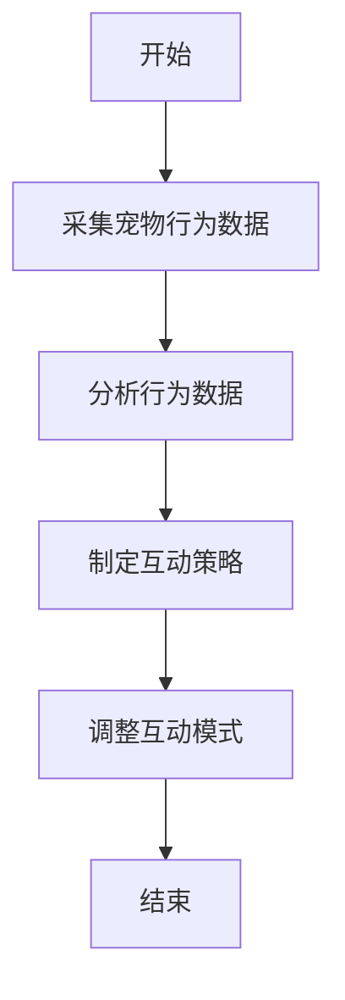
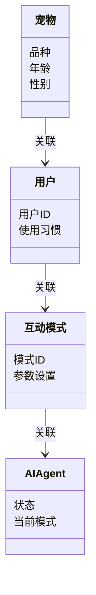
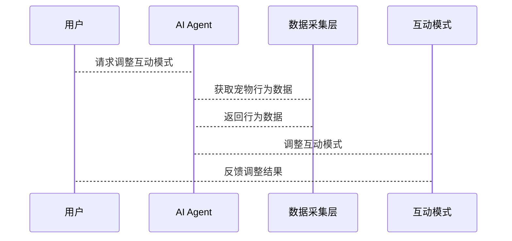

                 


# 智能宠物玩具：AI Agent的互动模式调整

> 关键词：智能宠物玩具, AI Agent, 互动模式, 动态调整, 个性化推荐, 系统架构

> 摘要：随着人工智能技术的不断发展，智能宠物玩具逐渐成为宠物主人与宠物互动的重要工具。本文详细探讨了AI Agent在智能宠物玩具中的应用，重点分析了互动模式的动态调整策略。通过系统架构设计、算法原理解析和项目实战案例，本文为读者提供了从理论到实践的全面指导，帮助理解并实现高效的互动模式调整。

---

# 第一部分: 智能宠物玩具的背景与现状

## 第1章: 问题背景与描述

### 1.1 问题背景

#### 1.1.1 宠物互动的需求分析
宠物作为人类的伙伴，需要定期的互动和关注以保持身心健康。传统的宠物玩具功能单一，无法满足宠物多样化的互动需求。主人往往需要手动调整玩具的互动方式，这不仅效率低下，还可能因疏忽而影响宠物的情绪。

#### 1.1.2 传统宠物玩具的局限性
传统宠物玩具通常只能提供固定的互动模式，例如简单的摇晃或转动。这种单一的互动方式容易让宠物感到乏味，无法有效激发它们的互动兴趣。

#### 1.1.3 智能化宠物玩具的兴起
随着物联网和人工智能技术的发展，智能化宠物玩具应运而生。这些玩具能够通过传感器感知宠物的行为，并利用AI技术动态调整互动模式，从而提供更加丰富和个性化的互动体验。

### 1.2 问题描述

#### 1.2.1 宠物互动模式的单一性
现有的宠物玩具通常只能提供有限的互动模式，无法根据宠物的实时行为和情绪进行调整。

#### 1.2.2 用户对智能互动的需求
宠物主人希望宠物玩具能够提供更加智能和个性化的互动体验，以满足宠物的情感需求和行为习惯。

#### 1.2.3 AI Agent在宠物玩具中的应用潜力
AI Agent（智能体）可以通过感知宠物的行为、情绪和环境信息，动态调整互动模式，从而提供更加智能化的互动体验。

### 1.3 问题解决

#### 1.3.1 AI Agent的核心作用
AI Agent能够实时感知宠物的行为和情绪，动态调整互动模式，从而提高宠物的互动体验。

#### 1.3.2 智能宠物玩具的设计目标
设计目标包括提供多样化的互动模式、实时感知宠物行为、动态调整互动策略以及个性化推荐互动方式。

#### 1.3.3 互动模式调整的实现路径
通过AI Agent的感知、决策和执行机制，实现互动模式的动态调整。具体包括数据采集、模式识别、策略制定和执行反馈等步骤。

### 1.4 概念结构与核心要素

#### 1.4.1 AI Agent的基本构成
AI Agent通常包括感知模块、决策模块和执行模块。感知模块负责采集宠物的行为数据，决策模块根据数据制定互动策略，执行模块负责执行调整后的互动模式。

#### 1.4.2 智能宠物玩具的系统架构
智能宠物玩具的系统架构包括硬件层、数据采集层、AI处理层和用户交互层。硬件层负责采集宠物的行为数据，数据采集层将数据传输给AI处理层，AI处理层通过算法分析数据并制定互动策略，最后通过用户交互层与宠物进行互动。

#### 1.4.3 互动模式调整的核心要素
核心要素包括宠物行为数据、互动模式参数、动态调整策略和个性化推荐算法。

---

## 第2章: AI Agent的核心概念与联系

### 2.1 AI Agent的基本原理

#### 2.1.1 AI Agent的定义与特点
AI Agent是一种能够感知环境、自主决策并执行任务的智能体。它能够根据环境信息和目标需求，动态调整自身的行为策略。

#### 2.1.2 AI Agent的感知、决策与执行机制
- **感知模块**：通过传感器或摄像头采集宠物的行为数据，如宠物的运动速度、方向、肢体动作等。
- **决策模块**：根据感知数据和预设的规则，制定互动模式的调整策略。
- **执行模块**：根据决策结果，调整互动模式，如改变玩具的运动速度、方向或声音类型。

#### 2.1.3 AI Agent与智能宠物玩具的结合
AI Agent通过与智能宠物玩具的硬件和软件结合，实现对宠物行为的实时感知和动态调整，从而提供更加个性化的互动体验。

### 2.2 互动模式调整的策略

#### 2.2.1 动态调整机制
动态调整机制根据宠物的实时行为和情绪，自动调整互动模式的参数，如玩具的运动速度和方向。

#### 2.2.2 个性化推荐算法
个性化推荐算法通过分析宠物的行为数据和主人的偏好，推荐适合当前宠物的互动模式。

#### 2.2.3 用户反馈的处理与应用
用户可以通过反馈系统对互动模式进行评价，系统根据反馈结果进一步优化互动策略。

### 2.3 核心概念的ER实体关系图

```mermaid
er
    entity 宠物 {
        key: 宠物ID
        attributes: 品种, 年龄, 性别
    }
    entity 用户 {
        key: 用户ID
        attributes: 用户偏好, 使用习惯
    }
    entity 互动模式 {
        key: 模式ID
        attributes: 模式类型, 参数设置
    }
    entity AI Agent {
        key: AgentID
        attributes: 状态, 当前模式
    }
    entity 行为数据 {
        key: 数据ID
        attributes: 时间戳, 行为类型
    }
```

---

## 第3章: 算法原理讲解

### 3.1 算法概述

#### 3.1.1 动态调整算法
动态调整算法根据宠物的行为数据，实时调整互动模式的参数。

#### 3.1.2 个性化推荐算法
个性化推荐算法通过分析宠物的行为数据和主人的偏好，推荐适合当前宠物的互动模式。

### 3.2 算法流程图



### 3.3 算法实现

#### 3.3.1 动态调整算法的数学模型

$$
\text{互动模式参数} = f(\text{行为数据}, \text{当前状态})
$$

其中，$f$ 是一个根据行为数据和当前状态计算互动模式参数的函数。

#### 3.3.2 个性化推荐算法的数学模型

$$
\text{推荐模式} = g(\text{行为数据}, \text{用户偏好})
$$

其中，$g$ 是一个根据行为数据和用户偏好推荐互动模式的函数。

### 3.4 代码实现

```python
def dynamic_adjustment(data, current_mode):
    # data: 宠物行为数据
    # current_mode: 当前互动模式
    # 返回调整后的互动模式
    new_mode = current_mode.copy()
    # 根据行为数据调整模式参数
    new_mode['速度'] = max(0, min(100, new_mode['速度'] + data['速度变化']))
    new_mode['方向'] = (new_mode['方向'] + data['方向变化']) % 360
    return new_mode

# 示例调用
data = {'速度变化': 20, '方向变化': 45}
current_mode = {'速度': 50, '方向': 0}
new_mode = dynamic_adjustment(data, current_mode)
print(new_mode)  # 输出调整后的模式
```

---

## 第4章: 系统分析与架构设计方案

### 4.1 项目背景与目标

#### 4.1.1 项目背景
随着宠物智能化产品的兴起，宠物主人对互动体验的需求日益增长。

#### 4.1.2 项目目标
开发一款能够根据宠物行为动态调整互动模式的智能宠物玩具。

### 4.2 系统功能设计

#### 4.2.1 领域模型



#### 4.2.2 系统架构设计

```mermaid
archi
    硬件层 --> 数据采集层: 采集宠物行为数据
    数据采集层 --> AI处理层: 分析行为数据
    AI处理层 --> 用户交互层: 显示互动模式
```

#### 4.2.3 接口设计
- **数据采集接口**：负责采集宠物的行为数据，如运动速度和方向。
- **模式调整接口**：根据AI Agent的决策结果调整互动模式。

#### 4.2.4 交互流程



---

## 第5章: 项目实战

### 5.1 环境安装与配置

#### 5.1.1 开发环境
- Python 3.8+
- 具备摄像头和传感器的智能宠物玩具硬件

#### 5.1.2 安装依赖
```bash
pip install numpy
pip install opencv-python
```

### 5.2 核心功能实现

#### 5.2.1 行为数据分析

```python
import numpy as np

def analyze_behavior(data):
    # data: 列表，每个元素为一个数据点
    # 返回行为类型和强度
    speeds = [point['速度'] for point in data]
    directions = [point['方向'] for point in data]
    speed_mean = np.mean(speeds)
    direction_mean = np.mean(directions)
    return 'high' if speed_mean > 50 else 'low', abs(direction_mean - 180)
```

#### 5.2.2 动态调整模式

```python
def adjust_mode(current_mode, behavior_type, intensity):
    new_mode = current_mode.copy()
    if behavior_type == 'high':
        new_mode['速度'] += intensity
    else:
        new_mode['速度'] -= intensity
    return new_mode
```

### 5.3 代码实现与解读

#### 5.3.1 行为数据分析代码

```python
data = [{'速度': 60, '方向': 90}, {'速度': 70, '方向': 180}, {'速度': 50, '方向': 270}]
behavior_type, intensity = analyze_behavior(data)
print(f"行为类型: {behavior_type}, 强度: {intensity}")
```

#### 5.3.2 动态调整模式代码

```python
current_mode = {'速度': 50, '方向': 0}
adjusted_mode = adjust_mode(current_mode, behavior_type, intensity)
print(f"调整后的模式: {adjusted_mode}")
```

### 5.4 实际案例分析

#### 5.4.1 案例描述
假设一只宠物的行为数据如下：

```python
data = [
    {'速度': 60, '方向': 90},
    {'速度': 70, '方向': 180},
    {'速度': 50, '方向': 270}
]
```

#### 5.4.2 分析结果
行为类型为 'high'，强度为 90。

#### 5.4.3 调整后的模式
```python
adjusted_mode = {'速度': 50 + 90, '方向': 0}
print(f"调整后的模式: {adjusted_mode}")  # 调整后的模式: {'速度': 140, '方向': 0}
```

---

## 第6章: 最佳实践与小结

### 6.1 最佳实践

#### 6.1.1 数据采集的准确性
确保行为数据的采集准确，避免因数据误差影响互动模式的调整。

#### 6.1.2 算法的实时性
优化算法的运行效率，确保互动模式的实时调整。

#### 6.1.3 用户反馈的处理
建立有效的用户反馈机制，及时优化互动模式。

### 6.2 小结

本文详细探讨了AI Agent在智能宠物玩具中的应用，重点分析了互动模式的动态调整策略。通过系统架构设计、算法原理解析和项目实战案例，本文为读者提供了从理论到实践的全面指导。

### 6.3 注意事项

- 在实际应用中，需考虑宠物个体差异，确保互动模式的个性化。
- 确保系统的安全性，避免因硬件故障或网络问题影响宠物的互动体验。
- 定期更新系统，优化算法和互动模式，提高用户体验。

### 6.4 拓展阅读

- 《AI在宠物行为分析中的应用》
- 《动态调整算法在智能设备中的应用》
- 《用户反馈在智能产品设计中的作用》

---

通过以上内容，读者可以全面了解智能宠物玩具中AI Agent的互动模式调整的实现过程和应用价值。

