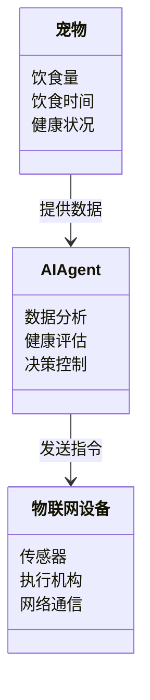
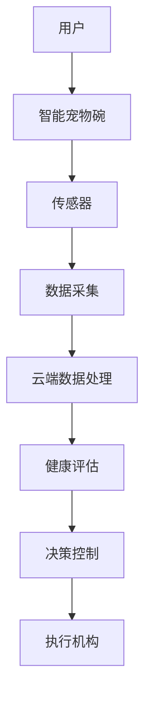

                 


# 智能宠物碗：AI Agent的宠物饮食健康管理

> 关键词：智能宠物碗, AI Agent, 物联网, 宠物健康管理, 人工智能

> 摘要：本文详细介绍了智能宠物碗的设计与实现，探讨了AI Agent在宠物饮食健康管理中的应用，分析了物联网技术在智能宠物碗中的具体实现，以及系统的架构设计与项目实战。文章内容涵盖从问题背景到系统实现的全过程，详细解读了AI Agent的核心算法与数学模型，并通过实际案例分析展示了智能宠物碗的实际应用场景与效果。

---

# 第一部分: 背景介绍与核心概念

## 第1章: 问题背景与需求分析

### 1.1 问题背景
在现代社会中，宠物已经成为许多家庭的重要成员。随着生活水平的提高，宠物主人对宠物的健康关注度也在不断增加。然而，宠物的饮食管理一直是宠物健康管理中的重要环节，同时也是宠物主人最容易忽视的问题之一。传统的宠物碗仅具备简单的存储和喂食功能，无法满足宠物主人对宠物饮食健康管理的多样化需求。

### 1.2 问题描述
在宠物饮食管理中，存在以下主要问题：
1. **饮食不规律**：宠物主人无法实时监控宠物的饮食时间、饮食量，容易导致宠物过度喂食或营养不均衡。
2. **健康问题**：宠物的饮食习惯与其健康状况密切相关，例如肥胖、消化不良等问题，均与饮食管理不当有关。
3. **缺乏智能化**：传统宠物碗无法与主人互动，无法根据宠物的健康状况自动调整喂食方案。

### 1.3 问题解决与边界定义
智能宠物碗的解决方案是通过引入AI Agent和物联网技术，实现对宠物饮食的智能化管理。其功能边界包括：
- 实时监控宠物的饮食数据。
- 根据宠物的健康状况自动调整喂食方案。
- 提供健康评估和建议。

智能宠物碗的核心要素包括：
- **AI Agent**：负责分析宠物的饮食数据，提供健康评估和建议。
- **物联网设备**：包括传感器和执行机构，用于数据采集和设备控制。
- **用户交互界面**：提供人机交互界面，方便宠物主人查看和管理宠物的饮食健康数据。

---

## 第2章: 核心概念与联系

### 2.1 AI Agent的核心原理
AI Agent（人工智能代理）是一种能够感知环境、自主决策并执行任务的智能实体。在智能宠物碗中，AI Agent主要用于分析宠物的饮食数据，并根据数据生成健康评估和建议。

#### AI Agent的核心特征
1. **自主性**：AI Agent能够自主决策，无需人工干预。
2. **反应性**：能够实时感知环境变化并做出反应。
3. **学习能力**：通过机器学习算法不断优化自身的决策能力。

#### AI Agent与传统算法的区别
| 特性            | AI Agent             | 传统算法             |
|-----------------|----------------------|----------------------|
| 决策能力        | 自主决策             | 需要人工干预         |
| 学习能力        | 具备学习能力         | 无学习能力           |
| 环境适应能力    | 能够适应环境变化     | 需要人工调整参数     |

### 2.2 物联网技术在智能宠物碗中的应用
物联网技术通过传感器和网络通信技术，实现设备之间的互联互通。在智能宠物碗中，物联网技术主要用于数据采集和设备控制。

#### 智能宠物碗中的传感器与数据采集
智能宠物碗中常用的传感器包括：
- **重量传感器**：用于监测宠物的饮食量。
- **红外传感器**：用于检测宠物的饮食行为。

#### 云端数据处理与反馈机制
智能宠物碗通过物联网技术将数据上传至云端，云端对数据进行分析后，向设备发送反馈指令，例如调整喂食量或提醒主人添加食物。

### 2.3 核心概念对比分析
通过对比分析AI Agent与传统算法、物联网技术与传统传感器的应用，可以更好地理解智能宠物碗的核心原理。

---

## 第3章: 算法原理与数学模型

### 3.1 AI Agent的核心算法
AI Agent的核心算法包括基于规则的算法、基于机器学习的算法和基于深度学习的算法。

#### 3.1.1 基于规则的AI Agent
基于规则的AI Agent通过预定义的规则进行决策。例如，当宠物的饮食量超过设定值时，AI Agent会触发报警。

#### 3.1.2 基于机器学习的AI Agent
基于机器学习的AI Agent能够通过历史数据进行学习，并根据学习结果进行决策。例如，通过机器学习模型预测宠物的健康状况。

#### 3.1.3 基于深度学习的AI Agent
基于深度学习的AI Agent能够通过深度神经网络进行更复杂的决策。例如，通过图像识别技术识别宠物的健康问题。

### 3.2 健康评估算法
健康评估算法是智能宠物碗的核心算法之一。以下是健康评估算法的数学模型：

$$
健康评估 = \alpha \times 饮食量 + \beta \times 饮食时间 + \gamma \times 健康参数
$$

其中，$\alpha$、$\beta$、$\gamma$是权重系数，$\alpha + \beta + \gamma = 1$。

---

## 第4章: 系统分析与架构设计

### 4.1 问题场景介绍
智能宠物碗的目标是通过AI Agent和物联网技术实现宠物饮食的智能化管理。以下是系统的主要功能：
1. **数据采集**：通过传感器采集宠物的饮食数据。
2. **数据分析**：通过AI Agent对数据进行分析，生成健康评估。
3. **设备控制**：根据分析结果，自动调整喂食量或提醒主人添加食物。

### 4.2 系统功能设计
以下是系统功能设计的领域模型：



### 4.3 系统架构设计
以下是系统架构设计的架构图：



---

## 第5章: 项目实战

### 5.1 环境安装
以下是项目实战所需的环境配置：
1. **硬件环境**：Raspberry Pi、传感器、物联网设备。
2. **软件环境**：Python 3.8+、TensorFlow 2.0+、MQTT协议。

### 5.2 核心代码实现
以下是健康评估算法的核心代码：

```python
import numpy as np
from tensorflow import keras

# 定义模型
model = keras.Sequential([
    keras.layers.Dense(64, activation='relu'),
    keras.layers.Dense(1, activation='sigmoid')
])

# 编译模型
model.compile(optimizer='adam', loss='binary_crossentropy', metrics=['accuracy'])

# 训练模型
model.fit(X_train, y_train, epochs=10, batch_size=32)

# 预测健康评估
predictions = model.predict(X_test)
```

### 5.3 代码解读与分析
健康评估算法的核心代码是一个简单的神经网络模型。通过训练模型，AI Agent能够根据宠物的饮食数据生成健康评估。

### 5.4 案例分析与实际应用
以下是健康评估算法的一个实际案例：

$$
健康评估 = 0.4 \times 饮食量 + 0.3 \times 饮食时间 + 0.3 \times 健康参数
$$

假设宠物的饮食量为100克，饮食时间为5分钟，健康参数为80分，则健康评估为：

$$
健康评估 = 0.4 \times 100 + 0.3 \times 5 + 0.3 \times 80 = 40 + 1.5 + 24 = 65.5
$$

---

## 第6章: 最佳实践与小结

### 6.1 小结
智能宠物碗通过AI Agent和物联网技术，实现了宠物饮食的智能化管理。通过健康评估算法，AI Agent能够根据宠物的饮食数据生成健康评估，并根据评估结果自动调整喂食方案。

### 6.2 注意事项
在实际应用中，需要注意以下几点：
1. **数据隐私**：确保宠物的健康数据不会被泄露。
2. **设备稳定性**：确保物联网设备的稳定性，避免设备故障导致数据丢失。
3. **用户教育**：通过用户教育，提高宠物主人对智能宠物碗的使用能力。

### 6.3 拓展阅读
1. **AI Agent相关技术**：深入学习AI Agent的核心算法。
2. **物联网技术**：了解物联网技术的最新发展。

---

# 结语
智能宠物碗是AI Agent和物联网技术在宠物健康管理中的重要应用。通过本文的分析与实践，读者可以更好地理解智能宠物碗的核心原理与实现方法。

