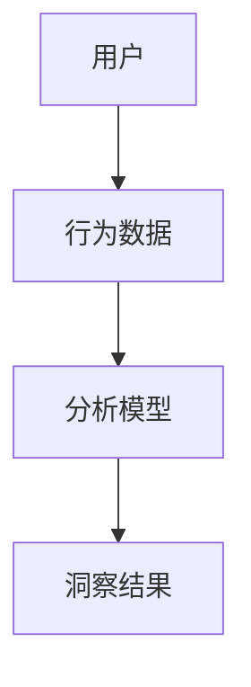
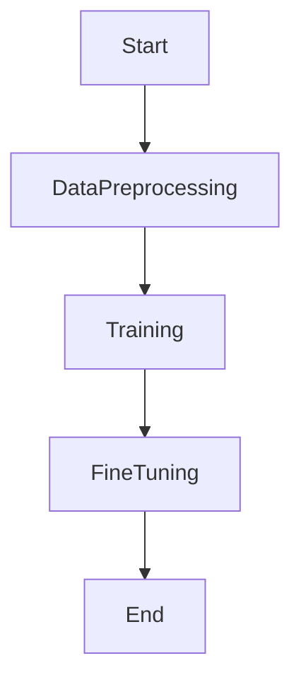
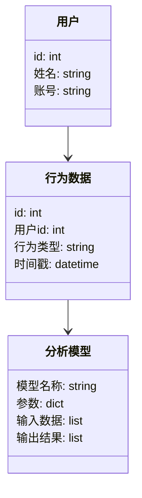

                 


# 智能客户洞察AI Agent：LLM驱动的用户行为分析

## 关键词
智能客户洞察，AI Agent，LLM，用户行为分析，大语言模型

## 摘要
本文详细探讨了利用大语言模型（LLM）驱动的智能客户洞察AI Agent在用户行为分析中的应用。通过分析用户行为数据，LLM能够提供深入的洞察和预测，帮助企业做出更明智的决策。文章从背景介绍、核心概念、算法原理、系统架构到项目实战，全面阐述了如何构建和应用智能客户洞察AI Agent，旨在为企业提供一个高效、智能的用户行为分析解决方案。

---

## 第1章：智能客户洞察AI Agent的背景与意义

### 1.1 问题背景与挑战
用户行为分析是企业理解客户、提升用户体验和制定精准营销策略的关键。传统的分析方法依赖于规则引擎和统计分析，但在处理复杂行为模式和实时反馈方面存在局限性。随着大语言模型（LLM）的发展，企业对智能客户洞察的需求日益增长。LLM的强大自然语言处理能力使其成为用户行为分析的理想工具。

### 1.2 问题描述与目标
用户行为分析的核心问题是如何从海量数据中提取有价值的信息，并实时提供洞察。智能客户洞察AI Agent的目标是通过LLM技术，实现对用户行为的深度理解和预测，帮助企业提升客户满意度和转化率。

### 1.3 问题解决与实现路径
通过LLM驱动的方法，整合数据处理和分析技术，构建一个自动化、智能化的用户行为分析系统。实现路径包括数据收集、处理、分析和可视化，确保系统能够实时响应用户行为变化。

### 1.4 边界与外延
智能客户洞察的边界在于不涉及产品推荐，仅专注于行为分析。与其他AI应用（如聊天机器人）的区别在于其分析而非交互功能。技术实现范围限定在前端分析，不涉及后端服务。

### 1.5 概念结构与核心要素
智能客户洞察AI Agent由用户、行为数据、分析模型和洞察结果构成，各要素之间相互关联，共同实现用户行为的深度分析。

---

## 第2章：LLM驱动的用户行为分析原理

### 2.1 LLM的核心原理
大语言模型基于Transformer架构，通过自注意力机制捕捉上下文信息。编码器和解码器结构使其能够处理序列数据，适用于用户行为分析中的模式识别和预测。

### 2.2 用户行为分析的关键技术
数据预处理与特征提取、行为模式识别与预测、语义理解与意图识别是用户行为分析的核心技术。通过LLM的强大能力，能够更准确地理解用户意图。

### 2.3 实体关系分析
使用ER图展示用户、行为数据、分析模型和洞察结果之间的关系：


---

## 第3章：LLM的算法原理与流程

### 3.1 LLM的训练流程
训练流程包括数据预处理、模型训练和微调。通过大规模数据训练，优化模型性能以适应特定任务需求：


### 3.2 模型推理过程
输入处理、解码过程和输出结果是模型推理的关键步骤。代码示例展示了如何实现简单的LLM模型，数学公式解释了编码器和解码器的原理：
```python
class LLMModel(torch.nn.Module):
    def __init__(self, vocab_size):
        super().__init__()
        self.token_embedding = torch.nn.Embedding(vocab_size, 64)
        self.positional_encoding = torch.nn.Linear(64, 64)
        self.transformer_block = TransformerBlock(64, 8, 64)

    def forward(self, input_ids):
        token_embeddings = self.token_embedding(input_ids)
        pos_embeddings = self.positional_encoding(torch.arange(input_ids.size(1), device=input_ids.device).unsqueeze(0).repeat(input_ids.size(0), 1))
        embeddings = token_embeddings + pos_embeddings
        output = self.transformer_block(embeddings)
        return output
```

---

## 第4章：系统分析与架构设计方案

### 4.1 问题场景介绍
电商和社交媒体中的用户行为分析是典型场景。系统需要实时收集和分析数据，提供实时反馈。

### 4.2 系统功能设计
数据收集模块实时获取行为数据，数据处理模块清洗和提取特征，分析模块使用LLM进行预测，可视化界面展示结果。

### 4.3 领域模型类图


### 4.4 系统架构设计


### 4.5 接口设计与交互
```mermaid
sequenceDiagram
    用户 -->+ 终端: 提交查询
    终端 -->+ 服务器: 发送请求
    服务器 -->+ 分析模型: 处理请求
    分析模型 -->+ 返回结果
    服务器 -->- 终端: 返回响应
    用户 <--- 终端: 收到结果
```

---

## 第5章：项目实战

### 5.1 环境安装
安装必要的Python库：
```bash
pip install python python-tensorflow keras huggingface-transformers
```

### 5.2 核心代码实现
数据处理和模型训练代码示例：
```python
import pandas as pd
df = pd.read_csv('user_behavior.csv')
df = df.dropna()
df['timestamp'] = pd.to_datetime(df['timestamp'])

from transformers import AutoTokenizer, AutoModelForMaskedLM
tokenizer = AutoTokenizer.from_pretrained('bert-base-cased')
model = AutoModelForMaskedLM.from_pretrained('bert-base-cased')
```

### 5.3 代码解读与分析
数据预处理模块清洗数据，模型训练模块加载预训练模型并进行微调，分析模块结合LLM进行预测。

### 5.4 案例分析与详细讲解
通过电商和社交媒体案例展示系统的实际应用，分析用户行为模式和预测结果。

### 5.5 项目小结
成功实现智能客户洞察AI Agent，提升用户行为分析的准确性和实时性。

---

## 第6章：最佳实践与注意事项

### 6.1 实践经验总结
强调数据质量和模型调优的重要性，推荐使用数据增强和交叉验证。

### 6.2 小结与展望
总结项目成果，展望未来可能的改进方向，如引入强化学习和集成模型。

### 6.3 注意事项与风险提示
关注数据隐私保护，确保模型泛化能力和系统的可扩展性。

### 6.4 拓展阅读
推荐相关书籍和资源，帮助读者深入学习和应用相关技术。

---

## 第7章：附录

### 7.1 术语表
解释文中涉及的核心术语。

### 7.2 参考文献
列出文章中引用的文献和技术资料。

---

通过以上详细内容，我们全面探讨了智能客户洞察AI Agent的构建与应用，为企业提供了高效、智能的用户行为分析解决方案。

