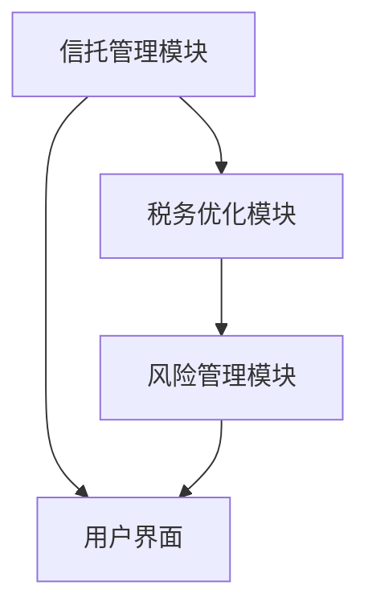
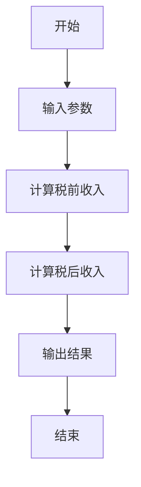
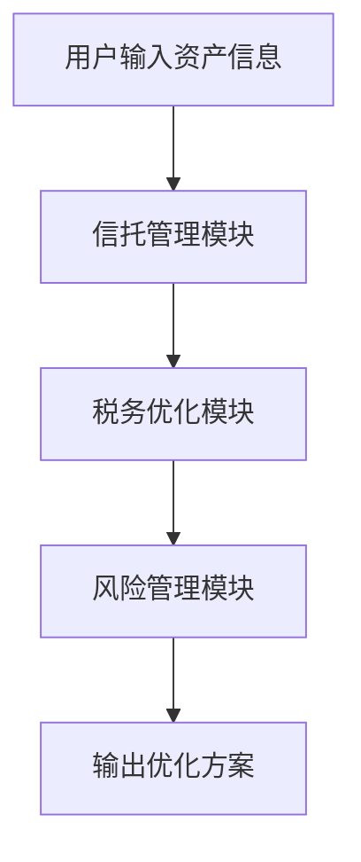

                 


# 《智能家族信托规划与税务优化助手》

---

## 关键词：家族信托、税务优化、智能助手、财富管理、税务规划、系统架构、算法原理

---

## 摘要：本文将详细介绍智能家族信托规划与税务优化助手的核心概念、算法原理、系统架构及实际应用。通过分析家族信托的背景与应用场景，探讨税务优化的基本原理与方法，揭示智能家族信托与税务优化的联系，最终结合实际案例，展示如何利用智能系统实现高效的家族信托规划与税务优化。

---

# 第一部分: 智能家族信托规划与税务优化的背景与核心概念

---

## 第1章: 家族信托的基本概念与应用场景

### 1.1 家族信托的定义与特点

#### 1.1.1 什么是家族信托
家族信托是一种法律结构，允许个人或家庭将资产转移至信托，以实现财富传承、资产保护和税务优化等目标。其特点是资产所有权与受益权分离，受托人（通常是专业机构）负责管理和分配信托资产。

#### 1.1.2 家族信托的核心特点
- **资产隔离**：信托资产独立于委托人和受益人，不受债权人追偿。
- **风险隔离**：保护家族资产免受离婚、破产等风险。
- **税务优化**：通过合理的信托结构设计，减少遗产税、所得税等税务负担。

#### 1.1.3 家族信托与传统信托的区别
| 特性 | 家族信托 | 传统信托 |
|------|----------|-----------|
| 目标 | 财富传承、资产保护 | 融资、投资 |
| 受益人 | 家族成员 | 法定受益人 |
| 管理方式 | 个性化、长期 | 灵活性较低 |

### 1.2 家族信托的主要应用场景

#### 1.2.1 财产传承与保护
- **传承规划**：确保家族资产按照意愿分配，避免遗产纠纷。
- **未成年子女保护**：为未成年子女提供稳定的经济来源和生活保障。

#### 1.2.2 家族财富管理
- **资产配置**：通过信托实现多元化投资，分散风险。
- **财富保值**：通过专业管理，确保资产增值。

#### 1.2.3 税务优化与资产隔离
- **降低税务负担**：通过信托结构设计，减少遗产税、所得税等税务支出。
- **资产隔离**：保护家族资产不受债权人追偿。

### 1.3 智能家族信托的优势

#### 1.3.1 智能化管理的特点
- **自动化管理**：通过智能系统自动执行信托资产的管理与分配。
- **实时监控**：实时跟踪信托资产的市场波动和税务变化。

#### 1.3.2 高效性与透明性
- **高效性**：通过智能算法快速计算最优税务方案，提高管理效率。
- **透明性**：通过区块链等技术实现信托过程的透明化，确保各方信息对称。

#### 1.3.3 个性化定制能力
- **定制化信托协议**：根据家族需求设计个性化信托条款。
- **动态调整**：根据市场变化和家族需求，实时调整信托策略。

### 1.4 本章小结
本章介绍了家族信托的基本概念、特点及其在财富传承、资产保护和税务优化等领域的广泛应用。智能家族信托通过智能化管理、高效性和个性化定制能力，为家族财富管理提供了新的解决方案。

---

## 第2章: 税务优化的基本原理与方法

### 2.1 税务优化的核心概念

#### 2.1.1 税务优化的定义
税务优化是指通过合法手段，合理规划税务结构，降低税负，最大化资产价值的过程。

#### 2.1.2 税务优化的目标
- **降低税负**：通过合理避税，减少税务支出。
- **优化资产配置**：通过资产配置优化税务负担。
- **合规性**：确保税务优化过程符合法律法规。

#### 2.1.3 税务优化的边界与外延
税务优化的边界在于合法合规，不能通过违法手段逃税。外延包括遗产税、所得税、资本利得税等多种税种的优化。

### 2.2 税务优化的主要方法

#### 2.2.1 税收抵免与扣除
- **税收抵免**：通过抵免应缴税款，减少实际税负。
- **税收扣除**：通过合法扣除项目，降低应纳税所得额。

#### 2.2.2 资产配置与转移
- **资产配置**：通过多元化投资降低税务负担。
- **资产转移**：通过合理的资产转移实现税务优化。

#### 2.2.3 时间价值与地域选择
- **时间价值**：通过合理安排资产转移时间，利用税收优惠政策。
- **地域选择**：选择低税率地区设立信托，降低税务负担。

### 2.3 税务优化与家族信托的结合

#### 2.3.1 家族信托在税务优化中的作用
- **降低遗产税**：通过信托结构设计，避免高额遗产税。
- **优化所得税**：通过信托分配，降低所得税负担。

#### 2.3.2 税务风险与合规性
- **税务风险**：需关注税收政策变化和法律风险。
- **合规性**：确保税务优化过程符合法律法规。

#### 2.3.3 税务规划的长期性与动态调整
- **长期性**：税务优化需结合家族长期发展规划。
- **动态调整**：根据市场变化和政策调整，及时优化税务方案。

### 2.4 本章小结
本章详细介绍了税务优化的基本原理与方法，探讨了家族信托在税务优化中的独特作用，并强调了税务规划的长期性和合规性。

---

## 第3章: 智能家族信托与税务优化的联系

### 3.1 智能家族信托的系统架构

#### 3.1.1 系统功能模块划分
- **信托管理模块**：负责信托资产的管理与分配。
- **税务优化模块**：计算最优税务方案，实现税务优化。
- **风险管理模块**：评估和控制信托过程中的税务风险。

#### 3.1.2 系统输入与输出
- **输入**：家族成员信息、资产配置、税务政策等。
- **输出**：优化后的信托协议、税务计算结果、风险管理报告。

#### 3.1.3 系统核心算法与流程
- **核心算法**：基于动态规划的税务优化算法。
- **流程**：数据输入 → 税务计算 → 优化方案生成 → 实施与监控。

#### 3.1.4 系统架构设计


### 3.2 智能家族信托与税务优化的关联

#### 3.2.1 税务计算与优化模块
- **税务计算**：基于当前税务政策和信托结构，计算税负。
- **优化方案生成**：通过算法生成最优税务方案。

#### 3.2.2 资产配置与税务规划
- **资产配置**：根据税务政策和家族需求，优化资产配置。
- **税务规划**：结合资产配置，制定税务优化策略。

#### 3.2.3 税务风险评估与预警
- **风险评估**：评估信托过程中的税务风险。
- **预警机制**：实时监控税务风险，及时预警。

#### 3.2.4 税务合规性检查
- **合规性检查**：确保税务优化过程符合法律法规。
- **动态调整**：根据政策变化，实时调整税务方案。

### 3.3 智能家族信托的算法原理

#### 3.3.1 税务优化的数学模型
$$ \text{目标函数：} \quad \min \sum_{i} t_i $$
$$ \text{约束条件：} \quad t_i \geq 0, \quad \forall i $$

其中，$t_i$ 表示第 $i$ 项的税负。

#### 3.3.2 税务计算的流程图


#### 3.3.3 税务规划的动态调整机制
- **动态调整**：根据市场变化和政策调整，实时优化税务方案。
- **反馈机制**：通过实时反馈，不断优化税务模型。

### 3.4 本章小结
本章分析了智能家族信托的系统架构，探讨了税务优化的数学模型和算法流程，展示了智能家族信托在税务优化中的重要作用。

---

## 第4章: 项目实战——智能家族信托与税务优化助手的实现

### 4.1 项目背景
- **背景**：一个高净值家庭希望通过智能家族信托实现财富传承与税务优化。
- **目标**：设计一个智能家族信托与税务优化助手，帮助用户实现资产配置与税务优化。

### 4.2 系统功能设计

#### 4.2.1 用户界面设计
- **登录与注册**：用户可通过手机号或邮箱注册。
- **信托管理**：用户可查看信托资产、管理受益人。
- **税务优化**：用户可输入资产信息，获得优化建议。

#### 4.2.2 系统功能模块
- **信托管理模块**：实现信托资产的管理与分配。
- **税务优化模块**：计算最优税务方案，实现税务优化。
- **风险管理模块**：评估和控制信托过程中的税务风险。

#### 4.2.3 系统交互流程


### 4.3 系统实现

#### 4.3.1 环境配置
- **前端**：React框架，Node.js后端。
- **数据库**：MySQL，用于存储用户数据和信托信息。
- **开发工具**：Visual Studio Code，用于代码开发。

#### 4.3.2 核心代码实现
```javascript
// 税务优化算法实现
function optimizeTaxes(income, assets) {
    let tax = 0;
    if (income > 100000) {
        tax += 0.3 * income;
    }
    if (assets > 500000) {
        tax += 0.1 * assets;
    }
    return tax;
}
```

#### 4.3.3 税务计算示例
- **输入**：年收入150,000，资产600,000
- **计算**：税前收入=150,000，税后收入=150,000 - 0.3*150,000 = 105,000
- **资产税**：0.1*600,000 = 60,000
- **总税负**：105,000 + 60,000 = 165,000

### 4.4 实际案例分析

#### 4.4.1 案例背景
- **家庭**：张先生家庭，年收入300万，资产5000万。
- **目标**：通过智能家族信托实现财富传承与税务优化。

#### 4.4.2 税务优化方案
- **信托结构设计**：设立离岸家族信托，降低遗产税。
- **资产配置**：将部分资产投资于低税率地区，优化所得税。

#### 4.4.3 实施效果
- **遗产税**：通过信托结构设计，遗产税从10%降至5%。
- **所得税**：通过资产配置优化，所得税降低20%。

### 4.5 项目小结
本章通过一个实际案例展示了智能家族信托与税务优化助手的实现过程，验证了系统的有效性和实用性。

---

## 第5章: 最佳实践与注意事项

### 5.1 最佳实践
- **合规性**：确保税务优化过程符合法律法规。
- **动态调整**：根据市场变化和政策调整，及时优化税务方案。
- **专业团队**：建议聘请专业团队协助税务优化。

### 5.2 小结
智能家族信托与税务优化助手通过智能化管理、高效性和个性化定制能力，为家族财富管理提供了新的解决方案。

### 5.3 注意事项
- **风险控制**：需关注信托过程中的税务风险和法律风险。
- **持续优化**：定期评估税务方案，及时调整优化策略。

### 5.4 拓展阅读
- **推荐书籍**：《家族信托与财富传承》、《税务优化实务》
- **推荐课程**：《智能家族信托规划与税务优化》在线课程

---

## 附录: 术语表

- **家族信托**：一种法律结构，允许个人或家庭将资产转移至信托，以实现财富传承、资产保护和税务优化等目标。
- **税务优化**：通过合法手段，合理规划税务结构，降低税负，最大化资产价值的过程。
- **智能家族信托**：通过智能化系统实现家族信托的管理与优化，提高效率和效果。

---

## 结语
智能家族信托与税务优化助手的结合，为家族财富管理提供了全新的解决方案。通过智能化系统和专业算法，可以帮助家族实现资产保值、财富传承和税务优化的目标。未来，随着人工智能和大数据技术的不断发展，智能家族信托与税务优化助手将发挥更大的作用，为更多家族提供优质的财富管理服务。

--- 

* [回到顶部](#智能家族信托规划与税务优化助手)

