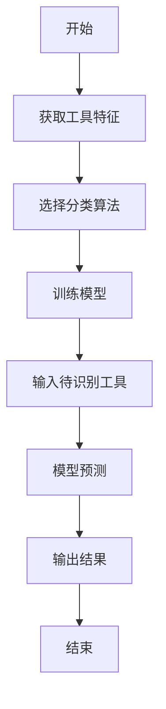
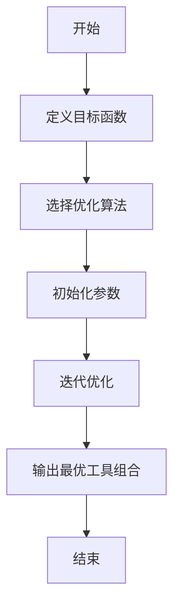
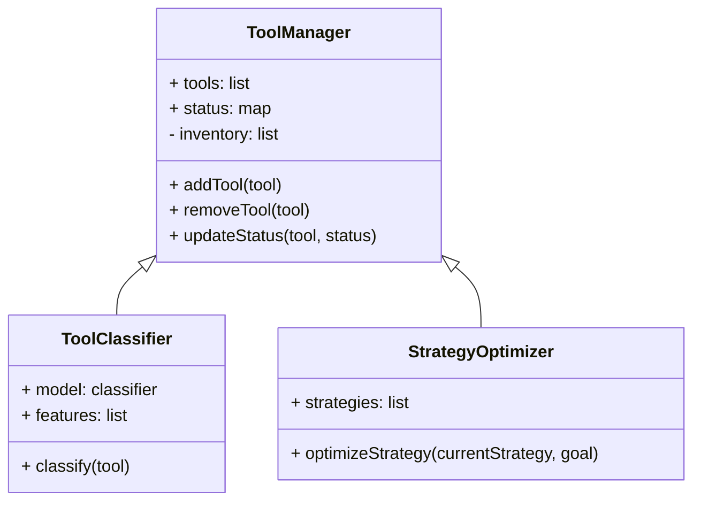

                 


# 智能工具箱：AI Agent的工具识别与管理

> 关键词：AI Agent，工具识别，工具管理，智能工具箱，系统架构，算法原理

> 摘要：AI Agent作为一种智能体，其核心能力之一是工具识别与管理。本文将从AI Agent的基本概念出发，深入探讨工具识别与管理的核心原理、算法实现、系统架构设计以及实际应用场景。通过案例分析和代码实现，详细讲解工具识别与管理的关键技术，并总结最佳实践和未来发展方向。

---

## 第一部分：AI Agent与工具识别管理概述

### 第1章：AI Agent的基本概念

#### 1.1 什么是AI Agent？
AI Agent（人工智能代理）是指能够感知环境、自主决策并执行任务的智能体。它能够通过与环境交互来实现特定目标，是人工智能领域的核心研究对象之一。

#### 1.2 AI Agent的核心概念
- **自主性**：AI Agent能够自主决策，无需外部干预。
- **反应性**：能够实时感知环境并做出反应。
- **目标导向性**：所有行为都以实现特定目标为导向。
- **社交能力**：能够与其他Agent或人类进行交互和协作。

#### 1.3 工具识别与管理的定义
工具识别与管理是AI Agent的一项核心能力，指AI Agent能够识别可用工具，并对其进行有效管理，以实现特定任务的目标。

---

### 第2章：工具识别与管理的背景与意义

#### 2.1 问题背景
随着人工智能技术的快速发展，AI Agent的应用场景日益广泛。然而，AI Agent在实际应用中需要依赖各种工具（如API、数据库、第三方服务等）来完成任务。如何高效识别和管理这些工具，是AI Agent设计中的关键问题。

#### 2.2 问题描述
AI Agent的工具识别与管理面临以下挑战：
1. **工具多样性**：工具种类繁多，特性各异。
2. **动态变化**：工具的可用性可能随环境变化而改变。
3. **效率要求**：工具识别与管理需要高效准确。

#### 2.3 工具识别与管理的意义
通过有效的工具识别与管理，AI Agent能够：
1. 提高任务执行效率。
2. 增强环境适应能力。
3. 降低系统维护成本。

---

## 第二部分：工具识别与管理的核心原理

### 第3章：工具识别的原理

#### 3.1 工具识别的关键特征
- **工具类型**：工具可以是API、数据库、文件等。
- **工具属性**：每个工具都有特定的功能和使用限制。
- **工具标识**：工具可以通过名称、功能或位置进行标识。

#### 3.2 工具识别的实现机制
1. **基于特征的识别**：通过工具的特征（如功能、接口）进行识别。
2. **基于上下文的识别**：结合环境上下文进行工具识别。
3. **基于规则的识别**：通过预定义规则匹配工具特征。

### 第4章：工具管理的原理

#### 4.1 工具管理的核心要素
- **工具库存**：记录可用工具的基本信息。
- **工具状态**：监控工具的可用性和性能。
- **工具策略**：制定工具使用和切换的策略。

#### 4.2 工具管理的实现机制
1. **库存管理**：动态维护工具库存。
2. **状态监控**：实时监控工具状态。
3. **策略优化**：根据环境变化动态调整工具使用策略。

---

## 第三部分：工具识别与管理的算法原理

### 第5章：工具识别的分类算法

#### 5.1 分类算法概述
工具识别可以看作是一个分类问题，可以通过机器学习算法进行模型训练。

#### 5.2 常见分类算法
1. **决策树**：通过特征分层进行工具分类。
2. **随机森林**：通过多棵决策树进行投票分类。
3. **支持向量机（SVM）**：通过高维空间的分割进行分类。

#### 5.3 深度学习分类算法
- **卷积神经网络（CNN）**：适用于图像类工具的识别。
- **循环神经网络（RNN）**：适用于序列数据的工具识别。

#### 5.4 工具识别算法的流程图


---

### 第6章：工具管理的优化算法

#### 6.1 优化算法概述
工具管理需要在多种工具中选择最优工具，可以通过优化算法实现。

#### 6.2 常见优化算法
1. **贪心算法**：逐步选择最优工具。
2. **动态规划**：通过分阶段决策优化工具选择。
3. **遗传算法**：模拟自然选择过程优化工具组合。

#### 6.3 工具管理优化算法的流程图


---

## 第四部分：系统分析与架构设计

### 第7章：系统功能设计

#### 7.1 系统功能模块
1. **工具识别模块**：负责工具的识别和分类。
2. **工具管理模块**：负责工具的库存管理和状态监控。
3. **策略优化模块**：负责工具使用的动态策略调整。

#### 7.2 系统功能设计的类图


---

## 第五部分：项目实战与案例分析

### 第8章：项目实战

#### 8.1 环境安装
1. **安装Python**：Python 3.8+
2. **安装依赖库**：`scikit-learn`, `numpy`, `pandas`

#### 8.2 核心代码实现
```python
from sklearn.tree import DecisionTreeClassifier
from sklearn.model_selection import train_test_split
import numpy as np

# 示例数据：工具特征与标签
X = np.array([[1, 0, 0], [0, 1, 0], [0, 0, 1], [1, 1, 0]])
y = np.array(['API', 'DB', 'File', 'API'])

# 训练决策树分类器
clf = DecisionTreeClassifier()
X_train, X_test, y_train, y_test = train_test_split(X, y, test_size=0.25, random_state=42)
clf.fit(X_train, y_train)

# 工具识别
new_tool = np.array([[1, 1, 0]])
print(clf.predict(new_tool))  # 输出：['API']
```

---

### 第9章：案例分析

#### 9.1 案例背景
假设我们需要设计一个AI Agent来管理多种工具（API、数据库、文件等）。

#### 9.2 案例分析
1. **工具识别**：使用决策树算法识别工具类型。
2. **工具管理**：动态调整工具使用策略。

---

## 第六部分：总结与展望

### 第10章：总结与展望

#### 10.1 最佳实践
- **工具识别**：选择合适的分类算法，确保数据质量。
- **工具管理**：动态优化策略，实时监控工具状态。

#### 10.2 小结
本文详细讲解了AI Agent的工具识别与管理的核心原理、算法实现和系统架构设计，并通过案例分析展示了实际应用。

#### 10.3 注意事项
- 工具识别与管理需要结合具体场景进行优化。
- 注意工具的多样性和动态变化对系统的影响。

#### 10.4 拓展阅读
- 推荐阅读《机器学习实战》和《深度学习》。

---

## 结语

通过本文的讲解，读者可以全面了解AI Agent的工具识别与管理的核心技术，并能够在实际项目中灵活应用。未来，随着人工智能技术的不断发展，工具识别与管理将更加智能化和高效化。

