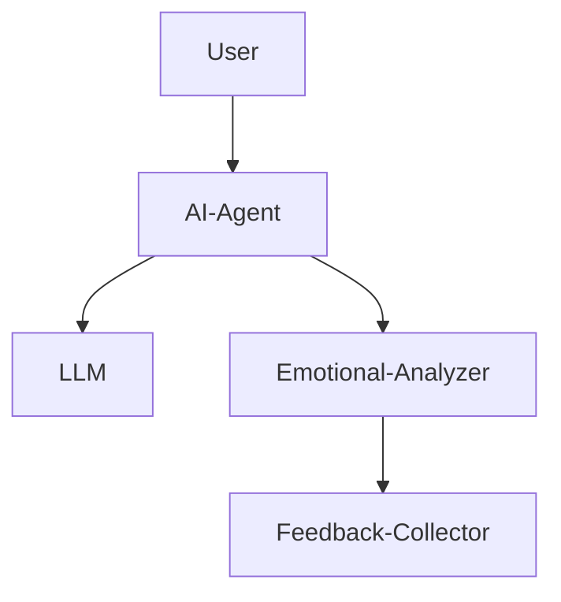
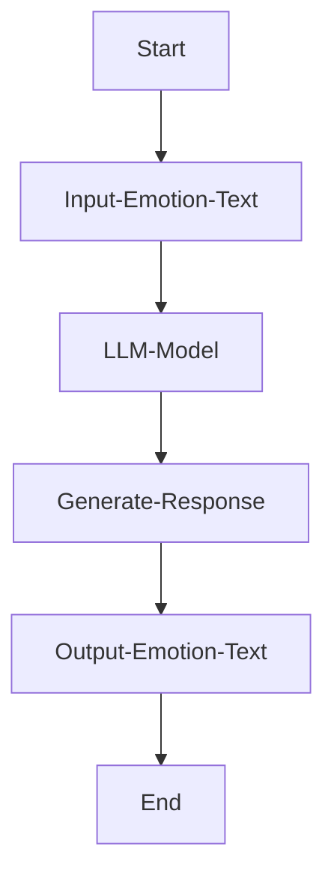
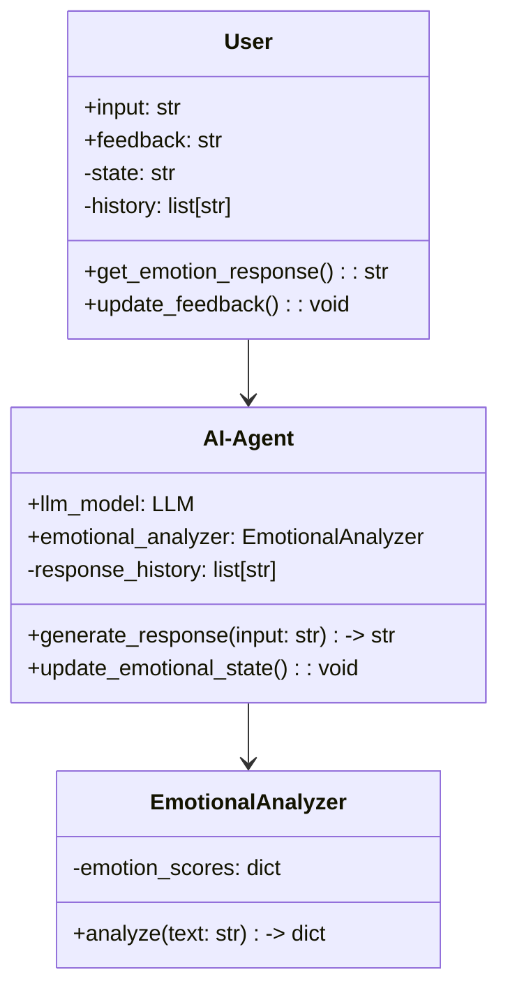
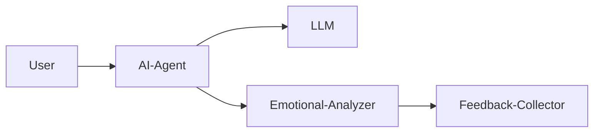
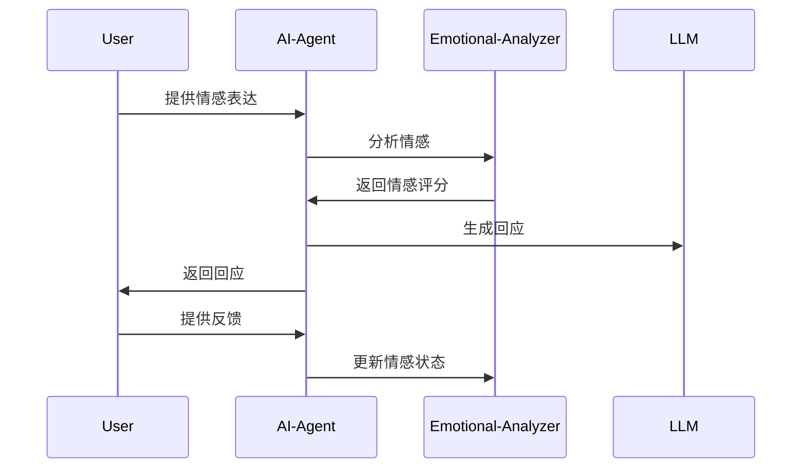

                 


# 智能情感陪伴 AI Agent：LLM 在心理健康领域的深度应用

## 关键词：智能情感陪伴，AI Agent，LLM，心理健康，人工智能，情感分析

## 摘要：  
随着人工智能技术的飞速发展，LLM（大语言模型）在心理健康领域的应用潜力逐渐显现。本文深入探讨了基于LLM的情感陪伴AI Agent的设计与实现，分析了其在心理健康支持中的核心作用。文章从问题背景、核心概念、算法原理、系统架构、项目实战等多个维度展开，详细讲解了如何利用AI技术为心理健康提供智能化、个性化的解决方案。本文还提供了实际的代码示例和系统设计图，帮助读者更好地理解和应用相关技术。

---

## 第一部分: 智能情感陪伴 AI Agent 的背景与核心概念

### 第1章: 智能情感陪伴 AI Agent 的背景介绍

#### 1.1 问题背景与问题描述
##### 1.1.1 心理健康问题的现状与挑战  
现代社会节奏加快，心理健康问题日益普遍。焦虑、抑郁等心理疾病逐渐年轻化，传统心理咨询资源有限，难以满足日益增长的需求。  

##### 1.1.2 传统心理咨询的局限性  
- 专业心理咨询师数量不足，覆盖面有限。  
- 用户可能因隐私问题或地理位置限制难以获得及时帮助。  
- 咨询过程依赖人工判断，难以实现个性化和实时反馈。  

##### 1.1.3 AI技术在心理健康领域的潜力  
AI技术可以提供24/7的实时支持，覆盖更广泛的人群，同时通过数据驱动的方式优化心理咨询的个性化和精准性。  

#### 1.2 问题解决思路与边界定义
##### 1.2.1 AI Agent 在情感陪伴中的角色定位  
AI情感陪伴Agent作为辅助工具，可以扮演倾听者、情绪支持者和行为引导者的角色，帮助用户缓解负面情绪并提供积极建议。  

##### 1.2.2 情感陪伴 AI Agent 的功能边界  
- 仅提供情感支持，不替代专业医疗诊断。  
- 专注于情绪疏导和心理陪伴，不涉及药物治疗或其他医学干预。  

##### 1.2.3 与传统心理咨询工具的区分  
AI情感陪伴Agent的优势在于实时性、可及性和个性化，而传统心理咨询工具则更注重专业性和深度。  

#### 1.3 核心概念与核心要素
##### 1.3.1 情感陪伴 AI Agent 的核心要素  
- **自然语言处理（NLP）**：理解用户情绪和意图。  
- **情感分析**：识别用户情感状态并提供对应反馈。  
- **对话生成**：基于用户情绪生成合适的回应。  

##### 1.3.2 LLM 在情感陪伴中的作用  
- LLM通过大规模数据训练，具备理解和生成人类语言的能力。  
- 可以通过上下文理解和预测用户情绪变化，提供连贯的情感支持。  

##### 1.3.3 系统架构与功能模块  
- 用户输入：文本或语音形式的情感表达。  
- 情感分析模块：识别情绪类别（如愤怒、悲伤、快乐）。  
- 对话生成模块：基于情绪生成回应。  
- 用户反馈：收集用户对AI回应的满意度，优化模型。  

---

### 第2章: 情感陪伴 AI Agent 的核心概念与联系

#### 2.1 核心概念原理
##### 2.1.1 LLM 的基本原理  
- 基于深度学习的序列模型（如Transformer）训练而成。  
- 通过大量情感对话数据，学习情感陪伴的模式和策略。  

##### 2.1.2 情感计算的核心机制  
- **情感识别**：通过词嵌入和情感词典进行情绪分类。  
- **情感强度分析**：量化用户情绪的强度（如非常悲伤 vs. 稍微不开心）。  
- **情感记忆**：记录用户情绪变化，提供连续的情感支持。  

##### 2.1.3 AI Agent 的行为决策模型  
- 基于用户情绪和历史对话数据，选择合适的回应策略。  

#### 2.2 核心概念对比分析
##### 2.2.1 不同 AI 模型在情感陪伴中的表现对比  
| 模型类型    | 优点                              | 缺点                              |
|-------------|-----------------------------------|-----------------------------------|
| 基础情感分析 | 实现简单，适用于单点分析         | 难以捕捉上下文和情感变化         |
| 基于LLM的模型| 情感连贯，支持复杂对话          | 计算资源需求高，成本较高          |

##### 2.2.2 情感陪伴与任务执行的对比  
- 情感陪伴：注重情感支持和情绪调节。  
- 任务执行：注重目标导向和问题解决。  

##### 2.2.3 用户需求与系统响应的对比  
- 用户需求：情绪表达、情感支持、行为引导。  
- 系统响应：情感回应、建议、反馈。  

#### 2.3 实体关系图  


---

## 第三部分: 情感陪伴 AI Agent 的算法原理

### 第3章: 算法原理概述

#### 3.1 情感分析的损失函数
$$ \text{损失函数} = -\frac{1}{N}\sum_{i=1}^{N} y_i \log(p_i) + (1 - y_i)\log(1 - p_i) $$  
其中，\( y_i \) 是真实标签，\( p_i \) 是模型预测的概率。  

#### 3.2 对话生成的数学模型
$$ P(w_{t}|w_{1}, w_{2}, ..., w_{t-1}) = \prod_{i=1}^{t} P(w_i|w_{1}, w_{2}, ..., w_{i-1}) $$  
基于条件概率生成对话内容。  

#### 3.3 用户情感状态的实时更新
$$ \text{情感强度} = \alpha \cdot \text{情感得分} + \beta \cdot \text{对话轮数} $$  
其中，\( \alpha \) 和 \( \beta \) 是权重系数。  

#### 3.4 算法流程图


#### 3.5 算法实现代码示例
```python
def loss_fn(labels, predictions):
    return -torch.mean(labels * torch.log(predictions) + (1 - labels) * torch.log(1 - predictions))

class LLM_Emotion-Agent(nn.Module):
    def __init__(self):
        super().__init__()
        self.embedding = nn.Embedding(vocab_size, embedding_dim)
        self.transformer = nn.Transformer(embedding_dim, nhead, num_encoder_layers)
        self.classifier = nn.Linear(embedding_dim, output_dim)
        
    def forward(self, input):
        embed = self.embedding(input)
        output = self.transformer(embed, embed)
        return self.classifier(output)
```

---

## 第四部分: 情感陪伴 AI Agent 的系统架构与设计

### 第4章: 系统分析与架构设计方案

#### 4.1 问题场景介绍
- 用户通过文本或语音输入情感表达。  
- 系统分析用户情绪并生成回应。  
- 用户反馈对回应的满意度，优化系统性能。  

#### 4.2 系统功能设计
##### 4.2.1 领域模型


##### 4.2.2 系统架构图


##### 4.2.3 接口设计
- **输入接口**：文本或语音输入。  
- **输出接口**：情感回应文本或语音。  
- **反馈接口**：用户满意度评分。  

##### 4.2.4 交互流程图


---

## 第五部分: 项目实战与实现

### 第5章: 项目实战

#### 5.1 环境安装与配置
- 安装Python和相关库（如TensorFlow、PyTorch、Transformers）。  
- 配置GPU支持（如NVIDIA显卡驱动和CUDA toolkit）。  

#### 5.2 系统核心实现源代码
##### 5.2.1 情感分析模块
```python
import torch
import torch.nn as nn
import torch.optim as optim

class EmotionalAnalyzer(nn.Module):
    def __init__(self, vocab_size, embedding_dim, output_dim):
        super().__init__()
        self.embedding = nn.Embedding(vocab_size, embedding_dim)
        self.fc = nn.Linear(embedding_dim, output_dim)
        
    def forward(self, input):
        embed = self.embedding(input)
        output = self.fc(embed.mean(dim=1))
        return output
```

##### 5.2.2 对话生成模块
```python
from transformers import GPT2LMHeadModel, GPT2Tokenizer

tokenizer = GPT2Tokenizer.from_pretrained('gpt2')
model = GPT2LMHeadModel.from_pretrained('gpt2')

def generate_response(input_text):
    inputs = tokenizer(input_text, return_tensors='pt')
    outputs = model.generate(**inputs, max_length=50)
    return tokenizer.decode(outputs[0], skip_special_tokens=True)
```

#### 5.3 代码应用解读与分析
- 情感分析模块通过嵌入层和全连接层实现情绪分类。  
- 对话生成模块基于预训练的GPT模型，生成连贯的回应。  

#### 5.4 实际案例分析
- 用户输入：“我最近总是感到很焦虑。”  
- 系统分析：识别情绪为“焦虑”。  
- 系统回应：“听起来你最近压力很大，可以和我分享一下具体是什么事情让你感到焦虑吗？”  

#### 5.5 项目小结
通过结合情感分析和对话生成，系统能够提供个性化的心理支持，帮助用户缓解负面情绪。

---

## 第六部分: 最佳实践与小结

### 第6章: 最佳实践与小结

#### 6.1 小结
- 情感陪伴 AI Agent 利用LLM技术，为用户提供智能化的心理支持。  
- 通过实时情感分析和对话生成，实现个性化的交互体验。  

#### 6.2 注意事项
- 保护用户隐私，确保数据安全。  
- 避免过度依赖AI，建议用户在必要时寻求专业心理咨询。  

#### 6.3 拓展阅读
- 探索多模态情感分析（结合语音和表情识别）。  
- 研究基于强化学习的对话生成模型。  

---

## 第七部分: 总结

智能情感陪伴 AI Agent 作为心理健康支持的新工具，通过LLM技术实现情感分析和对话生成，为用户提供实时、个性化的心理支持。尽管目前仍需克服技术与伦理上的挑战，但其潜力巨大，未来将为心理健康领域带来深远影响。

