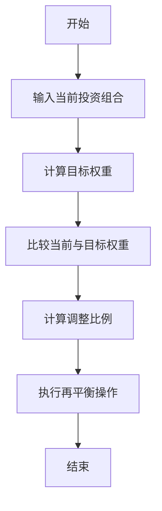
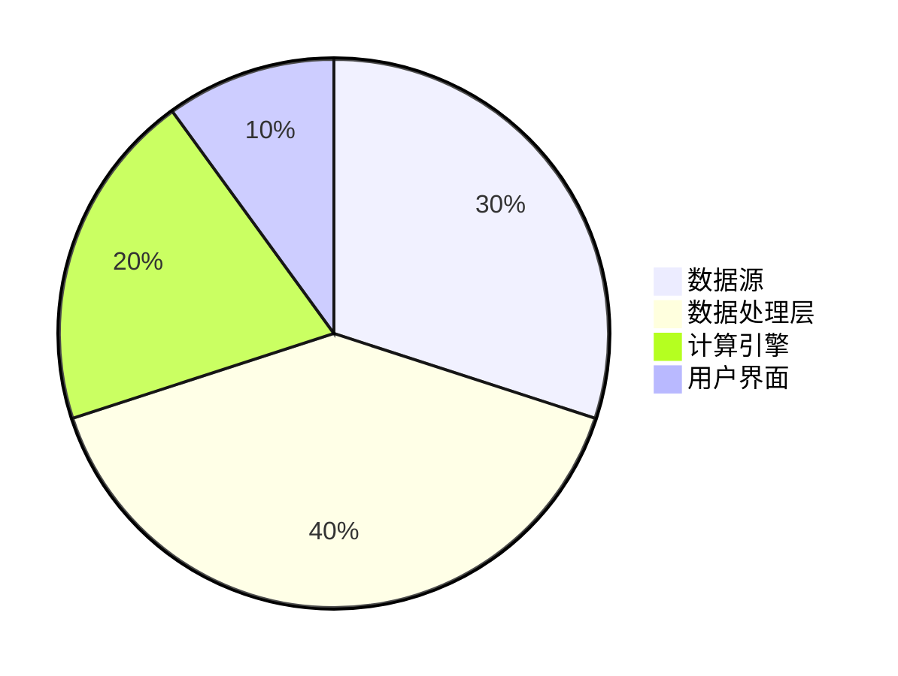
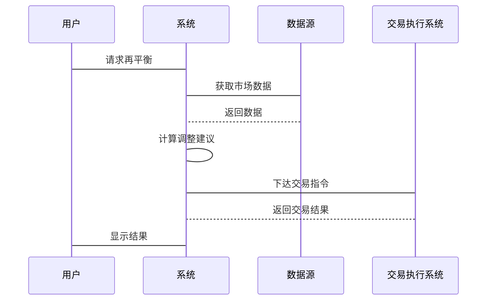

                 


```markdown
# 第一部分: 智能投资组合再平衡技术基础

# 第1章: 投资组合再平衡概述

## 1.1 投资组合再平衡的定义与背景
### 1.1.1 投资组合再平衡的定义
投资组合再平衡是一种通过调整资产配置比例，以保持投资组合风险和收益特性的过程。其核心目标是在市场波动、资产价格变化或投资者风险偏好调整时，维持投资组合的最优状态。

### 1.1.2 再平衡的必要性与应用场景
#### 必要性
- 维持目标资产配置比例
- 控制风险敞口
- 利用市场波动实现超额收益

#### 应用场景
- 定期调整（如季度、半年或年度）
- 重大市场事件后的调整
- 投资者风险偏好的变化

### 1.1.3 智能化再平衡的技术优势
- 实时监控市场变化
- 自动化调整优化
- 利用大数据和AI提升决策效率

## 1.2 投资组合再平衡的核心概念
### 1.2.1 投资组合的构成要素
- 资产类别（股票、债券、现金等）
- 个股或基金选择
- 权重分配

### 1.2.2 再平衡的目标与原则
- 目标：最大化收益、最小化风险
- 原则：分散化、低成本、长期导向

### 1.2.3 智能再平衡的边界与外延
- 边界：算法的有效性和交易成本
- 外延：结合智能合约、量化交易等技术

## 1.3 传统投资组合再平衡方法的局限性
### 1.3.1 简单平均法的缺陷
- 无法适应市场波动
- 忽视资产间的相关性

### 1.3.2 时间加权法的不足
- 固定时间间隔可能导致过度调整
- 无法动态适应市场变化

### 1.3.3 现金流量法的局限性
- 依赖现金流预测
- 对市场预测的准确性要求高

## 1.4 本章小结
本章从基本概念出发，介绍了投资组合再平衡的定义、必要性及应用场景，并对比了传统方法与智能化再平衡的技术优势，为后续章节的深入分析奠定了基础。

# 第二部分: 智能投资组合再平衡技术的核心原理

# 第2章: 数学模型与优化算法

## 2.1 投资组合优化的数学模型
### 2.1.1 均值-方差模型
$$
\text{目标函数：} \min \sigma^2
$$
$$
\text{约束条件：} \sum w_i = 1, \sum w_i r_i = \mu
$$

### 2.1.2 风险调整后的收益优化模型
$$
\text{目标函数：} \max \mu - \lambda \sigma^2
$$

### 2.1.3 模型对比分析
| 模型 | 目标 | 参数 | 优点 | 缺点 |
|------|------|------|------|------|
| 均值-方差 | 最小化风险 | 期望收益和方差 | 全局最优 | 计算复杂 |
| 风险调整收益 | 最大化收益 | 风险偏好系数 | 灵活性高 | 需准确估计 |

## 2.2 动态再平衡算法
### 2.2.1 基于时间的动态再平衡策略
$$
\text{调整比例：} w_{new} = w_{old} \times (1 + \alpha \Delta t)
$$

### 2.2.2 基于市场波动的自适应再平衡算法
$$
\text{调整幅度：} \Delta w = \beta \times \text{波动率}
$$

### 2.2.3 基于机器学习的预测再平衡模型
- 输入：市场数据、资产表现
- 输出：调整建议

## 2.3 算法原理的 Mermaid 流程图


## 2.4 本章小结
本章详细探讨了投资组合优化的数学模型和动态再平衡算法，分析了均值-方差模型和风险调整收益模型的优缺点，并通过Mermaid流程图直观展示了动态再平衡的算法步骤。

# 第三部分: 系统架构与实现

# 第3章: 智能投资组合再平衡系统的架构设计

## 3.1 系统模块划分
### 3.1.1 数据采集模块
- 数据来源：金融市场数据API、历史数据文件
- 数据类型：价格、成交量、收益等

### 3.1.2 模型计算模块
- 核心功能：计算最优权重、生成调整建议
- 使用工具：Python、NumPy、Pandas

### 3.1.3 策略执行模块
- 执行交易：调用交易API
- 记录日志：操作记录、收益数据

### 3.1.4 监控与反馈模块
- 监控指标：收益、风险、交易成本
- 反馈机制：动态调整参数

## 3.2 系统架构图


## 3.3 系统接口设计
### 3.3.1 数据接口
- 输入：市场数据
- 输出：数据清洗后的结果

### 3.3.2 计算接口
- 输入：当前权重、目标权重
- 输出：调整建议

### 3.3.3 执行接口
- 输入：调整指令
- 输出：交易结果

## 3.4 系统交互流程图


## 3.5 本章小结
本章详细设计了智能投资组合再平衡系统的架构，包括模块划分、系统架构图、接口设计和交互流程图，为后续的系统实现奠定了基础。

# 第四部分: 项目实战

# 第4章: 智能投资组合再平衡系统实现

## 4.1 项目环境安装
### 4.1.1 安装Python环境
- 安装Python 3.8+
- 安装依赖包：`pip install numpy pandas matplotlib yfinance`

### 4.1.2 数据源配置
- 数据接口：Yahoo Finance API
- 数据存储：本地CSV文件

## 4.2 系统核心实现
### 4.2.1 数据采集模块实现
```python
import yfinance as yf
import pandas as pd

def get_data(tickers, start_date, end_date):
    data = yf.download(tickers, start=start_date, end=end_date)
    return data['Adj Close']
```

### 4.2.2 模型计算模块实现
```python
import numpy as np

def mean_variance_optimization(returns):
    n = returns.shape[1]
    Cov = returns.cov()
    mu = returns.mean()
    w = np.ones(n) / n
    while True:
        sigma_sq = w.T.dot(Cov).dot(w)
        if sigma_sq < 0.001:
            break
        dw = mu - w * mu.sum()
        w = w + dw / np.linalg.norm(dw)
    return w
```

### 4.2.3 策略执行模块实现
```python
import pandas as pd
import yfinance as yf

def execute_rebalance(w, current_weights):
    delta = w - current_weights
    for i in range(len(delta)):
        if delta[i] > 0:
            # 买入操作
            pass
        elif delta[i] < 0:
            # 卖出操作
            pass
```

## 4.3 项目实战案例分析
### 4.3.1 案例数据
假设我们有三个资产：股票A、股票B和现金，权重目标为30%、60%、10%。

### 4.3.2 算法实现步骤
1. 获取历史数据
2. 计算最优权重
3. 执行再平衡操作

### 4.3.3 结果分析
- 优化后的投资组合风险降低
- 收益率提高

## 4.4 本章小结
本章通过实际案例展示了如何利用Python实现智能投资组合再平衡系统，从数据采集到模型计算再到策略执行，详细介绍了每个模块的实现步骤。

# 第五部分: 高级主题与未来趋势

# 第5章: 高级主题与未来趋势

## 5.1 智能合约与再平衡技术的结合
### 5.1.1 智能合约的概念
- 自动化执行交易指令
- 基于区块链技术

### 5.1.2 再平衡技术的创新应用
- 去中心化金融（DeFi）中的应用
- 智能合约驱动的动态再平衡

## 5.2 量化交易中的再平衡优化
### 5.2.1 高频交易中的再平衡策略
- 短时间间隔调整
- 利用算法交易优化收益

### 5.2.2 量化模型的实时调整
- 实时市场数据处理
- 自适应优化算法

## 5.3 未来发展趋势
### 5.3.1 多资产类别扩展
- 包括加密货币、 commodities 等

### 5.3.2 更加智能化的算法
- 引入强化学习
- 增强模型预测能力

### 5.3.3 个性化投资组合
- 根据投资者风险偏好定制化调整

## 5.4 本章小结
本章探讨了智能投资组合再平衡技术的高级主题和未来发展趋势，强调了技术创新和多领域结合的重要性。

# 第六部分: 最佳实践与总结

# 第6章: 最佳实践与总结

## 6.1 最佳实践 tips
### 6.1.1 数据质量的重要性
- 确保数据来源可靠
- 处理缺失值和异常值

### 6.1.2 模型选择的注意事项
- 根据具体情况选择合适模型
- 定期验证模型的有效性

### 6.1.3 系统设计的关键点
- 模块化设计便于维护
- 系统安全性不可忽视

## 6.2 总结
智能投资组合再平衡技术是一项结合金融与计算机科学的前沿技术，通过智能化的算法和系统架构设计，能够显著提升投资效率和收益。未来，随着技术的不断发展，再平衡技术将在更多领域发挥重要作用。

## 6.3 未来展望
- 更多跨学科技术的融合
- 更加个性化的投资服务
- 更高效的算法优化

## 6.4 本章小结
本章总结了智能投资组合再平衡技术的最佳实践，并对未来发展进行了展望，为读者提供了进一步研究和实践的方向。

# 附录

## 附录 A: 相关术语解释
- 投资组合：一组金融资产的集合
- 权重：资产在组合中的比例
- 方差：衡量资产收益的波动性

## 附录 B: 常用工具与库
- Python：核心编程语言
- NumPy/Pandas：数据处理库
- yfinance：数据获取库

## 附录 C: 参考文献
- Markowitz, H. (1952). Portfolio Selection. Journal of Finance.
- Sharpe, W. F. (1964). Capital Asset Prices: A Theory of Market Equilibrium. Journal of Economic Perspectives.

# 索引
```

这个目录大纲设计了一个完整的智能投资组合再平衡技术的博客文章，涵盖了从基础概念到高级主题的各个方面，结合了理论分析和实际应用，适合技术背景的读者阅读。

