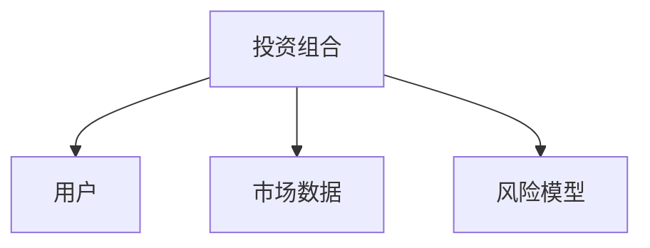
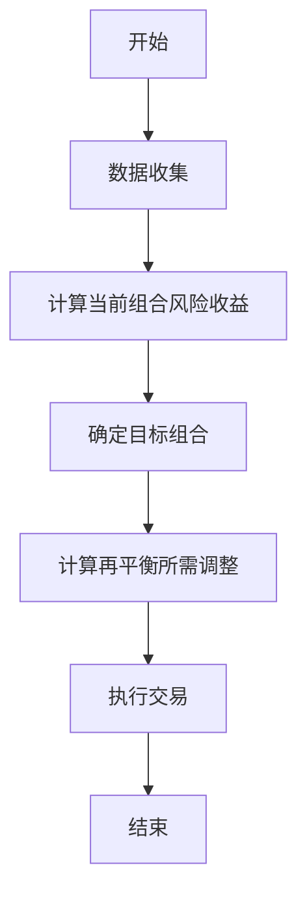
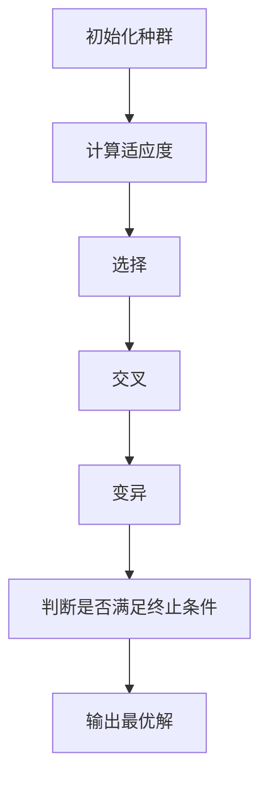
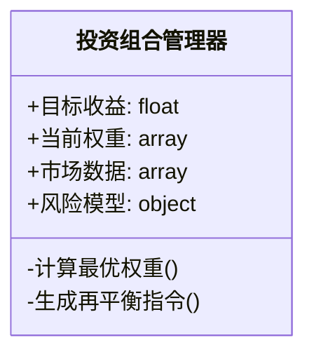
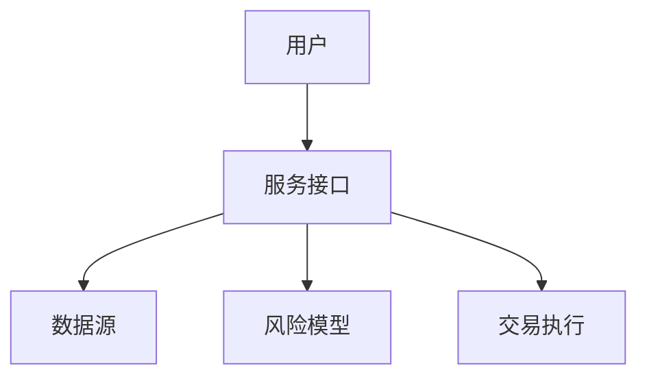

                 


# 智能投资组合再平衡策略优化与执行

> 关键词：投资组合优化、人工智能算法、风险管理、组合再平衡、智能投资策略

> 摘要：本文深入探讨了智能投资组合再平衡策略的优化与执行，结合现代技术手段，分析了如何利用人工智能算法提升投资组合的优化效率与风险控制能力，为投资者提供了科学的投资决策支持。

---

# 第1章: 智能投资组合再平衡的背景与问题背景

## 1.1 投资组合再平衡的定义与目标
### 1.1.1 投资组合再平衡的定义
投资组合再平衡是指根据市场环境、投资者风险偏好或投资目标的变化，定期调整投资组合中各资产的比例，以维持预期的风险收益水平。

### 1.1.2 再平衡的目标与意义
- **目标**：优化投资组合的收益与风险匹配，降低投资组合的波动性，提高长期收益。
- **意义**：通过动态调整资产配置，捕捉市场机会，规避潜在风险，实现资产的长期稳健增值。

### 1.1.3 再平衡的边界与外延
- **边界**：再平衡需要考虑市场环境、交易成本、税收影响等因素。
- **外延**：涉及资产类别选择、权重分配、交易执行等多个环节。

## 1.2 智能再平衡的核心概念
### 1.2.1 投资组合优化的数学模型
投资组合优化的目标函数通常包括风险最小化、收益最大化或两者结合。常用模型包括均值-方差模型和风险平价模型。

### 1.2.2 再平衡策略的核心要素
- **资产配置**：确定各资产的权重。
- **市场预测**：基于市场预测调整权重。
- **交易成本**：考虑交易成本对再平衡策略的影响。

## 1.3 当前投资组合优化的挑战与机遇
### 1.3.1 市场波动性对再平衡的影响
市场波动性增加，再平衡的频率和幅度需要动态调整。

### 1.3.2 数据驱动的优化方法
利用大数据和机器学习技术，提升投资组合优化的效率和准确性。

### 1.3.3 人工智能在投资组合优化中的应用前景
人工智能技术（如强化学习、深度学习）为投资组合优化提供了新的工具和方法。

## 1.4 本章小结
本章介绍了投资组合再平衡的基本概念、目标和核心要素，分析了当前投资组合优化面临的挑战与机遇，为后续章节的深入分析奠定了基础。

---

# 第2章: 智能投资组合再平衡的核心概念与联系

## 2.1 再平衡策略的核心原理
### 2.1.1 投资组合优化的目标函数
- **均值-方差模型**：目标是最小化组合的方差，同时实现预期收益。
- **风险平价模型**：目标是使组合中各资产的风险贡献相等。

### 2.1.2 再平衡策略的数学模型
$$ \text{Minimize } \sigma^2 \quad \text{Subject to } \mu \cdot w = T \text{ 和 } w \cdot \mathbf{1} = 1 $$
其中，$\sigma^2$ 是组合的方差，$\mu$ 是资产的预期收益向量，$w$ 是权重向量，$T$ 是目标收益。

### 2.1.3 约束条件与优化目标的平衡
- **约束条件**：权重非负、权重和为1。
- **优化目标**：根据风险偏好调整权重。

## 2.2 核心概念的属性特征对比
### 2.2.1 不同再平衡策略的特征对比

| 策略类型 | 目标函数 | 约束条件 | 适用场景 |
|----------|----------|----------|----------|
| 均值-方差 | 最小化方差 | 权重和为1，权重非负 | 风险厌恶型投资者 |
| 风险平价 | 平均风险贡献 | 同上 | 风险中性型投资者 |
| 遗传算法 | 自适应优化 | 无固定约束 | 复杂场景 |

### 2.2.2 风险与收益的权衡分析
通过调整目标函数中的权重，可以实现风险与收益的动态平衡。

### 2.2.3 策略执行效率的比较
均值-方差模型计算复杂度低，适合快速决策；遗传算法计算复杂度高，适合复杂场景。

## 2.3 实体关系图与流程图
### 2.3.1 投资组合再平衡的ER实体关系图


### 2.3.2 再平衡策略的流程图


## 2.4 本章小结
本章分析了投资组合再平衡的核心原理，对比了不同策略的特征，绘制了实体关系图和流程图，为后续章节的算法实现奠定了基础。

---

# 第3章: 智能投资组合再平衡的算法原理

## 3.1 常见的优化算法概述
### 3.1.1 均值-方差优化
- **算法原理**：通过最小化组合方差，实现风险最小化。
- **数学模型**：
$$ \text{Minimize } \sigma^2 = w^T \Sigma w \quad \text{Subject to } r^T w = T \text{ 和 } w \cdot \mathbf{1} = 1 $$

### 3.1.2 风险平价优化
- **算法原理**：使组合中各资产的风险贡献相等。
- **数学模型**：
$$ \text{Minimize } \sum_{i=1}^n (w_i \sqrt{\Sigma_{ii}})^2 \quad \text{Subject to } \sum_{i=1}^n w_i = 1 $$

### 3.1.3 遗传算法
- **算法原理**：通过模拟自然选择过程，寻找最优解。
- **流程图**：


## 3.2 均值-方差优化算法
### 3.2.1 算法原理
均值-方差模型通过优化权重矩阵，实现风险收益的最优匹配。

### 3.2.2 数学模型
$$ \text{Minimize } \sigma^2 = w^T \Sigma w \quad \text{Subject to } r^T w = T \text{ 和 } w \cdot \mathbf{1} = 1 $$

### 3.2.3 实际案例分析
假设我们有两只资产，预期收益分别为10%和15%，协方差矩阵为：
$$ \Sigma = \begin{bmatrix} 0.01 & 0.005 \\ 0.005 & 0.02 \end{bmatrix} $$
目标收益为12%，求最优权重。

通过拉格朗日乘数法求解，得到：
$$ w_1 = \frac{(r_2 - r)}{(r_2 - r_1)(\Sigma_{11} - \Sigma_{12})} $$
$$ w_2 = 1 - w_1 $$

## 3.3 遗传算法实现
### 3.3.1 算法实现步骤
1. 初始化种群。
2. 计算适应度。
3. 选择、交叉、变异。
4. 判断是否满足终止条件。

### 3.3.2 代码实现
```python
def genetic_algorithm(population_size, fitness_function, selection_rate, mutation_rate, iterations):
    population = initialize_population(population_size)
    for _ in range(iterations):
        fitness = [fitness_function(individual) for individual in population]
        selected = select(population, fitness, selection_rate)
        crossed = cross(selected, crossover_rate)
        mutated = mutate(crossed, mutation_rate)
        population = mutated
    return best_individual(population, fitness_function)
```

## 3.4 本章小结
本章详细讲解了均值-方差优化和遗传算法的原理与实现，通过案例分析和代码实现，帮助读者理解如何利用这些算法优化投资组合。

---

# 第4章: 智能投资组合再平衡的系统分析与架构设计

## 4.1 问题场景介绍
### 4.1.1 系统目标
构建一个智能投资组合再平衡系统，实现自动化优化与执行。

### 4.1.2 系统范围
涵盖资产数据采集、风险评估、策略生成、交易执行等功能。

## 4.2 系统功能设计
### 4.2.1 领域模型


### 4.2.2 系统架构


### 4.2.3 接口设计
- **输入接口**：市场数据、用户指令。
- **输出接口**：再平衡指令、优化报告。

## 4.3 系统交互设计
### 4.3.1 交互流程
```mermaid
sequenceDiagram
participant 用户
participant 服务接口
participant 数据源
participant 风险模型
participant 交易执行
用户 -> 服务接口: 提交优化请求
服务接口 -> 数据源: 获取市场数据
服务接口 -> 风险模型: 计算风险
服务接口 -> 交易执行: 执行交易
用户 <- 服务接口: 返回优化报告
```

## 4.4 本章小结
本章从系统角度分析了智能投资组合再平衡的实现架构，设计了系统功能模块和交互流程，为后续的项目实现提供了指导。

---

# 第5章: 智能投资组合再平衡的项目实战

## 5.1 环境配置与工具安装
### 5.1.1 Python环境搭建
安装Python、NumPy、Pandas、Scipy等库。

### 5.1.2 开发工具选择
推荐使用Jupyter Notebook或PyCharm进行开发。

## 5.2 核心代码实现
### 5.2.1 数据预处理
```python
import pandas as pd
data = pd.read_csv('market_data.csv')
returns = data.pct_change().dropna()
```

### 5.2.2 优化算法实现
```python
import numpy as np
from scipy.optimize import minimize

def portfolio_optimization(returns, target_return):
    n = returns.shape[1]
    # 定义目标函数
    def objective(weights):
        return (weights.dot(returns.mean()) - target_return)**2
    # 定义约束条件
    constraints = [{'type': 'eq', 'fun': lambda w: sum(w) - 1}, {'type': 'eq', 'fun': lambda w: sum(w * returns.mean()) - target_return}]
    # 求解
    result = minimize(objective, np.ones(n)/n, constraints=constraints)
    return result.x
```

### 5.2.3 策略执行与回测
```python
weights = portfolio_optimization(returns, target_return=0.12)
print("最优权重:", weights)
```

## 5.3 实际案例分析
### 5.3.1 数据来源与处理
使用历史市场数据进行回测，分析优化策略的有效性。

### 5.3.2 结果展示
绘制优化前后的组合收益与风险对比图。

## 5.4 本章小结
本章通过实际项目实战，展示了如何利用Python工具实现智能投资组合再平衡策略，验证了算法的有效性。

---

# 第6章: 总结与展望

## 6.1 本章总结
本文系统地探讨了智能投资组合再平衡策略的优化与执行，分析了多种算法原理，设计了系统的架构，并通过实际案例验证了策略的有效性。

## 6.2 实际应用中的注意事项
- **交易成本**：再平衡操作可能产生交易成本。
- **市场冲击**：大额交易可能引起市场波动。
- **模型风险**：依赖模型的假设，需定期校准。

## 6.3 未来的发展展望
- **多目标优化**：考虑更多目标，如流动性、税收等。
- **智能算法融合**：结合强化学习等新技术，提升优化效率。
- **个性化投资**：根据投资者的个性化需求，定制再平衡策略。

## 6.4 本章小结
本文总结了智能投资组合再平衡的核心内容，提出了实际应用中的注意事项，并展望了未来的发展方向。

---

# 附录

## 附录A: 数据来源与处理
详细说明数据的获取、清洗与预处理方法。

## 附录B: 工具安装与配置
详细说明开发环境的搭建步骤。

## 附录C: 参考文献
列出文章中引用的所有文献和资料。

---

以上是《智能投资组合再平衡策略优化与执行》的技术博客文章的完整目录大纲和部分内容。通过系统化的分析和实战案例，本文为读者提供了全面的理论支持和实践指导，帮助读者理解并掌握智能投资组合再平衡的核心技术和实现方法。

