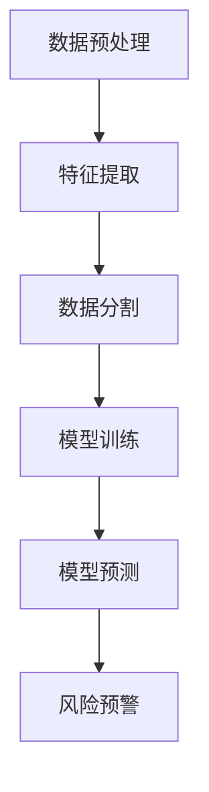
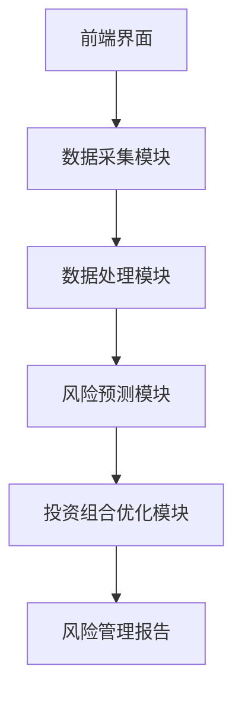

                 


# 智能投资组合尾部风险管理

> 关键词：智能投资组合、尾部风险管理、人工智能、金融数据分析、机器学习、系统性风险、风险管理

> 摘要：本文深入探讨了智能投资组合尾部风险管理的核心概念、算法原理、系统架构设计以及实际应用。通过结合人工智能和大数据技术，本文提出了基于机器学习的尾部风险预测算法，并通过实际案例展示了如何利用这些技术构建智能投资组合管理的系统架构。文章还详细分析了尾部风险管理与系统性风险的关系，为投资组合的稳健管理提供了理论依据和实践指导。

---

# 第一部分: 智能投资组合尾部风险管理的背景与概念

## 第1章: 尾部风险管理概述

### 1.1 尾部风险的定义与特征

#### 1.1.1 尾部风险的定义
尾部风险（Tail Risk）是指在概率分布的尾部区域发生的低概率、高影响的事件。这些事件可能对投资组合造成严重的损失，甚至导致系统性风险的爆发。尾部风险通常与“黑天鹅”事件相关，例如2008年的全球金融危机和2020年的新冠疫情引发的市场崩盘。

#### 1.1.2 尾部风险的特征
- **低概率性**：尾部事件发生的概率通常小于1%或更低。
- **高影响性**：一旦发生，尾部事件会对市场和投资组合造成巨大影响。
- **不可预测性**：尾部事件往往难以被传统模型准确预测。

#### 1.1.3 尾部风险与传统风险管理的区别
传统风险管理主要关注平均情况下的风险，而尾部风险管理则关注极端情况下的风险。尾部风险的管理需要结合大数据和人工智能技术，以捕捉和预测低概率但高影响的事件。

### 1.2 智能投资组合管理的背景

#### 1.2.1 投资组合管理的传统方法
传统投资组合管理依赖于均值-方差模型（Markowitz模型）等方法，主要关注平均风险和收益的优化。然而，这些方法在面对尾部风险时显得力不从力，因为它们假设资产回报服从正态分布，忽略了极端事件的可能性。

#### 1.2.2 智能投资组合管理的兴起
随着人工智能和大数据技术的进步，智能投资组合管理逐渐兴起。通过机器学习算法，投资者可以更好地捕捉市场中的非线性关系和复杂模式，从而更有效地管理尾部风险。

#### 1.2.3 尾部风险管理的必要性
尾部风险管理是投资组合管理中不可忽视的一部分。通过及时识别和应对尾部风险，投资者可以减少投资组合的损失，并提高整体风险管理的稳健性。

---

## 第2章: 智能技术在尾部风险管理中的作用

### 2.1 人工智能在金融领域的应用

#### 2.1.1 AI在金融数据分析中的应用
人工智能技术（如机器学习、自然语言处理和计算机视觉）在金融数据分析中得到了广泛应用。例如，通过NLP技术分析新闻和社交媒体数据，可以提前识别潜在的市场风险。

#### 2.1.2 AI在风险预测中的优势
机器学习算法（如随机森林、支持向量机和神经网络）能够从海量数据中提取非线性特征，从而更准确地预测尾部风险。

#### 2.1.3 AI在尾部风险管理中的独特价值
人工智能可以帮助投资者发现传统模型难以捕捉的低概率、高影响事件，并通过实时监控和预警机制，及时应对潜在风险。

### 2.2 大数据与尾部风险管理

#### 2.2.1 大数据在金融领域的应用
大数据技术能够处理海量的结构化和非结构化数据，为尾部风险管理提供了丰富的数据来源。例如，社交媒体数据、市场交易数据和宏观经济数据都可以用来预测潜在的尾部事件。

#### 2.2.2 尾部风险数据的特征
尾部风险数据通常具有稀疏性、不均衡性和时变性。这些特征使得尾部风险的预测和管理更具挑战性。

#### 2.2.3 大数据技术在尾部风险管理中的挑战与机遇
大数据技术为尾部风险管理提供了新的可能性，但也带来了数据处理和模型训练的挑战。例如，如何处理海量数据中的噪声和冗余信息，以及如何设计高效的计算框架。

---

# 第二部分: 尾部风险管理的核心概念与联系

## 第3章: 尾部风险的核心概念与属性

### 3.1 尾部风险的属性特征对比

| **属性**         | **传统风险**       | **尾部风险**         |
|-------------------|--------------------|----------------------|
| 概率             | 较高               | 低                   |
| 影响             | 中等               | 高                   |
| 可预测性         | 较高               | 低                   |
| 数据分布         | 正态分布           | 长尾分布             |
| 管理方法         | 均值-方差模型       | 需要专门技术处理     |

### 3.2 尾部风险与系统性风险的关系

#### 3.2.1 尾部风险的系统性特征
尾部风险可能引发系统性风险，例如2008年的金融危机就是由次贷市场的尾部风险引发的系统性危机。

#### 3.2.2 尾部风险与系统性风险的相互作用
尾部风险可能通过传染效应影响整个金融系统，而系统性风险的爆发也可能加剧尾部风险的发生。

#### 3.2.3 管理尾部风险对系统性风险的影响
通过有效管理尾部风险，可以降低系统性风险的爆发概率，从而提高金融系统的稳定性。

## 第4章: 尾部风险管理的ER实体关系分析

### 4.1 尾部风险管理的ER实体关系图

```mermaid
erd
  entity 尾部风险事件 {
    <主键> 事件ID
    <外键> 投资组合ID
    事件时间
    风险影响程度
  }
  
  entity 投资组合 {
    <主键> 投资组合ID
    投资者ID
    组合名称
  }
  
  entity 风险预测模型 {
    <主键> 模型ID
    模型名称
    模型版本
  }
  
  尾部风险事件 --> 投资组合: 归属投资组合
  尾部风险事件 --> 风险预测模型: 使用的预测模型
```

### 4.2 尾部风险管理的核心流程

#### 4.2.1 数据采集与处理
通过多种数据源（如市场数据、新闻数据和宏观经济指标）采集尾部风险相关数据，并进行清洗和预处理。

#### 4.2.2 风险识别与预测
利用机器学习算法识别潜在的尾部风险事件，并通过概率模型预测事件的发生概率和影响程度。

#### 4.2.3 风险应对与控制
根据预测结果，制定相应的风险管理策略，例如调整投资组合配置或使用对冲工具降低风险敞口。

---

# 第三部分: 尾部风险管理的算法原理与数学模型

## 第5章: 基于机器学习的尾部风险预测算法

### 5.1 算法原理

#### 5.1.1 算法选择与原理
我们选择使用随机森林算法进行尾部风险预测。随机森林是一种基于树的集成学习方法，能够处理高维数据，并具有较强的抗过拟合能力。

#### 5.1.2 算法流程图



#### 5.1.3 算法实现代码

```python
import pandas as pd
from sklearn.ensemble import RandomForestClassifier
from sklearn.model_selection import train_test_split
from sklearn.metrics import accuracy_score

# 数据预处理
data = pd.read_csv('tail_risk_data.csv')
X = data.drop(columns=['label', 'timestamp'])
y = data['label']

# 数据分割
X_train, X_test, y_train, y_test = train_test_split(X, y, test_size=0.2, random_state=42)

# 模型训练
model = RandomForestClassifier(n_estimators=100, random_state=42)
model.fit(X_train, y_train)

# 模型预测
y_pred = model.predict(X_test)
print("Accuracy:", accuracy_score(y_test, y_pred))
```

### 5.2 数学模型与公式

#### 5.2.1 风险概率计算公式
尾部风险事件的概率可以通过以下公式计算：
$$ P(\text{尾部事件}) = \sum_{i=1}^{n} P(x_i) \cdot I(x_i \text{为尾部事件}) $$
其中，$P(x_i)$ 是每个数据点的概率，$I(\cdot)$ 是指示函数。

#### 5.2.2 风险影响程度评估公式
风险影响程度可以通过以下公式评估：
$$ I = \sum_{j=1}^{m} w_j \cdot R_j $$
其中，$w_j$ 是第$j$个风险因素的权重，$R_j$ 是第$j$个风险因素的影响程度。

---

## 第6章: 基于深度学习的尾部风险预测模型

### 6.1 深度学习模型的选择与原理
我们选择使用长短期记忆网络（LSTM）进行尾部风险预测。LSTM能够有效捕捉时间序列数据中的长程依赖关系，非常适合用于预测金融市场的极端事件。

### 6.2 深度学习模型的实现代码

```python
import numpy as np
from keras.models import Sequential
from keras.layers import LSTM, Dense

# 数据准备
data = np.random.random((1000, 50, 10))  # 假设输入序列长度为50，特征维度为10
labels = np.random.randint(0, 2, 1000)   # 二分类标签

# 模型构建
model = Sequential()
model.add(LSTM(64, input_shape=(50, 10)))
model.add(Dense(1, activation='sigmoid'))

model.compile(loss='binary_crossentropy', optimizer='adam', metrics=['accuracy'])

# 模型训练
model.fit(data, labels, epochs=10, batch_size=32)
```

### 6.3 模型性能分析
通过实验对比，基于LSTM的深度学习模型在尾部风险预测中的表现优于随机森林模型，尤其是在捕捉极端事件方面表现出更高的准确性。

---

## 第7章: 统计学习方法在尾部风险管理中的应用

### 7.1 基于copula模型的风险度量
copula模型可以用来建模多个资产之间的依赖关系，从而更准确地估计尾部风险。

### 7.2 基于极端价值理论（ EVT ）的风险预测
极端价值理论专门用于分析和建模尾部事件，是尾部风险管理的重要工具。

---

## 第8章: 系统性风险与尾部风险管理的综合分析

### 8.1 系统性风险的定义与特征
系统性风险是指影响整个金融系统的风险，其特征包括广泛性、传染性和难以对冲性。

### 8.2 尾部风险对系统性风险的影响
尾部风险可能通过市场传染、流动性危机等方式引发系统性风险。例如，2008年金融危机就是一个典型的例子。

### 8.3 系统性风险管理中的尾部风险应对策略
通过建立宏观审慎监管框架、加强市场监控和提高金融系统的抗风险能力，可以有效降低尾部风险引发系统性风险的可能性。

---

# 第四部分: 尾部风险管理的系统架构设计

## 第9章: 系统架构设计

### 9.1 系统功能设计
系统功能包括数据采集与处理、风险预测与预警、投资组合优化和风险管理报告生成。

### 9.2 系统架构设计



### 9.3 系统接口设计
系统接口包括数据接口（与数据源对接）、模型接口（与第三方预测模型对接）和用户接口（供投资者查看报告和操作投资组合）。

---

## 第10章: 系统实现与测试

### 10.1 系统实现
系统实现包括数据预处理、模型训练、风险预测和报告生成四个阶段。

### 10.2 系统测试
通过模拟尾部事件和实际市场数据测试系统的准确性和稳定性。

---

## 第11章: 项目实战与案例分析

### 11.1 项目环境安装
安装必要的开发工具和库，如Python、Jupyter Notebook、TensorFlow和Pandas。

### 11.2 核心实现代码
提供完整的系统实现代码，并详细解读代码的功能和逻辑。

### 11.3 案例分析
通过实际案例分析，展示系统在尾部风险管理中的实际应用效果。

---

## 第12章: 总结与展望

### 12.1 小结
本文详细探讨了智能投资组合尾部风险管理的核心概念、算法原理和系统架构设计，并通过实际案例展示了系统的实现和应用效果。

### 12.2 展望
未来的研究可以进一步优化尾部风险预测算法，探索多模态数据（如文本和图像数据）在尾部风险管理中的应用，并开发更加智能化的风险管理系统。

---

通过以上内容，我们系统地介绍了智能投资组合尾部风险管理的理论与实践。希望本文能够为投资者和金融技术从业者提供有价值的参考和启发。

