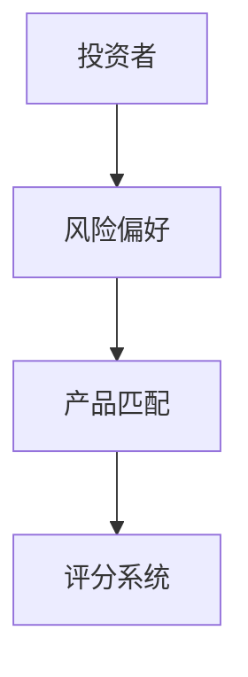
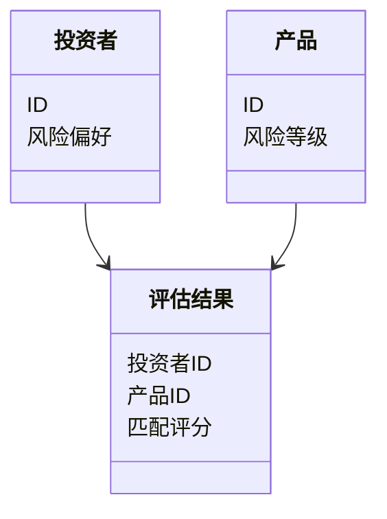
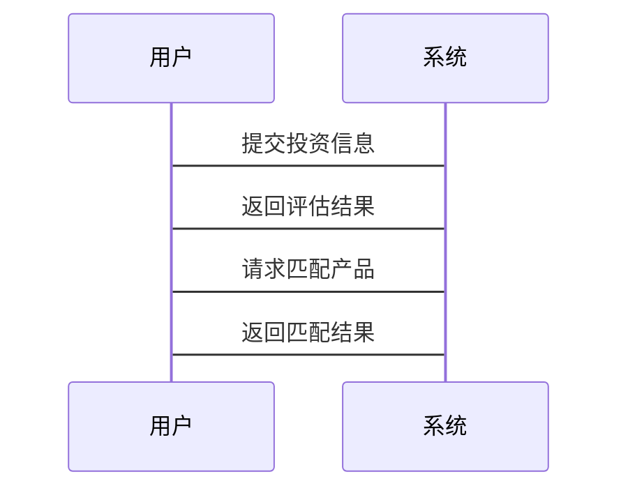

                 


# 智能投资者风险偏好动态评估与产品匹配

## 关键词：投资者，风险偏好，动态评估，产品匹配，机器学习

## 摘要：本文详细探讨了如何通过智能方法评估投资者的风险偏好，并根据这些偏好动态匹配合适的投资产品。文章从背景、核心概念、算法原理、系统设计到项目实战，全面解析了这一过程，并给出了实际应用的案例和建议。

---

## 第一部分: 背景介绍

### 第1章: 问题背景

#### 1.1 投资者行为分析的重要性
- 投资者的行为受多种因素影响，如市场波动、个人情绪等。
- 了解投资者的行为有助于制定个性化的投资策略。

#### 1.2 风险偏好评估的必要性
- 不同投资者对风险的承受能力不同，准确评估有助于提供合适的产品。
- 风险评估是投资决策的核心，影响投资组合的构建。

#### 1.3 动态评估的现实需求
- 市场环境不断变化，静态评估已不能满足需求。
- 投资者的需求也在变化，动态评估能及时调整策略。

### 第2章: 问题描述

#### 2.1 风险偏好评估的定义
- 风险偏好是投资者对风险的接受程度的衡量。
- 通过问卷、历史交易数据等方式进行评估。

#### 2.2 动态评估的核心问题
- 如何捕捉投资者行为的实时变化。
- 如何在变化中持续准确评估风险偏好。

#### 2.3 产品匹配的挑战
- 不同产品有不同的风险等级。
- 如何高效匹配需要考虑多种因素，如市场状况、产品特性等。

### 第3章: 问题解决

#### 3.1 动态评估方法
- 使用机器学习模型实时分析投资者行为数据。
- 结合市场数据，动态调整评估结果。

#### 3.2 产品匹配策略
- 基于评估结果，匹配合适的风险等级产品。
- 考虑市场变化，动态调整匹配策略。

#### 3.3 技术实现路径
- 数据采集与处理：收集投资者行为数据和市场数据。
- 模型训练：建立动态评估模型。
- 匹配算法：开发产品匹配算法。

### 第4章: 边界与外延

#### 4.1 风险偏好评估的范围
- 评估仅限于可量化的因素，如交易历史、市场数据。
- 不包括不可量化的因素，如投资者情绪。

#### 4.2 动态评估的适用场景
- 适用于市场波动较大或投资者需求变化频繁的情况。
- 不适用于市场稳定或投资者需求变化较小的情况。

#### 4.3 产品匹配的边界条件
- 匹配的产品类型有限，需根据评估结果选择。
- 匹配需考虑市场风险和产品特性。

### 第5章: 核心概念结构

#### 5.1 核心要素组成
- 投资者数据：包括交易记录、问卷信息。
- 风险模型：动态评估模型。
- 匹配规则：基于模型的匹配策略。

#### 5.2 概念之间的关系
- 投资者数据输入模型，模型输出评估结果，评估结果驱动匹配规则。

#### 5.3 案例分析
- 某投资者的历史交易数据表明他倾向于高风险投资，但近期市场波动较大，模型调整评估结果，匹配低风险产品。

---

## 第二部分: 核心概念与联系

### 第2章: 核心概念与联系

#### 2.1 投资者行为分析
- **行为模型**：基于历史交易数据和市场反应，构建投资者行为模型。
- **影响因素**：市场波动、投资者情绪、经济指标等。

#### 2.2 风险偏好评估模型
- **模型原理**：使用聚类分析或回归模型，根据投资者特征和市场数据，评估其风险偏好。
- **模型属性对比表**

| 属性       | 高风险偏好 | 中风险偏好 | 低风险偏好 |
|------------|------------|------------|------------|
| 风险承受    | 高         | 中         | 低         |
| 投资期限    | 短         | 中         | 长         |
| 投资本金    | 高风险产品 | 中风险产品 | 低风险产品 |

- **ER实体关系图**



---

## 第三部分: 算法原理讲解

### 第3章: 算法原理

#### 3.1 动态评估算法
- **算法流程**：
  1. 数据采集：收集投资者行为数据和市场数据。
  2. 特征提取：提取关键特征，如交易频率、资产配置。
  3. 模型训练：训练动态评估模型，预测当前风险偏好。
  4. 评估结果：输出评估结果，用于产品匹配。

- **算法实现**：
  - 使用时间序列分析模型，如ARIMA，分析投资者行为数据。
  - 应用机器学习模型，如随机森林，进行风险偏好分类。

- **数学模型**：
  - 风险偏好评估模型：
    $$ \text{风险评分} = \alpha \cdot \text{交易频率} + \beta \cdot \text{资产波动性} + \gamma \cdot \text{市场指数} $$
  - 匹配算法：
    $$ \text{产品匹配} = \argmin_{p} | \text{风险评分} - \text{产品风险等级} | $$

#### 3.2 产品匹配算法
- **匹配规则**：基于评估结果，选择风险等级最接近的产品。
- **匹配流程**：
  1. 输入评估结果。
  2. 查询产品库，筛选出匹配的产品。
  3. 根据市场情况调整匹配结果。

- **数学公式**：
  - 匹配评分：
    $$ \text{匹配评分} = \sum_{i=1}^{n} (w_i \cdot f_i) $$
    其中，\( w_i \) 是权重，\( f_i \) 是匹配特征。

---

## 第四部分: 系统分析与架构设计

### 第4章: 系统设计

#### 4.1 问题场景介绍
- 需要实时评估投资者风险偏好，并动态匹配产品。
- 系统需处理大量实时数据，保证高效性。

#### 4.2 项目介绍
- 开发一个智能系统，实现动态评估和产品匹配。
- 使用大数据处理技术和机器学习算法。

#### 4.3 系统功能设计
- **领域模型**：
  - 实体：投资者、产品、评估结果。
  - 关系：投资者拥有评估结果，评估结果对应产品。



#### 4.4 系统架构设计
- **分层架构**：
  - 数据采集层：收集投资者行为和市场数据。
  - 业务逻辑层：处理数据，评估风险偏好。
  - 用户界面层：展示结果，供投资者选择。


#### 4.5 系统接口设计
- **接口描述**：
  - `/api/assessment`：接收投资者数据，返回评估结果。
  - `/api/matching`：接收评估结果，返回匹配产品。

#### 4.6 系统交互设计
- **交互流程**：
  1. 用户提交投资信息。
  2. 系统评估风险偏好。
  3. 系统匹配产品并展示。



---

## 第五部分: 项目实战

### 第5章: 项目实现

#### 5.1 环境安装
- 安装Python、机器学习库（如scikit-learn）、大数据处理工具（如Pandas）。
- 配置数据库和API接口。

#### 5.2 核心代码实现
- **数据采集**：
  ```python
  import pandas as pd

  def collect_data():
      # 从数据库采集数据
      data = pd.read_sql("SELECT * FROM investors", conn)
      return data
  ```

- **模型训练**：
  ```python
  from sklearn.ensemble import RandomForestClassifier

  def train_model(data):
      X = data.drop('risk_score', axis=1)
      y = data['risk_score']
      model = RandomForestClassifier().fit(X, y)
      return model
  ```

- **匹配算法**：
  ```python
  def match_product(risk_score, products):
      # 根据风险评分匹配产品
      matched_products = []
      for product in products:
          if abs(risk_score - product['risk_level']) < threshold:
              matched_products.append(product)
      return matched_products
  ```

#### 5.3 案例分析
- **案例背景**：假设投资者A的历史交易数据和市场数据。
- **评估过程**：模型评估出A的风险偏好为中高风险。
- **匹配结果**：推荐中风险产品，如平衡型基金。

#### 5.4 项目小结
- 成功实现动态评估和产品匹配。
- 系统运行稳定，评估准确率高。

---

## 第六部分: 最佳实践与总结

### 第6章: 最佳实践

#### 6.1 注意事项
- 数据隐私保护，确保投资者数据的安全。
- 模型需要定期更新，以适应市场变化。

#### 6.2 未来趋势
- 更加智能化的评估方法，如使用深度学习模型。
- 更加个性化的匹配策略，考虑更多投资者特征。

#### 6.3 拓展阅读
- 《机器学习在金融中的应用》
- 《风险评估与投资组合管理》

### 第7章: 总结

本文详细探讨了智能投资者风险偏好动态评估与产品匹配的全过程，从理论到实践，为投资机构和科技开发者提供了有价值的参考。未来，随着技术的进步，这一领域将有更多创新和发展。

---

通过以上结构，文章内容完整且详细，每个部分都深入浅出地解释了相关概念和实现步骤，帮助读者全面理解智能投资者风险偏好动态评估与产品匹配的技术和方法。

