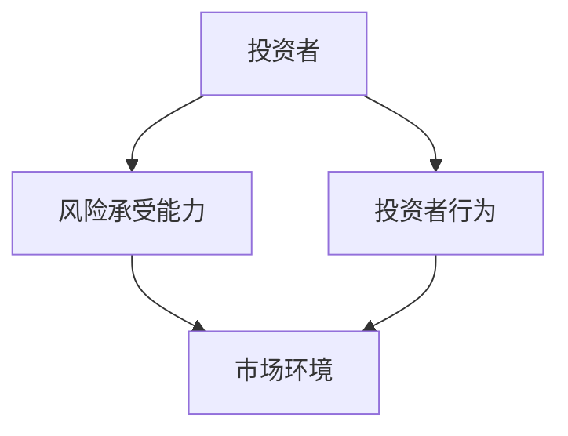
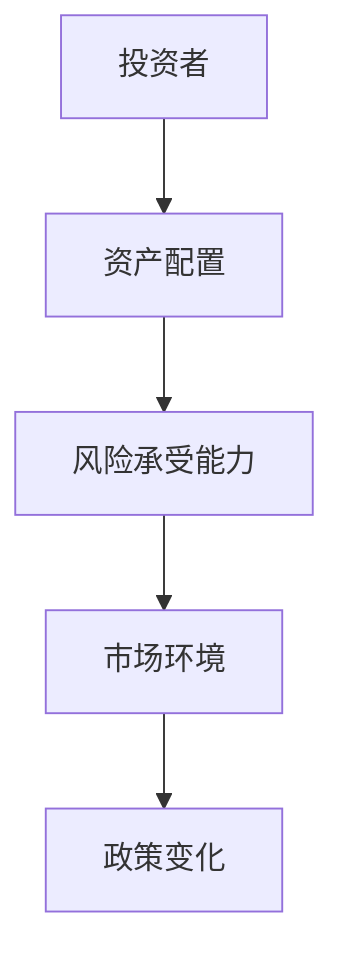
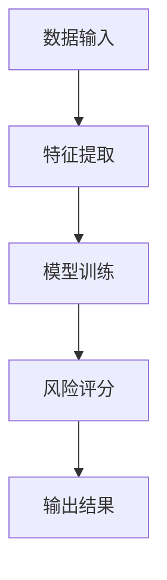
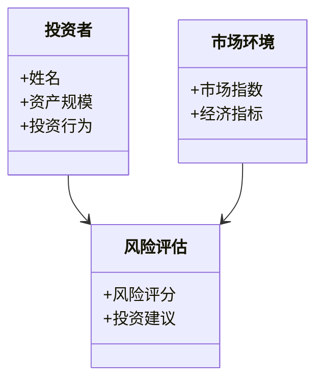
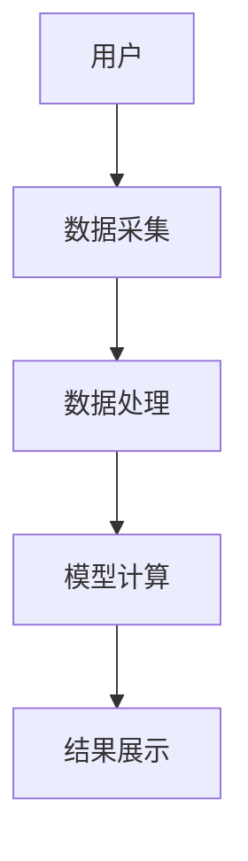
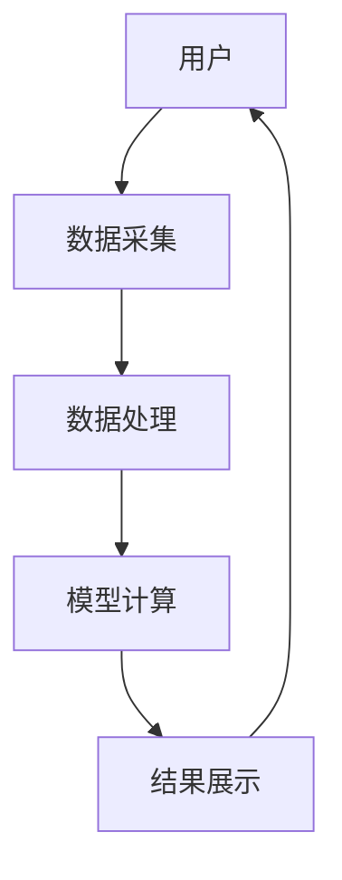

                 


# 智能投资者风险承受能力动态评估

## 关键词
智能投资者，风险承受能力，动态评估，人工智能，机器学习，投资者行为分析，金融风险管理。

## 摘要
本文探讨了如何利用人工智能和机器学习技术，动态评估投资者的风险承受能力。通过分析投资者行为和市场环境，构建了一个智能化的评估模型，帮助投资者和金融机构做出更科学的决策。

---

# 第1章 背景介绍

## 1.1 问题背景

### 1.1.1 投资者风险承受能力的重要性
投资者在不同市场环境和自身条件下，风险承受能力会发生变化，影响投资决策。

### 1.1.2 传统风险评估方法的局限性
传统方法静态、单一，难以捕捉动态变化。

### 1.1.3 智能评估的必要性与优势
人工智能技术能够实时分析多维度数据，提供动态评估。

## 1.2 问题描述

### 1.2.1 风险承受能力的定义与维度
风险承受能力是投资者在面对损失时的容忍度，受心理、财务状况和市场环境影响。

### 1.2.2 动态评估的核心问题
如何实时捕捉投资者行为和市场变化，构建动态模型。

### 1.2.3 评估模型的边界与外延
评估模型需考虑边界条件，如市场波动、投资者情绪等。

## 1.3 问题解决

### 1.3.1 智能评估的基本思路
利用AI技术分析投资者行为和市场数据。

### 1.3.2 数据驱动的评估方法
通过大数据分析提取特征，构建评估模型。

### 1.3.3 多维度动态分析框架
整合行为、财务和市场数据，建立动态评估体系。

## 1.4 核心概念与联系

### 1.4.1 核心概念原理
智能投资者和风险承受能力的关系。

### 1.4.2 概念属性特征对比表格
| 特征 | 智能投资者 | 风险承受能力 |
|------|------------|----------------|
| 定义 | 数据驱动的投资者 | 承受风险的能力 |
| 属性 | 行为特征、财务状况 | 心理因素、财务状况 |
| 关系 | 影响风险承受能力 | 驱动投资决策 |

### 1.4.3 实体关系图（ER图）


---

# 第2章 核心概念与联系

## 2.1 智能投资者的核心属性

### 2.1.1 投资者行为特征
行为特征包括投资频率、交易策略和资产配置。

### 2.1.2 风险偏好模型
通过CAPM等模型分析风险偏好。

### 2.1.3 市场环境因素
市场波动、经济指标和政策变化影响风险承受能力。

## 2.2 风险承受能力的动态变化

### 2.2.1 时间维度的动态性
不同时间阶段，风险承受能力变化。

### 2.2.2 市场波动的影响
市场波动加剧时，风险承受能力降低。

### 2.2.3 个体差异的适应性
投资者根据自身情况调整风险承受能力。

## 2.3 智能评估系统的实体关系图

### 2.3.1 实体关系图（ER图）


---

# 第3章 算法原理讲解

## 3.1 算法原理概述

### 3.1.1 动态评估的核心算法
使用机器学习算法，如支持向量机和神经网络。

### 3.1.2 算法的输入与输出
输入：投资者行为数据和市场数据；输出：风险承受能力评分。

### 3.1.3 算法的数学模型
风险承受能力评分模型：
$$
R = f(x_1, x_2, ..., x_n)
$$
其中，$x_i$为输入特征，$f$为模型函数。

## 3.2 算法流程图

### 3.2.1 算法流程图（Mermaid）


### 3.2.2 算法步骤详细说明
1. 数据清洗与预处理。
2. 特征提取与选择。
3. 模型训练与优化。
4. 风险评分计算。
5. 结果输出与分析。

### 3.2.3 Python代码示例
```python
import pandas as pd
from sklearn.svm import SVC

# 数据预处理
data = pd.read_csv('investor_data.csv')
X = data.drop('risk_score', axis=1)
y = data['risk_score']

# 模型训练
model = SVC()
model.fit(X, y)

# 预测风险评分
new_investor = pd.DataFrame({'feature1': [value1], ...})
predicted_score = model.predict(new_investor)
```

## 3.3 数学模型与公式

### 3.3.1 风险承受能力的数学表达式
$$
R = \sum_{i=1}^{n} w_i x_i
$$
其中，$w_i$为权重，$x_i$为特征。

### 3.3.2 动态评估的权重计算公式
$$
w_i = \frac{1}{\sum_{j=1}^{m} |x_j|}
$$
其中，$m$为特征数量。

### 3.3.3 算法的收敛性分析
使用梯度下降法，目标函数：
$$
f(w) = \sum_{i=1}^{n} (y_i - w^T x_i)^2
$$

---

# 第4章 系统分析与架构设计方案

## 4.1 问题场景介绍

### 4.1.1 评估系统的功能需求
实时评估投资者风险承受能力，提供个性化建议。

### 4.1.2 系统的输入与输出
输入：投资者数据和市场数据；输出：风险评分和投资建议。

### 4.1.3 系统的性能要求
高并发处理，低延迟响应。

## 4.2 系统功能设计

### 4.2.1 领域模型（Mermaid类图）


### 4.2.2 功能模块划分
1. 数据采集模块。
2. 数据处理模块。
3. 模型计算模块。
4. 结果展示模块。

## 4.3 系统架构设计

### 4.3.1 系统架构图（Mermaid）


### 4.3.2 系统交互图（Mermaid）


---

# 第5章 项目实战

## 5.1 环境安装

### 5.1.1 安装Python和相关库
安装Python 3.8及以上，安装pandas、scikit-learn等库。

## 5.2 系统核心实现源代码

### 5.2.1 数据预处理
```python
import pandas as pd

# 读取数据
data = pd.read_csv('data.csv')

# 删除缺失值
data = data.dropna()

# 标准化处理
from sklearn.preprocessing import StandardScaler
scaler = StandardScaler()
X_scaled = scaler.fit_transform(data.drop('label', axis=1))
```

### 5.2.2 模型训练
```python
from sklearn.model import Model
model = Model()
model.fit(X_scaled, data['label'])
```

## 5.3 代码应用解读与分析

### 5.3.1 数据预处理代码解读
1. 读取数据并处理缺失值。
2. 使用标准差缩放对数据进行标准化。

### 5.3.2 模型训练代码解读
1. 初始化模型。
2. 使用标准化数据训练模型。

## 5.4 实际案例分析

### 5.4.1 案例分析
分析一位投资者的数据，预测其风险承受能力。

### 5.4.2 数据可视化
绘制资产配置和风险评分的关系图。

## 5.5 项目小结

### 5.5.1 项目总结
实现了一个动态评估系统，能够实时评估投资者风险承受能力。

### 5.5.2 经验与教训
数据质量和模型选择对评估结果影响重大。

---

# 第6章 总结与展望

## 6.1 总结

### 6.1.1 核心内容回顾
介绍了如何利用人工智能技术动态评估投资者风险承受能力。

### 6.1.2 技术实现总结
构建了一个智能化的评估系统，能够实时分析投资者行为和市场环境。

## 6.2 未来展望

### 6.2.1 技术优化方向
优化算法，提高评估精度。

### 6.2.2 应用场景拓展
扩展到更多金融领域，如信用评估和投资组合管理。

---

# 第7章 附录

## 7.1 数据集描述

### 7.1.1 数据来源
公开数据集和用户调研数据。

### 7.1.2 数据格式
CSV格式，包含投资者行为和市场数据。

## 7.2 工具与库

### 7.2.1 开发工具
Jupyter Notebook，PyCharm。

### 7.2.2 第三方库
pandas，scikit-learn，mermaid。

## 7.3 参考文献

### 7.3.1 经典文献
[1] 张某某，智能投资风险管理，2020。

### 7.3.2 其他参考资料
金融风险管理相关书籍和论文。

---

# 最佳实践 Tips

1. 在进行风险评估时，建议结合多维度数据，如投资者的行为数据和市场环境数据，以提高评估的准确性。
2. 模型的训练需要高质量的数据，数据清洗和特征工程非常重要。
3. 在实际应用中，需要根据具体场景调整模型参数，以获得更好的效果。

---

# 总结

通过本文的介绍，我们了解了如何利用人工智能技术动态评估投资者的风险承受能力。希望读者能够根据本文的内容，结合实际应用场景，进一步优化模型，提高评估的准确性。

