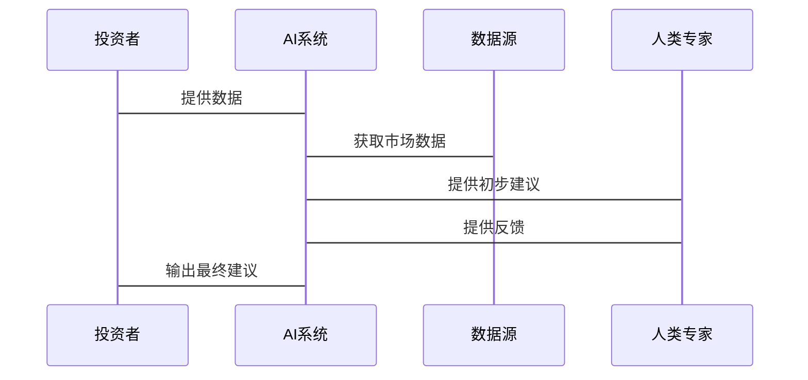

                 


# 智能投资顾问：AI与人类专家的协同策略

---

## 关键词：
智能投资顾问、人工智能、人类专家、协同策略、投资组合优化、金融数据分析

---

## 摘要：
智能投资顾问通过结合人工智能技术和人类专家的深度分析，为投资者提供高效、个性化的投资建议。本文探讨了AI在投资顾问中的应用，分析了AI与人类专家的协同策略，提出了基于机器学习和自然语言处理的投资分析模型，并通过实际案例展示了系统的实现与优化。

---

## 第1章: 智能投资顾问的背景与定义

### 1.1 问题背景

#### 1.1.1 投资顾问的传统模式
传统的投资顾问模式依赖于人工分析和经验判断，效率较低且成本较高。面对海量的金融数据，人类专家难以快速处理和分析，尤其是在实时交易中，这种模式显得力不从心。

#### 1.1.2 AI技术在金融领域的应用趋势
AI技术的快速发展使得金融领域成为其重要应用领域。机器学习、自然语言处理和强化学习等技术为投资分析提供了新的可能性。

#### 1.1.3 传统投资顾问的局限性
传统投资顾问模式存在以下问题：
- 数据处理能力有限，难以应对海量金融数据。
- 人工判断存在主观性和情绪化。
- 服务成本高，难以覆盖中小投资者。

### 1.2 智能投资顾问的定义

#### 1.2.1 智能投资顾问的核心概念
智能投资顾问是基于AI技术的投资建议系统，能够实时分析市场数据，提供个性化投资策略。

#### 1.2.2 智能投资顾问的分类与特点
根据功能的不同，智能投资顾问可以分为以下几类：
- **基于规则的系统**：根据预设的市场规则和条件提供投资建议。
- **基于机器学习的系统**：通过算法模型学习市场规律，预测价格走势。
- **混合型系统**：结合规则和机器学习的混合策略。

### 1.3 AI与人类专家协同的必要性

#### 1.3.1 AI的优势与局限性
- **优势**：快速处理数据，提供实时建议，降低人为情绪干扰。
- **局限性**：缺乏对市场复杂情况的理解，无法应对突发事件。

#### 1.3.2 人类专家的优势与局限性
- **优势**：丰富的市场经验，能够结合宏观因素进行判断。
- **局限性**：处理数据效率低，主观判断可能存在偏差。

#### 1.3.3 协同工作的必要性与价值
通过AI与人类专家的协同工作，可以结合两者的优点，提供更全面和准确的投资建议。AI负责数据分析和预测，人类专家则负责策略调整和风险评估。

---

## 第2章: AI与人类专家协同的核心概念

### 2.1 协同机制的定义与分类

#### 2.1.1 协同机制的定义
协同机制是指AI系统与人类专家之间的互动流程，通过数据共享和决策支持实现高效合作。

#### 2.1.2 基于AI的协同模式
- **实时数据共享**：AI系统将实时市场数据传递给人类专家，辅助其做出决策。
- **自动化建议生成**：AI根据市场变化自动生成投资建议，供人类专家参考。

### 2.2 协同模型的构建

#### 2.2.1 协同模型的构建方法
协同模型的构建需要考虑以下几点：
- 数据流：AI系统与人类专家之间的数据交互。
- 信息处理：AI对数据的分析和处理过程。
- 决策输出：人类专家根据AI分析结果做出最终决策。

#### 2.2.2 协同模型的评估标准
- **准确率**：AI分析结果的准确性。
- **响应时间**：系统处理数据的速度。
- **用户体验**：人类专家对AI系统的满意度。

#### 2.2.3 协同模型的优化策略
- **数据优化**：提高数据质量和多样性。
- **算法优化**：改进AI算法，提高分析精度。
- **人机交互优化**：设计友好的人机交互界面，提升用户体验。

### 2.3 协同过程中的伦理与法律问题

#### 2.3.1 数据隐私与合规性
- 数据收集和使用需要遵守相关法律法规，保护用户隐私。

#### 2.3.2 责任分配与法律风险
- 明确AI系统和人类专家的责任划分，避免法律纠纷。

#### 2.3.3 伦理决策与透明度
- 确保AI决策过程的透明性，避免伦理问题。

---

## 第3章: AI在投资分析中的应用

### 3.1 机器学习在投资分析中的应用

#### 3.1.1 机器学习的基本原理
机器学习是一种通过数据训练模型，使其能够进行预测和决策的技术。

#### 3.1.2 常见的投资预测模型
- **线性回归模型**：用于预测资产价格趋势。
- **随机森林模型**：用于分类和回归分析。

#### 3.1.3 基于机器学习的投资组合优化
通过机器学习算法优化投资组合，降低风险并提高收益。

### 3.2 自然语言处理在金融新闻中的应用

#### 3.2.1 NLP的基本原理
自然语言处理技术能够理解和生成人类语言，常用于分析新闻和社交媒体。

#### 3.2.2 金融新闻的情感分析
通过对新闻文本进行情感分析，预测市场情绪对股价的影响。

#### 3.2.3 基于NLP的市场情绪预测
利用NLP技术分析社交媒体和新闻，预测市场情绪变化。

### 3.3 强化学习在投资策略中的应用

#### 3.3.1 强化学习的基本原理
强化学习通过试错机制，学习最优策略。

#### 3.3.2 基于强化学习的投资策略
- **买卖时机选择**：通过强化学习算法选择最佳买卖时机。
- **动态资产配置**：根据市场变化动态调整资产配置。

---

## 第4章: 协同策略与系统架构设计

### 4.1 系统功能设计

#### 4.1.1 领域模型（Mermaid 类图）


### 4.2 系统架构设计

#### 4.2.1 系统架构（Mermaid 架构图）
```mermaid
client
   投资者
client
    AI系统
client
    人类专家
    数据源
    交互界面
```

### 4.3 系统接口设计

#### 4.3.1 数据接口
- **输入接口**：接收市场数据和用户信息。
- **输出接口**：提供投资建议和分析结果。

#### 4.3.2 交互接口
- **用户界面**：投资者与系统交互的界面。
- **专家界面**：人类专家查看分析结果和提供反馈。

### 4.4 系统交互（Mermaid 序列图）


---

## 第5章: 项目实战与案例分析

### 5.1 环境安装与配置

```python
# 安装依赖
pip install numpy pandas scikit-learn tensorflow
```

### 5.2 系统核心实现

#### 5.2.1 机器学习模型实现
```python
import numpy as np
from sklearn.linear_model import LinearRegression

# 数据准备
X = np.array([[1], [2], [3], [4]])
y = np.array([1, 2, 3, 4])

# 训练模型
model = LinearRegression()
model.fit(X, y)

# 预测
print(model.predict(np.array([[5]])))
```

#### 5.2.2 情感分析实现
```python
from tensorflow.keras.preprocessing.text import Tokenizer
from tensorflow.keras.preprocessing.sequence import pad_sequences
from tensorflow.keras.models import Sequential
from tensorflow.keras.layers import Embedding, LSTM, Dense

# 数据准备
tokenizer = Tokenizer(num_words=10000)
tokenizer.fit_on_texts(corpus)
sequences = tokenizer.texts_to_sequences(corpus)
X = pad_sequences(sequences, maxlen=500)

# 模型构建
model = Sequential()
model.add(Embedding(10000, 50, input_length=500))
model.add(LSTM(100))
model.add(Dense(1, activation='sigmoid'))
model.compile(loss='binary_crossentropy', optimizer='adam', metrics=['accuracy'])
model.fit(X, y_train, epochs=10, batch_size=32)
```

### 5.3 案例分析与解读

#### 5.3.1 案例分析
分析一次市场波动情况，AI系统如何预测并给出建议，人类专家如何进行策略调整。

#### 5.3.2 案例解读
详细解读AI系统和人类专家在案例中的协同过程，总结经验教训。

### 5.4 项目总结

---

## 第6章: 最佳实践与小结

### 6.1 小结

### 6.2 注意事项

### 6.3 拓展阅读

---

## 总结
智能投资顾问通过AI与人类专家的协同策略，实现了高效的投资分析和决策。本文详细探讨了AI在投资顾问中的应用，分析了协同策略的实现方法，并通过实际案例展示了系统的实现与优化。未来，随着AI技术的不断发展，智能投资顾问将在金融领域发挥越来越重要的作用。

