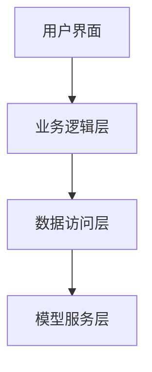
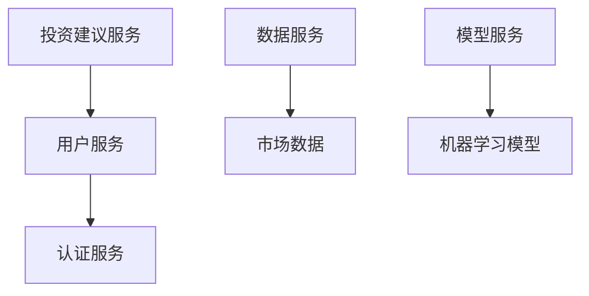
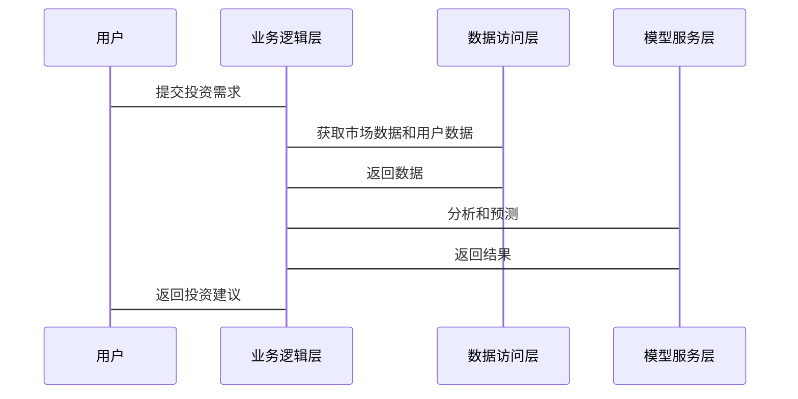

                 


# 智能投顾平台的架构设计与实现

> 关键词：智能投顾、人工智能、系统架构、资产配置、机器学习

> 摘要：智能投顾平台通过结合人工智能和大数据分析技术，为投资者提供个性化的投资建议和资产配置方案。本文将从智能投顾平台的背景、核心概念、算法原理、系统架构设计到项目实战实现，全面解析智能投顾平台的架构设计与实现过程。

---

## 第一部分: 智能投顾平台的背景与核心概念

### 第1章: 智能投顾平台的定义与背景

#### 1.1 智能投顾的定义与特点
智能投顾（Robo-Advisor）是一种基于人工智能和大数据分析技术的自动化投资顾问服务，旨在为投资者提供个性化的投资建议和资产配置方案。与传统的人工投顾相比，智能投顾具有以下特点：
- **自动化**：通过算法自动分析市场数据和用户需求，生成投资建议。
- **智能化**：利用机器学习技术，动态调整投资组合，优化收益与风险。
- **低成本**：相比传统投顾，智能投顾的运营成本更低，能够为更多用户提供服务。
- **实时性**：能够实时跟踪市场变化，快速调整投资策略。

#### 1.2 智能投顾的背景与发展趋势
智能投顾的兴起源于以下几个方面：
- **技术驱动**：人工智能、大数据和云计算等技术的快速发展，为智能投顾提供了技术基础。
- **市场需求**：传统投顾服务门槛高、成本高，难以满足中小投资者的需求。
- **金融创新**：智能投顾通过自动化和智能化的方式，提升了金融服务的效率和可及性。

智能投顾的发展趋势包括：
- **个性化服务**：基于用户的风险偏好和财务目标，提供定制化的投资建议。
- **多资产配置**：不仅限于股票，还涵盖债券、基金等多种资产类别。
- **实时动态调整**：根据市场变化和个人财务状况的变化，实时调整投资组合。

#### 1.3 智能投顾的核心问题与解决思路
智能投顾的核心问题包括：
- **投资者需求分析**：如何准确理解投资者的风险偏好和财务目标。
- **资产配置优化**：如何在不同资产类别中找到最优配置。
- **风险控制**：如何在市场波动中控制投资风险，同时追求最大收益。

解决思路：
- **数据收集与分析**：通过问卷和历史数据，分析投资者的需求。
- **机器学习算法**：利用聚类、分类和回归等算法，进行风险评估和收益预测。
- **动态调整**：根据市场变化和个人需求的变化，动态优化投资组合。

---

### 第2章: 智能投顾平台的核心概念与联系

#### 2.1 核心概念原理
智能投顾平台的核心概念包括：
- **用户画像**：通过问卷和数据分析，建立投资者的画像，包括年龄、收入、风险偏好等。
- **资产配置模型**：根据用户的需求，设计合理的资产配置方案。
- **风险评估**：通过历史数据分析和市场预测，评估投资组合的风险。
- **投资组合优化**：利用数学模型，优化投资组合，最大化收益，最小化风险。

#### 2.2 核心概念属性特征对比表
以下是核心概念的属性特征对比：

| 概念       | 属性               | 特征对比             |
|------------|--------------------|----------------------|
| 用户画像   | 风险偏好           | 高风险 vs 低风险     |
|            | 投资目标           | 短期 vs 长期         |
| 资产配置模型 | 股票占比           | 高风险高收益 vs 低风险低收益 |
|            | 债券占比           | 高流动性 vs 高稳定性 |
| 风险评估   | VaR（在险价值）     | 最大可能损失         |
|            | 风险调整后收益（RAROC） | 收益与风险的平衡     |

#### 2.3 ER实体关系图
以下是智能投顾平台的ER实体关系图：

```mermaid
erDiagram
    user [*----* investment_profile]
    investment_profile [*----* risk_assessment]
    investment_profile [*----* portfolio_allocation]
    portfolio_allocation [*----* asset_class]
```

解释：
- **用户（User）**：用户的基本信息和风险偏好。
- **投资画像（Investment Profile）**：用户的资产配置方案。
- **风险评估（Risk Assessment）**：用户投资组合的风险指标。
- **资产类别（Asset Class）**：投资组合中的资产类型，如股票、债券等。

#### 2.4 本章小结
本章详细介绍了智能投顾平台的核心概念，包括用户画像、资产配置模型和风险评估等，并通过对比表和ER图展示了这些概念之间的关系。

---

## 第二部分: 智能投顾平台的算法原理与实现

### 第3章: 智能投顾平台的算法原理与实现

#### 3.1 机器学习在智能投顾中的应用
智能投顾平台中常用的机器学习算法包括：
- **聚类算法**：用于用户分群，将具有相似风险偏好的用户归为一类。
- **分类算法**：用于风险评估，预测用户的投资风险等级。
- **回归算法**：用于收益预测，预测不同资产类别的预期收益。

#### 3.2 算法原理的数学模型与公式
##### 3.2.1 K-means聚类算法
K-means聚类算法的目标是将数据点分成K个簇，使得簇内数据点的相似性最大化。算法步骤如下：

1. 随机选择K个初始质心。
2. 计算每个数据点到质心的距离，将数据点分配到最近的质心所在的簇。
3. 计算每个簇的新质心。
4. 重复步骤2和3，直到质心不再变化或达到预设的迭代次数。

数学公式：
$$
\text{距离} = \sqrt{(x_i - x_j)^2 + (y_i - y_j)^2}
$$

##### 3.2.2 支持向量机（SVM）分类算法
SVM是一种监督学习算法，用于分类和回归。其核心思想是将数据映射到高维空间，找到一个超平面，使得正反类数据能够被正确分类。

数学公式：
$$
y = \text{sign}(w \cdot x + b)
$$

##### 3.2.3 线性回归模型
线性回归用于预测连续型变量，如收益预测。其数学模型为：
$$
y = \beta_0 + \beta_1 x_1 + \beta_2 x_2 + \cdots + \beta_n x_n + \epsilon
$$
其中，$\beta$为回归系数，$\epsilon$为误差项。

#### 3.3 算法实现的Python代码示例
##### 3.3.1 K-means聚类代码
```python
from sklearn.cluster import KMeans
import numpy as np

# 示例数据
X = np.array([[1, 2], [1, 3], [2, 2], [2, 3], [4, 5], [4, 6], [5, 5], [5, 6]])

# 创建KMeans模型
kmeans = KMeans(n_clusters=2, random_state=0)
kmeans.fit(X)

# 获取聚类结果
labels = kmeans.labels_
print("聚类结果：", labels)
```

##### 3.3.2 SVM分类代码
```python
from sklearn.svm import SVC
from sklearn.datasets import make_classification

# 示例数据
X, y = make_classification(n_samples=100, n_features=2, n_classes=2)

# 创建SVM模型
svm = SVC()
svm.fit(X, y)

# 预测
print("预测结果：", svm.predict(X))
```

##### 3.3.3 线性回归代码
```python
from sklearn.linear_model import LinearRegression
import numpy as np

# 示例数据
X = np.array([1, 2, 3, 4, 5])
y = np.array([2, 4, 5, 4, 5])

# 创建线性回归模型
lr = LinearRegression()
lr.fit(X.reshape(-1, 1), y)

# 预测
print("预测值：", lr.predict([[6]]))
```

#### 3.4 算法流程图
##### 3.4.1 聚类算法流程图
```mermaid
graph TD
    A[开始] -> B[数据预处理]
    B -> C[选择K值]
    C -> D[初始化质心]
    D -> E[计算距离]
    E -> F[分配簇]
    F -> G[计算新质心]
    G -> H[判断是否收敛]
    H -> I[收敛则结束，否则回到D]
    I -> 结束
```

##### 3.4.2 分类算法流程图
```mermaid
graph TD
    A[开始] -> B[数据预处理]
    B -> C[选择算法]
    C -> D[训练模型]
    D -> E[预测]
    E -> F[评估结果]
    F -> 结束
```

##### 3.4.3 回归算法流程图
```mermaid
graph TD
    A[开始] -> B[数据预处理]
    B -> C[选择算法]
    C -> D[训练模型]
    D -> E[预测]
    E -> F[评估结果]
    F -> 结束
```

#### 3.5 本章小结
本章详细介绍了智能投顾平台中常用的机器学习算法，包括聚类、分类和回归，并通过代码示例和流程图展示了这些算法的实现过程。

---

## 第三部分: 智能投顾平台的系统分析与架构设计

### 第4章: 智能投顾平台的系统分析与架构设计

#### 4.1 系统功能需求分析
智能投顾平台的主要功能模块包括：
- **用户管理**：用户注册、登录、个人信息管理。
- **数据采集与分析**：收集用户信息、市场数据，进行数据分析。
- **模型训练与优化**：基于数据训练机器学习模型，优化投资组合。
- **投资建议生成**：根据模型结果，生成投资建议。
- **风险评估与预警**：实时监控市场变化，评估风险，发出预警。

#### 4.2 系统架构设计
##### 4.2.1 分层架构设计
智能投顾平台的分层架构包括：
1. **表示层**：用户界面，包括网页和移动端。
2. **业务逻辑层**：处理用户的请求，调用数据和模型服务。
3. **数据访问层**：访问数据库和外部数据源。
4. **模型服务层**：提供机器学习模型的服务接口。

##### 4.2.2 微服务架构设计
微服务架构将系统拆分为多个独立的服务，包括：
- **用户服务**：处理用户的注册、登录等操作。
- **数据服务**：提供市场数据和用户数据的访问接口。
- **模型服务**：提供机器学习模型的服务接口。
- **投资建议服务**：生成投资建议并返回给用户。

##### 4.2.3 数据流与服务交互设计
以下是数据流与服务交互的流程：
1. 用户提交投资需求。
2. 业务逻辑层调用数据服务获取市场数据和用户数据。
3. 数据服务返回数据到业务逻辑层。
4. 业务逻辑层调用模型服务进行分析和预测。
5. 模型服务返回结果到业务逻辑层。
6. 业务逻辑层生成投资建议并返回给用户。

#### 4.3 系统架构图
##### 4.3.1 分层架构图


##### 4.3.2 微服务架构图


##### 4.3.3 数据流与交互图


#### 4.4 本章小结
本章详细介绍了智能投顾平台的系统架构设计，包括分层架构和微服务架构，并通过架构图和交互图展示了系统的模块划分和数据流。

---

## 第四部分: 智能投顾平台的项目实战

### 第5章: 智能投顾平台的项目实战

#### 5.1 环境搭建与配置
##### 5.1.1 安装Python和相关库
```bash
pip install numpy pandas scikit-learn flask
```

##### 5.1.2 安装Jupyter Notebook
```bash
pip install jupyter
```

#### 5.2 系统核心实现源代码
##### 5.2.1 用户画像代码
```python
import pandas as pd

# 示例数据
data = {
    'age': [25, 35, 45],
    'income': [50000, 70000, 60000],
    'risk_preference': ['low', 'medium', 'high']
}

df = pd.DataFrame(data)
print(df)
```

##### 5.2.2 资产配置模型代码
```python
from sklearn.linear_model import LinearRegression

# 示例数据
X = [[100000], [200000], [300000]]
y = [10, 20, 30]

model = LinearRegression()
model.fit(X, y)

print("预测收益：", model.predict([[400000]]))
```

##### 5.2.3 风险评估代码
```python
from sklearn.svm import SVC

# 示例数据
X = [[1, 0], [0, 1], [1, 1], [0, 0]]
y = [0, 0, 1, 1]

model = SVC()
model.fit(X, y)

print("预测风险等级：", model.predict([[1, 1]]))
```

#### 5.3 代码应用解读与分析
##### 5.3.1 用户画像代码解读
上述代码通过Pandas库创建了一个用户画像的数据框，包含了用户的年龄、收入和风险偏好。用户的风险偏好可以通过数据框中的`risk_preference`列进行分类。

##### 5.3.2 资产配置模型代码解读
该代码使用线性回归模型，根据用户的资产规模预测其预期收益。通过训练数据，模型可以预测不同资产规模下的收益。

##### 5.3.3 风险评估代码解读
该代码使用SVM算法，根据用户的资产配置情况预测其投资组合的风险等级。通过训练数据，模型可以将资产配置分为低风险和高风险两类。

#### 5.4 实际案例分析
假设一个用户的资产规模为400000元，风险偏好为高风险。根据上述代码，资产配置模型预测其预期收益为40%，风险评估模型预测其投资组合的风险等级为高风险。因此，智能投顾平台会推荐一个高风险高收益的资产配置方案。

#### 5.5 本章小结
本章通过实际案例，详细讲解了智能投顾平台的核心功能实现，并通过代码示例展示了如何利用Python和机器学习算法实现用户画像、资产配置和风险评估。

---

## 第五部分: 智能投顾平台的总结与展望

### 第6章: 总结与展望

#### 6.1 最佳实践 tips
- **数据质量**：确保数据的准确性和完整性，避免数据偏差影响模型结果。
- **模型优化**：定期更新模型，根据市场变化和用户需求调整模型参数。
- **风险管理**：建立风险预警机制，及时发现和处理潜在风险。

#### 6.2 小结
智能投顾平台通过结合人工智能和大数据分析技术，为投资者提供了高效、个性化的投资服务。本文从背景、核心概念、算法原理、系统架构到项目实战，全面解析了智能投顾平台的架构设计与实现过程。

#### 6.3 注意事项
- 智能投顾平台的实现需要结合实际业务需求，选择合适的算法和架构。
- 数据隐私和安全问题是需要重点关注的内容。
- 模型的可解释性也是用户信任的重要因素。

#### 6.4 拓展阅读
- 《机器学习实战》
- 《智能投顾：人工智能在金融中的应用》
- 《系统架构设计：复杂系统的构建与管理》

---

## 结语
智能投顾平台的架构设计与实现是一个复杂但极具挑战性的任务。通过本文的详细讲解，读者可以系统地了解智能投顾平台的核心概念、算法原理和系统架构，并通过实际案例掌握其实现方法。未来，随着人工智能和大数据技术的不断发展，智能投顾平台将为投资者提供更加智能和个性化的投资服务。

--- 

# END

