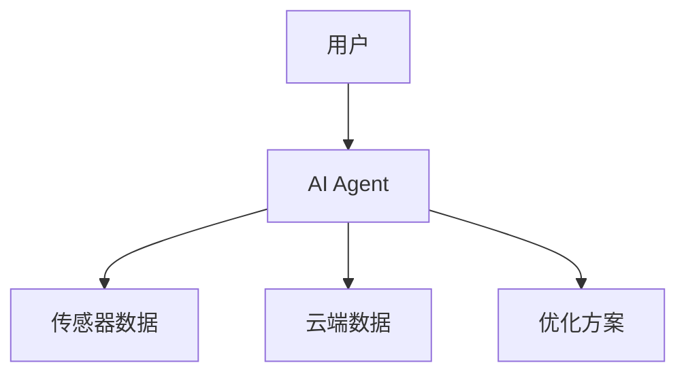
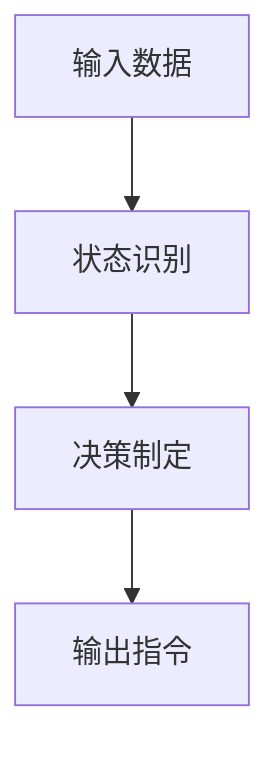
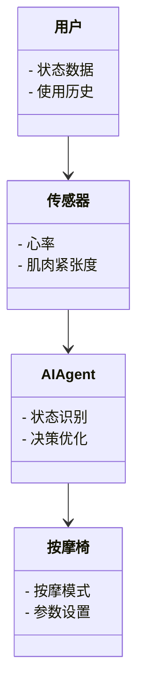

                 

# 智能按摩椅：AI Agent的疲劳恢复优化方案

> 关键词：智能按摩椅，AI Agent，疲劳恢复，算法优化，系统架构

> 摘要：本文将探讨如何利用AI Agent技术优化智能按摩椅的疲劳恢复功能。通过分析AI Agent的核心概念、算法原理、系统架构以及项目实战，我们展示了如何通过智能化手段提升按摩椅的用户体验，实现个性化的疲劳恢复方案。本文还提供了详细的数学模型、系统设计和代码实现，帮助读者深入了解AI Agent在智能按摩椅中的应用。

---

# 第一部分: 智能按摩椅与AI Agent概述

## 第1章: 智能按摩椅与AI Agent的背景介绍

### 1.1 智能按摩椅的发展历程

#### 1.1.1 传统按摩椅的功能与局限
传统按摩椅通过机械结构和固定程序提供基础的按摩功能，无法根据用户的实时状态进行调整。例如，用户可能在不同时间有不同的疲劳程度，传统按摩椅无法感知并适应这些变化。

#### 1.1.2 智能化技术的引入与演变
随着物联网和人工智能技术的发展，智能按摩椅开始引入传感器、云端计算和AI算法。这些技术使得按摩椅能够实时感知用户的状态，并根据数据优化按摩方案。

#### 1.1.3 AI技术在按摩椅中的应用前景
AI技术能够通过学习用户的使用习惯和健康数据，提供个性化的疲劳恢复方案。未来，智能按摩椅将更加智能化，能够主动适应用户的需求。

---

### 1.2 AI Agent的基本概念与特点

#### 1.2.1 AI Agent的定义与核心功能
AI Agent是一种能够感知环境、自主决策并执行任务的智能实体。在智能按摩椅中，AI Agent的核心功能包括：
- 感知用户状态（如压力、肌肉紧张度等）
- 学习用户偏好
- 优化按摩方案

#### 1.2.2 AI Agent与传统算法的区别
AI Agent具有自主学习和适应能力，能够根据实时数据动态调整策略。而传统算法通常基于固定的规则，无法根据环境变化进行优化。

#### 1.2.3 AI Agent在智能按摩椅中的应用场景
AI Agent可以应用于按摩椅的个性化设置、疲劳程度评估、按摩方案优化等领域。例如，AI Agent可以根据用户的生理数据推荐最佳的按摩时间、力度和模式。

---

## 第2章: AI Agent在疲劳恢复中的核心概念与联系

### 2.1 AI Agent的核心原理

#### 2.1.1 AI Agent的基本工作流程
1. **感知环境**：AI Agent通过传感器收集用户的数据，如心率、体温、肌肉紧张度等。
2. **状态识别**：AI Agent分析数据，识别用户的疲劳程度和身体状态。
3. **决策制定**：基于状态识别结果，AI Agent制定优化的按摩方案。
4. **执行与反馈**：AI Agent控制按摩椅执行方案，并根据反馈调整策略。

#### 2.1.2 AI Agent的感知与决策机制
AI Agent通过多模态传感器（如心率传感器、压力传感器等）感知用户状态，并结合历史数据进行决策。例如，当用户心率较高且肌肉紧张度高时，AI Agent可能推荐深层组织放松模式。

#### 2.1.3 AI Agent的学习与优化能力
AI Agent通过强化学习不断优化按摩方案。例如，当用户对某个方案的反馈较好时，AI Agent会增加该方案的权重。

---

### 2.2 核心概念对比分析

#### 2.2.1 AI Agent与传统算法的对比
| **特性**         | **AI Agent**          | **传统算法**          |
|-------------------|-----------------------|-----------------------|
| 自主性           | 高                   | 低                   |
| 学习能力         | 高                   | 低                   |
| 适应性           | 高                   | 低                   |

#### 2.2.2 AI Agent在按摩椅中的实体关系图

---

## 第3章: AI Agent的算法原理与数学模型

### 3.1 算法原理

#### 3.1.1 AI Agent的基本算法框架
AI Agent的核心算法基于强化学习。通过状态-动作-奖励机制，AI Agent不断优化其决策策略。

#### 3.1.2 基于强化学习的优化算法
强化学习的基本公式为：
$$ Q(s,a) = r + \gamma \max_{a'} Q(s',a') $$

其中：
- \( Q(s,a) \)：状态-动作值函数
- \( r \)：奖励
- \( \gamma \)：折扣因子
- \( a' \)：下一个动作

#### 3.1.3 算法流程图

### 3.2 数学模型与公式

#### 3.2.1 状态识别的数学模型
用户的状态可以通过多维数据表示，例如：
$$ P(s) = \sum_{i=1}^{n} w_i x_i $$
其中：
- \( P(s) \)：状态概率
- \( w_i \)：权重
- \( x_i \)：输入特征

#### 3.2.2 决策优化的数学公式
$$ Q(s,a) = r + \gamma \max_{a'} Q(s',a') $$

---

## 第4章: 系统分析与架构设计方案

### 4.1 问题场景介绍

#### 4.1.1 用户需求分析
用户希望按摩椅能够根据其疲劳程度提供个性化的按摩方案。

#### 4.1.2 系统目标设定
系统的目标是通过AI Agent优化按摩方案，提升用户体验。

#### 4.1.3 系统边界与约束条件
系统边界包括传感器、AI Agent、按摩椅机械结构和用户界面。约束条件包括数据隐私、计算资源限制等。

---

### 4.2 系统功能设计

#### 4.2.1 领域模型

---

通过以上内容，我们可以看到，AI Agent在智能按摩椅中的应用不仅提升了用户体验，还为疲劳恢复提供了更科学的解决方案。接下来的章节将详细介绍系统架构设计、项目实战以及最佳实践等内容。

