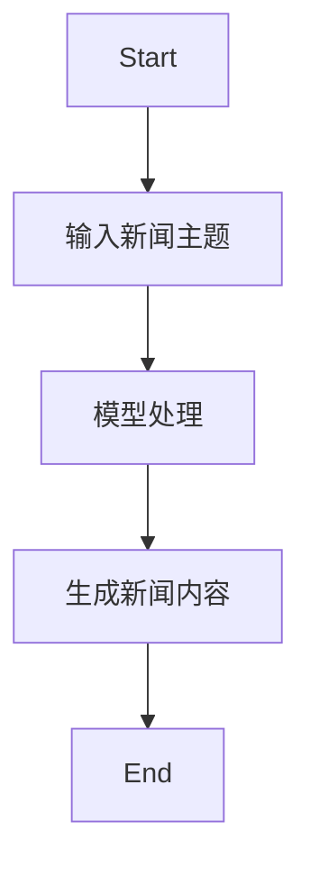
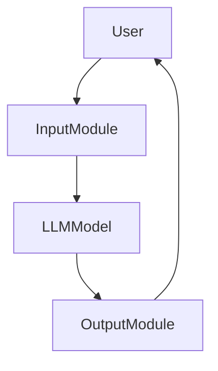

                 


# 智能新闻写作 AI Agent：LLM 辅助新闻报道生成

## 关键词
智能新闻写作, AI Agent, 大语言模型, LLM, 新闻生成, 人工智能

## 摘要
随着人工智能技术的飞速发展，新闻写作也在经历一场智能化的变革。本文探讨了如何利用大语言模型（LLM）辅助新闻报道的生成，分析了其核心原理、系统架构，并通过实际案例展示了其应用过程。文章内容包括背景介绍、核心概念、算法原理、系统设计以及项目实战，旨在为开发者和新闻从业者提供深入的技术洞察与实践指导。

---

## 第1章 智能新闻写作 AI Agent 背景与概念

### 1.1 问题背景与挑战
新闻写作作为信息传播的重要手段，传统模式依赖人工撰写，存在效率低下、成本高昂、内容同质化严重等问题。此外，新闻时效性的要求使得人工写作难以快速响应。

智能化新闻写作的需求主要体现在：
- **效率提升**：快速生成新闻内容，缩短报道周期。
- **个性化定制**：根据目标读者调整新闻风格。
- **内容丰富性**：通过AI辅助生成更多元化的内容。

LLM（大语言模型）凭借其强大的文本生成能力，为新闻写作智能化提供了新的解决方案。

### 1.2 智能新闻写作的核心概念
AI Agent 是一种能够理解、推理并执行任务的智能体，结合 LLM 的自然语言处理能力，可实现新闻内容的自动生成。其特点包括：
- **自动化**：无需人工干预，自动完成新闻撰写。
- **适应性**：根据输入主题调整生成内容。
- **学习能力**：通过反馈不断优化生成效果。

### 1.3 核心概念与联系
LLM 的核心原理在于其编码与解码机制，结合注意力机制进行序列建模。智能新闻写作的实体关系图展示了用户、AI Agent、新闻数据之间的交互。

---

## 第2章 LLM 辅助新闻写作的核心原理

### 2.1 LLM 的基本原理
大语言模型通过监督微调和强化学习进行训练，编码器将输入转化为向量，解码器生成相应输出。注意力机制帮助模型捕捉上下文信息，提升生成质量。

### 2.2 智能新闻写作的算法流程
生成新闻内容的过程包括输入主题、模型处理、输出内容三个阶段，如图所示：



### 2.3 数学模型与公式
- **概率分布公式**：
  $$ P(y|x) = \frac{P(x,y)}{P(x)} $$
  
- **损失函数**：
  $$ \text{Loss} = -\sum_{i=1}^{n} \log P(y_i|x) $$

---

## 第3章 智能新闻写作系统的架构设计

### 3.1 系统功能设计
系统主要模块包括：
- **用户输入模块**：接收新闻主题和参数。
- **内容生成模块**：调用LLM生成新闻。
- **反馈优化模块**：根据用户反馈优化模型。

### 3.2 系统架构图
系统架构展示了各模块之间的交互关系：



### 3.3 接口与交互设计
- **API接口定义**：提供RESTful API，接收请求并返回生成内容。
- **交互流程图**：展示用户与系统之间的交互步骤。

---

## 第4章 项目实战

### 4.1 环境安装
安装必要的库，如TensorFlow或PyTorch，并配置LLM模型。

### 4.2 核心代码实现
以下为生成新闻内容的核心代码示例：

```python
def generate_news_headline(title):
    # 编码输入
    inputs = tokenizer(title, return_tensors='np')
    # 模型推理
    outputs = model.generate(inputs.input_ids)
    # 解码输出
    headline = tokenizer.decode(outputs[0], skip_special_tokens=True)
    return headline
```

### 4.3 实际案例分析
以某个新闻主题为例，展示生成过程，并分析优化空间。

---

## 第5章 总结与展望

### 5.1 最佳实践 tips
- 定期更新模型以保持生成质量。
- 根据具体需求调整参数。

### 5.2 小结
本文详细探讨了LLM辅助新闻写作的技术与实践，展示了其在新闻生成中的潜力与应用价值。

### 5.3 注意事项
- 生成内容需结合人工审核，确保准确性和合规性。
- 保护用户隐私，避免数据泄露。

### 5.4 拓展阅读
推荐阅读相关领域的最新研究，深入了解大语言模型的优化与应用。

---

通过以上内容，读者可以全面了解智能新闻写作 AI Agent 的技术细节与实际应用，为新闻行业智能化转型提供了有价值的参考。

