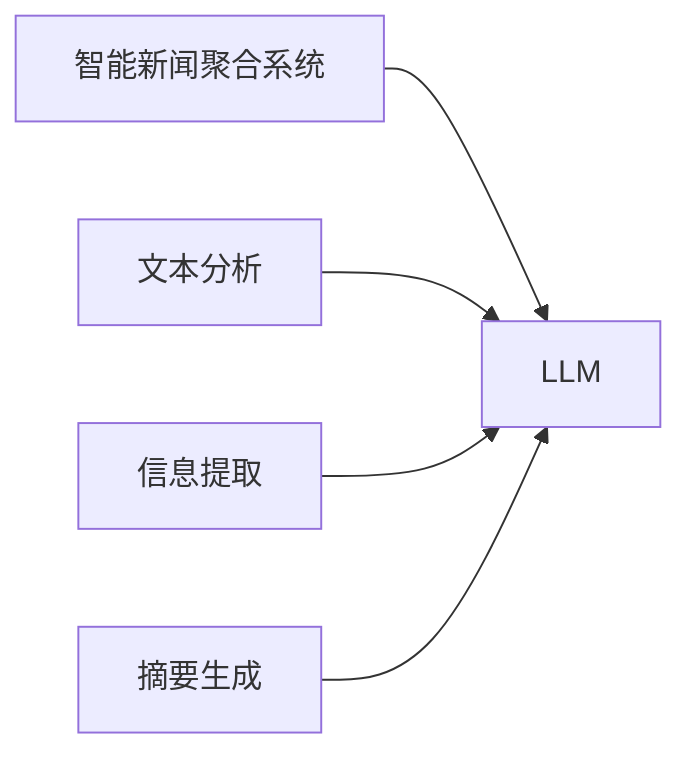
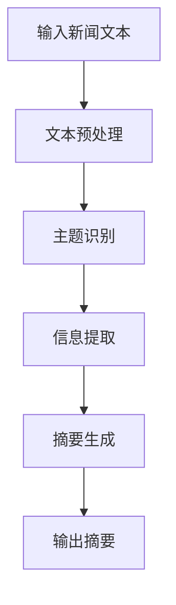
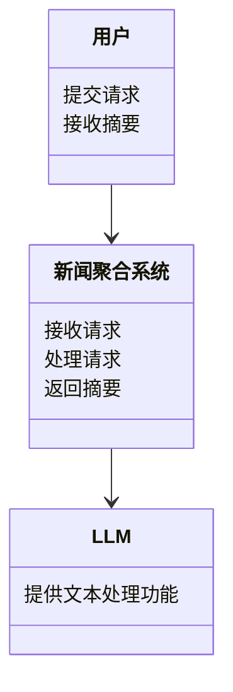

                 


# 智能新闻聚合AI Agent：LLM驱动的信息整合与分析

> 关键词：智能新闻聚合，AI Agent，LLM，信息整合，自然语言处理

> 摘要：本文探讨了利用大语言模型（LLM）进行智能新闻聚合的技术与方法。通过分析问题背景、核心概念、算法原理、系统架构、项目实战和最佳实践，详细阐述了LLM驱动的信息整合与分析在新闻聚合中的应用，为读者提供了一套完整的解决方案。

---

## 第一部分：背景介绍

### 第1章：智能新闻聚合的背景与问题背景

#### 1.1 智能新闻聚合的背景

随着互联网的飞速发展，每天都有海量的新闻信息被发布。然而，信息的爆炸性增长使得用户难以在短时间内获取所需的信息。传统的新闻聚合方式依赖人工筛选和分类，效率低下且容易遗漏重要信息。近年来，人工智能技术的快速发展为新闻聚合带来了新的可能性。大语言模型（LLM）作为一种强大的自然语言处理工具，能够自动理解和分析文本内容，从而为智能新闻聚合提供了技术支持。

#### 1.2 问题背景与问题描述

用户在面对海量新闻时，常常面临以下问题：
1. **信息过载**：用户难以从大量信息中筛选出自己感兴趣的内容。
2. **信息分散**：新闻信息分布在不同的平台和渠道，用户需要在多个地方查找。
3. **信息更新**：新闻内容实时更新，用户需要及时获取最新信息。

智能新闻聚合的目标是通过AI技术，自动从多个新闻源中筛选、整合和分析信息，为用户提供高质量的新闻摘要或推荐。本研究的范围限定在基于LLM的新闻聚合系统的设计与实现，不包括新闻爬取和推荐系统的其他部分。

#### 1.3 问题解决与边界

智能新闻聚合的核心目标是提高信息获取的效率和质量。通过LLM技术，系统能够自动识别新闻主题、提取关键信息，并生成简洁的摘要。以下是问题解决的关键点：
- **主题识别**：准确识别新闻的主题和关键词。
- **信息提取**：从新闻文本中提取关键信息。
- **摘要生成**：生成简洁明了的新闻摘要。

系统的边界包括：
- 仅处理中文新闻。
- 不包含新闻爬取功能。
- 仅提供摘要生成，不涉及推荐算法。

---

## 第二部分：核心概念与联系

### 第2章：智能新闻聚合与LLM的核心概念

#### 2.1 智能新闻聚合的定义与特点

智能新闻聚合是一种基于AI技术的信息整合方式，通过自然语言处理和机器学习算法，从多个新闻源中提取、分析和整合信息，为用户提供个性化的内容。其主要特点包括：
- **自动化**：无需人工干预，自动完成信息聚合。
- **智能化**：通过LLM理解新闻内容，生成摘要或推荐。
- **实时性**：能够实时更新和处理最新的新闻信息。

#### 2.2 LLM的定义与工作原理

大语言模型（LLM）是一种基于深度学习的自然语言处理模型，能够理解和生成人类语言。其工作原理包括以下步骤：
1. **输入处理**：将输入文本转换为模型可处理的向量表示。
2. **编码**：通过编码层将文本编码为上下文表示。
3. **解码**：通过解码层生成输出文本。

#### 2.3 智能新闻聚合与LLM的关系

智能新闻聚合依赖于LLM进行文本理解和生成。LLM为聚合系统提供了核心的自然语言处理能力，包括文本分析、信息提取和摘要生成。以下是两者的关系图：



#### 2.4 核心概念对比表

| 对比维度 | 智能新闻聚合 | LLM |
|----------|--------------|-----|
| 定义     | 自动聚合新闻 | 大语言模型 |
| 功能     | 提取、分析、生成 | 理解、生成 |
| 优缺点   | 优点：高效、智能；缺点：依赖LLM性能 | 优点：强大的自然语言处理能力；缺点：计算资源消耗大 |

#### 2.5 ER实体关系图

```mermaid
er
actor 用户 {
  id 用户ID
  偏好主题 主题
}
news_source 新闻源 {
  id 新闻源ID
  新闻标题 标题
  新闻内容 内容
  发布时间 时间
}
聚合结果 聚合结果 {
  id 聚合ID
  用户ID 用户ID
  新闻源ID 新闻源ID
  摘要 摘要
  关键词 关键词
}
```

---

## 第三部分：算法原理

### 第3章：基于LLM的智能新闻聚合算法

#### 3.1 LLM的数学模型

大语言模型通常基于Transformer架构，其核心思想是通过自注意力机制（Self-attention）捕捉文本中的语义关系。数学模型如下：

$$
\text{Self-attention}(Q, K, V) = \text{softmax}\left(\frac{QK^T}{\sqrt{d_k}}\right)V
$$

其中，$Q$、$K$、$V$分别为查询、键和值向量，$d_k$为键的维度。

#### 3.2 算法流程

以下是智能新闻聚合的算法流程图：



---

## 第四部分：系统架构设计

### 第4章：系统架构与设计

#### 4.1 系统功能设计

智能新闻聚合系统的功能模块包括：
- **输入模块**：接收用户输入或新闻源数据。
- **处理模块**：包括文本预处理、主题识别和信息提取。
- **输出模块**：生成并输出摘要。

#### 4.2 系统架构设计

系统架构采用分层设计：



---

## 第五部分：项目实战

### 第5章：项目实现与案例分析

#### 5.1 环境配置

需要安装以下依赖：
- Python 3.8+
- Transformers库
- PyTorch

```bash
pip install transformers torch
```

#### 5.2 核心代码实现

以下是摘要生成的代码示例：

```python
from transformers import pipeline

summarizer = pipeline("summarization", model="facebook/bart-large-cnn")

def generate_summary(text):
    return summarizer(text, max_length=100, min_length=50, do_sample=False)
```

#### 5.3 案例分析

输入新闻文本：
```
近日，一项新的研究表明，气候变化对海洋生态系统的影响比之前预想的更为严重。科学家们呼吁各国政府采取紧急措施，减少碳排放。
```

生成摘要：
```
气候变化对海洋生态系统的影响比之前预想的更为严重，科学家呼吁各国采取紧急措施。
```

---

## 第六部分：最佳实践

### 第6章：总结与展望

#### 6.1 总结

智能新闻聚合是一项结合了自然语言处理和机器学习的复杂任务。通过LLM技术，我们可以实现高效的新闻信息整合与分析，为用户提供更优质的服务。

#### 6.2 注意事项

- **数据质量**：输入数据的质量直接影响聚合结果。
- **模型优化**：需要不断优化模型以提高准确率。
- **性能优化**：在实际应用中需要考虑计算资源的消耗。

#### 6.3 拓展阅读

- 《大语言模型入门与实战》
- 《自然语言处理算法解析》

---

通过以上内容，我们详细探讨了智能新闻聚合的技术与实现。希望本文能够为相关领域的研究者和开发者提供有价值的参考和启示。

