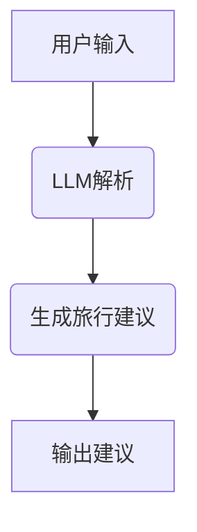
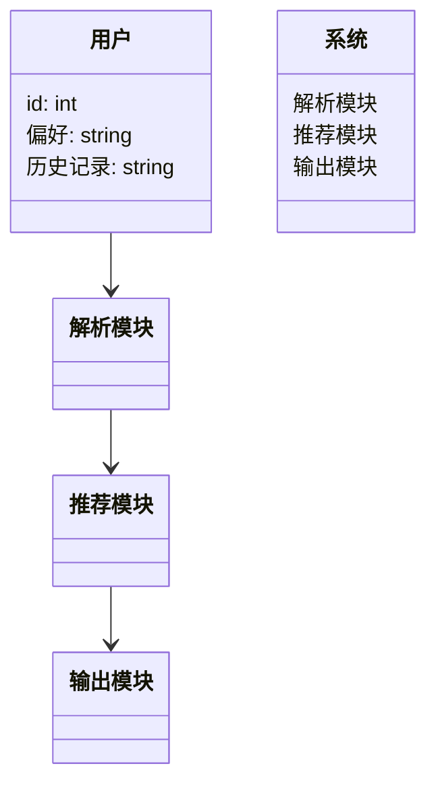

                 


# 智能旅游规划 AI Agent：LLM 辅助个性化旅行定制

## 关键词：
智能旅游规划，AI Agent，LLM，个性化旅行，自然语言处理，旅游推荐系统

## 摘要：
本文探讨如何利用大语言模型（LLM）构建智能旅游规划AI代理，实现个性化旅行定制。通过分析AI Agent与LLM的结合，详细阐述其算法原理、系统架构设计及实际应用，帮助读者理解并掌握基于LLM的智能旅游规划技术。

---

## 第1章：智能旅游规划的背景与需求

### 1.1 智能旅游规划的背景
#### 1.1.1 传统旅游规划的局限性
传统旅游规划依赖人工推荐或通用行程表，难以满足个性化需求，且效率低下。

#### 1.1.2 智能化旅游的需求驱动
现代旅行者追求独特体验，对个性化服务的需求日益增长，推动了智能旅游规划的发展。

#### 1.1.3 AI Agent在旅游中的应用潜力
AI Agent能够实时分析用户需求，提供动态化、个性化的旅行方案，提升用户体验。

### 1.2 AI Agent与LLM的结合
#### 1.2.1 AI Agent的基本概念
AI Agent是能够感知环境、自主决策的智能体，通过LLM实现自然语言处理和推理。

#### 1.2.2 LLM在AI Agent中的作用
LLM负责理解和生成自然语言，为AI Agent提供强大的语义分析和生成能力。

#### 1.2.3 个性化旅行定制的核心要素
用户偏好分析、实时信息处理、动态行程调整是个性化旅行定制的关键。

### 1.3 旅游规划中的问题与挑战
#### 1.3.1 个性化需求的多样性
用户兴趣广泛，行程偏好差异大，增加规划难度。

#### 1.3.2 信息过载与决策困难
海量信息导致用户难以快速做出决策，需要AI辅助筛选。

#### 1.3.3 实时性和动态性要求
旅行计划需灵活调整，实时更新信息是关键。

---

## 第2章：AI Agent与LLM的核心概念

### 2.1 AI Agent的基本原理
#### 2.1.1 AI Agent的定义与分类
AI Agent是具有感知、决策和执行能力的智能体，可分为简单反射型和基于模型的规划型。

#### 2.1.2 LLM的工作原理
LLM通过大量数据训练，掌握语言规律，生成相关文本内容。

#### 2.1.3 LLM与AI Agent的结合方式
LLM作为AI Agent的语言处理模块，负责理解用户需求和生成响应。

### 2.2 LLM在旅游规划中的应用
#### 2.2.1 自然语言处理在旅游中的应用
通过NLP技术分析用户输入，提取需求关键词，生成旅行建议。

#### 2.2.2 基于LLM的对话系统
构建智能对话系统，提供实时旅行咨询和建议。

#### 2.2.3 LLM驱动的个性化推荐
利用LLM分析用户偏好，推荐个性化景点、酒店和行程安排。

### 2.3 AI Agent与LLM的协同工作
#### 2.3.1 协同机制的概述
AI Agent通过LLM处理用户输入，进行信息检索和决策，提供个性化服务。

#### 2.3.2 信息处理流程
用户输入→LLM解析需求→AI Agent生成计划→反馈给用户。

#### 2.3.3 智能决策过程
基于用户偏好和实时信息，动态调整行程安排，优化旅行体验。

---

## 第3章：LLM辅助个性化旅行定制的算法原理

### 3.1 LLM的训练过程
#### 3.1.1 数据预处理
清洗数据，去除噪声，构建训练语料库。

#### 3.1.2 模型训练
使用大规模数据训练LLM，优化模型参数，提升生成质量。

#### 3.1.3 微调与优化
在特定领域数据上进行微调，提升模型在旅游规划中的表现。

### 3.2 LLM的推理机制
#### 3.2.1 解码策略
通过贪心搜索或采样方法生成最优或多样化的旅行建议。

#### 3.2.2 上下文处理
维护对话历史，确保生成内容连贯，符合用户需求。

#### 3.2.3 多轮对话
支持多轮交互，逐步细化旅行计划，满足用户个性化需求。

### 3.3 算法流程图（Mermaid）


### 3.4 Python代码实现
```python
def generate_travel_plan(user_input):
    # 解析用户需求
    preferences = parse_input(user_input)
    # 生成旅行建议
    plan = generate_suggestion(preferences)
    return plan

# 示例代码
user_input = "我想去巴黎旅游，预算5000元，喜欢艺术和美食"
preferences = {"城市": "巴黎", "预算": 5000, "兴趣": ["艺术", "美食"]}
plan = generate_travel_plan(user_input)
print(plan)
```

### 3.5 数学模型与公式
LLM的训练目标是最小化生成文本与真实数据的差异，常用交叉熵损失函数：
$$ \mathcal{L} = -\sum_{i=1}^{n} \log p(x_i) $$

优化过程使用Adam优化器：
$$ \theta = \theta - \eta \nabla_{\theta} \mathcal{L} $$

---

## 第4章：系统分析与架构设计

### 4.1 系统功能设计
#### 4.1.1 领域模型（Mermaid类图）


#### 4.1.2 系统架构（Mermaid架构图）


### 4.2 系统交互流程（Mermaid序列图）
```mermaid
sequenceDiagram
    用户 ->> frontend: 提交旅行需求
    frontend ->> backend: 请求处理
    backend ->> database: 查询历史记录
    backend ->> ai_service: 获取推荐计划
    backend <<- ai_service: 返回推荐结果
    frontend ->> 用户: 显示推荐计划
```

---

## 第5章：项目实战

### 5.1 环境安装
安装Python、依赖库（如TensorFlow、Hugging Face库）和IDE。

### 5.2 核心代码实现
```python
from transformers import GPT2LMHeadModel, GPT2Tokenizer

# 加载预训练模型
model_name = "gpt2"
model = GPT2LMHeadModel.from_pretrained(model_name)
tokenizer = GPT2Tokenizer.from_pretrained(model_name)

# 生成旅行建议
def generate_travel_suggestion(prompt):
    inputs = tokenizer.encode(prompt, return_tensors='pt')
    outputs = model.generate(inputs, max_length=100, num_return_sequences=1)
    suggestion = tokenizer.decode(outputs[0], skip_special_tokens=True)
    return suggestion

# 示例
prompt = "建议我一个适合家庭的巴黎旅行计划"
print(generate_travel_suggestion(prompt))
```

### 5.3 案例分析
用户输入需求，系统解析并生成个性化行程，展示LLM在实际应用中的效果。

---

## 第6章：最佳实践与总结

### 6.1 总结
LLM辅助的AI Agent显著提升了旅游规划的效率和个性化程度，为用户带来更好的旅行体验。

### 6.2 小结
通过本文的学习，读者能够理解并掌握基于LLM的智能旅游规划技术，应用于实际项目中。

### 6.3 注意事项
数据隐私保护、模型训练成本、用户体验优化是实际应用中需重点关注的问题。

### 6.4 拓展阅读
推荐深入学习NLP前沿技术，探索更多AI在旅游中的应用，如AR导览、智能导游等。

---

通过以上步骤，我们可以系统地构建一个基于LLM的智能旅游规划AI Agent，为个性化旅行定制提供有力支持。

