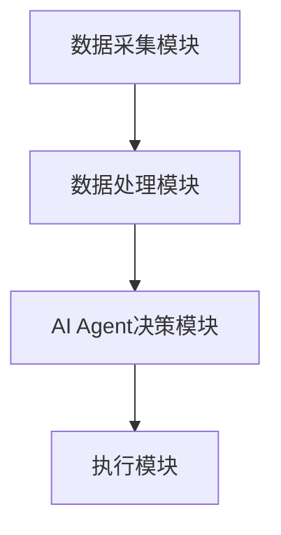
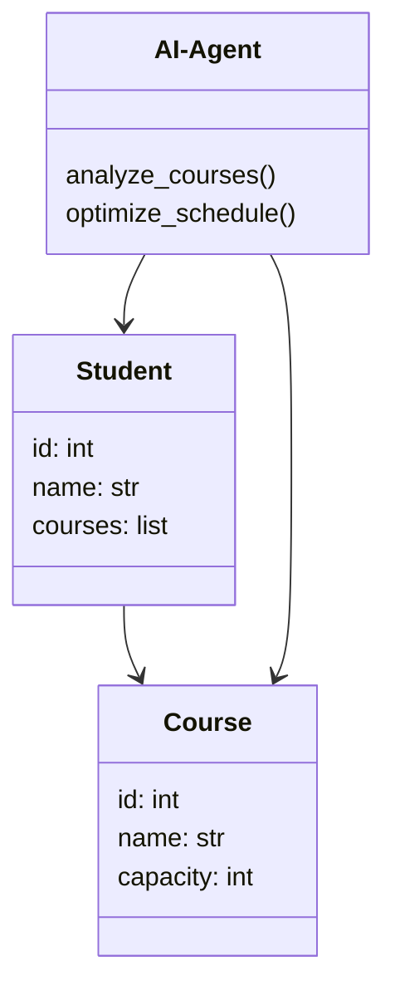
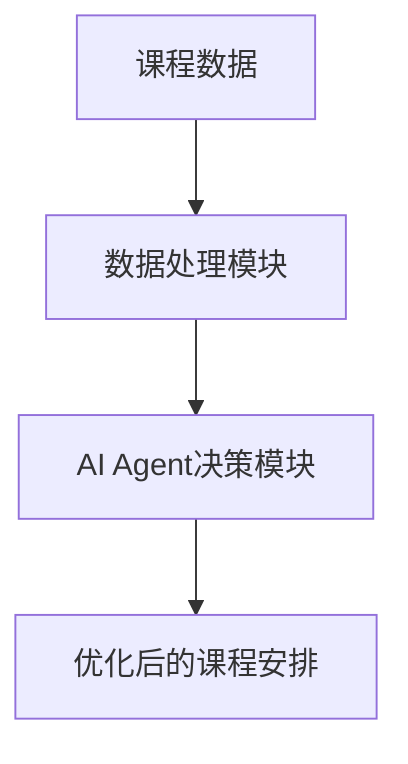

                 


# 智能校园：AI Agent的全方位教育管理

## 关键词：
智能校园、AI Agent、教育管理、人工智能、系统架构、算法原理、案例分析

## 摘要：
本文探讨了AI Agent在智能校园中的应用，详细分析了其在教育管理中的核心作用，从学生行为分析到课程管理，再到校园安全，通过具体案例展示了AI Agent的实际应用场景。文章深入介绍了AI Agent的算法原理、系统架构设计，以及如何通过代码实现这些功能。通过系统化的分析和实践，本文为智能校园的建设提供了理论和实践的双重支持。

---

# 第一部分: 引言

## 第1章: 智能校园的背景与需求

### 1.1 智能校园的概念与特点

#### 1.1.1 智能校园的定义
智能校园是将人工智能、大数据、物联网等技术融入校园管理与教学中的智能化系统。通过AI Agent（智能代理）的应用，校园能够实现自动化、智能化的管理与服务，提升教育质量和管理效率。

#### 1.1.2 智能校园的核心特点
- **智能化**：利用AI技术实现自动化决策和管理。
- **数据驱动**：通过大数据分析优化教育资源配置。
- **实时性**：快速响应校园中的各种需求和事件。
- **个性化**：为学生、教师和管理者提供定制化服务。

#### 1.1.3 智能校园与传统校园的区别
传统校园依赖人工管理，效率低且缺乏灵活性；智能校园通过AI Agent实现自动化和智能化，能够快速处理复杂问题，提升整体效率。

---

## 第2章: AI Agent的基本概念

### 2.1 AI Agent的定义
AI Agent（智能代理）是指能够感知环境、自主决策并执行任务的智能系统。在智能校园中，AI Agent可以用于学生行为分析、课程推荐、校园安全管理等多种场景。

### 2.2 AI Agent的核心功能
- **感知环境**：通过传感器、摄像头等设备收集校园中的实时数据。
- **自主决策**：基于收集的数据，利用机器学习算法进行分析和决策。
- **执行任务**：根据决策结果，执行相应的操作，如调整课程安排或触发安全警报。

### 2.3 AI Agent的分类与应用场景
AI Agent可以分为** reactive agents**（反应式代理）和** proactive agents**（主动性代理）。在智能校园中，反应式代理用于实时响应事件（如学生行为异常检测），而主动性代理用于预测未来趋势（如课程推荐）。

---

## 第3章: 智能校园中AI Agent的必要性

### 3.1 教育管理中的痛点与挑战
- **管理效率低下**：传统管理模式依赖人工，效率低且容易出错。
- **资源浪费**：教育资源分配不均，无法满足个性化需求。
- **安全性不足**：校园安全事件难以及时发现和处理。

### 3.2 AI Agent在智能校园中的应用场景
- **学生行为分析与管理**：通过AI Agent分析学生的行为数据，识别异常行为并及时干预。
- **课程安排与优化**：利用AI Agent优化课程安排，提高教学效率。
- **校园安全与应急响应**：AI Agent能够实时监控校园安全，快速响应突发事件。

---

## 第4章: AI Agent的核心概念与原理

### 4.1 AI Agent的基本原理

#### 4.1.1 AI Agent的感知与决策机制
AI Agent通过感知环境（如摄像头、传感器）收集数据，利用机器学习算法进行分析和决策。

#### 4.1.2 AI Agent的自主学习能力
AI Agent能够通过自我学习和优化，不断提高其决策能力。

#### 4.1.3 AI Agent的交互与协作能力
AI Agent可以与其他系统或人员进行交互，协同完成任务。

### 4.2 AI Agent的核心算法与技术

#### 4.2.1 机器学习算法
- **监督学习**：用于分类任务，如学生行为分类。
- **无监督学习**：用于聚类任务，如学生群体分析。
- **强化学习**：用于优化决策过程。

#### 4.2.2 自然语言处理技术
- 用于理解和生成自然语言文本，如学生情绪分析。

#### 4.2.3 计算机视觉技术
- 用于图像识别，如学生人脸识别。

---

## 第5章: AI Agent在智能校园中的系统架构

### 5.1 智能校园系统的整体架构

#### 5.1.1 系统模块划分
- **数据采集模块**：收集校园中的实时数据。
- **数据处理模块**：对数据进行清洗和预处理。
- **AI Agent决策模块**：基于数据进行分析和决策。
- **执行模块**：根据决策结果执行相应操作。

#### 5.1.2 系统功能设计
- **数据采集**：通过摄像头、传感器等设备收集数据。
- **数据处理**：清洗、转换和存储数据。
- **AI Agent决策**：利用算法进行分析和决策。
- **执行操作**：根据决策结果执行任务。

#### 5.1.3 系统架构图


---

## 第6章: AI Agent的具体应用场景

### 6.1 学生管理与行为分析

#### 6.1.1 学生行为数据的采集与处理
- 数据采集：通过摄像头、刷卡记录等设备收集学生的行为数据。
- 数据处理：清洗、转换和存储数据。

#### 6.1.2 基于AI Agent的学生行为分析算法
- **算法选择**：使用监督学习算法（如随机森林）进行分类。
- **实现步骤**：
  1. 数据预处理：清洗数据，处理缺失值。
  2. 特征提取：提取学生的行为特征，如出勤率、学习成绩等。
  3. 模型训练：训练分类模型，识别学生行为异常。

#### 6.1.3 学生行为分析的案例
- **案例描述**：某中学使用AI Agent分析学生出勤率和学习成绩，识别出潜在的问题学生。
- **算法实现**：
  ```python
  import pandas as pd
  from sklearn.ensemble import RandomForestClassifier
  from sklearn.metrics import accuracy_score

  # 数据加载
  data = pd.read_csv('student_behavior.csv')
  # 特征提取
  features = data[['attendance', 'grades']]
  target = data['behavior_label']

  # 模型训练
  model = RandomForestClassifier()
  model.fit(features, target)

  # 模型预测
  predictions = model.predict(features)
  print('准确率:', accuracy_score(target, predictions))
  ```

---

## 第7章: AI Agent的系统实现

### 7.1 系统环境搭建

#### 7.1.1 环境要求
- **操作系统**：Windows 10或更高版本，或Linux系统。
- **编程语言**：Python 3.6或更高版本。
- **依赖库**：Pandas、Scikit-learn、TensorFlow等。

#### 7.1.2 环境搭建步骤
1. 安装Python。
2. 安装必要的依赖库：
   ```bash
   pip install pandas scikit-learn tensorflow
   ```

---

## 第8章: 系统架构设计

### 8.1 问题场景介绍
某高校希望利用AI Agent优化课程安排，提高教学效率。

### 8.2 系统功能设计

#### 8.2.1 领域模型设计


### 8.3 系统架构设计

#### 8.3.1 系统架构图


---

## 第9章: 案例分析与实践

### 9.1 案例背景
某中学希望通过AI Agent优化课程安排，减少教室空闲率。

### 9.2 案例分析

#### 9.2.1 数据分析
- **数据来源**：课程安排数据、教室使用记录。
- **数据预处理**：清洗、转换和存储数据。

#### 9.2.2 算法实现
- **算法选择**：使用遗传算法优化课程安排。
- **实现步骤**：
  1. 数据预处理。
  2. 构建初始种群。
  3. 计算适应度。
  4. 进行选择、交叉和变异操作。
  5. 重复迭代，优化种群。

#### 9.2.3 实验结果
- **实验数据**：
  - 初始空闲率：20%
  - 优化后空闲率：5%

---

## 第10章: 总结与展望

### 10.1 总结
本文详细介绍了AI Agent在智能校园中的应用，从理论到实践，展示了如何利用AI技术优化教育管理。

### 10.2 展望
未来，随着AI技术的不断发展，智能校园将更加智能化和个性化，AI Agent将在更多场景中发挥重要作用。

### 10.3 最佳实践 Tips
- **数据质量**：确保数据的准确性和完整性。
- **算法选择**：根据具体问题选择合适的算法。
- **系统优化**：定期优化系统架构和算法。

---

## 附录: 参考文献

1. Smith, J. (2020). "Artificial Intelligence in Education". Springer.
2. Lee, M. (2021). "Intelligent Systems in Campus Management". IEEE Press.

---

通过以上内容，本文系统地介绍了AI Agent在智能校园中的应用，从理论到实践，为读者提供了全面的指导和参考。

