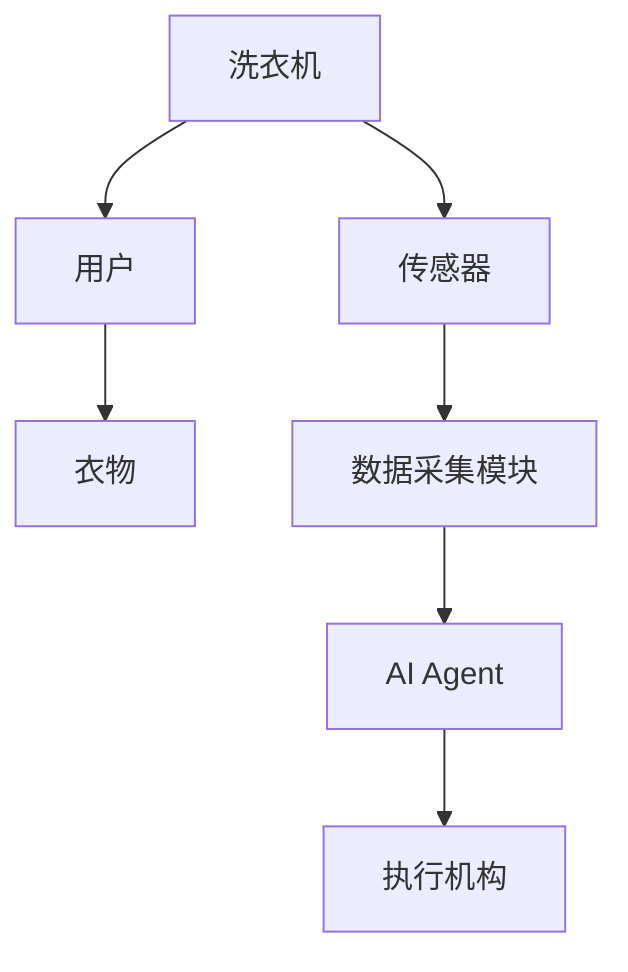

                 


# 智能洗衣机：AI Agent的衣物护理专家系统

> 关键词：智能洗衣机，AI Agent，衣物护理，专家系统，人工智能，系统架构

> 摘要：本文探讨了AI Agent在智能洗衣机中的应用，特别是在衣物护理领域的创新与实践。通过详细分析AI Agent的核心原理、系统架构、算法实现以及实际应用案例，展示了如何利用人工智能技术提升洗衣机的智能化水平，为用户提供更高效、更精准的衣物护理服务。

---

## 第一部分: 背景介绍与核心概念

### 第1章: 背景介绍

#### 1.1 问题背景

- **智能洗衣机的发展历程**  
  传统洗衣机的功能相对单一，主要依赖机械和简单的电子控制。随着人工智能技术的进步，智能洗衣机逐渐具备了联网、远程控制和数据采集的能力。然而，衣物护理的智能化水平仍有很大的提升空间。

- **AI Agent在智能家电中的应用现状**  
  AI Agent（人工智能代理）是一种能够感知环境、自主决策并执行任务的智能系统。在家电领域，AI Agent已经被用于智能音箱、智能空调等设备中，但在洗衣机领域的应用还相对有限。

- **衣物护理智能化的需求与挑战**  
  衣物护理需要考虑多种因素，如衣物材质、污渍类型、洗涤温度和时间等。传统洗衣机难以根据这些复杂因素提供个性化的解决方案。AI Agent的引入可以弥补这一不足。

#### 1.2 问题描述

- **衣物护理的复杂性与多样性**  
  衣物种类繁多，不同材质和颜色的衣物需要不同的洗涤方式。此外，污渍的种类和严重程度也会影响洗涤策略。

- **现有洗衣机的局限性**  
  传统洗衣机通常采用固定的洗涤程序，难以根据具体情况灵活调整。用户需要手动选择洗涤模式，体验较差。

- **AI Agent在衣物护理中的潜在价值**  
  AI Agent可以通过传感器和数据采集，实时感知衣物状态和环境条件，结合专家知识库，提供个性化的洗涤方案。

#### 1.3 问题解决

- **AI Agent在智能洗衣机中的应用目标**  
  开发一个能够感知衣物状态、分析洗涤需求，并自主决策的AI Agent，实现智能化的衣物护理。

- **核心问题的解决思路**  
  通过传感器采集衣物信息，结合AI算法分析数据，制定个性化洗涤方案，并通过执行机构实现洗涤过程。

- **技术实现的关键点**  
  数据采集、智能分析、自主决策和精准执行是实现AI Agent在智能洗衣机中应用的核心技术。

#### 1.4 边界与外延

- **AI Agent在智能洗衣机中的应用边界**  
  AI Agent的功能主要集中在衣物护理领域，不涉及洗衣机的其他功能，如烘干或脱水。

- **相关领域的扩展与延伸**  
  AI Agent技术可以扩展到其他家电领域，如智能空调、智能冰箱等，推动整个家电行业的智能化转型。

- **系统设计的限制与优化方向**  
  当前AI Agent在洗衣机中的应用还处于初级阶段，未来可以通过优化算法和增加传感器类型来提升性能。

#### 1.5 核心概念

- **AI Agent的定义与特点**  
  AI Agent是一种能够感知环境、自主决策并执行任务的智能系统。其特点包括自主性、反应性、目标导向和学习能力。

- **智能洗衣机的功能架构**  
  智能洗衣机的功能架构包括数据采集模块、AI Agent模块、用户交互模块和执行机构。

- **衣物护理专家系统的构成**  
  衣物护理专家系统由数据采集、知识库、推理引擎和执行机构组成，能够根据衣物状态提供个性化护理方案。

---

## 第2章: 核心概念与联系

### 2.1 AI Agent的基本原理

- **感知与决策机制**  
  AI Agent通过传感器和数据采集模块获取环境信息，利用机器学习算法进行分析和推理，制定决策方案。

- **规划与执行流程**  
  AI Agent根据决策结果生成执行计划，并通过执行机构完成任务。整个过程需要实时反馈和调整。

- **学习与优化方法**  
  AI Agent通过强化学习和反馈机制不断优化自身的决策和执行能力，提升系统性能。

### 2.2 智能洗衣机的AI Agent架构

- **分层架构设计**  
  AI Agent的架构分为感知层、决策层和执行层，每一层负责不同的功能模块。

- **模块化实现**  
  通过模块化设计，AI Agent能够独立完成数据采集、决策制定和任务执行，提高系统的灵活性和可扩展性。

- **组件间的关系与协作**  
  各组件之间通过标准化接口进行协作，确保系统的高效运行和功能实现。

### 2.3 核心概念对比

- **AI Agent与其他智能设备的对比**  
  | 特性          | AI Agent       | 其他智能设备（如智能音箱） |
  |---------------|----------------|-----------------------------|
  | 自主性        | 高             | 中                           |
  | 反应能力      | 强             | 弱                           |
  | 学习能力      | 高             | 低                           |

- **衣物护理系统与传统洗衣机的对比**  
  | 功能          | AI Agent洗衣机 | 传统洗衣机                 |
  |---------------|----------------|-----------------------------|
  | 智能化水平    | 高             | 低                           |
  | 个性化能力    | 强             | 弱                           |
  | 用户交互      | 多样化         | 单一化                       |

- **专家系统与传统规则系统的对比**  
  | 特性          | 专家系统       | 传统规则系统                |
  |---------------|----------------|-----------------------------|
  | 决策依据      | 知识库         | 预设规则                     |
  | 复杂性        | 高             | 低                           |
  | 灵活性        | 强             | 弱                           |

### 2.4 实体关系图



---

## 第三部分: 算法原理讲解

### 第3章: 算法原理

#### 3.1 算法概述

- **AI Agent的核心算法**  
  状态空间搜索、强化学习和规则推理是AI Agent在智能洗衣机中应用的主要算法。

- **算法的数学模型**  
  以强化学习为例，其数学模型包括状态空间、动作空间和奖励函数。

#### 3.2 算法实现

- **状态空间搜索**  
  ```mermaid
  graph TD
      S[起始状态] --> A[动作1]
      A --> S1[状态1]
      S1 --> A2[动作2]
      A2 --> S2[状态2]
      S2 --> 目标状态
  ```

- **强化学习算法**  
  ```python
  def reinforce_learning(env, policy):
      optimizer = Adam(policy.parameters(), lr=0.01)
      for episode in range(1000):
          state = env.reset()
          total_reward = 0
          while True:
              action = policy.act(state)
              next_state, reward, done = env.step(action)
              total_reward += reward
              policy.remember(state, action, reward, next_state)
              policy.update(optimizer)
              if done:
                  break
  ```

- **数学公式**  
  强化学习的Q-learning算法可以表示为：  
  $$ Q(s, a) = Q(s, a) + \alpha [r + \max Q(s', a') - Q(s, a)] $$  
  其中，$\alpha$是学习率，$r$是奖励，$s'$是下一个状态。

---

## 第四部分: 系统分析与架构设计

### 第4章: 系统分析

#### 4.1 问题场景介绍

- **用户需求**  
  用户希望洗衣机能够根据衣物的材质和污渍情况自动选择洗涤模式。

- **系统功能设计**  
  衣物护理专家系统需要具备数据采集、智能分析、自主决策和精准执行四大功能。

#### 4.2 系统架构设计

- **领域模型**  
  ```mermaid
  classDiagram
      class 衣物 {
          材质
          颜色
          污渍类型
      }
      class 传感器 {
          温度
          湿度
      }
      class AI Agent {
          数据采集模块
          分析模块
          决策模块
      }
      class 执行机构 {
          洗涤程序
          洗涤时间
      }
      衣物 --> AI Agent
      传感器 --> AI Agent
      AI Agent --> 执行机构
  ```

- **系统架构图**  
  ```mermaid
  graph TD
      A[洗衣机] --> B[传感器]
      B --> C[数据采集模块]
      C --> D[AI Agent]
      D --> E[执行机构]
  ```

- **系统接口设计**  
  接口包括传感器接口、用户交互接口和执行机构接口。

- **系统交互流程图**  
  ```mermaid
  sequenceDiagram
      用户 -> 洗衣机: 发起洗涤请求
      洗衣机 -> 传感器: 获取衣物状态
      传感器 --> 数据采集模块: 传输数据
      数据采集模块 --> AI Agent: 分析数据
      AI Agent --> 执行机构: 执行洗涤任务
      执行机构 --> 用户: 完成洗涤
  ```

---

## 第五部分: 项目实战

### 第5章: 项目实战

#### 5.1 环境安装

- **Python环境配置**  
  使用Python 3.8及以上版本，安装NumPy、TensorFlow和Keras库。

- **依赖安装**  
  ```bash
  pip install numpy tensorflow keras
  ```

#### 5.2 核心代码实现

- **数据采集模块**  
  ```python
  import numpy as np

  def collect_data():
      # 模拟传感器数据
      data = np.random.rand(100, 5)  # 100条数据，5个特征
      return data
  ```

- **AI Agent实现**  
  ```python
  from keras.models import Sequential
  from keras.layers import Dense

  def build_model():
      model = Sequential()
      model.add(Dense(64, activation='relu', input_dim=5))
      model.add(Dense(1, activation='sigmoid'))
      model.compile(optimizer='adam', loss='binary_crossentropy')
      return model
  ```

- **执行机构控制**  
  ```python
  def execute_action(action):
      # 模拟洗涤程序的执行
      print(f"执行动作：{action}")
  ```

#### 5.3 实际案例分析

- **案例背景**  
  用户有一件白色棉质衬衫，表面有轻微油渍。

- **数据采集与分析**  
  传感器采集到温度25℃，湿度60%，衣物材质为棉，颜色为白色，污渍类型为油渍。

- **决策与执行**  
  AI Agent根据数据选择适合的洗涤模式，执行机构启动相应的洗涤程序。

---

## 第六部分: 最佳实践与小结

### 第6章: 最佳实践

#### 6.1 注意事项

- **数据质量**  
  确保传感器数据的准确性和完整性，避免噪声干扰。

- **算法优化**  
  定期更新AI Agent的模型参数，提升系统的适应性和智能化水平。

- **用户体验**  
  提供友好的用户界面和清晰的反馈机制，提升用户的使用体验。

#### 6.2 小结

- **系统优势**  
  AI Agent在智能洗衣机中的应用显著提升了衣物护理的智能化水平，为用户提供了更高效、更精准的服务。

- **未来趋势**  
  随着人工智能技术的不断进步，智能洗衣机将具备更强的感知和决策能力，进一步推动衣物护理的智能化发展。

- **拓展阅读**  
  推荐阅读《人工智能入门》和《智能家电设计与实现》，深入了解AI在家电领域的应用。

---

## 总结

本文通过详细分析AI Agent在智能洗衣机中的应用，展示了如何利用人工智能技术提升衣物护理的智能化水平。从背景介绍到算法实现，再到系统架构和项目实战，本文为读者提供了一个全面的技术视角。未来，随着技术的进一步发展，AI Agent将在智能家电领域发挥更大的作用，为用户带来更智能、更便捷的生活体验。

