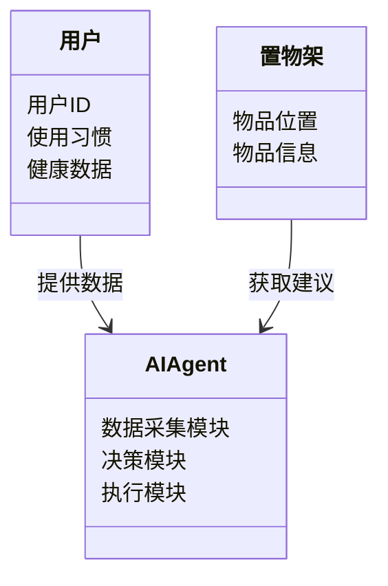
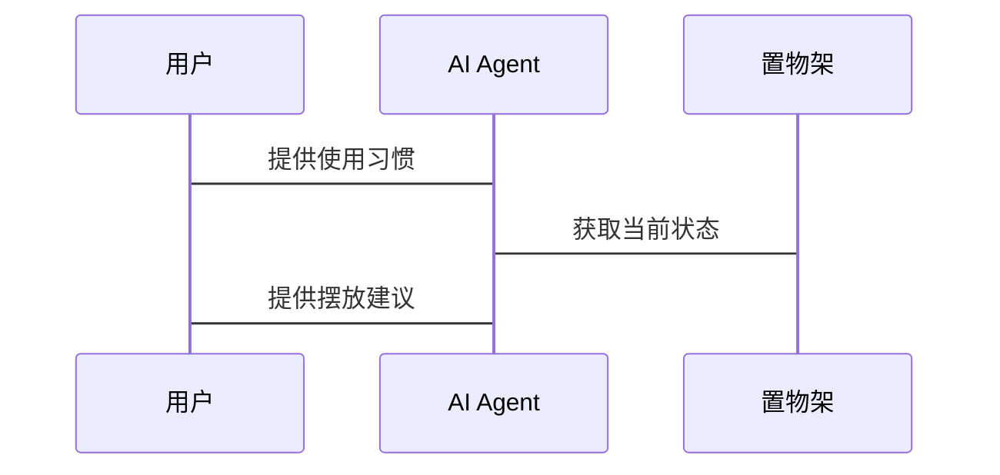

                 


# 智能浴室置物架：AI Agent的个人护理建议

## 关键词：AI Agent，智能浴室，个人护理，物联网，智能系统

## 摘要：智能浴室置物架通过AI Agent技术，能够根据用户的习惯和健康数据，提供个性化的物品摆放建议和健康护理方案，提升用户的日常生活体验。本文将深入探讨这一系统的核心原理、实现方法及其应用场景。

---

# 目录大纲：《智能浴室置物架：AI Agent的个人护理建议》

---

## 第1章：背景介绍

### 1.1 智能浴室置物架的发展背景

#### 1.1.1 传统浴室置物架的功能与局限
- **传统置物架的功能**：存储和摆放洗漱用品、毛巾等。
- **局限性**：固定摆放位置，无法根据用户习惯调整，容易造成空间浪费或使用不便。
- **市场需求**：用户对个性化和智能化的收纳需求日益增长。

#### 1.1.2 AI Agent的基本概念
- **AI Agent的定义**：人工智能代理，能够感知环境、执行任务并提供智能化服务。
- **AI Agent的核心功能**：数据采集、分析、决策和执行。

#### 1.1.3 智能浴室置物架与AI Agent的结合
- **结合的意义**：通过AI Agent实现智能收纳和个性化建议。
- **应用场景**：家庭浴室、公共浴室等。

---

## 第2章：AI Agent的核心原理

### 2.1 AI Agent的感知、决策与执行流程

#### 2.1.1 感知环境：数据采集与处理
- **数据来源**：用户的使用习惯、健康数据、环境传感器等。
- **数据处理**：通过传感器收集数据并进行预处理。

#### 2.1.2 决策逻辑：基于数据的分析与判断
- **算法选择**：机器学习模型（如决策树、随机森林）。
- **决策流程**：根据数据预测最佳摆放位置。

#### 2.1.3 执行操作：反馈与调整机制
- **执行方式**：通过机械臂或智能设备调整物品位置。
- **反馈机制**：根据用户反馈优化决策模型。

### 2.2 不同类型AI Agent的对比分析

#### 2.2.1 基于规则的AI Agent
- **特点**：简单、规则明确，适用于规则性较强的场景。
- **局限性**：缺乏灵活性，无法处理复杂情况。

#### 2.2.2 基于模型的AI Agent
- **特点**：学习能力强，能够适应复杂环境。
- **优势**：能够根据用户行为动态调整。

---

## 第3章：算法原理讲解

### 3.1 机器学习算法的应用

#### 3.1.1 分类算法：用户行为识别
- **算法选择**：支持向量机（SVM）、K-近邻算法（KNN）。
- **实现流程**：
  1. 数据采集：记录用户的使用习惯。
  2. 数据预处理：清洗和标准化。
  3. 模型训练：使用SVM进行分类。
  4. 模型预测：识别用户行为模式。

#### 3.1.2 回归算法：摆放位置优化
- **算法选择**：线性回归、岭回归。
- **实现流程**：
  1. 数据采集：收集物品摆放位置和用户满意度。
  2. 数据分析：建立回归模型。
  3. 模型优化：调整参数以提高预测精度。

### 3.2 强化学习的应用

#### 3.2.1 状态空间与动作空间的定义
- **状态空间**：当前物品摆放位置、用户需求等。
- **动作空间**：调整位置、增加/减少物品等。

#### 3.2.2 奖励机制设计
- **奖励函数**：用户满意度越高，奖励值越大。
- **学习目标**：最大化累计奖励。

### 3.3 算法实现的数学模型

#### 3.3.1 分类算法的数学模型
$$ P(y|x) = \frac{P(x|y)P(y)}{P(x)} $$
- **解释**：贝叶斯定理，用于分类任务。

#### 3.3.2 回归算法的数学模型
$$ y = \beta_0 + \beta_1x + \epsilon $$
- **解释**：线性回归模型，用于预测摆放位置。

---

## 第4章：系统分析与架构设计方案

### 4.1 问题场景介绍

#### 4.1.1 系统应用场景
- **家庭浴室**：个性化收纳需求。
- **公共浴室**：高效管理公共物品。

#### 4.1.2 系统目标
- 提供个性化物品摆放建议。
- 实现智能收纳和健康监测。

### 4.2 系统功能设计

#### 4.2.1 领域模型设计（Mermaid类图）


#### 4.2.2 系统架构设计（Mermaid架构图）


### 4.3 系统接口设计

#### 4.3.1 接口描述
- **输入接口**：用户数据、传感器数据。
- **输出接口**：摆放建议、健康报告。

#### 4.3.2 交互流程图（Mermaid序列图）


---

## 第5章：项目实战

### 5.1 环境安装

#### 5.1.1 开发环境
- **编程语言**：Python
- **框架**：TensorFlow、Scikit-learn
- **工具**：Jupyter Notebook

#### 5.1.2 环境配置
```bash
pip install numpy
pip install scikit-learn
pip install tensorflow
```

### 5.2 系统核心实现

#### 5.2.1 核心代码实现

##### 5.2.1.1 用户行为识别（分类算法）
```python
from sklearn import svm
from sklearn.model_selection import train_test_split

# 数据预处理
X = ...  # 特征向量
y = ...  # 标签

X_train, X_test, y_train, y_test = train_test_split(X, y, test_size=0.2)

# 模型训练
model = svm.SVC()
model.fit(X_train, y_train)

# 预测
y_pred = model.predict(X_test)
```

##### 5.2.1.2 摆放位置优化（回归算法）
```python
from sklearn.linear_model import LinearRegression

# 数据预处理
X = ...  # 特征向量
y = ...  # 标签

model = LinearRegression()
model.fit(X, y)

# 预测
y_pred = model.predict(X)
```

### 5.3 案例分析与详细解读

#### 5.3.1 案例分析
- **案例背景**：用户习惯分析。
- **实施过程**：数据采集、模型训练、结果输出。

#### 5.3.2 实施效果
- **效果评估**：准确率、用户满意度。
- **优化建议**：根据反馈调整模型参数。

### 5.4 项目总结

#### 5.4.1 成功经验
- 数据质量的重要性。
- 模型选择的合理性。

#### 5.4.2 问题与改进方向
- 数据不足的问题。
- 模型泛化能力的提升。

---

## 第6章：最佳实践

### 6.1 小结

#### 6.1.1 核心要点回顾
- AI Agent在智能浴室置物架中的应用。
- 算法选择与实现方法。

### 6.2 注意事项

#### 6.2.1 数据隐私保护
- 确保用户数据的安全性和隐私性。

#### 6.2.2 系统稳定性
- 确保系统在各种场景下的稳定运行。

### 6.3 拓展阅读

#### 6.3.1 相关技术领域
- 智能家居系统。
- 人工智能在医疗健康中的应用。

#### 6.3.2 进阶学习方向
- 更复杂的机器学习模型。
- 强化学习在智能系统中的应用。

---

## 结语

智能浴室置物架通过AI Agent技术，不仅提升了物品管理的效率，还为用户提供个性化的健康建议。随着技术的不断进步，这类智能设备将在未来的家庭生活中发挥越来越重要的作用。

